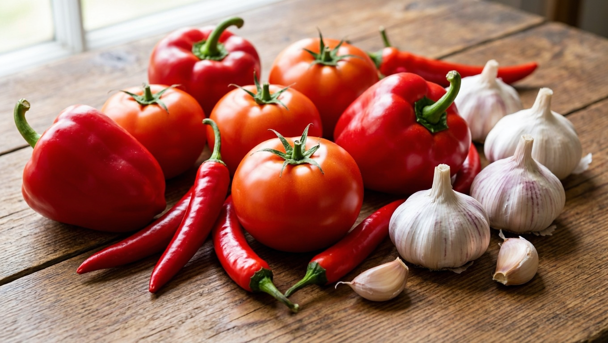
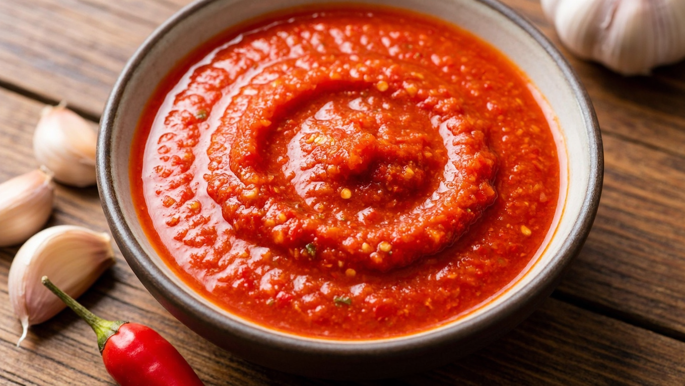
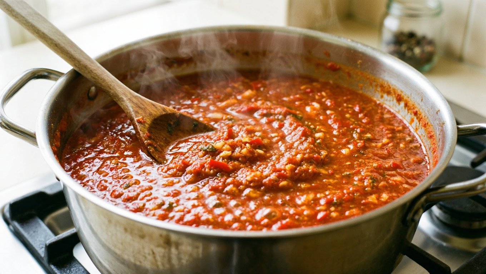
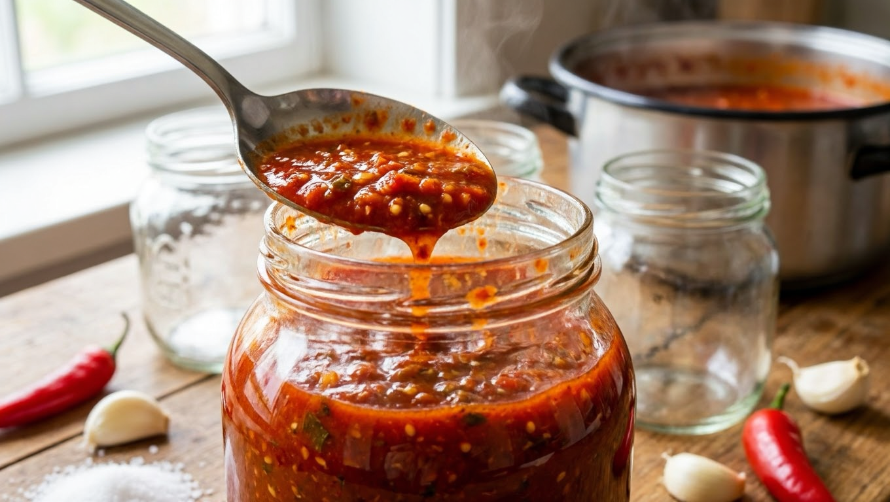
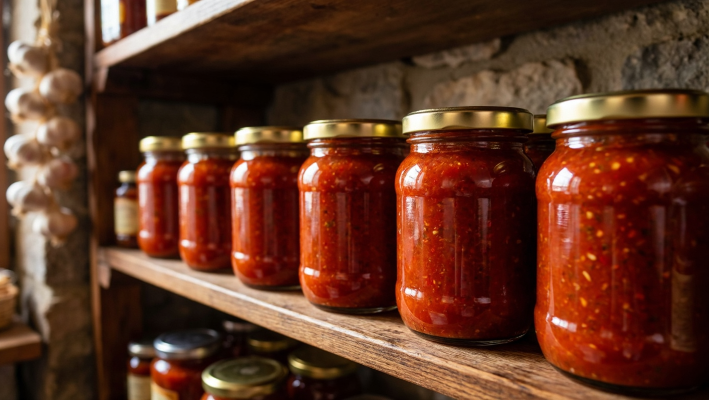

Аджика — острая ароматная заготовка, без которой зимой не обходится ни одно застолье: её мажут на хлеб, подают к мясу, добавляют в супы и соусы. Готовят её двумя принципиально разными способами — сырую (без варки) и варёную, — и от выбора зависит и вкус, и срок хранения. Разберём классические рецепты аджики на зиму: сырую и варёную, острую и послаще, с пропорциями, секретами и правилами хранения.

## 🌶️ Что такое аджика и какая бывает

Настоящая кавказская аджика — это густая паста из острого перца, чеснока и пряных трав, очень жгучая. Но в дачном обиходе аджикой чаще называют **томатно-перечный соус** разной остроты, который заготавливают на зиму. Его-то мы и разберём.

Главное деление — по способу приготовления:

- **Сырая аджика (без варки)** — овощи перекручивают и смешивают со специями без термообработки. Сохраняет максимум витаминов и свежий вкус, но хранится только в холоде.
- **Варёная аджика** — овощную массу уваривают. Хранится долго даже при комнатной температуре, вкус более насыщенный, «печёный».

Разберём оба классических рецепта.

## 🥕 Ингредиенты

Базовый набор для томатной аджики (на выход примерно 2,5–3 литра):

- помидоры — 2,5 кг;
- сладкий болгарский перец — 1 кг;
- острый перец чили — 2–3 стручка (по вкусу);
- чеснок — 150–200 г;
- сахар — 100 г;
- соль — 2–3 ст. ложки;
- растительное масло — 100 мл (для варёной);
- уксус 9% — 2–3 ст. ложки (для сырой — обязательно, для варёной — по желанию).

Остроту регулируют количеством чили и чеснока — от лёгкой пикантности до обжигающей. Берите мясистые помидоры и толстостенный перец — аджика будет гуще.

## 🌿 Сырая аджика (без варки)

Самый быстрый способ, сохраняющий свежесть овощей:

1. Помидоры, сладкий и острый перец, чеснок вымыть, перец очистить от семян.
2. Все овощи пропустить через мясорубку или измельчить блендером до однородной массы.
3. Добавить соль, сахар и уксус, тщательно перемешать до растворения.
4. Дать постоять 20–30 минут, попробовать и при необходимости досолить или добавить остроты.
5. Разложить по стерильным банкам, закрыть крышками.

**Важно:** сырая аджика **хранится только в холодильнике или погребе** — без варки она не рассчитана на комнатную температуру. Уксус и большое количество чеснока и соли выступают консервантами, но холод обязателен.

## 🍲 Варёная аджика

Этот вариант хранится дольше и имеет более насыщенный вкус:

1. Помидоры, перец сладкий и острый, чеснок пропустить через мясорубку.
2. Томатно-перечную массу (без чеснока) вылить в казан, добавить масло, соль, сахар.
3. Довести до кипения и уваривать на слабом огне **40–60 минут**, помешивая, до нужной густоты.
4. За 5–10 минут до готовности добавить продавленный чеснок и, по желанию, уксус, прогреть.
5. Горячую аджику разложить в стерильные банки, закатать, перевернуть и укутать до остывания.

Варёная аджика с уксусом и стерилизацией хранится при комнатной температуре, поэтому именно её чаще заготавливают впрок в больших количествах.

## 🔀 Варианты аджики

- **Острая классическая** — много чили и чеснока, минимум сладкого перца.
- **Мягкая (сладкая)** — больше болгарского перца и сахара, чили по минимуму; подойдёт даже детям.
- **С яблоками или морковью** — добавляют мягкости и густоты, слегка смягчая остроту.
- **С хреном** — для любителей ядрёного вкуса.
- **С травами** — кинза, укроп, базилик добавляют аромат (чаще в сырую).

## 💡 Секреты вкусной аджики

- **Регулируйте остроту постепенно** — чили и чеснок можно добавить, а убрать уже нельзя. Пробуйте массу перед закаткой.
- **Работайте с чили в перчатках** — жгучий сок надолго остаётся на коже; не трите глаза.
- **Густоту варёной аджики** даёт уваривание: чем дольше томите, тем гуще результат.
- **Для сырой аджики не жалейте соли, чеснока и уксуса** — они работают консервантами.
- **Стерилизуйте банки** и для сырой, и для варёной — это защита от плесени.

## 🫙 Как и сколько хранить

- **Варёная аджика** с уксусом в стерильных банках — до года в тёмном прохладном месте, выдерживает комнатную температуру.
- **Сырая аджика** — только в холодильнике или холодном погребе, несколько месяцев. При комнатной температуре она забродит.

Общие правила хранения заготовок — в статье [как хранить овощи зимой](https://mir-doma.pro/kak-hranit-ovoshchi-zimoy/).

## 🍽️ С чем едят аджику

Аджика — не просто соус к мясу, зимой она выручает во множестве блюд:

- **намазать на хлеб** — классическая острая закуска;
- **подать к мясу, шашлыку, птице и рыбе** — аджика оттеняет их вкус;
- **добавить в суп, борщ или рагу** — ложка аджики делает блюдо ярче и острее;
- **использовать как основу для соусов и маринадов** — например, замариновать мясо;
- **заправить гарнир** — рис, гречку, картофель, макароны.

По сути это концентрат вкуса и остроты, который зимой заменяет свежие овощи и специи разом. Поэтому острую варёную аджику заготавливают с запасом.

**Чем отличается сырая аджика от варёной?**
Сырую готовят без термообработки — она свежее и полезнее, но хранится только в холоде. Варёную уваривают, у неё насыщенный вкус, и она хранится долго даже при комнатной температуре.

**Как приготовить аджику на зиму без варки?**
Перекрутить помидоры, сладкий и острый перец и чеснок через мясорубку, добавить соль, сахар и уксус, перемешать и разложить по стерильным банкам. Хранить обязательно в холодильнике или погребе.

**Сколько хранится сырая аджика?**
Несколько месяцев в холодильнике или холодном погребе. При комнатной температуре сырая аджика бродит и портится, поэтому холод обязателен.

**Как сделать аджику менее острой?**
Уменьшить количество чили и чеснока, добавить больше сладкого болгарского перца, а также яблок или моркови — они смягчают остроту и добавляют густоты.

**Нужен ли уксус в аджике?**
В сырой аджике уксус обязателен — он консервант. В варёной с достаточной стерилизацией можно обойтись без него, но с уксусом заготовка хранится надёжнее.

**Почему аджика забродила?**
Чаще всего сырую аджику оставили в тепле или положили мало соли, чеснока и уксуса. Сырая аджика хранится только в холоде, а банки должны быть стерильными.

**Можно ли заморозить аджику?**
Да, сырую аджику удобно замораживать порциями — так она хранится дольше и сохраняет свежий вкус. Размороженную используют сразу.

---

Аджика — универсальная острая заготовка: сырая порадует свежим вкусом из холодильника, варёная станет надёжным запасом на всю зиму. Отрегулируйте остроту под себя, не забудьте про стерильные банки — и ароматный соус будет готов к любому блюду. В компанию к аджике заготовьте [лечо](https://mir-doma.pro/lecho-na-zimu/), [помидоры на зиму](https://mir-doma.pro/pomidory-na-zimu-recepty/) и [кабачковую икру](https://mir-doma.pro/kabachkovaya-ikra-na-zimu/).
