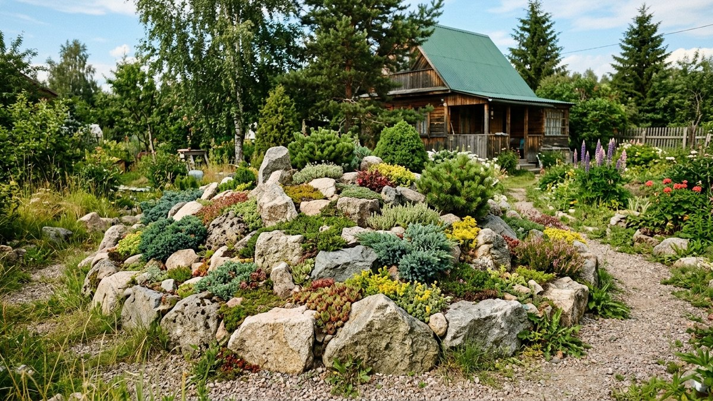
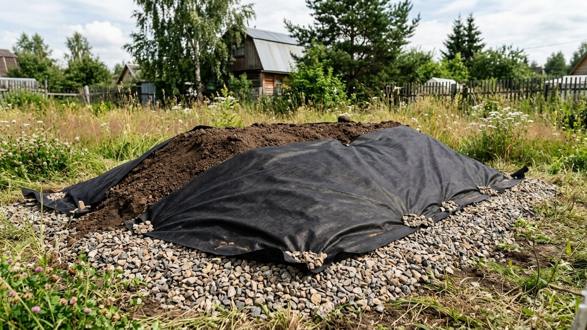
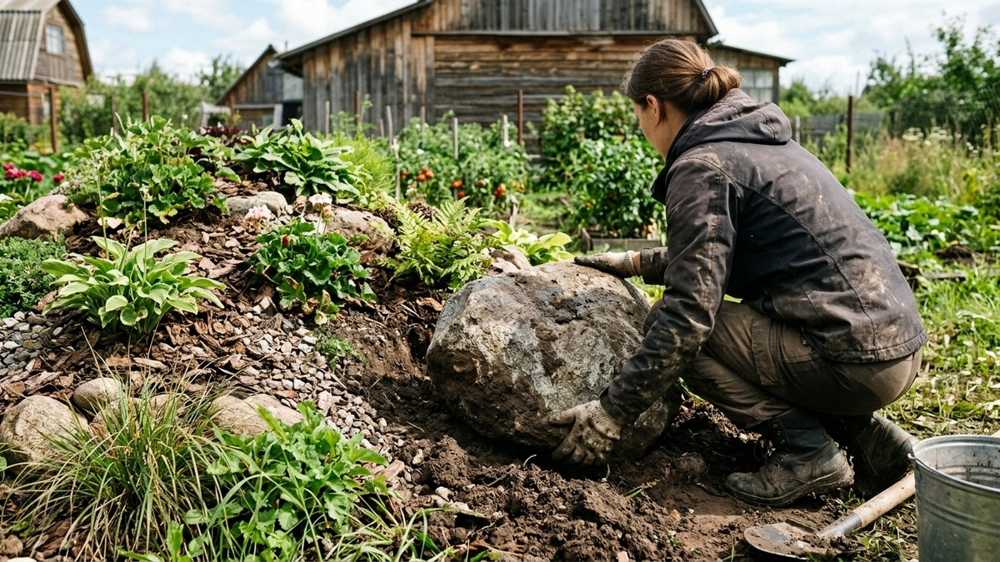
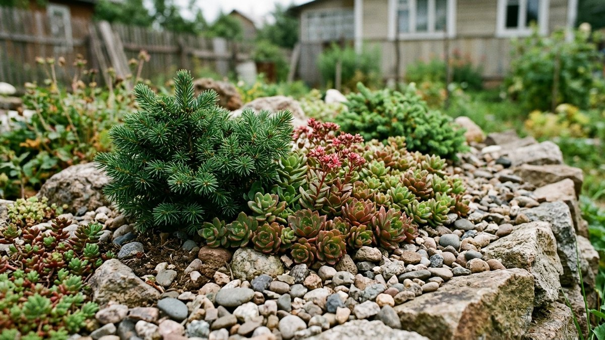
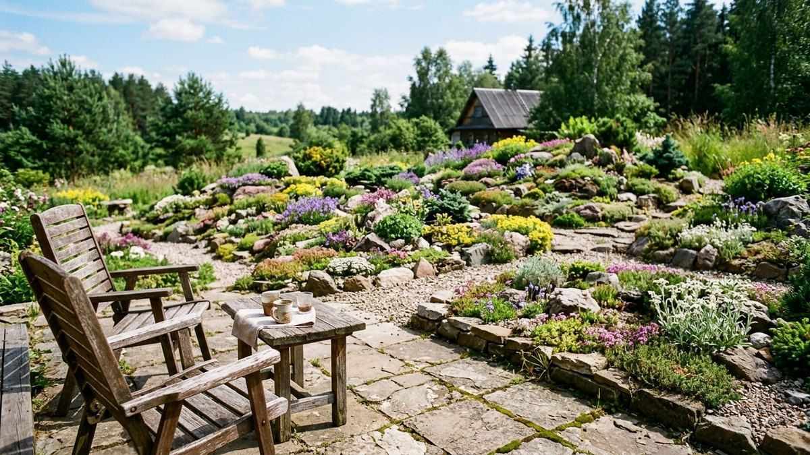
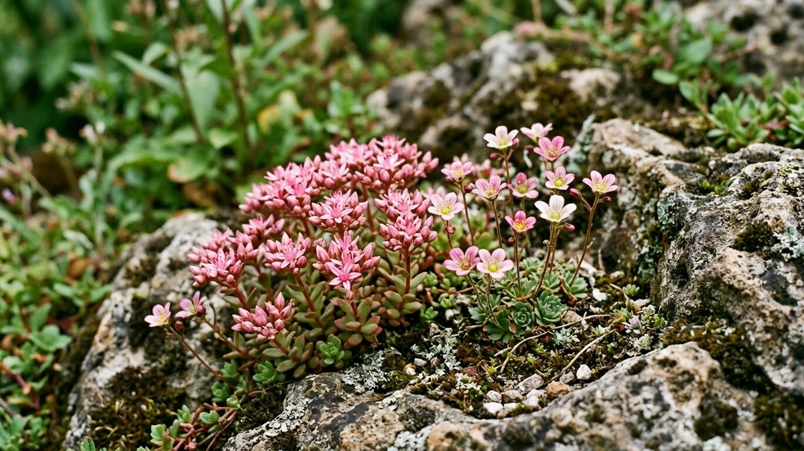

# Альпийская горка своими руками: от дренажа до посадки растений

Альпийская горка (альпинарий) — имитация горного склона: неровный рельеф,
крупные камни разного размера и растения, которые в природе растут на
каменистых альпийских лугах, а не пышные садовые цветы. Главная причина,
по которой самодельные горки часто выглядят неубедительно, — не форма и не
камни, а нарушенный дренаж и не те растения. Разберём горку по порядку: от
основания до подбора растений по ярусам.

## Выбор места

Солнечное открытое место — большинство альпийских растений в природе растут
на свету и в полутени быстро вытягиваются и теряют компактную форму. Горку
ставят там, где её видно из зоны отдыха или окна дома — это элемент для
разглядывания вблизи, а не фоновая зелень на краю участка. Место обязательно
должно быть без застоя воды: даже небольшая горка на низине, куда стекает
вода со всего участка, обречена на загнивание корней растений в первый же
дождливый сезон. Хорошее соседство — зона отдыха: горка хорошо смотрится
рядом с беседкой или площадкой для отдыха, общий подход к зонированию
участка под такие акценты разобран в статье [планировка участка 10
соток](https://mir-doma.pro/planirovka-uchastka-10-sotok/).

## Дренаж — не опция

Это главное отличие горки от обычной цветочной клумбы: альпийские растения
в природе растут на каменистых, отлично дренированных склонах и не
переносят застоя воды у корней. Под горкой всегда закладывают дренажный
слой — битый кирпич, щебень или крупный гравий слоем 15–20 см, поверх него
геотекстиль, который не даёт грунту вымываться вниз и смешиваться с
дренажом. На глинистом грунте дренаж особенно критичен: вода на глине сама
не уходит и будет копиться прямо под горкой — устройство дренажа для такого
случая подробно разобрано в статье [дренаж участка на глинистых
почвах](https://mir-doma.pro/drenazh-uchastka-na-glinistoy-pochve/).

## Материалы: камень и грунт

- **Камень.** Берут один вид породы на всю горку — смесь разных камней
  выглядит хаотично и «новодельно». Размеры разные: крупные валуны у
  основания, средние и мелкие камни к вершине. Каждый камень заглубляют в
  грунт на треть — камни, просто уложенные на поверхность, выглядят
  ненатурально и легко смещаются.
- **Грунт.** Обычная садовая земля для альпинария не годится — она слишком
  плотная и питательная. Смешивают дренированный грунт: садовую землю,
  крупный песок и мелкий гравий примерно в равных частях. Чем беднее и
  легче почва, тем компактнее и аккуратнее растёт большинство альпийских
  растений — в жирном грунте они вытягиваются и теряют форму.

## Сборка горки пошагово

1. Снять дёрн на площади будущей горки и на 20–30 см за её границами.
2. Уложить дренажный слой (щебень или битый кирпич) 15–20 см, накрыть
   геотекстилем внахлёст.
3. Насыпать холм из подготовленной дренированной грунтовой смеси, придавая
   форму с асимметричным, а не конусообразным ровным профилем — природный
   рельеф всегда неровный.
4. Уложить крупные камни у основания, заглубляя каждый на треть и
   утрамбовывая грунт вокруг — это самый нагруженный ярус, камни должны
   стоять устойчиво.
5. Продолжить укладку среднего и мелкого камня к вершине, оставляя между
   камнями карманы грунта под посадку.
6. Досыпать грунт в промежутки между камнями, слегка утрамбовать, полить и
   дать осесть несколько дней перед посадкой.

## Растения по ярусам

- **У подножия** — растения, которые переносят чуть больше влаги и тени:
  флоксы шиловидные, низкорослые ирисы, барвинок.
- **В средней части** — очитки (седумы), молодило, гвоздика травянка —
  классика альпинариев, неприхотливы и держат компактную форму без ухода.
- **На вершине, самое сухое и солнечное место** — карликовые хвойники
  (можжевельник горизонтальный, туя карликовых форм), камнеломки, тимьян
  ползучий.

Высокие и агрессивно разрастающиеся многолетники (флоксы метельчатые,
крупные седумы, ландыш) на горку не сажают — за один-два сезона они
затягивают камни и убирают весь эффект рельефа, ради которого горка
строилась.

## Частые ошибки

- **Горка без дренажа.** Самая частая причина, по которой альпийские
  растения выпревают и гибнут за одну влажную зиму — вода стоит в грунте
  без оттока.
- **Камни одного размера, уложенные рядами.** Выглядит как декоративная
  отсыпка, а не имитация горного рельефа — нужны разные размеры и
  неровная, асимметричная раскладка.
- **Жирный питательный грунт вместо дренированной смеси.** Провоцирует
  быстрый рост и потерю формы у растений, которые в природе растут на
  бедных каменистых почвах.
- **Крупные разрастающиеся многолетники в композиции.** За пару сезонов
  полностью закрывают камни, ради которых горка и задумывалась.

## Частые вопросы

### Чем альпийская горка отличается от рокария

Альпийская горка имитирует горный рельеф — у неё есть возвышение и ярусы.
Рокарий — плоская или слабо рельефная каменистая композиция без выраженного
холма, часто более крупная по площади.

### Обязательно ли делать дренаж под альпийской горкой

Да — без дренажного слоя вода застаивается в грунте, и большинство
альпийских растений, привыкших к сухим каменистым склонам, из-за этого
загнивают уже в первый влажный сезон.

### Какие растения самые неприхотливые для альпийской горки

Очитки (седумы) и молодило — они переносят бедную почву, жару и
кратковременную засуху без ухода и хорошо держат компактную форму на любом
ярусе горки.

### Что посадить рядом с альпийской горкой, если хочется больше цвета

Рядом с горкой, но не на ней самой, хорошо смотрятся клумбы с розами или
другими яркими многолетниками — на самой горке крупные декоративные цветы
разрастаются и закрывают камни, а по соседству работают как контраст.
Разбор посадки и ухода — в статье [розы: посадка и
уход](https://mir-doma.pro/rozy-posadka-i-uhod/).

### Можно ли сделать альпийскую горку в тени

Можно, но набор растений будет другим — классические солнцелюбивые
альпийские виды в тени вытягиваются, вместо них подбирают теневыносливые
почвопокровники и папоротники, сохраняя ту же принципиальную структуру с
дренажом и камнем.

