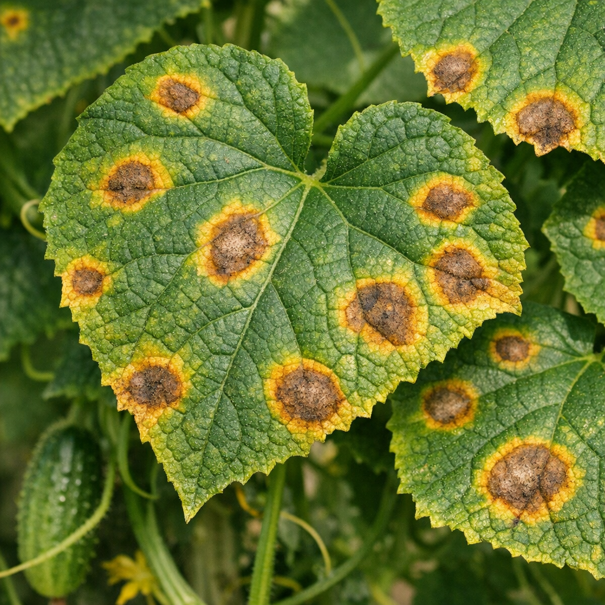
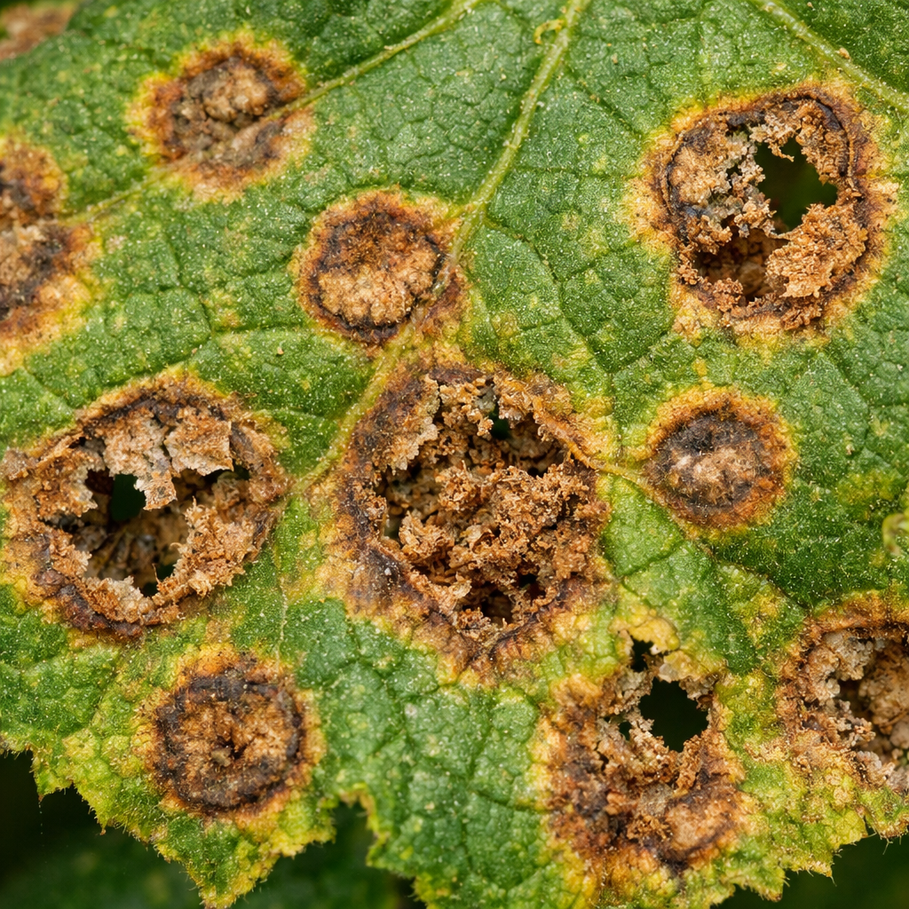
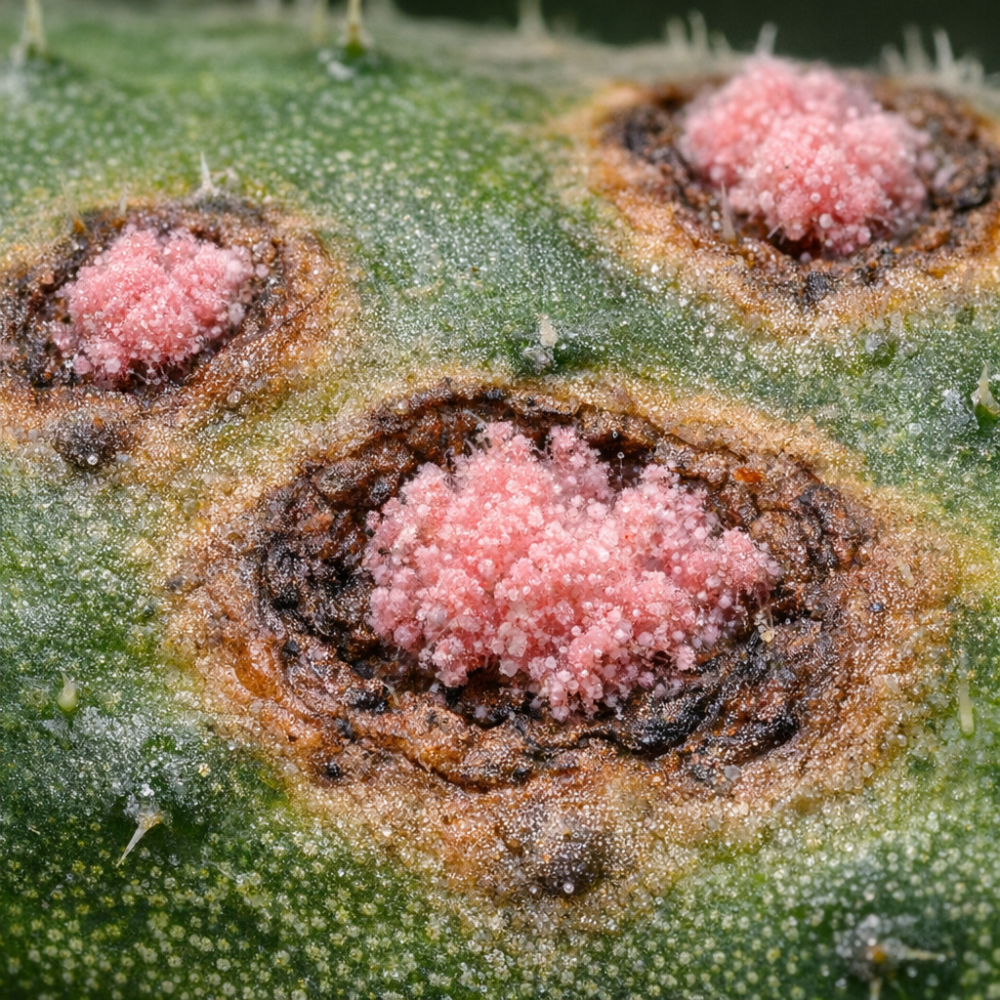
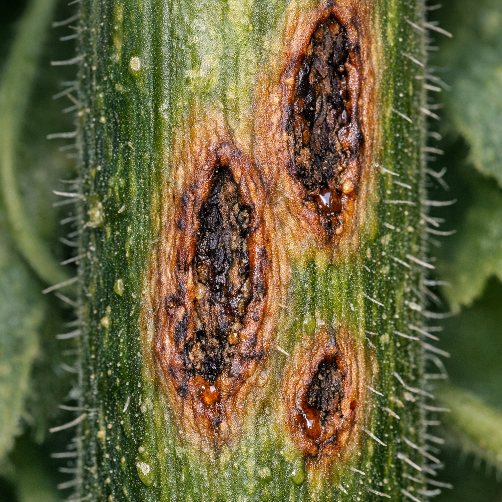
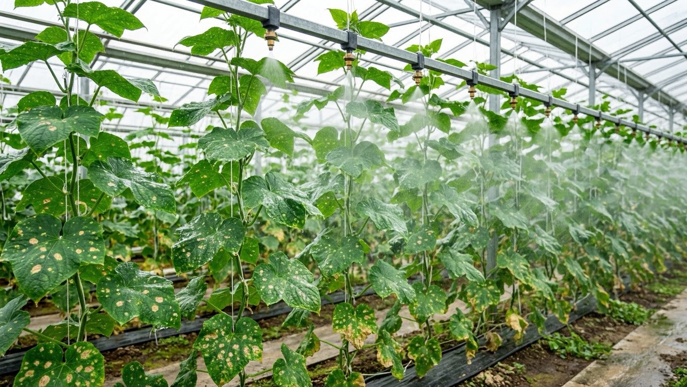
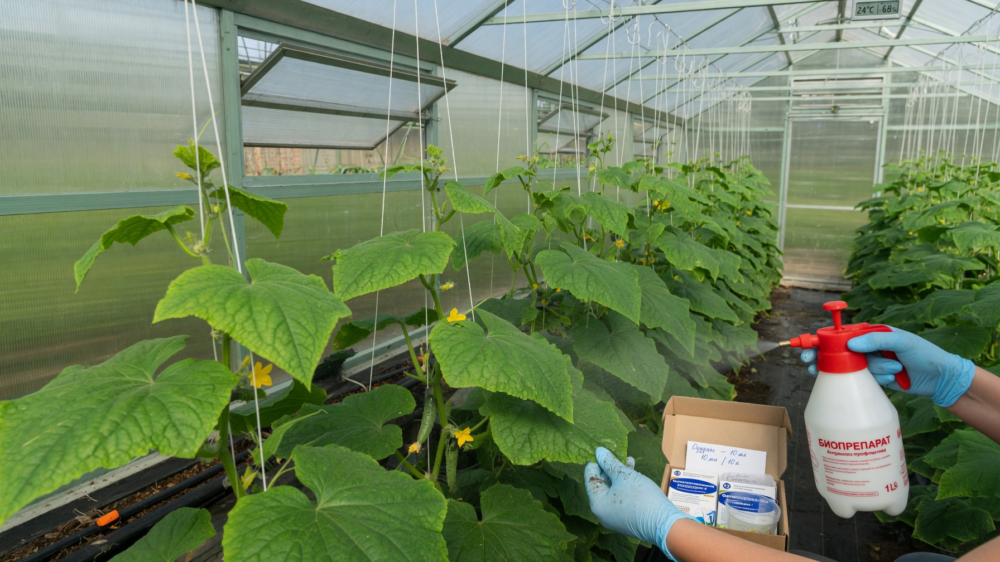

Антракноз, который дачники часто называют медянкой, — грибковая болезнь огурцов, поражающая и листья, и стебли, и сами плоды. Она особенно опасна тем, что не заканчивается с уборкой урожая: заражённые огурцы продолжают гнить уже при хранении. Разберём, как распознать антракноз огурцов, чем обработать растения и что сделать, чтобы болезнь не вернулась.

## 🍄 Что такое антракноз

Антракноз вызывает грибок, который зимует **на растительных остатках и семенах**, а весной прорастает и заражает молодые растения. Споры разносятся ветром, каплями воды, насекомыми и на руках и инструменте.

Болезнь развивается стремительно во влажную тёплую погоду и поражает растение целиком — от листьев до плодов. Поражённые огурцы теряют товарный вид, горчат и быстро загнивают, поэтому вовремя распознать антракноз особенно важно.

## 🔍 Признаки антракноза

Симптомы отличаются от других огуречных болезней:

- **На листьях** — округлые, расплывчатые желтовато-бурые пятна. Со временем поражённая ткань подсыхает, крошится и выпадает, оставляя дыры.
- **На стеблях и черешках** — вытянутые вдавленные бурые язвочки, растение слабеет и может переломиться.
- **На плодах** — самый узнаваемый признак: **вдавленные бурые язвы**, будто вмятины. Во влажную погоду в них появляется **розоватый налёт спор** — отсюда народное название «медянка».
- Поражённые огурцы горчат, темнеют и гниют, в том числе уже при хранении.

## ⚖️ Как отличить от других болезней

Главное — не спутать, потому что лечение разное:

| Болезнь | Отличительный признак |
|---|---|
| **Антракноз** | **Округлые** расплывчатые пятна; вдавленные язвы на плодах; **розовый налёт** спор во влажность |
| **Бактериоз** | **Угловатые** маслянистые пятна, ограниченные жилками; мутные капли снизу листа |
| **Пероноспороз** | Жёлтые угловатые пятна сверху, **серо-фиолетовый налёт** снизу |
| **Мучнистая роса** | **Белый мучнистый налёт** на верхней стороне листа |

Проще всего ориентироваться по плодам: вдавленные язвы с розовым налётом бывают только при антракнозе. Если же пятна угловатые и с каплями — это [бактериоз](https://mir-doma.pro/bakterioz-ogurtsov/), а белый налёт сверху — [мучнистая роса](https://mir-doma.pro/muchnistaya-rosa-na-ogurtsah/).

## 🌦️ Причины появления

Антракноз развивается, когда совпадают несколько условий:

- **высокая влажность** (около 90%) — дожди, роса, сырость в теплице;
- **тепло +22…+27 °C** — оптимум для грибка;
- **загущённые посадки** и слабое проветривание;
- **полив по листьям**, особенно холодной водой;
- **заражённые семена** и неубранные растительные остатки;
- **ослабленные растения** — им сложнее сопротивляться инфекции.

## 🧪 Чем обработать: лечение

Антракноз — грибковая болезнь, поэтому здесь работают фунгициды.

1. **Удалить поражённое.** Оборвать больные листья, срезать поражённые плоды и вынести с участка (не в компост).
2. **Обработать фунгицидами.** На ранней стадии помогают медьсодержащие препараты — бордоская жидкость, ХОМ, оксихлорид меди. При сильном поражении применяют системные фунгициды по инструкции.
3. **Биопрепараты** (фитоспорин, триходерма) эффективны в самом начале и как профилактика между обработками.
4. **Снизить влажность** — проветривать теплицу, проредить посадки, перейти на полив под корень тёплой водой.
5. **Повторить обработку** через 7–10 дней; обязательно выдержать срок ожидания перед сбором плодов, указанный на упаковке.

Важно: после обработок продолжайте осматривать растения — грибок легко возвращается, если сохраняется сырость.

## 📦 Антракноз и хранение урожая

Особенность антракноза в том, что он **не заканчивается со сбором огурцов**. Грибок продолжает развиваться уже в снятых плодах: внешне нормальный огурец через несколько дней темнеет, покрывается вдавленными пятнами и загнивает. Поэтому:

- **тщательно перебирайте урожай** с больных растений — даже небольшая вмятина или потемнение означают, что плод не хранится;
- **не закладывайте на хранение** огурцы с грядки, где был антракноз, — их лучше сразу пустить в переработку;
- **не смешивайте** такие плоды со здоровыми: гниль легко переходит на соседние.

Общие правила закладки и хранения урожая разбирали в статье [как хранить овощи зимой](https://mir-doma.pro/kak-hranit-ovoshchi-zimoy/).

## 🛡️ Профилактика

Чтобы антракноз не появился снова:

- **обеззараживайте семена** перед посевом — они частый источник инфекции;
- **соблюдайте севооборот**, не сажая огурцы после тыквенных;
- **убирайте растительные остатки** осенью и не кладите больные в компост;
- **дезинфицируйте теплицу** после сезона — грибок зимует в грунте и на конструкциях; как это сделать, подробно в статье про [обработку теплицы осенью](https://mir-doma.pro/obrabotka-teplicy-osenyu/);
- **не загущайте посадки** и регулярно проветривайте теплицу;
- **поливайте под корень**, избегая дождевания;
- **выбирайте устойчивые гибриды** — производители указывают устойчивость к антракнозу.

## ❓ Частые вопросы

**Как выглядит антракноз на огурцах?**
На листьях — округлые расплывчатые желтовато-бурые пятна, которые подсыхают и выпадают. На плодах — вдавленные бурые язвы, во влажную погоду с розоватым налётом спор. На стеблях появляются вытянутые язвочки.

**Чем обработать огурцы от антракноза?**
Медьсодержащими препаратами (бордоская жидкость, ХОМ) или системными фунгицидами при сильном поражении. На ранней стадии помогают биопрепараты. Одновременно снижают влажность и убирают поражённые части.

**Почему антракноз называют медянкой?**
Из-за характерного розовато-медного налёта спор, который выступает во влажную погоду в язвах на плодах.

**Можно ли есть огурцы с антракнозом?**
Плоды с язвами в пищу не годятся — они горчат и загнивают. Внешне здоровые огурцы с обработанного растения можно есть только после срока ожидания, указанного на упаковке препарата.

**Чем антракноз отличается от бактериоза?**
При антракнозе пятна округлые и расплывчатые, а на плодах вдавленные язвы с розовым налётом. При бактериозе пятна угловатые, ограничены жилками, а снизу листа выступают мутные капли.

**Как не допустить антракноз в следующем сезоне?**
Обеззаразить семена, убрать растительные остатки, продезинфицировать теплицу, соблюдать севооборот, поливать под корень и не загущать посадки.

---

Антракноз огурцов узнаётся по округлым бурым пятнам и вдавленным язвам на плодах с розовым налётом. Лечится он фунгицидами — но только если не спутать его с бактериозом, у которого другая природа и другое лечение. Главная же защита — сухая листва, проветривание и чистая теплица. О самой частой болезни огурцов читайте в статье про [мучнистую росу](https://mir-doma.pro/muchnistaya-rosa-na-ogurtsah/), а если листья желтеют без пятен — в материале [почему желтеют листья у огурцов](https://mir-doma.pro/zhelteyut-listya-u-ogurtsov/).
