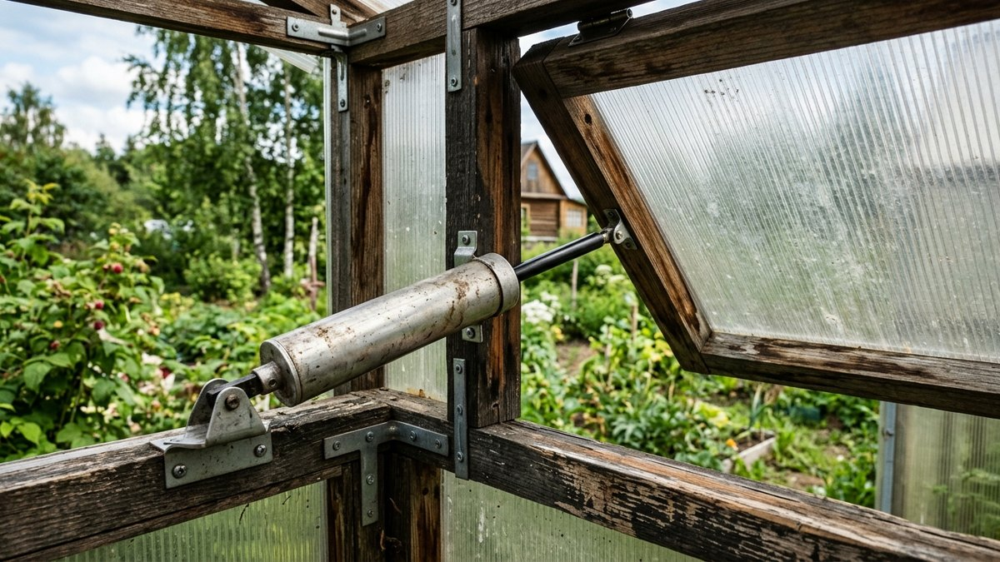
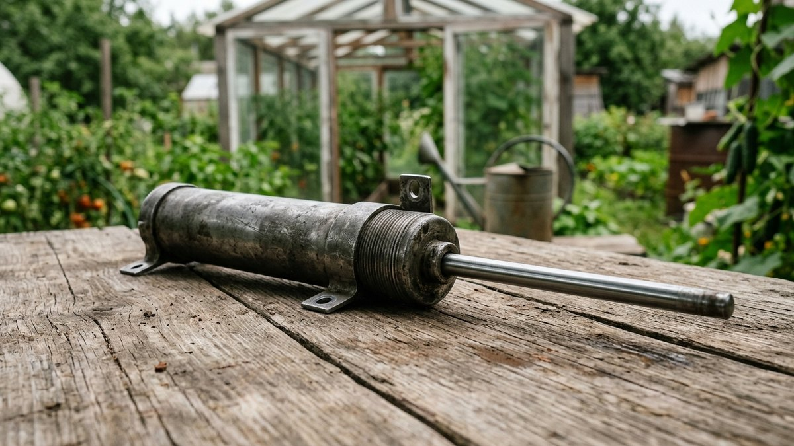
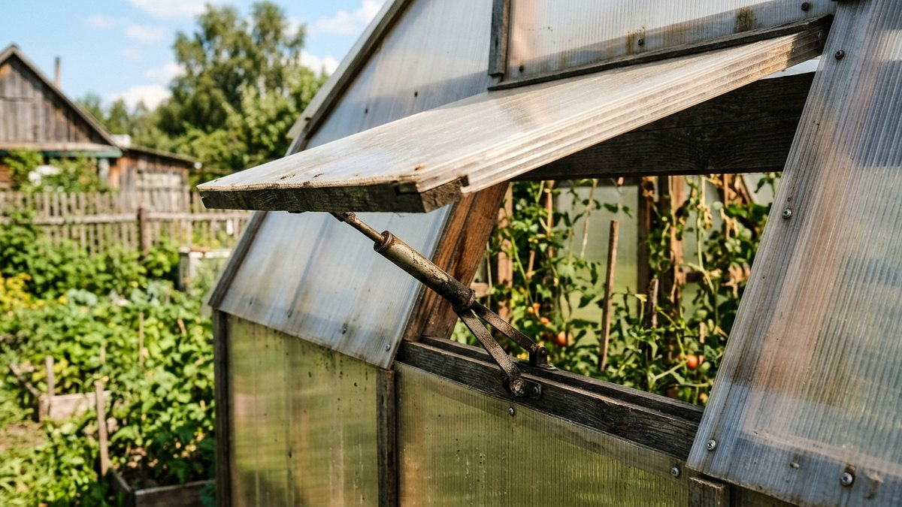
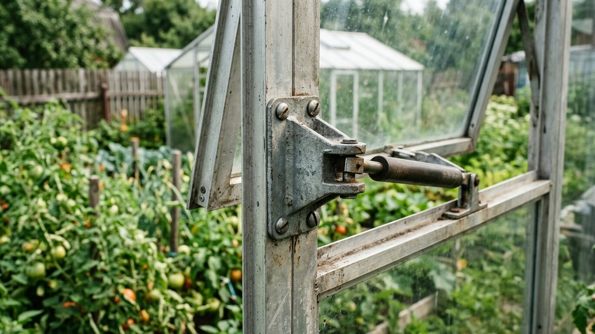
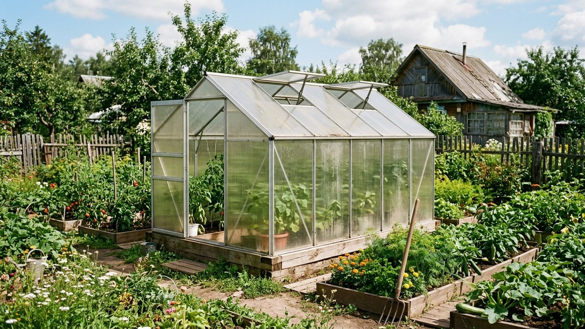

Закрытая теплица в жаркий солнечный день перегревается за пару часов — температура внутри легко переваливает за 50 °C, и растения получают тепловой удар, если форточку никто вовремя не откроет. Автоматический проветриватель решает эту проблему без электричества и без вашего присутствия на участке: сам открывает форточку при нагреве и закрывает при остывании. Разберём, как он устроен, какие виды бывают и как выбрать под конкретную теплицу.

## Как работает термопривод

Внутри привода — рабочее тело (воск, масло или биметаллическая пластина), которое расширяется при нагреве и сжимается при остывании. Расширяясь, оно толкает шток, который через рычаг поднимает форточку; при остывании шток втягивается обратно, и форточка под собственным весом закрывается. Никакой электроники, батареек или проводов — чисто механический процесс, который работает даже если на участке неделями никого нет.

## Виды автоматических проветривателей

- **Биметаллические** — самые простые и недорогие, работают за счёт разного теплового расширения двух соединённых металлов. Менее точные и обычно рассчитаны на форточки небольшого веса.
- **Восковые (наиболее распространены)** — в цилиндре находится специальный воск, который при нагреве плавится и расширяется в объёме, создавая усилие на штоке. Точнее биметаллических, надёжнее в работе, служат много сезонов.
- **Гидравлические (масляные)** — похожий принцип, но рабочее тело жидкое; чуть более плавный ход, чаще встречаются в моделях с повышенной грузоподъёмностью.
- **Электронные** — с датчиком температуры и электроприводом (от сети или аккумулятора). Дают точную настройку и могут открывать форточку по расписанию или дистанционно, но требуют электричества и стоят заметно дороже — для большинства дачных теплиц избыточны.

Для дачи, где электричества в теплице обычно нет, а бывать получается не каждый день, восковой термопривод — самый практичный выбор: не зависит от батареек и сети, а по надёжности не уступает более дорогим вариантам.

## На что смотреть при выборе

- **Грузоподъёмность.** У разных моделей — от 4 до 12+ кг. Взвесьте или оцените вес форточки заранее: привод, рассчитанный на 4 кг, не поднимет тяжёлую раму с двойным поликарбонатом.
- **Диапазон срабатывания.** Большинство моделей позволяют настроить температуру открывания в пределах 15–25 °C — важно, чтобы диапазон подходил под то, что вы выращиваете: теплолюбивым культурам openable позже, зеленным раньше.
- **Ход штока.** Определяет, насколько широко откроется форточка, — обычно 30–45 см. Для маленькой форточки хватает и меньшего хода, для крупной автоматической фрамуги на всю стену нужен больший.
- **Материал корпуса.** Нержавеющая сталь служит в условиях постоянного конденсата теплицы дольше, чем окрашенный обычный металл, который со временем ржавеет.

## Установка

Термопривод крепится одним концом к неподвижной раме теплицы, другим — к форточке, через рычаг. Важно выставить угол крепления так, чтобы шток работал по прямой траектории без перекоса, — тогда рычаг усилия будет равномерным на всём ходу форточки. После установки стоит проверить работу вручную: подвинуть шток от руки в разных положениях и убедиться, что форточка открывается и закрывается свободно, без заеданий о раму или петли.

## Что термопривод не решает

Автоматический проветриватель спасает от перегрева летом, но не защищает от заморозков — весной и осенью, когда днём тепло, а ночью резко холодает, форточка так же открывается днём и закрывается ночью автоматически, без учёта прогноза. В переходный сезон стоит проверять теплицу лично или ставить модель с более узким диапазоном настройки, чтобы не рисковать переохлаждением рассады ночью.

Автоматическое проветривание — только половина автоматизации теплицы: вторая половина — полив, который тоже можно сделать не требующим ежедневного присутствия, разбор устройства — в статье [«Автополив теплицы своими руками»](https://mir-doma.pro/avtopoliv-dlya-teplitsy-svoimi-rukami/). А если теплица из поликарбоната ещё не построена, общий разбор конструкции и обустройства — в статье [«Теплица из поликарбоната своими руками»](https://mir-doma.pro/teplitsa-iz-polikarbonata-svoimi-rukami/).

## Частые ошибки

- **Брать привод без запаса по грузоподъёмности.** Форточка на пределе паспортной массы открывается медленно и рывками, а привод изнашивается быстрее.
- **Неправильный угол монтажа.** Шток, работающий с перекосом, заедает и быстрее выходит из строя.
- **Ставить дешёвый биметаллический привод на тяжёлую форточку.** Модели этого типа обычно рассчитаны на небольшую нагрузку — для крупной автоматической фрамуги лучше восковой или гидравлический вариант.
- **Полагаться на термопривод как на защиту от заморозков.** Он реагирует только на нагрев, а не следит за прогнозом и ночными похолоданиями.

## Частые вопросы

### Нужно ли электричество для автоматического проветривания теплицы?

Нет, механические термоприводы (восковые, биметаллические, гидравлические) работают полностью автономно за счёт теплового расширения рабочего тела. Электричество нужно только электронным моделям с датчиком и приводом, которые для дачной теплицы обычно избыточны.

### Какой термопривод лучше выбрать?

Для большинства дачных теплиц оптимален восковой термопривод — надёжнее биметаллического, не требует электричества в отличие от электронного и служит несколько сезонов без обслуживания.

### Сколько служит термопривод для теплицы?

При правильном монтаже без перекоса и в пределах паспортной грузоподъёмности — от 5 до 10 лет в зависимости от качества модели и условий эксплуатации.

### Можно ли сделать автоматическое проветривание своими руками без покупного термопривода?

Технически да — самодельные варианты на основе газовых амортизаторов или пружинных механизмов существуют, но они менее надёжны и предсказуемы по усилию и температуре срабатывания, чем заводской термопривод, который стоит недорого именно из-за массовости производства.

### Защищает ли термопривод теплицу от заморозков?

Нет, термопривод реагирует только на нагрев внутри теплицы и открывает форточку в жару. От ночных заморозков он не защищает — за этим по-прежнему нужно следить лично, особенно в переходные сезоны.
