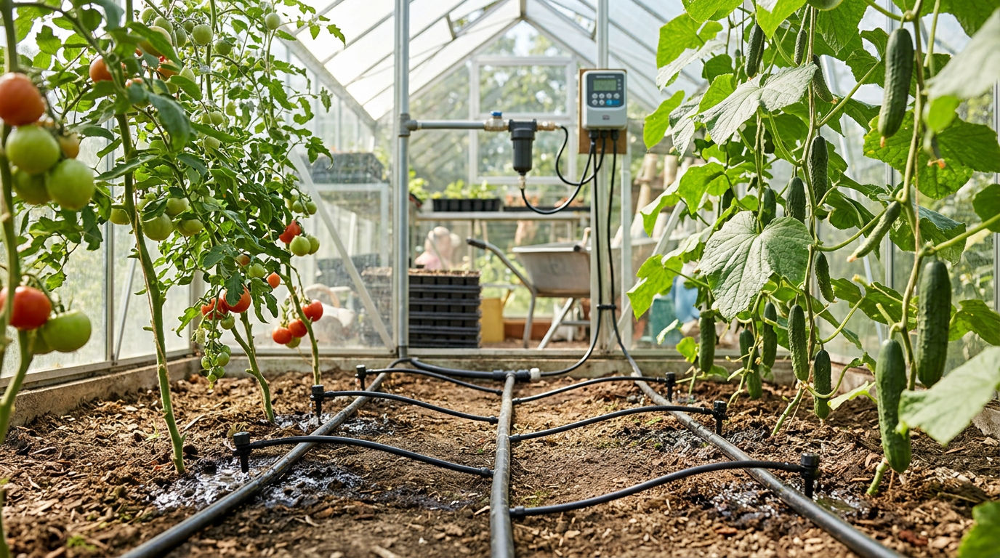
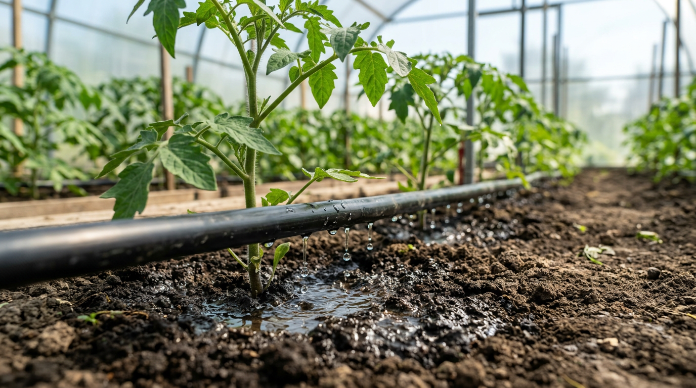
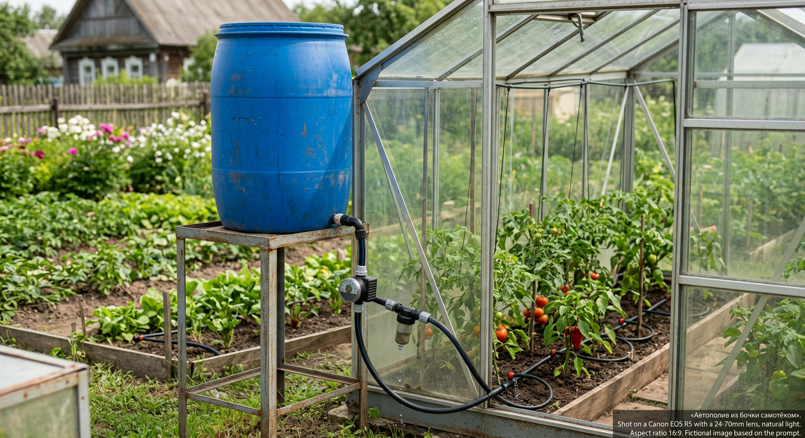
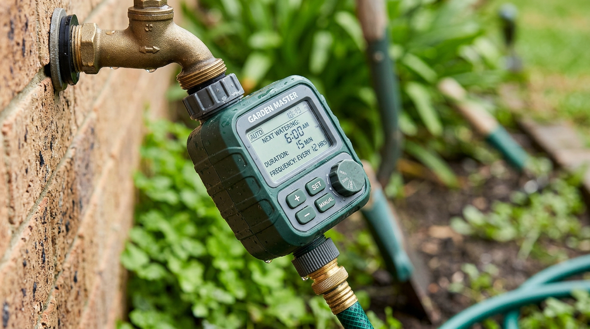
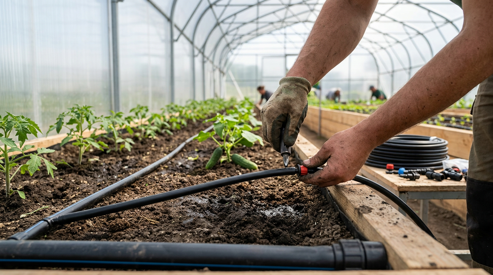
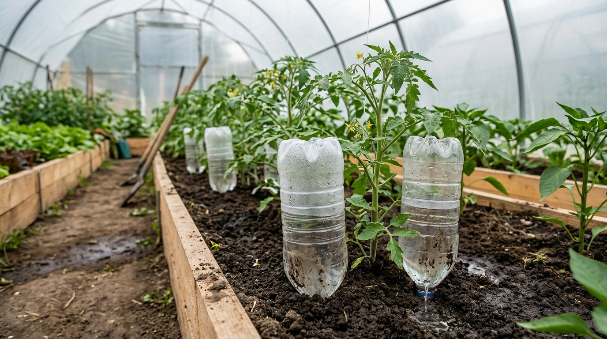

Полив теплицы в жару — занятие утомительное и ежедневное, а стоит уехать на несколько дней, как растения остаются без воды. Решение есть — автополив: один раз настроил систему, и теплица поливается сама, равномерно и точно под корень. Сделать такой полив своими руками вполне реально и недорого, от простой капельной системы из бочки до автоматики с таймером. В этой статье разберём виды автополива для теплицы, как сделать капельную систему своими руками и какие простые варианты подойдут для дачи, которую посещают наездами.

## 🌱 Зачем нужен автополив в теплице

Автоматический полив — это не роскошь, а способ получить лучший урожай с меньшими усилиями:

- **Экономит время** — не нужно ежедневно стоять со шлангом.
- **Поливает равномерно** — каждое растение получает свою порцию воды.
- **Подаёт воду под корень** — листья остаются сухими, а это меньше болезней (фитофторы, гнилей).
- **Экономит воду** — она идёт прямо к корням, а не испаряется с поверхности.
- **Работает в ваше отсутствие** — теплица поливается, даже когда вы в городе.
- **Бережёт растения от стресса** — равномерная влажность без «качелей» засуха–перелив, из-за которых трескаются плоды и опадают завязи.

Особенно важно, что из бочки в систему поступает прогретая на солнце вода, а полив холодной водой томаты и огурцы переносят плохо. Если вы только планируете теплицу, автополив удобно предусмотреть сразу — о самой постройке мы рассказывали в статье о [теплице из поликарбоната своими руками](https://mir-doma.pro/teplitsa-iz-polikarbonata-svoimi-rukami/).

## 🚿 Виды автополива для теплицы

Систем автополива несколько — от продвинутых до самых простых.

### Капельный полив

Самый популярный и удачный для теплицы вариант. Вдоль грядок прокладывают капельные ленты или трубки с капельницами, которые подают воду по каплям прямо под каждое растение. Это экономично, поддерживает сухие листья и равномерную влажность. Капельные ленты дешевле и проще, но служат меньше; трубки с капельницами дороже, зато долговечны и позволяют точно дозировать воду каждому растению. Подробно базовая система разобрана в статье о [капельном поливе своими руками](https://mir-doma.pro/kapelnyy-poliv-svoimi-rukami/).

### Дождевание

Вода разбрызгивается сверху через распылители. Для теплицы этот способ менее желателен: мокрые листья провоцируют грибковые болезни, а неравномерный полив — другие проблемы, от которых, например, [желтеют листья у огурцов](https://mir-doma.pro/zhelteyut-listya-u-ogurtsov/). Дождевание уместно разве что для рассады и зелени, которым нужна повышенная влажность.

### Внутрипочвенный полив

Вода подаётся по трубам, проложенным в земле, прямо к корням. Способ экономичный и эффективный, но более сложный в монтаже, поэтому на дачах встречается реже.

### Фитильный полив и бутылки

Простейшие способы для небольших объёмов: фитиль из ткани подводит воду из ёмкости к корням, а вкопанная горлышком вниз бутылка с отверстиями медленно отдаёт влагу. Идеально для рассады и дачи наездами.

## 🪣 Источник воды: бочка или водопровод

Откуда брать воду — ключевой вопрос автополива.

- **Бочка на высоте** (1,5–2 метра) — вода идёт самотёком, без электричества и насоса. Главный плюс — вода в бочке прогревается на солнце, что идеально для теплицы. Это самый популярный вариант для дачи.
- **Водопровод** — даёт стабильный напор, но воду из него (часто холодную и под давлением) нужно пропускать через редуктор давления, а для теплолюбивых культур — давать ей прогреться.

Для большинства теплиц бочка с тёплой водой — оптимальное решение. Объём бочки подбирают по размеру теплицы и числу растений: чем больше посадок, тем вместительнее нужна ёмкость, чтобы воды хватало между доливами.

## ⏱️ Автоматизация: таймер и датчики

Чтобы система стала по-настоящему «авто», на кран ставят таймер.

- **Таймер полива** — электронный или механический прибор на кране, который открывает и закрывает воду по расписанию (например, утром и вечером на заданное время). Работает от батареек.
- **Контроллер с датчиком влажности** — более умный вариант: поливает не по часам, а когда почва действительно подсохла. Экономит воду и бережёт растения от перелива.

С таймером теплица поливается сама даже в ваше отсутствие — достаточно следить за уровнем воды в бочке. Поливать лучше рано утром или вечером, когда нет палящего солнца, — так вода лучше усваивается и меньше испаряется. Это расписание и задают в таймере.

## 🛠️ Капельный автополив своими руками: пошагово

Разберём сборку самой популярной системы — капельного автополива из бочки.

1. **Установите бочку** на подставку высотой 1,5–2 метра у теплицы, чтобы вода шла самотёком.
2. **Поставьте кран и фильтр** на выходе из бочки — фильтр обязателен, иначе капельницы быстро забьются.
3. **Проложите магистральную трубу** вдоль теплицы от бочки.
4. **Разведите капельные ленты или трубки** вдоль каждой грядки, подключив их к магистрали.
5. **Разместите капельницы** у каждого растения (если используете трубки с отдельными капельницами).
6. **Установите таймер** на кран для автоматического полива по расписанию.
7. **Проверьте систему**, заполнив бочку: убедитесь, что вода равномерно поступает к каждому растению, и при необходимости отрегулируйте.

После настройки остаётся только следить за уровнем воды в бочке и доливать её. Раз в сезон систему промывают, а фильтр чистят, чтобы капельницы не засорялись. На зиму ленты и трубки сливают и убирают, чтобы их не разорвало льдом.

## 💡 Простые варианты без затрат

Если нужен полив для дачи наездами или для рассады, подойдут бюджетные решения:

- **Из пластиковых бутылок.** В бутылке проделывают мелкие отверстия и вкапывают её горлышком вниз рядом с растением — вода медленно просачивается к корням несколько дней.
- **Фитильный полив.** Один конец тканевого жгута опускают в ёмкость с водой, другой — к корням растения; влага поднимается по фитилю.
- **Конусы и автополивайки.** Готовые насадки на бутылки, которые втыкают в землю.

Эти способы не заменят полноценную систему, но выручат, когда нужно обеспечить растения водой на несколько дней.

## 🛡️ Частые ошибки

- **Нет фильтра.** Без него капельницы забиваются мусором из воды, и система перестаёт работать.
- **Холодная вода из водопровода.** Полив холодной водой вреден теплолюбивым культурам — давайте воде прогреться.
- **Дождевание в теплице.** Мокрые листья провоцируют болезни — в теплице предпочтительнее капельный полив под корень.
- **Бочка стоит слишком низко.** Без достаточной высоты не будет самотёка и нужного давления.
- **Полив без учёта погоды.** Жёсткое расписание без поправки на дождь и жару ведёт к переливу или пересушке — выручает датчик влажности.

## ❓ Частые вопросы

### Какой автополив лучше для теплицы?

Для теплицы оптимален капельный полив: он подаёт воду под корень, держит листья сухими (это профилактика болезней) и экономит воду. В сочетании с бочкой тёплой воды и таймером получается удобная и недорогая автоматическая система.

### Как сделать автополив в теплице из бочки?

Установите бочку на высоте 1,5–2 метра, поставьте на выходе кран и фильтр, проложите магистральную трубу и капельные ленты вдоль грядок, разместите капельницы у растений и при желании добавьте таймер. Вода будет идти самотёком и поливать теплицу автоматически.

### Нужен ли таймер для автополива?

Не обязательно, но желательно. Без таймера систему нужно включать и выключать вручную, а с ним полив идёт по расписанию сам, даже в ваше отсутствие. Ещё удобнее контроллер с датчиком влажности, который поливает только при подсыхании почвы.

### Можно ли сделать автополив без электричества?

Да. Система из бочки на высоте работает самотёком, без насоса и электричества. Даже таймеры бывают на батарейках. Поэтому автополив легко организовать на даче без электроснабжения.

### Зачем нужен фильтр в системе автополива?

Фильтр задерживает частицы мусора и ила из воды, которые иначе забивают тонкие отверстия капельниц. Без фильтра капельная система быстро выходит из строя, поэтому его ставят обязательно, особенно при поливе из бочки или открытого источника.

### Какую воду использовать для полива теплицы?

Лучше всего отстоянную и прогретую на солнце воду — поэтому бочку и ставят на солнечном месте. Холодная вода из скважины или водопровода вызывает у теплолюбивых культур стресс, поэтому ей дают прогреться или используют как раз накопительную бочку.

### Как поливать теплицу, если уезжаешь на неделю?

Лучше всего настроить капельный автополив из бочки с таймером — он будет поливать растения по расписанию. Для коротких отлучек или небольшой теплицы подойдут и простые способы: бутылки с отверстиями у корней и фитильный полив.

## Заключение

Автополив для теплицы своими руками — это удобство, экономия времени и воды и более здоровые растения. Для теплицы лучше всего подходит капельная система из бочки с тёплой водой, дополненная таймером: она поливает под корень, равномерно и автоматически, даже когда вас нет на даче. А для небольших объёмов и поездок выручат простые бутылки и фитили. Соберите систему один раз — и забудете об утомительном ежедневном поливе, а урожай в теплице будет только радовать. Начать можно с простой капельной линии из бочки, а позже добавить таймер и датчик влажности, превратив теплицу в полностью автономную.

А какой полив устроен в вашей теплице? Делитесь решениями в комментариях и подписывайтесь, чтобы не пропустить новые статьи о поливе и обустройстве дачи.
