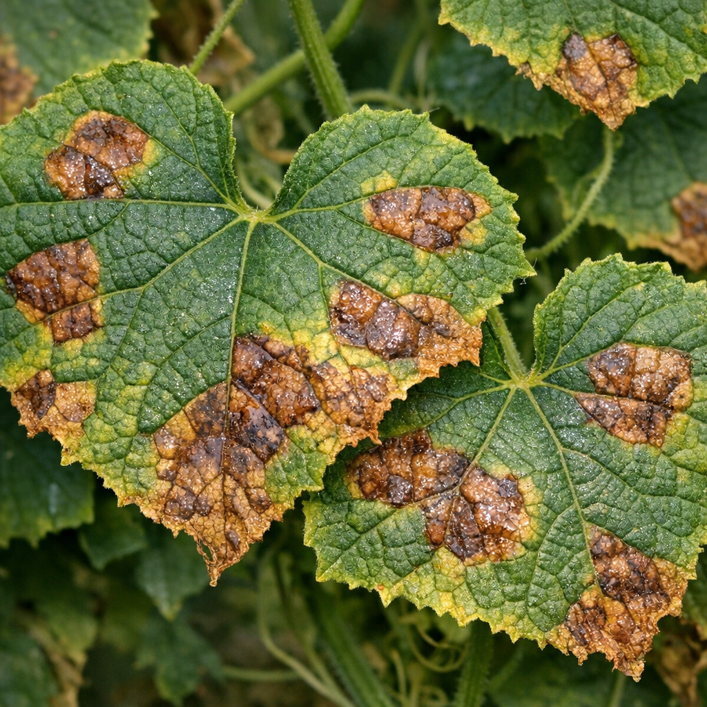
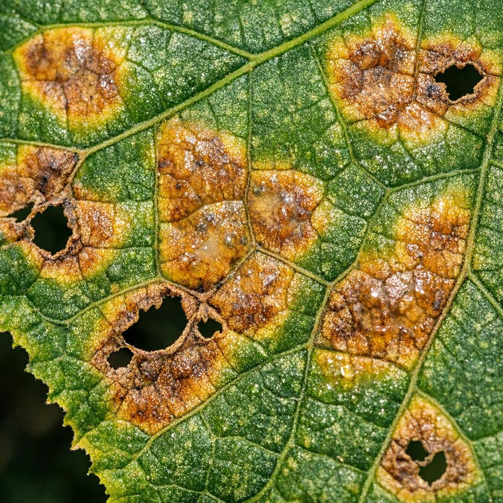
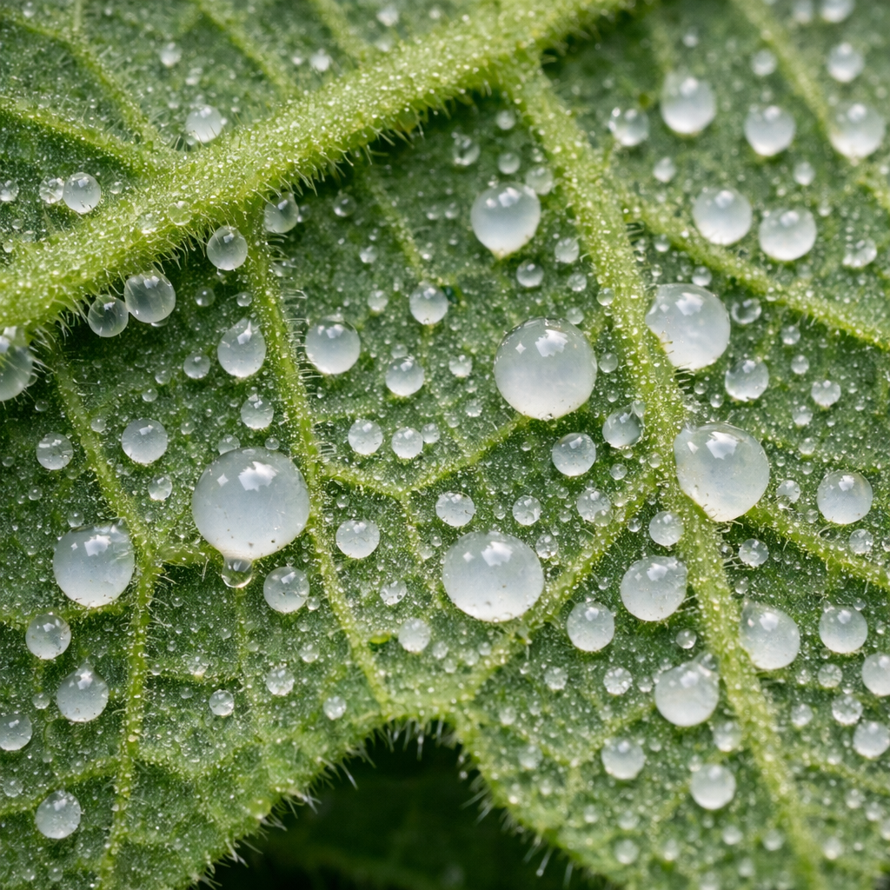
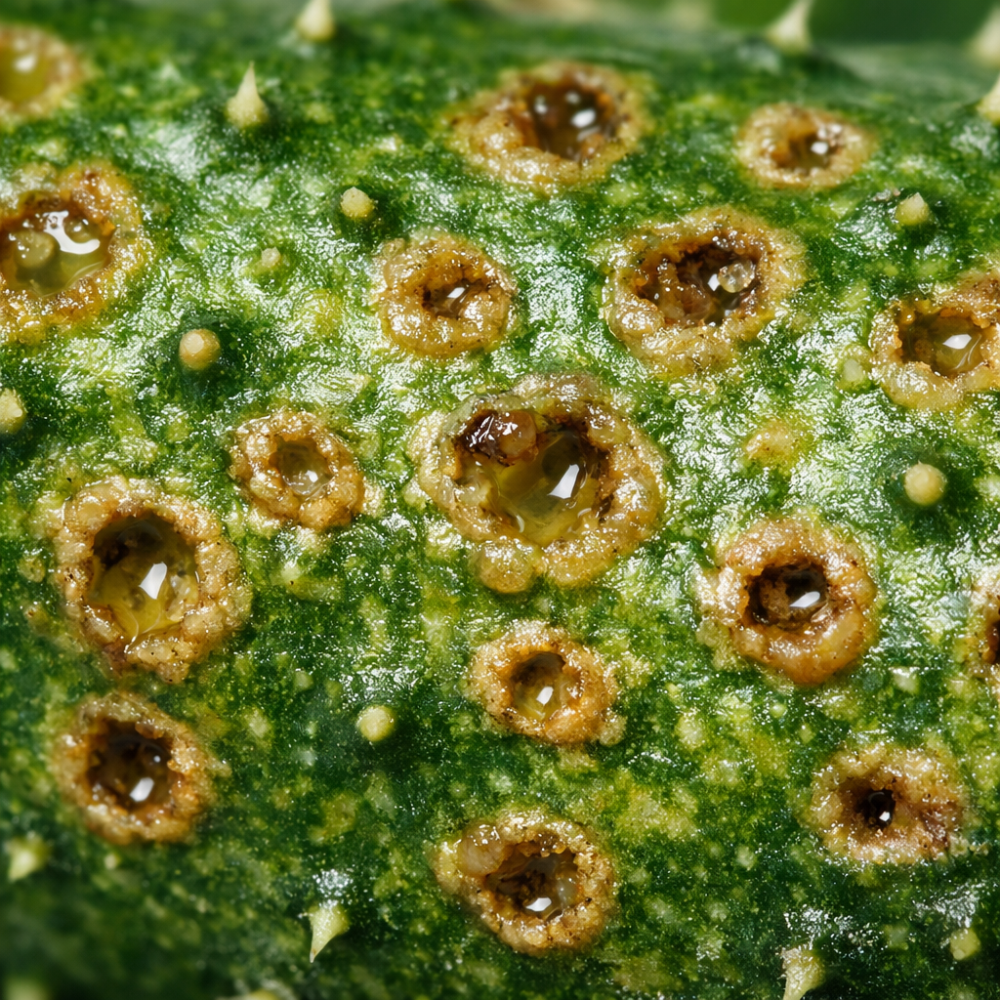
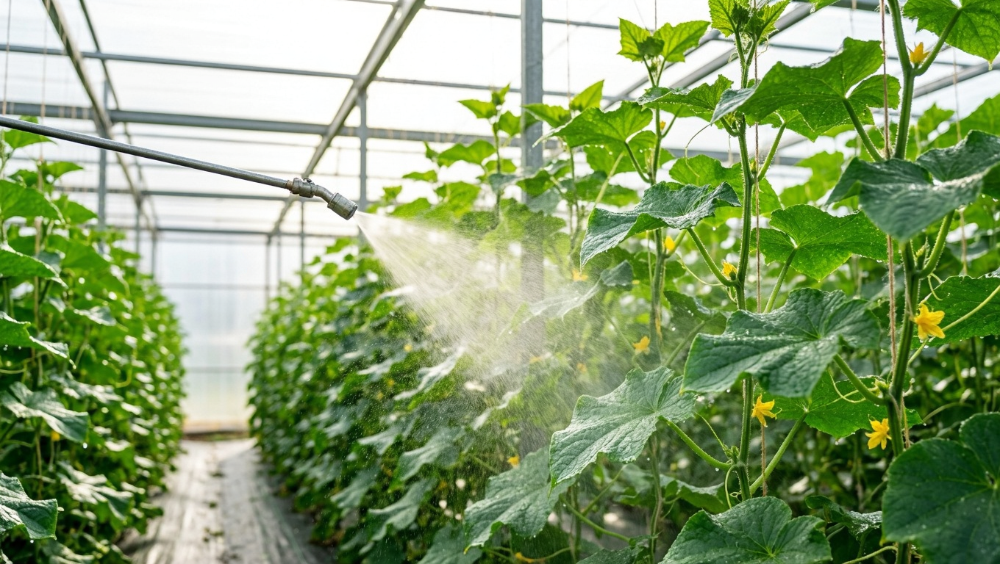
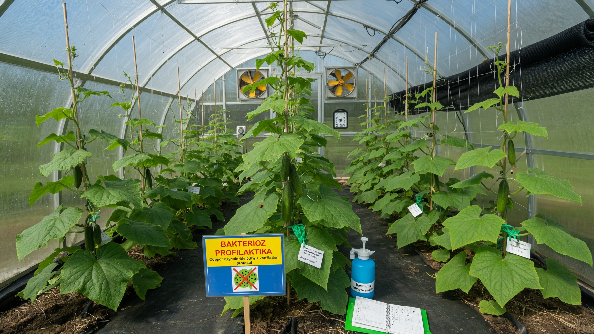

Бактериоз, или угловатая пятнистость листьев, — одна из самых коварных болезней огурцов. В отличие от грибковых болезней, её вызывают бактерии, поэтому привычные фунгициды здесь работают плохо, а болезнь за несколько дней способна изрешетить листья и испортить плоды. Разберём, как распознать бактериоз огурцов, чем он отличается от похожих болезней, чем обработать растения и как не допустить его в следующем сезоне.

## 🦠 Что такое бактериоз огурцов

Бактериоз (угловатая пятнистость) — бактериальная болезнь, поражающая листья, стебли, черешки и плоды огурца. Возбудитель зимует **в растительных остатках и на семенах**, а весной с брызгами воды и через ранки попадает в растение.

Опасность в том, что бактерии размножаются очень быстро: во влажную тёплую погоду болезнь распространяется за считанные дни, лист высыхает и выпадает, а плоды покрываются язвами и становятся непригодными. Урожай можно потерять почти полностью, поэтому важно поймать бактериоз в самом начале.

## 🔍 Признаки: как распознать

Симптомы у бактериоза очень характерные:

- **На листьях** — маслянистые, будто пропитанные водой пятна. Главная примета: пятна **ограничены жилками, поэтому имеют угловатую форму**, а не круглую.
- Пятна буреют и подсыхают, поражённая ткань крошится и **выпадает — лист становится дырявым**.
- **С нижней стороны листа** во влажную погоду выступают мутные капли — бактериальный экссудат. Подсыхая, они образуют белёсую плёнку.
- **На плодах** — водянистые пятна, переходящие в мокнущие язвочки и углубления; огурцы искривляются, горчат и загнивают.
- **На стеблях и черешках** — продолговатые бурые язвочки.

## ⚖️ Чем отличается от похожих болезней

Бактериоз легко спутать с другими пятнистостями, а лечение у них разное:

| Болезнь | Как выглядит |
|---|---|
| **Бактериоз** | Маслянистые **угловатые** пятна, ограниченные жилками; дырки в листе; мутные капли снизу |
| **Пероноспороз** (ложная мучнистая роса) | Жёлтые угловатые пятна сверху, но снизу — **серо-фиолетовый налёт** спор |
| **Антракноз** | **Округлые** расплывчатые бурые пятна; на плодах вдавленные язвы, во влажность — розоватый налёт |
| **Мучнистая роса** | **Белый мучнистый налёт** сверху листа, без пятен и дырок |

Ключ к различению: угловатые пятна + капли экссудата снизу = бактериоз; налёт снизу = [пероноспороз](https://mir-doma.pro/peronosporoz-ogurtsov/); белый налёт сверху = [мучнистая роса](https://mir-doma.pro/muchnistaya-rosa-na-ogurtsah/).

## 🥒 Бактериоз на плодах: что с урожаем

Когда болезнь добирается до огурцов, на них появляются водянистые пятна, которые превращаются в мокнущие язвочки и вмятины. Плоды искривляются, горчат и начинают загнивать прямо на плети, а при хранении портятся за считанные дни.

Что делать с урожаем:

- **поражённые огурцы** — с язвами, вмятинами и гнилью — в пищу и на заготовки не годятся, их убирают и уничтожают;
- **внешне здоровые плоды** с больного растения собирать можно, но только выдержав срок ожидания после обработки, указанный на упаковке препарата;
- **не оставляйте больные огурцы на грядке** — они становятся источником инфекции для соседних растений.

Чем раньше вы уберёте поражённые плоды и листья, тем больше шансов сохранить остальной урожай.

## 🌦️ Почему появляется

Бактериоз любит сырость и тепло. Развитию болезни способствуют:

- **высокая влажность** воздуха и почвы, роса, затяжные дожди;
- **полив холодной водой по листьям** — брызги разносят бактерии;
- **загущенные посадки** и плохое проветривание теплицы;
- **температура +19…+24 °C** — оптимальная для возбудителя;
- **заражённые семена** и неубранные растительные остатки с прошлого сезона;
- **ранки** на растениях — через них бактерии проникают внутрь.

## 🧪 Чем обработать: лечение

Бактериальные болезни лечатся сложнее грибковых, но на ранней стадии остановить бактериоз реально.

**Что делать:**

1. **Удалить поражённое.** Оборвать больные листья и убрать поражённые плоды, вынести с участка (не в компост).
2. **Прекратить дождевание.** Поливать только под корень и только тёплой водой.
3. **Обработать медьсодержащими препаратами** — бордоская жидкость, ХОМ, оксихлорид меди. Медь работает и против бактерий, и как профилактика грибковых болезней.
4. **Применить биопрепараты-антибиотики** (фитолавин и аналоги) — они действуют именно на бактерии; на ранних стадиях эффективны биофунгициды с сенной палочкой (фитоспорин, гамаир).
5. **Проветрить теплицу** и проредить посадки — снизить влажность.
6. **Повторить обработку** через 7–10 дней, соблюдая срок ожидания перед сбором плодов, указанный на упаковке.

Обычные фунгициды от грибков (например, «от мучнистой росы») против бактериоза почти бесполезны — вот почему так важно правильно поставить «диагноз».

## 🛡️ Профилактика

Бактериоз проще предупредить, чем лечить:

- **Обеззараживайте семена** перед посевом (протравливание) или берите обработанные — это главный источник инфекции.
- **Соблюдайте севооборот** — не сажайте огурцы после огурцов и тыквенных несколько лет.
- **Убирайте растительные остатки** осенью — в них зимует возбудитель.
- **Дезинфицируйте теплицу** после сезона: конструкции, грунт и инвентарь. Как это правильно сделать, разбирали в статье про [обработку теплицы осенью](https://mir-doma.pro/obrabotka-teplicy-osenyu/).
- **Поливайте под корень тёплой водой**, не устраивайте дождевание.
- **Не загущайте посадки**, регулярно проветривайте теплицу.
- **Выбирайте устойчивые гибриды** — в описании сортов указывают устойчивость к бактериозу.

## ❓ Частые вопросы

**Как выглядит бактериоз на огурцах?**
На листьях появляются маслянистые пятна угловатой формы, ограниченные жилками. Они буреют, ткань крошится и выпадает — лист становится дырявым. Снизу листа выступают мутные капли, а на плодах образуются водянистые язвочки.

**Чем обработать огурцы от бактериоза?**
Медьсодержащими препаратами (бордоская жидкость, ХОМ) и биопрепаратами-антибиотиками (фитолавин). Одновременно удаляют поражённые листья, прекращают полив по листьям и проветривают теплицу.

**Чем бактериоз отличается от пероноспороза?**
При бактериозе пятна маслянистые, угловатые, с мутными каплями снизу и дырками в листе. При пероноспорозе снизу листа появляется серо-фиолетовый налёт спор — это грибковая болезнь, и лечат её фунгицидами.

**Можно ли есть огурцы, поражённые бактериозом?**
Плоды с язвами и гнилью в пищу не годятся. Внешне здоровые огурцы с больного растения есть можно, но только после срока ожидания, указанного на упаковке применённого препарата.

**Откуда берётся бактериоз огурцов?**
Возбудитель зимует на семенах и в растительных остатках, а разносится брызгами воды, насекомыми и инструментом. Развитию способствуют сырость, полив по листьям и загущённые посадки.

**Как избежать бактериоза в следующем году?**
Обеззаразить семена, убрать все растительные остатки, продезинфицировать теплицу, соблюдать севооборот, поливать под корень тёплой водой и не загущать посадки.

---

Бактериоз огурцов узнаётся по угловатым маслянистым пятнам и дыркам в листьях — и лечится не так, как грибковые болезни: нужны медьсодержащие препараты и биопрепараты-антибиотики. Главное — вовремя распознать и не спутать с [мучнистой росой](https://mir-doma.pro/muchnistaya-rosa-na-ogurtsah/) или [пероноспорозом](https://mir-doma.pro/peronosporoz-ogurtsov/), у которых совсем другое лечение. А если листья огурцов желтеют без пятен, причина может быть в уходе — об этом в статье [почему желтеют листья у огурцов](https://mir-doma.pro/zhelteyut-listya-u-ogurtsov/).
