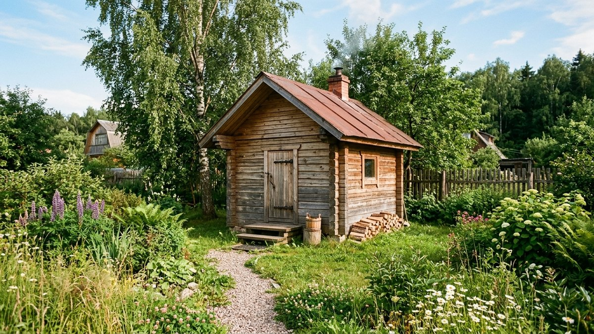
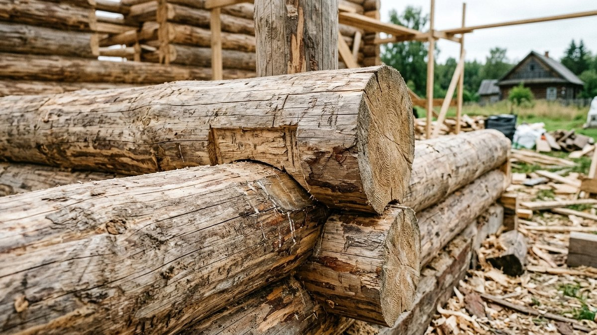
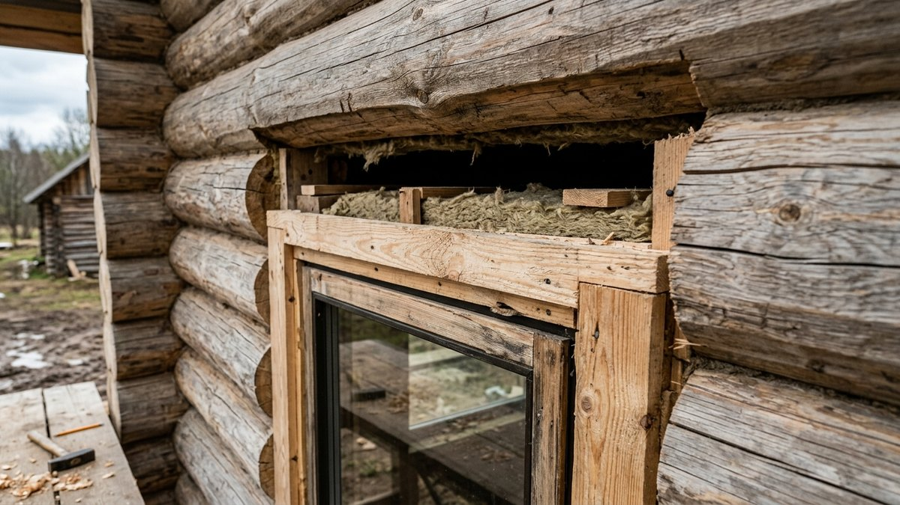
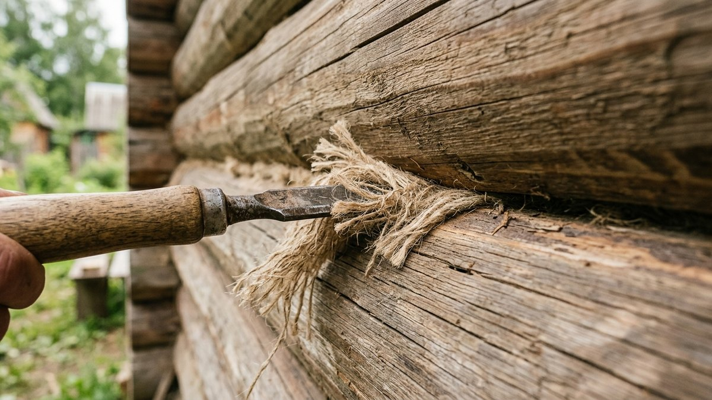
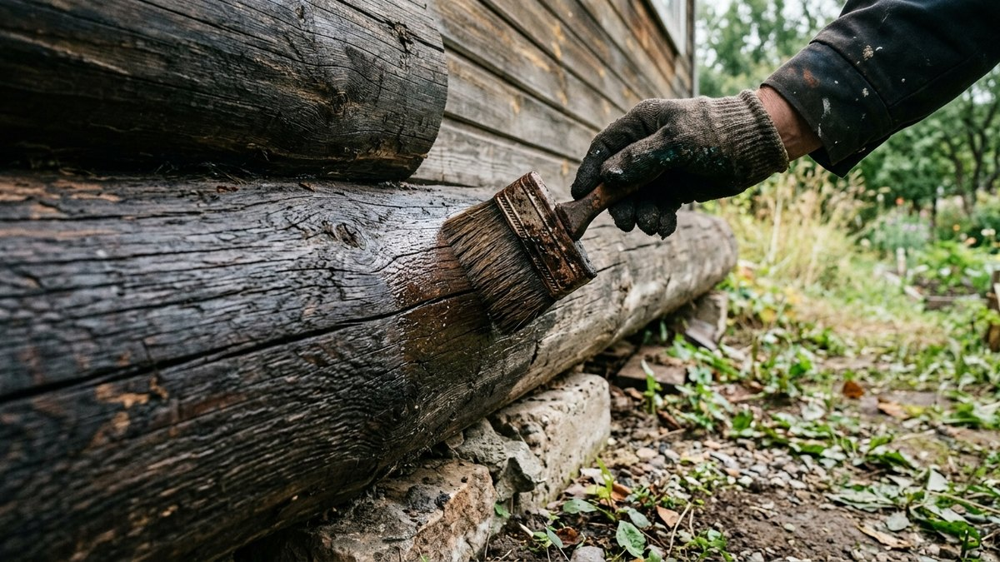
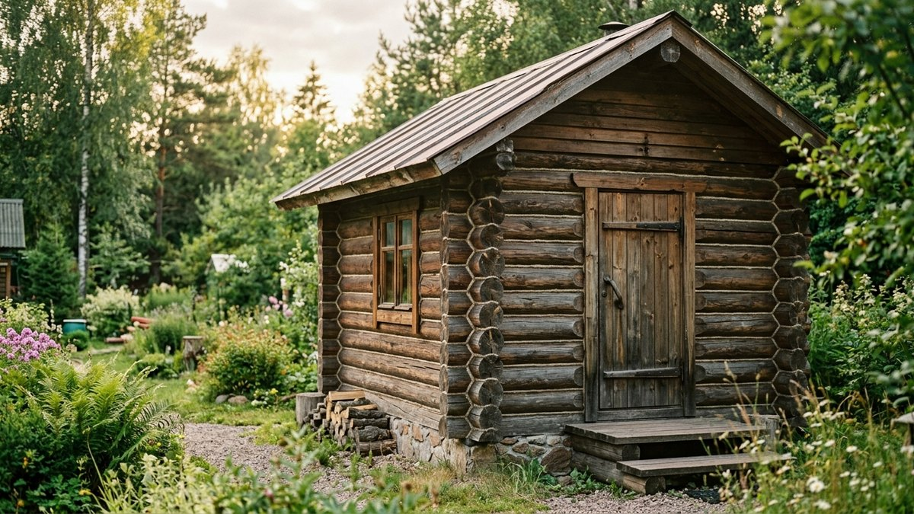

Брус — самый популярный материал для стен бани: он тёплый, не требует дополнительного утепления при достаточном сечении и выглядит как классический сруб без сложной работы с оцилиндрованным бревном. Но у бруса есть особенность, которая портит баню чаще всего, — усадка. Если поставить окна и двери или начать эксплуатацию сразу после сборки коробки, сруб потом перекосит. Разберём, какое сечение бруса выбрать, как правильно уложить венцы и сколько на самом деле нужно ждать до отделки.

## Какой брус выбрать: сечение и тип

| Тип бруса | Сечение для бани | Особенности |
|---|---|---|
| Профилированный (естественной влажности) | 150×150, 150×200 мм | Доступная цена, усадка 6–12 месяцев |
| Профилированный камерной сушки | 150×150, 150×200 мм | Меньше усадка (около 3–5%), суше и легче в работе, дороже |
| Клеёный брус | 145×145, 145×195 мм | Минимальная усадка (менее 1%), можно отделывать почти сразу, самый дорогой вариант |
| Обычный непрофилированный (пиленый) брус | 150×150 мм и более | Дешевле профилированного, но нужен утеплитель между венцами (пакля, джут) и более тщательная конопатка |

Для средней полосы для парной и моечной достаточно сечения 150×150 мм при условии дополнительного утепления изнутри; для круглогодичной бани с постоянным использованием берут 150×200 мм или сразу закладывают внутреннее утепление по каркасу поверх сруба.

## Порядок сборки сруба из бруса

1. **Уложить гидроизоляцию** на фундамент — рубероид или битумную мембрану в 2 слоя.
2. **Уложить окладной (первый) венец** из бруса большего сечения или заранее обработанного антисептиком вдвойне — этот венец испытывает наибольшую нагрузку от влаги фундамента.
3. **Собирать венцы друг на друга**, укладывая между ними утеплитель (джутовое полотно или льноватин) по всей плоскости бруса, а не только по углам.
4. **Соединять углы** одним из способов: «в чашу» (с остатком, углы выступают, теплее и надёжнее) или «в лапу» (без остатка, экономит материал, но требует более точной запиловки).
5. **Скреплять венцы нагелями** — деревянными или металлическими штырями, забитыми в высверленные отверстия через два-три венца, чтобы брус не «повело» при усадке.
6. **Оставить оконные и дверные проёмы с запасом на усадку** — не устанавливать коробки сразу, а только выпилить проёмы с зазором сверху.

<!-- wp:html -->

<h3 class="md-bb__title">Калькулятор бруса на сруб бани</h3>

Расчёт приблизительный, не учитывает проёмы окон и дверей — вычтите их площадь из площади стен вручную при необходимости.

<label class="md-bb__f">Периметр стен, м<input type="number" id="bbPer" value="24" min="4" max="200" step="0.1"></label>
<label class="md-bb__f">Высота стен, м<input type="number" id="bbH" value="2.2" min="1.5" max="4" step="0.1"></label>
<label class="md-bb__f">Сечение бруса
<select id="bbSize">
<option value="150x150" selected>150×150 мм</option>
<option value="150x200">150×200 мм</option>
<option value="145x145">145×145 мм (клеёный)</option>
<option value="145x195">145×195 мм (клеёный)</option>
<option value="custom">Свой размер</option>
</select></label>
<label class="md-bb__f" id="bbCustomWrap" hidden>Свой размер, мм (Ш × В сечения)
<input type="number" id="bbCw" value="150" min="80" max="300" step="1"><input type="number" id="bbCh" value="150" min="80" max="300" step="1"></label>
<label class="md-bb__f">Длина бруса в хлысте, м<input type="number" id="bbLen" value="6" min="3" max="12" step="0.5"></label>
<label class="md-bb__f">Запас на подрезку и брак, %<input type="number" id="bbRes" value="8" min="0" max="30" step="1"></label>

Венцов (рядов)<b id="bbRows">15</b>

Объём бруса<b id="bbVol">1,3 м³</b>

Объём с запасом<b id="bbVolRes">1,4 м³</b>

Хлыстов бруса<b id="bbPieces">16 шт</b>

Количество хлыстов приблизительное: реальная раскладка по углам может немного отличаться.

<button type="button" id="bbCopy" class="md-bb__btn md-bb__btn--main">Скопировать результат</button>
<a id="bbVk" class="md-bb__btn md-bb__btn--vk" href="#" target="_blank" rel="noopener noreferrer">Поделиться ВКонтакте</a>
<a id="bbTg" class="md-bb__btn md-bb__btn--tg" href="#" target="_blank" rel="noopener noreferrer">Поделиться в Telegram</a>
<button type="button" id="bbShareNative" class="md-bb__btn" hidden>Поделиться…</button>
<button type="button" id="bbPrint" class="md-bb__btn">Печать</button>

<!-- /wp:html -->

## Усадка: сколько на самом деле ждать

Усадка — это не просто «подождать месяц». Профилированный брус естественной влажности усаживается по высоте на 5–8% в течение первого года, из них большая часть (до 70%) приходится на первые 3–4 месяца. Клеёный брус усаживается меньше 1%, поэтому его иногда отделывают уже через пару месяцев.

**Практический ориентир:**

- Профилированный брус естественной влажности — ждать 9–12 месяцев, а лучше полный годовой цикл с одной зимой, чтобы прошли и усадка, и пересыхание.
- Профилированный брус камерной сушки — 4–6 месяцев обычно достаточно.
- Клеёный брус — можно приступать к отделке и остеклению через 1–2 месяца.

Пока сруб усаживается, окна и двери либо не ставят вовсе, либо монтируют в обсадную коробку («окосячку») со свободным зазором сверху — жёстко закреплённые рамы при усадке перекашивает и заклинивает.

## Конопатка: до усадки, после и вторично

Первую конопатку делают сразу после сборки сруба — она нужна не столько для утепления, сколько для равномерного распределения нагрузки по венцам. Проходят паклей или джутом все швы, начиная с нижнего венца и двигаясь по кругу, а не хаотично — иначе сруб перекосит от неравномерного натяжения.

Вторую, основную конопатку делают уже после завершения усадки, обычно через год. К этому моменту в швах образуются щели от усушки древесины, и без повторной конопатки баня будет продувать. Именно вторую конопатку часто пропускают — и это одна из причин, почему готовые срубы «дуют» даже при качественном материале. Если щели появляются повторно уже через годы эксплуатации, разбор материалов и способов заделки — в статье про [щели в деревянном доме](https://mir-doma.pro/chem-zadelat-shcheli-v-derevyannom-dome/).

## Антисептирование и защита от гниения

Особое внимание — нижним венцам и местам контакта с фундаментом: туда попадает больше всего влаги от осадков и конденсата. Их обрабатывают антисептиком глубокого проникновения в два-три слоя, а не только поверхностной пропиткой, как остальной сруб. Между нижним венцом и гидроизоляцией фундамента обязательно оставляют вентиляционный зазор — без него древесина преет и гниёт изнутри, даже несмотря на антисептик.

## Фундамент и общий контекст стройки

Тип и глубина заложения фундамента под сруб из бруса зависят от его веса и грунта — тяжёлому брусовому срубу нужен более серьёзный фундамент, чем лёгкой каркасной бане. Подробный разбор именно фундамента под баню — какой тип выбрать и как рассчитать объём бетона — в статье про [фундамент под баню своими руками](https://mir-doma.pro/fundament-pod-banyu-svoimi-rukami/). Общий обзор всего процесса стройки бани — от планировки до печи — собран в статье про то, [как построить баню на даче своими руками](https://mir-doma.pro/kak-postroit-banyu-na-dache/).

## Частые ошибки

- **Установили окна и двери сразу после сборки сруба.** При усадке рамы заклинивает и перекашивает — без обсадной коробки с зазором переделка неизбежна.
- **Пропустили вторую конопатку после усадки.** Щели от усушки открываются именно в этот период, и без повторной обработки баня продувает.
- **Сэкономили на антисептике для нижних венцов.** Это самая влажная зона сруба, и именно с неё чаще всего начинается гниение.
- **Начали внутреннюю отделку до завершения усадки.** Финишные материалы и печь-каменка при усадке смещаются вместе со стенами, что повреждает и отделку, и саму печную разделку.
- **Использовали брус естественной влажности без запаса времени на усадку**, торопясь запустить баню в первый же сезон.

## Частые вопросы

### Можно ли топить баню из бруса сразу после сборки, не дожидаясь усадки?

Пробную протопку для проверки печи и дымохода делают, но полноценную эксплуатацию с постоянным нагревом парной откладывают до завершения основной усадки — резкие перепады температуры и влажности до усадки могут увеличить перекос сруба.

### Чем профилированный брус отличается от обычного пиленого для бани?

У профилированного бруса на гранях выфрезерованы шипы и пазы — венцы плотнее прилегают друг к другу, и между ними закладывают меньше утеплителя. Пиленый брус ровный со всех сторон, поэтому щели между венцами шире, а расход утеплителя и трудозатраты на конопатку выше.

### Нужен ли нагель при сборке бруса или достаточно веса венцов?

Нагели обязательны: без них венцы могут сдвигаться при усадке и короблении бруса, особенно на длинных стенах. Шаг нагелей — обычно 1–1,5 м по длине стены и через один-два венца по высоте.

### Как понять, что усадка сруба завершилась?

Косвенный признак — стабилизация зазоров в обсадных коробках окон и дверей: если зазор сверху перестал уменьшаться в течение месяца-двух, усадка практически завершена. Точнее ориентироваться на полный годовой цикл, включающий зиму.

### Можно ли строить баню из бруса зимой?

Да, зимняя сборка сруба даже предпочтительна для бруса естественной влажности: древесина зимней заготовки суше и меньше подвержена грибку при хранении, а венцы промерзают равномерно без риска растрескивания от летнего солнца.

## Заключение

Баня из бруса — это правильный выбор сечения под климат и режим использования, аккуратная сборка венцов с нагелями и обязательный запас времени на усадку перед установкой окон, дверей и финишной отделкой. Тот, кто торопится с отделкой сразу после сборки коробки, чаще всего переделывает баню в первый же год.
