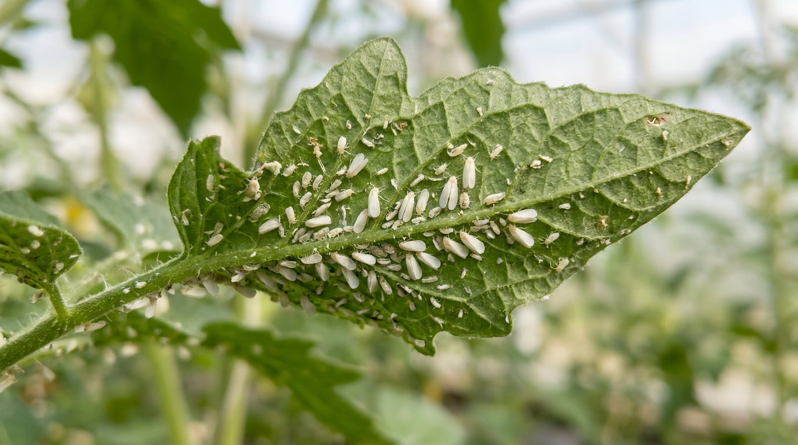
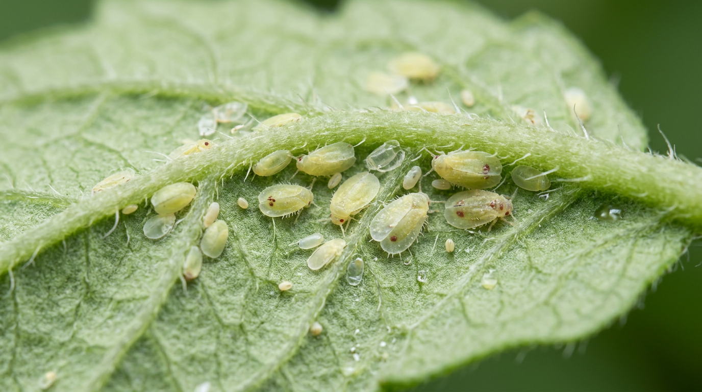
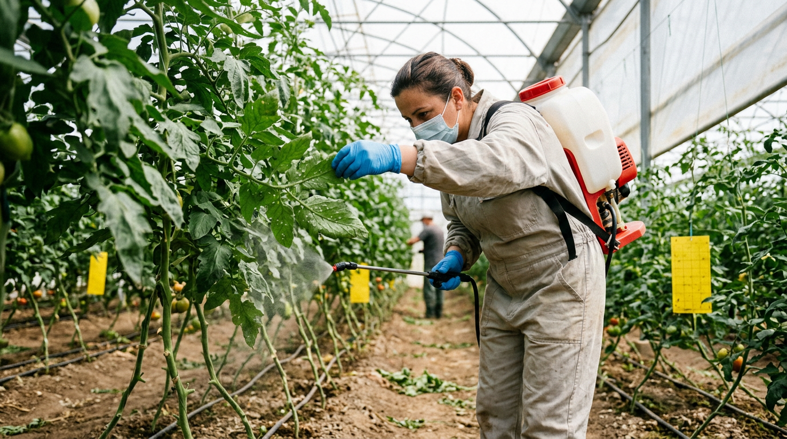
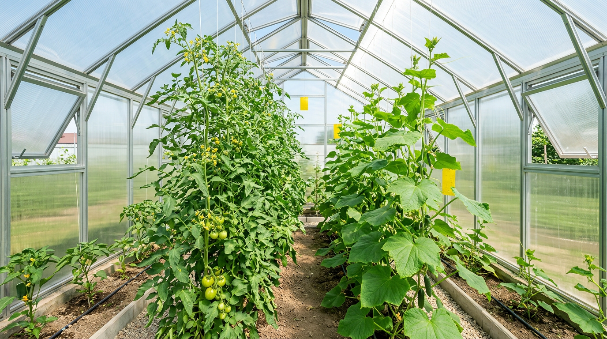

Стоит тронуть куст огурцов или томатов в теплице, как в воздух взлетает облачко мелких белых мошек — это белокрылка, один из самых надоедливых тепличных вредителей. Она быстро размножается в тепле, высасывает сок из листьев и покрывает растения липким налётом, на котором поселяется чёрный грибок. Без борьбы белокрылка способна серьёзно подорвать урожай огурцов, помидоров и перца. В этой статье разберём, как распознать белокрылку в теплице и как избавиться от неё ловушками, народными, биологическими и химическими средствами.

## 🦋 Кто такая белокрылка и чем она опасна

Белокрылка — это крохотное белое насекомое размером 2–3 мм, похожее на маленькую моль. Взрослые особи и их личинки сидят на нижней стороне листьев и высасывают из растения сок. Опасна белокрылка сразу с нескольких сторон:

- **Ослабляет растения** — листья желтеют, сохнут, куст отстаёт в росте и хуже плодоносит.
- **Оставляет липкий налёт** (медвяную росу), на котором развивается чёрный сажистый грибок, мешающий фотосинтезу.
- **Переносит вирусные болезни**, от которых нет лечения.
- **Угнетает плодоношение** — ослабленные кусты хуже завязывают плоды, из-за чего, среди прочего, [опадают завязи у томатов](https://mir-doma.pro/opadayut-zavyazi-u-pomidorov/).
- **Очень быстро размножается** в тепле, давая несколько поколений за сезон.

Больше всего от белокрылки страдают огурцы, томаты, перец и баклажаны в закрытом грунте. Как и [паутинный клещ](https://mir-doma.pro/pautinnyy-kleshch-na-ogurtsah/), белокрылка особенно опасна именно в теплице, где для неё создаются идеальные условия.

## 🔍 Признаки белокрылки

Распознать вредителя несложно:

- **Белые мошки взлетают** облачком, если задеть растение.
- **Белёсые чешуйки и личинки** на нижней стороне листьев.
- **Липкий блестящий налёт** на листьях — та самая медвяная роса.
- **Чёрный сажистый налёт** поверх липкого — это грибок (не путайте с белым налётом [мучнистой росы](https://mir-doma.pro/muchnistaya-rosa-na-ogurtsah/), это разные проблемы).
- **Пожелтение и увядание** листьев (важно отличать от других причин, по которым [желтеют листья огурцов](https://mir-doma.pro/zhelteyut-listya-u-ogurtsov/)).

Осматривать нужно нижнюю сторону листьев — именно там прячутся личинки, с которыми и придётся бороться в первую очередь.

## 🌡️ Почему появляется белокрылка

Белокрылка обожает тепло и влажность, поэтому теплица для неё — идеальный дом. Способствуют её появлению:

- **тепло и высокая влажность** без проветривания;
- **загущённые посадки**, где душно и влажно;
- **занос с рассадой**, покупными цветами или через форточки;
- **растительные остатки и сорняки**, где вредитель зимует.
- **отсутствие проветривания** — в застойном тёплом воздухе белокрылка чувствует себя особенно вольготно.

Понимание причин подсказывает профилактику: белокрылке не по нраву проветриваемая, чистая и не загущённая теплица. Одна самка откладывает сотни яиц, а за сезон сменяется несколько поколений, поэтому численность вредителя нарастает лавинообразно, если не вмешаться.

## 🛡️ Как избавиться от белокрылки

С белокрылкой борются комплексно и обязательно повторно — за один раз вывести все поколения не получится.

### Жёлтые клеевые ловушки

Белокрылку привлекает жёлтый цвет, поэтому жёлтые клеевые ловушки — простой и эффективный способ. Они ловят взрослых насекомых, снижают их численность и помогают вовремя заметить вредителя. Ловушки развешивают среди растений на уровне верхушек. Их можно купить готовыми или сделать самим: жёлтый картон или пластик смазывают невысыхающим клеем или вазелином. Такие ловушки не только ловят вредителя, но и показывают, насколько сильно заражена теплица.

### Механические меры и народные средства

- **Смывание водой** — взрослых мошек сбивают струёй воды, особенно с нижней стороны листьев.
- **Мыльный или зольно-мыльный раствор** — им обмывают листья, он растворяет липкий налёт и губит вредителя.
- **Настой чеснока** — опрыскивают растения, обрабатывая изнанку листьев.

Народные средства хороши при слабом заражении, и применять их нужно повторно, каждые несколько дней. Хорошо работает и раннее утро: в прохладе белокрылка малоподвижна, и её проще смыть или собрать. Некоторые огородники даже собирают вялых мошек пылесосом.

### Биопрепараты и химические средства

При сильном нашествии применяют более мощные средства:

- **Биологические методы** — энтомофаги (например, наездник энкарзия, который паразитирует на личинках) и биоинсектициды на основе природных компонентов; они безопасны для растений и человека и особенно ценны, когда в теплице уже зреют плоды и химию применять нежелательно.
- **Химические инсектициды** — при массовом заражении. Обрабатывают обязательно нижнюю сторону листьев, повторяют несколько раз с интервалом (яйца и личинки устойчивы), а препараты чередуют, чтобы белокрылка не привыкала. Обработку удобно сочетать с ловушками: они отлавливают взрослых мошек между опрыскиваниями и не дают вредителю восстановить численность.

Химию применяют строго по инструкции, в средствах защиты, а плоды не собирают в течение указанного срока ожидания.

## 🌿 Профилактика

Не допустить белокрылку проще, чем вывести:

- регулярно проветривайте теплицу и не допускайте духоты и переувлажнения;
- развесьте жёлтые ловушки для раннего обнаружения вредителя;
- убирайте растительные остатки и сорняки, где белокрылка зимует;
- осенью дезинфицируйте теплицу и обеззараживайте почву;
- осматривайте и выдерживайте на карантине новую рассаду;
- не загущайте посадки и по возможности ставьте сетки на форточки;
- высаживайте рядом растения с сильным запахом, отпугивающие вредителя.

## 🛡️ Частые ошибки

- **Обработка только сверху.** Личинки сидят на нижней стороне листьев, поэтому обрабатывают именно изнанку.
- **Одна обработка.** После неё выживают яйца и личинки, и вредитель возвращается. Нужно несколько обработок.
- **Не чередуют препараты.** Белокрылка быстро привыкает к одному средству.
- **Запущенное заражение.** С сажистым грибком и множеством поколений бороться намного труднее. Действуйте при первых мошках.
- **Занос с рассадой.** Новые растения без осмотра приносят вредителя в теплицу.

## ❓ Частые вопросы

### Как понять, что в теплице белокрылка?

Главный признак — облачко мелких белых мошек, взлетающих при касании растений. Также заметны белёсые личинки на нижней стороне листьев, липкий блестящий налёт, чёрный сажистый грибок и пожелтение листьев. Осматривать нужно именно изнанку листьев.

### Как избавиться от белокрылки народными средствами?

При слабом заражении помогают жёлтые клеевые ловушки, смывание мошек водой, обмывание листьев мыльным или зольно-мыльным раствором и опрыскивание настоем чеснока. Обрабатывают нижнюю сторону листьев и повторяют процедуры несколько раз. При сильном нашествии переходят к биопрепаратам и инсектицидам.

### Почему жёлтые ловушки помогают от белокрылки?

Белокрылку привлекает жёлтый цвет, поэтому она садится на жёлтые клеевые ловушки и прилипает. Ловушки отлавливают взрослых насекомых, снижают их численность и служат индикатором: по прилипшим мошкам легко понять, что вредитель появился, и вовремя начать борьбу.

### Чем опасна белокрылка для растений?

Белокрылка высасывает сок, из-за чего листья желтеют и сохнут, а растения слабеют и хуже плодоносят. Её липкие выделения покрывают листья, и на них селится чёрный сажистый грибок, мешающий фотосинтезу. Вдобавок белокрылка переносит вирусные болезни, поэтому она особенно опасна.

### Сколько раз обрабатывать теплицу от белокрылки?

Обработку повторяют несколько раз с интервалом в несколько дней, потому что за один раз уничтожаются взрослые особи, но выживают яйца и личинки. Препараты при этом чередуют, чтобы вредитель не привыкал. Одной обработки для полного избавления недостаточно.

### Можно ли есть овощи с растений, поражённых белокрылкой?

Сами овощи белокрылка не делает опасными, их можно есть, тщательно вымыв. Но если проводились химические обработки, нужно выдержать срок ожидания, указанный на препарате. Плоды с сильным сажистым налётом просто хорошо моют перед употреблением.

### Белокрылка на огурцах и помидорах — это один вредитель?

Да, тепличная белокрылка одинаково поражает и огурцы, и томаты, и перец с баклажанами. Поэтому и меры борьбы для всех этих культур общие: ловушки, обмывание, народные средства, биопрепараты и инсектициды, а также профилактика в масштабах всей теплицы.

### Как не допустить белокрылку в теплицу?

Проветривайте теплицу и не допускайте духоты, развешивайте жёлтые ловушки для раннего обнаружения, убирайте сорняки и растительные остатки, осенью дезинфицируйте теплицу, осматривайте и держите на карантине новую рассаду и не загущайте посадки. Чистая проветриваемая теплица белокрылке не по нраву.

## Заключение

Белокрылка в теплице опасна тем, что быстро размножается и вредит сразу многим культурам, но справиться с ней вполне реально. Осматривайте нижнюю сторону листьев, при первых белых мошках развешивайте жёлтые ловушки, обмывайте растения и опрыскивайте их — народными средствами при слабом заражении и биопрепаратами или инсектицидами при сильном. Обработки повторяйте и чередуйте, а лучше не допускайте вредителя, поддерживая теплицу чистой и проветриваемой. Тогда огурцы, томаты и перец останутся здоровыми и урожайными. Как и с большинством вредителей, здесь решает скорость: заметили первых белых мошек — сразу вешайте ловушки и начинайте борьбу, не дожидаясь нашествия.

А вы боролись с белокрылкой в теплице? Делитесь опытом в комментариях и подписывайтесь, чтобы не пропустить новые статьи о защите урожая.
