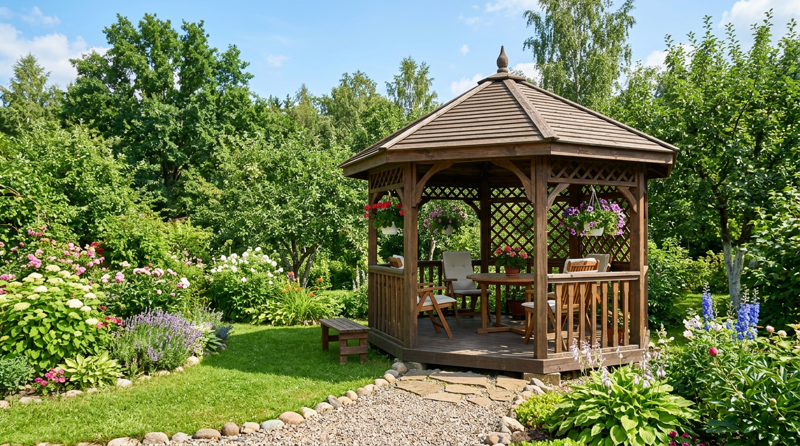
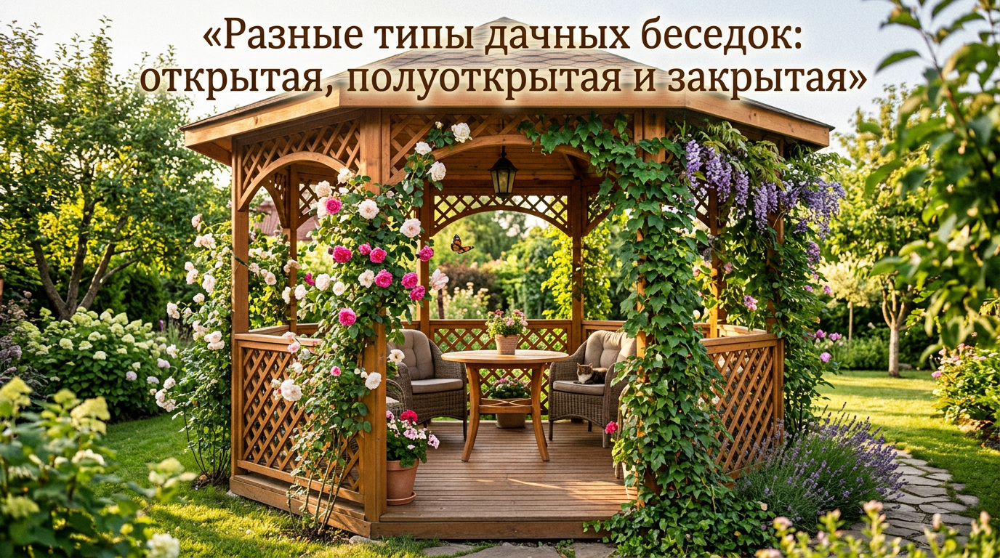
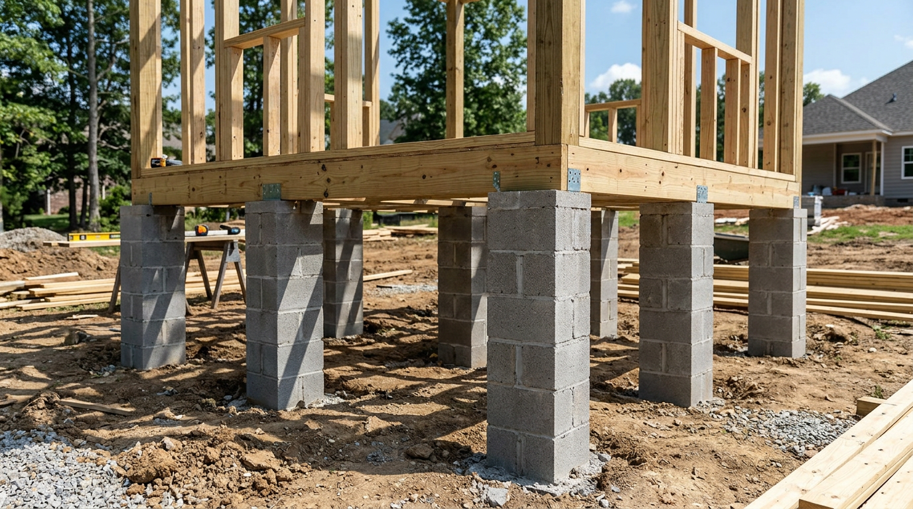
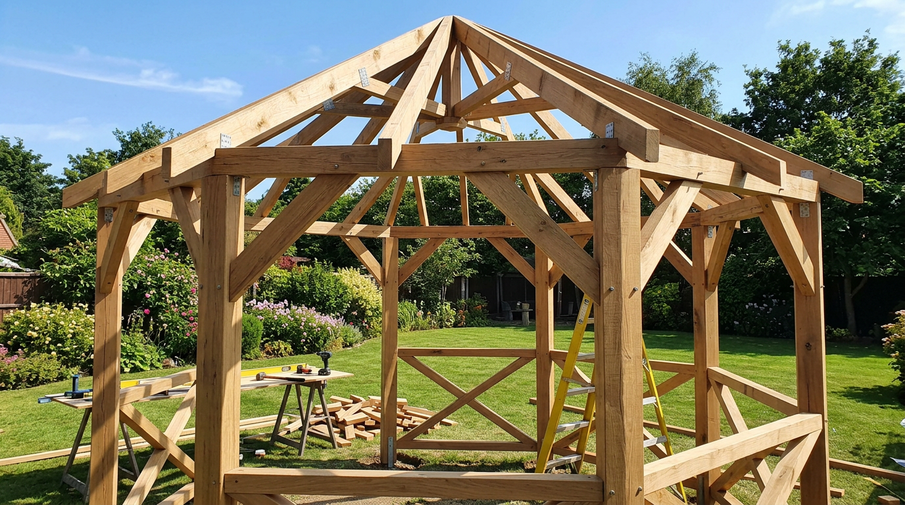
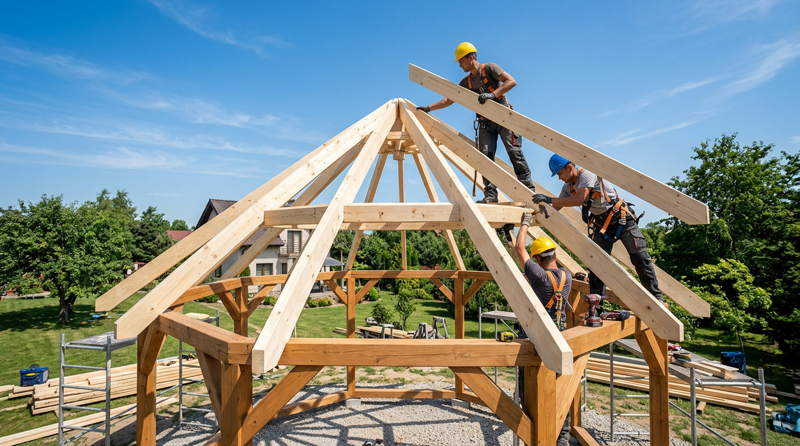
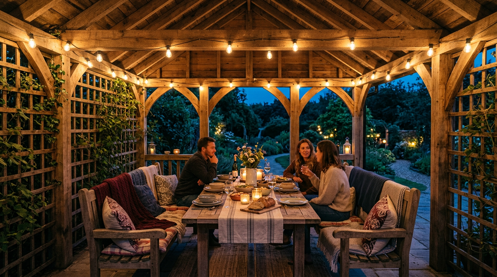

Беседка — это сердце дачного отдыха: место для вечернего чая, шашлыков и долгих разговоров в тени. И построить её своими руками вполне реально, даже без опыта в стройке — нужны лишь аккуратность, базовый инструмент и понятный план. Самодельная беседка обходится в разы дешевле готовой и получается ровно такой, какая нужна именно вам. В этой статье разберём, как построить беседку своими руками: какие бывают конструкции, как выбрать место и размер, какие нужны материалы и как пройти все этапы — от фундамента до крыши и отделки.

## 🏡 Какие бывают беседки

Прежде чем браться за чертёж, стоит определиться с типом беседки — от этого зависят и материалы, и сложность работ, и бюджет.

### По степени открытости

- **Открытые.** Лёгкая конструкция из опор и крыши, без стен. Самый простой и быстрый вариант для летнего отдыха.
- **Полуоткрытые.** С невысокими ограждениями, решётками или частичными стенами. Защищают от ветра и солнца, сохраняя ощущение простора.
- **Закрытые.** С полноценными стенами, окнами и дверью. По сути, небольшой садовый домик, в котором можно сидеть даже в прохладную погоду.

### По материалу

- **Дерево.** Самый популярный материал: тёплое, красивое, простое в работе. Идеально для самостоятельной стройки.
- **Металл.** Прочный и долговечный каркас, но требует сварки или болтовых соединений.
- **Кирпич или камень.** Капитальные, основательные беседки под мангал и барбекю, но трудоёмкие и дорогие.
- **Поликарбонат.** Часто используется как лёгкая обшивка или кровля в сочетании с металлическим или деревянным каркасом.

У каждого материала свои плюсы: дерево тёплое и простое в работе, но требует регулярной защиты от влаги; металл служит десятилетиями, но нагревается на солнце и нуждается в покраске от ржавчины; кирпич и камень основательны и пожаробезопасны, идеально под мангал, но дороги и требуют серьёзного фундамента. Для самостоятельной стройки без спецтехники и сварки дерево остаётся лучшим выбором по соотношению цены, простоты и результата.

### По форме

Чаще всего строят прямоугольные и квадратные беседки — их проще всего рассчитать и собрать. Шестигранные и восьмигранные смотрятся эффектнее, но требуют точных расчётов углов и опыта. Для первой самостоятельной постройки оптимальна **квадратная или прямоугольная деревянная беседка** — именно её мы и возьмём за основу.

## 📐 С чего начать: место и размер

### Зачем нужен чертёж

Даже простую беседку стоит начать с чертежа — он экономит материалы и нервы. На бумаге или в бесплатной программе нарисуйте вид сверху и сбоку, проставьте размеры: габариты основания, высоту столбов, шаг лаг и стропил. По чертежу легко посчитать, сколько бруса, доски и крепежа покупать, и не остаться без материала на середине стройки. Заодно вы заранее увидите слабые места — например, где усилить каркас укосинами. Готовый чертёж — это половина успеха: дальше остаётся просто следовать плану.

### Выбираем место

От расположения зависит, насколько комфортной будет беседка. Несколько ориентиров:

- Ставьте беседку на ровном, сухом участке, куда не стекает дождевая вода.
- Учитывайте вид: приятнее смотреть на сад или водоём, чем на забор соседа.
- Если планируете мангал, разместите беседку с подветренной стороны от дома, чтобы дым не шёл в окна.
- Продумайте удобный подход — дорожку от дома, чтобы не месить грязь после дождя.

Полезно заранее набросать план участка с расположением построек — об этом подробно в статье о [планировке участка](https://mir-doma.pro/planirovka-uchastka-10-sotok/).

### Определяем размер

Размер беседки зависит от того, сколько человек вы планируете в ней разместить и нужна ли мебель внутри. Ориентируйтесь на таблицу:

| Размер беседки | Площадь | Вместимость |
|----------------|---------|-------------|
| 2×2 м | 4 м² | 3–4 человека |
| 3×3 м | 9 м² | 6–8 человек |
| 3×4 м | 12 м² | 8–10 человек |
| 4×4 м | 16 м² | 10–12 человек с мангалом |

Самый универсальный вариант — **беседка 3×3 м**: в неё помещается стол со скамьями на компанию, и при этом её несложно построить. На ней и построим пошаговую инструкцию.

## 🧰 Материалы и инструменты

Для деревянной беседки 3×3 м с четырёхскатной крышей понадобится примерный набор:

| Материал | Назначение |
|----------|------------|
| Брус 100×100 мм | Опорные столбы, обвязка |
| Брус 50×100 мм | Лаги пола, стропила |
| Доска 100×25 мм | Обрешётка, ограждение |
| Половая или террасная доска | Настил пола |
| Бетонные блоки или асбестовые трубы + цемент | Фундамент |
| Кровельный материал | Крыша (мягкая черепица, профнастил, поликарбонат) |
| Крепёж | Уголки, пластины, саморезы, болты, анкеры |
| Антисептик и лак/краска | Защита и отделка дерева |

Из инструментов нужны: лопата или бур для ям, бетономешалка или ёмкость для замеса, уровень, рулетка, угольник, ножовка или циркулярная пила, шуруповёрт, молоток, кисти для пропитки. Покупая пиломатериал, выбирайте брус и доску камерной сушки без трещин, синевы и большого числа сучков — сырое дерево «поведёт» при высыхании, и каркас перекосит. Перед началом работ весь пиломатериал стоит обработать антисептиком, уделяя особое внимание торцам и нижним элементам — это продлит срок службы беседки на годы.

## 🏗️ Фундамент для беседки

Фундамент — основа долговечности беседки. Деревянная конструкция лёгкая, поэтому массивное основание ей не нужно, но и без фундамента нельзя: дерево, стоящее прямо на земле, тянет влагу и за пару сезонов сгнивает. Чаще всего выбирают один из трёх вариантов:

- **Столбчатый** — самый популярный и экономичный: опоры из бетонных блоков или залитых труб под углами и по периметру. Подходит для большинства деревянных беседок.
- **Ленточный** — бетонная лента по периметру, нужна для тяжёлых кирпичных или каменных конструкций.
- **Монолитная плита** — если хочется капитальный пол под плитку, особенно под зону барбекю.

### Столбчатый фундамент пошагово

1. Разметьте участок: натяните шнур по периметру 3×3 м, проверьте диагонали — они должны быть равны.
2. В углах и по середине сторон выкопайте ямы глубиной 50–70 см (ниже глубины промерзания для устойчивости).
3. На дно насыпьте песчано-гравийную подушку 10–15 см и утрамбуйте.
4. Установите бетонные блоки или вставьте асбестовые трубы и залейте их бетоном, заранее вставив анкеры для крепления обвязки.
5. Проверьте уровнем, чтобы все опоры были в одной горизонтальной плоскости — это основа ровной беседки.
6. Дайте бетону набрать прочность (несколько дней) перед продолжением работ.

Для беседки 3×3 м обычно достаточно девяти опор: по углам, в середине каждой стороны и одна в центре под лаги пола. Чем больше пролёт, тем чаще ставят опоры, чтобы пол не прогибался. Все оголовки опор поднимают на 10–15 см над землёй — так дерево обвязки не будет контактировать с грунтовой влагой.

## 🪵 Каркас беседки

Когда фундамент готов, переходим к каркасу — основе всей конструкции.

### Нижняя обвязка

На опоры фундамента укладывают нижнюю обвязку из бруса 100×100 мм, соединяя углы вполдерева или металлическими уголками. Между обвязкой и бетоном обязательно прокладывают гидроизоляцию (рубероид), чтобы дерево не тянуло влагу. Обвязку крепят к анкерам фундамента.

### Опорные столбы

По углам устанавливают вертикальные опоры из бруса 100×100 мм высотой 2,2–2,5 м. Каждый столб выставляют строго по уровню и временно фиксируют укосинами, чтобы он не отклонялся, пока не смонтирована верхняя обвязка. Для прочности столбы крепят к нижней обвязке усиленными уголками и болтами. Проверяйте вертикаль каждого столба сразу в двух плоскостях — отклонение даже на пару градусов потом аукнется кривой крышей. Удобно собирать каркас вдвоём: один держит и выставляет столб по уровню, второй фиксирует укосины.

### Верхняя обвязка

Сверху столбы связывают верхней обвязкой из того же бруса — она замыкает каркас в жёсткую коробку и служит опорой для крыши. После монтажа верхней обвязки временные укосины можно заменить декоративными постоянными, которые добавят жёсткости и украсят беседку. На этом этапе каркас уже стоит сам по себе — самое время проверить геометрию: диагонали основания и верха должны совпадать, а столбы стоять строго вертикально. Любые перекосы исправляют сейчас, пока не смонтирована крыша.

## ⛩️ Крыша беседки

Крыша защищает от дождя и солнца и во многом определяет облик беседки.

### Типы крыш

- **Односкатная** — самая простая, один уклон. Подходит для беседок у стены дома.
- **Двускатная** — классика, хорошо отводит осадки, несложна в монтаже.
- **Четырёхскатная (шатровая)** — красивая и устойчивая к ветру, но сложнее в расчёте.
- **Шестигранная** — для многоугольных беседок, смотрится эффектно, но требует точных запилов и опыта.

Чем сложнее форма крыши, тем больше отходов материала и выше требования к точности. Двускатная крыша прощает мелкие огрехи новичку, четырёхскатная и шатровая выглядят солиднее, но к ним стоит подступаться, когда рука уже набита.

Для квадратной беседки 3×3 м гармонично смотрится четырёхскатная крыша, но для первого опыта проще собрать двускатную.

### Стропила и кровля

На верхнюю обвязку монтируют стропильную систему из бруса 50×100 мм, сходящуюся к центральному коньку (для двускатной) или к верхней точке (для шатровой). Поверх стропил набивают обрешётку из доски, а на неё укладывают кровельный материал. Для лёгкой беседки удобны мягкая черепица (требует сплошной обрешётки из фанеры или ОСП), профнастил или прозрачный поликарбонат, который пропускает свет. Не забудьте про небольшой свес крыши — он защитит стены и людей от косого дождя.

Выбор кровельного материала зависит от бюджета и желаемого вида:

| Материал | Плюсы | Минусы |
|----------|-------|--------|
| Мягкая черепица | Красиво, тихо в дождь, гибкая | Нужна сплошная обрешётка |
| Профнастил | Дёшево, быстро, долговечно | Шумит под дождём, греется |
| Поликарбонат | Пропускает свет, лёгкий | Хуже держит тепло, желтеет со временем |
| Ондулин | Лёгкий, простой монтаж | Менее долговечен, выгорает |

Для уютной тенистой беседки чаще берут мягкую черепицу или профнастил, а если хочется света и воздуха — прозрачный или цветной поликарбонат.

## 🚪 Пол и ограждение

### Пол

Лаги пола из бруса 50×100 мм укладывают на нижнюю обвязку с шагом 40–60 см. Поверх настилают половую или террасную доску, оставляя небольшие зазоры для стока воды и вентиляции. Все элементы пола обязательно пропитывают антисептиком — он контактирует с влагой больше всего. Для открытой беседки лучше подходит террасная доска со специальной пропиткой, устойчивая к осадкам и не такая скользкая под дождём. Доски крепят саморезами из нержавейки, утапливая шляпки, чтобы не цепляться ногами. Под беседкой полезно застелить грунт геотекстилём и подсыпать щебень — это уберёт сорняки и улучшит вентиляцию пола снизу.

### Ограждение и стены

В полуоткрытой беседке между столбами монтируют ограждение высотой около 90 см: горизонтальные перила и заполнение — вертикальные балясины, декоративная решётка или доски. Решётчатое заполнение выглядит легко и пропускает воздух, а сплошное лучше защищает от ветра и посторонних глаз. Популярный вариант — деревянная решётка-шпалера, по которой пускают вьющиеся растения: девичий виноград, клематис или душистый горошек. К середине лета такая беседка утопает в зелени и даёт густую тень. Если хочется уюта закрытой беседки, верхнюю часть проёмов можно застеклить или затянуть прозрачным поликарбонатом — получится что-то среднее между беседкой и [уютной верандой](https://mir-doma.pro/kak-obustroit-verandu/).

## 🎨 Финишная отделка

Финишная отделка не только украшает беседку, но и защищает дерево от гниения, влаги и ультрафиолета — без неё даже идеально собранная конструкция быстро посереет и начнёт растрескиваться. Это не тот этап, который стоит откладывать «на потом»: голое дерево набирает влагу с первых же дождей. Порядок такой:

1. Отшлифуйте все деревянные поверхности, чтобы убрать заусенцы и шероховатости.
2. Нанесите антисептик и антипирен (защита от гниения, плесени и возгорания), если не сделали этого раньше.
3. Покройте дерево финишным составом: лаком для наружных работ, краской по дереву или цветным маслом. Масло и лессирующие пропитки подчёркивают текстуру дерева, краска даёт ровный цвет.
4. Обновляйте защитное покрытие раз в 2–3 года, чтобы беседка служила десятилетиями.

После отделки остаётся самое приятное — обустройство, ради которого всё и затевалось.

### Обустройство беседки

Внутри ставят стол и скамьи или садовую мебель по размеру беседки. Вечером пригодится освещение — гирлянды, фонари или светильники на солнечных батареях создадут уютную атмосферу без прокладки проводки. Текстиль (подушки, шторы от солнца), вьющиеся растения по решёткам и пара горшков с цветами превращают каркас в настоящее место отдыха. Если беседка открытая, продумайте защиту от комаров — москитную сетку по проёмам или специальные средства.

## 🔥 Беседка с мангалом или барбекю

Беседка с зоной готовки — мечта многих дачников, но к ней есть особые требования по пожарной безопасности. Мангал или печь-барбекю размещают на негорючем основании — бетонной площадке или плитке, а не на деревянном полу. Стену за мангалом защищают листовым металлом, кирпичом или камнем, а деревянные элементы каркаса держат на безопасном расстоянии от огня и обрабатывают антипиреном. Над очагом обязательно делают вытяжку или дымоход, чтобы дым уходил вверх, а не оставался под крышей. Для капитального мангала или печи лучше предусмотреть отдельный небольшой фундамент — кирпичная конструкция тяжёлая. Такую беседку чаще делают полуоткрытой или закрытой, чтобы готовить в любую погоду.

## 📋 Этапы стройки и сроки

Чтобы было проще спланировать работу, вот примерный порядок и трудозатраты для беседки 3×3 м:

| Этап | Что делаем | Ориентир по времени |
|------|------------|---------------------|
| 1. Проект и разметка | Чертёж, выбор места, разметка | 1 день |
| 2. Фундамент | Ямы, опоры, бетон | 1–2 дня + застывание |
| 3. Каркас | Обвязка, столбы, верхняя обвязка | 1–2 дня |
| 4. Крыша | Стропила, обрешётка, кровля | 1–2 дня |
| 5. Пол и ограждение | Лаги, настил, перила | 1–2 дня |
| 6. Отделка | Шлифовка, пропитка, покраска | 1–2 дня |

В сумме при работе по выходным беседку реально построить за 2–3 недели без спешки.

## 💰 На чём можно сэкономить, а на чём нельзя

Беседка — гибкий по бюджету проект, и понимание, где разумно сэкономить, помогает уложиться в нужную сумму без потери качества.

Экономить можно на форме (простая прямоугольная дешевле многогранной), на кровле (профнастил доступнее мягкой черепицы), на отделке (масло и пропитка дешевле многослойной покраски) и на мебели, сделав стол и скамьи своими руками из остатков пиломатериала.

А вот на чём экономить нельзя — это на фундаменте, антисептике и качестве несущего бруса. Эти три вещи определяют, простоит беседка пять лет или двадцать пять. Дешёвый сырой брус поведёт, пропущенная пропитка обернётся гнилью, а слабый фундамент — перекосом всей постройки. Здесь лучше доложить, чем потом переделывать.

## ⚠️ Частые ошибки при строительстве беседки

Чтобы постройка radовала годами, избегайте типичных промахов:

- **Экономия на антисептике.** Необработанное дерево начинает гнить уже через пару сезонов, особенно в нижней обвязке и полу.
- **Нет гидроизоляции между фундаментом и деревом.** Брус тянет влагу из бетона и быстро портится.
- **Опоры не выставлены по уровню.** Перекос фундамента ведёт к кривому каркасу и проблемам с крышей.
- **Слишком маленький свес крыши.** Косой дождь будет заливать пол и стены.
- **Нет зазоров в полу.** Плотно уложенные доски задерживают влагу и коробятся.
- **Недостаточная глубина опор.** Если фундамент выше глубины промерзания, беседку может перекосить при пучении грунта.

## ❓ Частые вопросы

### Сколько стоит построить беседку своими руками?

Точная сумма зависит от размера, материалов и кровли, но самостоятельная постройка из дерева обходится заметно дешевле готовой — вы платите в основном за пиломатериал, фундамент и крышу, экономя на работе. Открытая беседка дешевле закрытой, а поликарбонат и профнастил доступнее мягкой черепицы.

### Нужен ли фундамент для лёгкой беседки?

Да, хотя бы простой столбчатый. Без фундамента дерево контактирует с землёй, тянет влагу и быстро гниёт, а саму беседку может перекосить от движения грунта. Столбчатые опоры решают обе проблемы при минимальных затратах.

### Какое дерево выбрать для беседки?

Чаще всего используют сосну — она доступна и хорошо обрабатывается. Главное — качественно пропитать её антисептиком. Для элементов, контактирующих с влагой (пол, нижняя обвязка), лучше брать лиственницу или террасную доску.

### Какую крышу проще сделать новичку?

Для первого опыта проще всего односкатная или двускатная крыша — у них понятная геометрия и минимум сложных запилов. Шатровую и многогранную крышу лучше делать, когда появится уверенность.

### Можно ли построить беседку без бетонных работ?

Да, вместо заливки можно использовать готовые бетонные блоки или винтовые сваи — их устанавливают без замешивания бетона. Это ускоряет работу, хотя для тяжёлых конструкций надёжнее всё же залитый фундамент.

### Нужно ли разрешение на строительство беседки?

Лёгкая некапитальная беседка обычно не требует разрешения и регистрации — это не жилое строение. Но если планируете капитальную постройку с фундаментом, печью и подведением коммуникаций, стоит уточнить нормы в своём регионе и соблюсти отступы от границ участка и соседских строений.

### Как ухаживать за деревянной беседкой?

Главное — следить за состоянием защитного покрытия и обновлять его раз в 2–3 года, не дожидаясь, пока дерево потемнеет и начнёт растрескиваться. Весной осматривайте нижнюю обвязку и пол на признаки гнили, очищайте крышу от листьев и снега, проверяйте крепёж. При своевременном уходе деревянная беседка служит 15–20 лет и дольше.

### Чем обработать беседку, чтобы она дольше служила?

Сначала антисептиком и антипиреном, затем финишным покрытием — лаком для наружных работ, краской или маслом. Покрытие обновляют раз в 2–3 года, уделяя особое внимание полу и нижним элементам.

## Заключение

Построить беседку своими руками под силу даже новичку, если двигаться по этапам: продумать проект, заложить надёжный столбчатый фундамент, собрать ровный каркас, накрыть крышей, настелить пол и не пожалеть времени на защитную отделку. Деревянная беседка 3×3 м — оптимальный старт: несложная в сборке, вместительная и красивая. А дальше дело за уютом — стол, скамьи и вьющаяся зелень превратят её в любимое место отдыха всей семьи.

А какую беседку мечтаете построить вы — открытую летнюю или закрытую с мангалом? Делитесь идеями в комментариях и подписывайтесь, чтобы не пропустить новые статьи о дачном строительстве и обустройстве участка.
