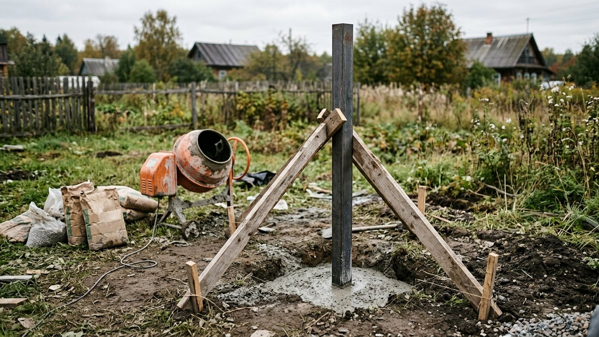
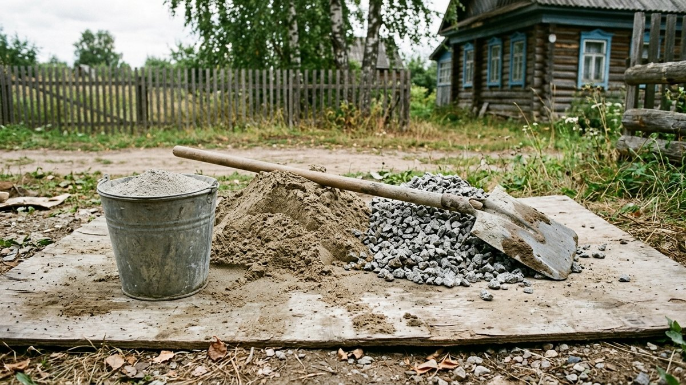
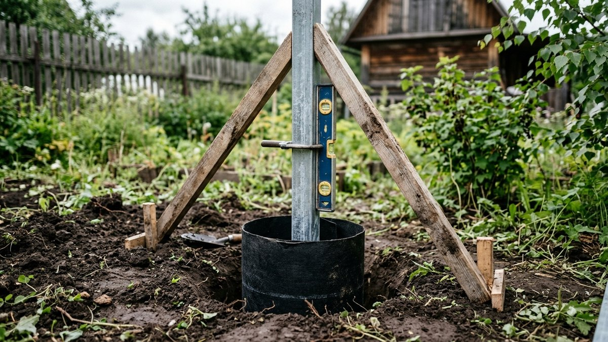
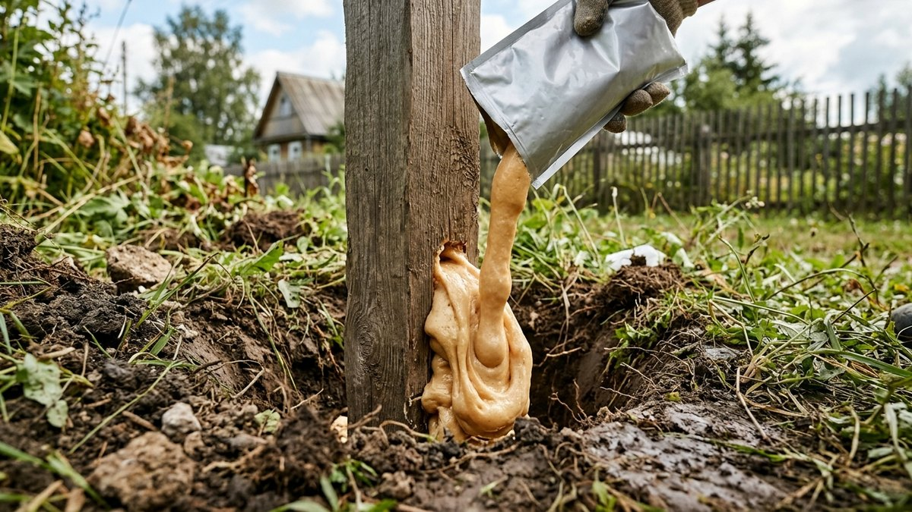
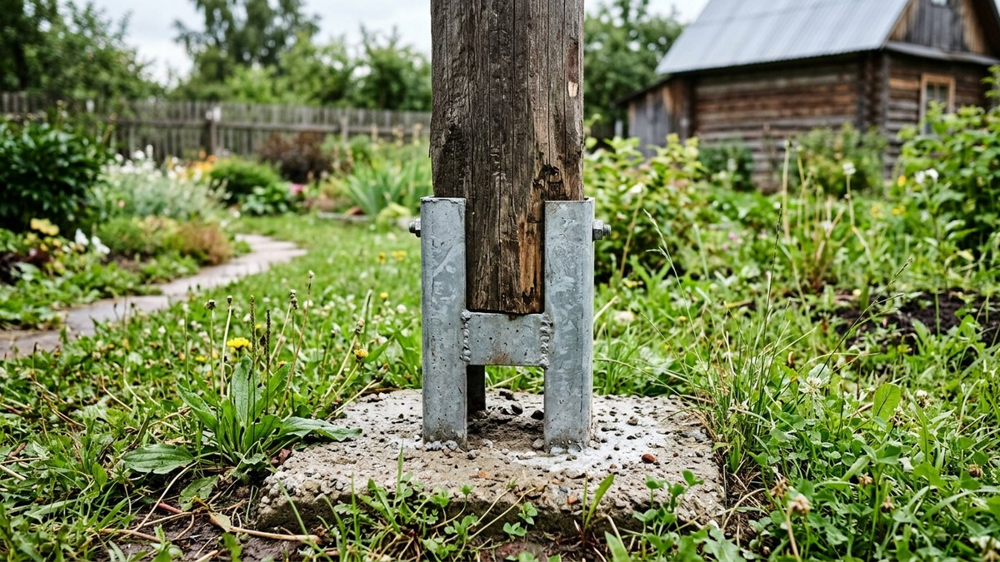
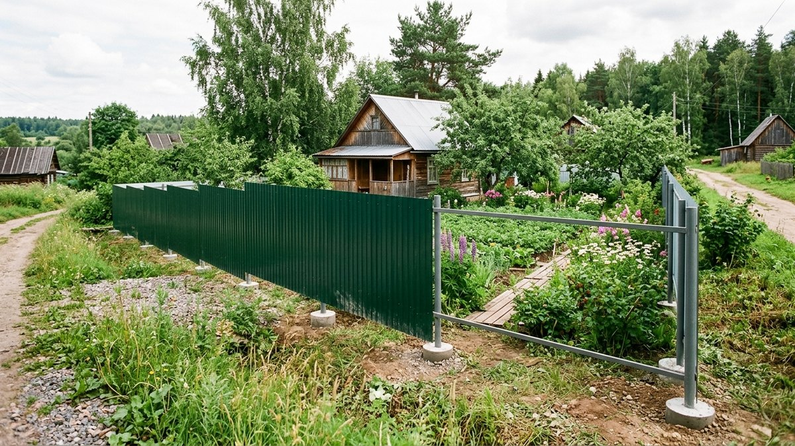

Пропорции бетона для заливки столбов — первое, что ищут, когда столбы
уже стоят в ямах, а мешки с цементом лежат рядом. Но ошибаются чаще
не в пропорциях, а в объёме: на забор из 30 столбов докупают цемент
по два-три раза, потому что яма с расширением снизу берёт вдвое больше
бетона, чем ровный цилиндр. Ниже — какая марка бетона нужна для столбов,
пропорции цемента, песка и щебня на ведро и на мешок, когда выгоднее
сухая смесь, как залить столб, чтобы его не выдавило морозом, и что
умеют заменители бетона. Калькулятор посчитает объём бетона и мешки
на весь забор.

## Какая марка бетона нужна для столбов

Для забора из сетки, штакетника и профнастила высотой до 2 м хватает
бетона **М200** (класс В15). Для ворот, калиток и забора с ветровой
нагрузкой — профнастил 2,5 м и выше, глухие деревянные заборы — берут
**М250–М300**. Для сетки-рабицы без ветровой нагрузки хватает и М150 —
это экономия цемента примерно на 15%. Прочнее М300 не нужно: столб ломается не из-за бетона, а из-за
пучения грунта и слишком мелкой ямы.

## Пропорции бетона для заливки столбов

Пропорции по массе — цемент : песок : щебень. Вода — 0,5–0,7 от массы
цемента, точнее по пластичности: смесь должна сползать с лопаты, но не
растекаться лужей.

| Марка бетона | На цементе М400 | На цементе М500 | Цемента на 1 м³ (ориентир) |
|---|---|---|---|
| М150 | 1 : 3,5 : 5,7 | 1 : 4,5 : 6,6 | 220–250 кг |
| М200 | 1 : 2,8 : 4,8 | 1 : 3,5 : 5,6 | 250–290 кг |
| М250 | 1 : 2,1 : 3,9 | 1 : 2,6 : 4,5 | 290–330 кг |
| М300 | 1 : 1,9 : 3,7 | 1 : 2,4 : 4,3 | 330–360 кг |

Пропорции — средние для сухого песка и щебня фракции 5–20 мм. На мокром
песке воды добавляют меньше.

**Если меряете вёдрами.** Насыпной вес у всех компонентов разный, поэтому
вёдра не равны килограммам. Для М200 на цементе М500 рабочая пропорция
по объёму примерно **1 ведро цемента : 2,5 ведра песка : 4 ведра
щебня** и 0,7–0,8 ведра воды. Из такого замеса выходит около 50–55 л
бетона, его хватает на 1–2 столба из профтрубы в яме 20 см.

## Калькулятор бетона для столбов

Введите число столбов, диаметр и глубину ямы и размер столба.
Калькулятор вычтет объём самого столба, учтёт песчано-щебёночную
подушку и посчитает бетон, мешки цемента и сухой смеси.

<!-- wp:html -->

  
Калькулятор бетона для столбов забора

  <label class="md-calc__label" for="mdBsZN">Число столбов</label>
  <input type="number" id="mdBsZN" class="md-calc__input" min="1" step="1" value="30">
  <label class="md-calc__label" for="mdBsZD">Диаметр ямы, см</label>
  <input type="number" id="mdBsZD" class="md-calc__input" min="10" step="1" value="20">
  <label class="md-calc__label" for="mdBsZH">Глубина ямы, см</label>
  <input type="number" id="mdBsZH" class="md-calc__input" min="30" step="5" value="120">
  <label class="md-calc__label" for="mdBsZP">Столб</label>
  <select id="mdBsZP" class="md-calc__input">
    <option value="0.06x0.06">Профтруба 60×60</option>
    <option value="0.08x0.08">Профтруба 80×80</option>
    <option value="0.06x0.04">Профтруба 60×40</option>
    <option value="d0.076">Круглая труба 76 мм</option>
    <option value="0.1x0.1">Брус 100×100</option>
  </select>
  <label class="md-calc__label" for="mdBsZB">Подушка из песка и щебня на дне, см</label>
  <input type="number" id="mdBsZB" class="md-calc__input" min="0" step="5" value="15">
  <label class="md-calc__label" for="mdBsZM">Марка бетона</label>
  <select id="mdBsZM" class="md-calc__input">
    <option value="270">М200 — сетка, штакетник, профнастил до 2 м</option>
    <option value="345">М300 — ворота, калитка, высокий глухой забор</option>
  </select>
  
Заполните поля

<!-- /wp:html -->

Пример: 30 столбов из профтрубы 60×60 в ямах 20 см глубиной 1,2 м
с подушкой 15 см. На один столб уходит около 29 л бетона, на весь забор —
около 0,94 м³ с запасом: примерно 250 кг цемента М500 (6 мешков), 0,8 т песка
и 1,3 т щебня. Сухой смеси понадобилось бы около 47 мешков по 40 кг —
вот почему на заборе из 30 столбов свой замес обычно выгоднее.

## Сухая смесь или свой замес

| | Сухая смесь в мешках | Свой замес |
|---|---|---|
| Удобство | Только вода, пропорции уже соблюдены | Нужно возить песок и щебень, мерить |
| Цена за м³ | В 1,5–2 раза дороже | Дешевле |
| Сколько выходит из мешка | 40 кг ≈ 20 л бетона | 50 кг цемента ≈ 0,18–0,2 м³ бетона М200 |
| Когда выбирать | До 8–10 столбов, ремонт, ворота | Целый забор |

Готовый бетон из миксера на столбы обычно невыгоден: минимальный объём
доставки больше, чем нужно, а разливать по ямам за отведённое время
трудно. Исключение — ленточный фундамент под забор с кирпичными
столбами.

## Как залить столб, чтобы его не выдавило морозом

Бетон сам по себе не спасает от пучения: если грунт пучинистый, мороз
цепляется за шершавую бетонную пробку и тянет её вверх.

1. **Глубина ниже промерзания** — для средней полосы 1–1,2 м под лёгкий
   забор и 1,2–1,5 м под ворота. Столб, вкопанный на 60–70 см,
   выдавливает за 2–3 зимы.
2. **Подушка 10–15 см** из песка и щебня на дне ямы, утрамбованная.
   Она отводит воду от низа столба.
3. **Гладкие стенки.** Рубероид или плотную плёнку в 2 слоя свернуть
   цилиндром по диаметру ямы и опустить в неё — получится опалубка,
   за которую грунт не цепляется. Бетон с плёнкой поднимать
   гораздо труднее.
4. **Расширение внизу** — пробуренная «пятка» диаметром в 1,5–2 раза
   больше ямы. Её поднимать пучению ещё труднее, но бетона на неё уходит
   больше: учитывайте в расчёте.
5. **Столб — по уровню в двух плоскостях** и временно на подкосах, пока
   бетон не схватится.
6. **Бетон уплотнить**: проткнуть арматурным прутом по кругу, простучать
   столб. Пустоты у столба — путь для воды.
7. **Верх — с уклоном от столба** и на 5–10 см выше земли, чтобы вода
   стекала, а не стояла у металла.

Нагружать столб — навешивать лаги и профлист — можно через 5–7 дней
в тёплую погоду и через 2 недели, если ночами ниже +5 °C. До этого бетон
легко треснет.

## Бетон до верха или бутование

**Полное бетонирование** — для ворот, калиток, глухих заборов и пучинистых
грунтов.

**Бутование** — столб забивают щебнем с трамбовкой слоями по 15–20 см
и бетонируют только верхние 30–40 см или вообще не бетонируют. Подходит
для сетки и штакетника на песчаных и супесчаных грунтах: вода уходит
вниз сквозь щебень, пучения почти нет, бетона в 3–4 раза меньше.
Для забора из сетки этот способ подробно описан в статье про
[забор из сетки-рабицы своими руками](https://mir-doma.pro/zabor-iz-setki-rabica-svoimi-rukami/).

## Заменитель бетона для столбов

Под этим названием продают двухкомпонентную полиуретановую смесь
в пакете: компоненты смешивают прямо в упаковке, выливают в яму вокруг
столба, через несколько минут смесь вспенивается и твердеет. Что важно
знать:

- **для лёгких заборов** — сетка, штакетник, лёгкий профнастил, почтовые
  ящики. Для ворот и калиток производители, как правило, рекомендуют
  бетон. Предельные нагрузки смотрите в инструкции конкретной смеси;
- **быстро**: столб держится через минуты, а не через неделю;
- **дорого**: на один столб обычно уходит один пакет, и на заборе из
  30 столбов это заметно дороже мешков цемента;
- **от пучения не спасает** сама по себе — глубина ямы и подушка нужны
  те же.

Ещё один вариант без бетона — винтовые сваи вместо столбов. Их вкручивают
ниже промерзания, бетонировать ничего не нужно, но нужен ровный
каменистый грунт без валунов.

## Деревянные и кирпичные столбы

**Деревянный столб** в бетон не заливают напрямую: дерево внутри
бетонной пробки гниёт быстрее, чем в земле, потому что вода не уходит.
Подземную часть обрабатывают битумной мастикой и оборачивают
рубероидом, а надёжнее — ставят деревянный столб на металлическую
закладную, которую бетонируют. Подробнее — в статье про
[забор из дерева своими руками](https://mir-doma.pro/zabor-iz-dereva-svoimi-rukami/).

**Кирпичные столбы** кладут вокруг металлического сердечника из
профтрубы, а сам сердечник бетонируют, как обычный столб. Под тяжёлые
кирпичные столбы делают отдельный фундамент или ленту.

## Частые ошибки

- **Яма на 60–70 см.** Выдавит за пару зим. Нужна глубина ниже промерзания.
- **Бетон «пожиже, чтобы залился».** Лишняя вода снижает прочность
  в полтора-два раза. Пластичность — как у густой сметаны.
- **Не уплотнили.** Пустоты у столба заполняются водой и разрывают бетон
  морозом.
- **Заливка в мороз без прогрева.** Ниже +5 °C бетон почти не набирает
  прочность, при замерзании воды в нём структура разрушается.
- **Купили цемент «на глаз».** На 30 столбов с ямой 25 см и подушкой
  разница с ямой 20 см — в полтора раза больше бетона. Считайте заранее.
- **Деревянный столб прямо в бетон.** Гниёт за 3–5 лет.

## Частые вопросы

### Какие пропорции бетона для заливки столбов забора

Для бетона М200 на цементе М500 — 1 часть цемента, 3,5 части песка
и 5,6 части щебня по массе, вода — 0,5–0,7 от массы цемента. По вёдрам
примерно 1 : 2,5 : 4 и 0,7–0,8 ведра воды.

### Сколько мешков цемента нужно на один столб

На столб из профтрубы 60×60 в яме диаметром 20 см и глубиной 1,2 м уходит
около 30 л бетона — это примерно 8 кг цемента М500, то есть один мешок
на 6 столбов. Сухой смеси на такой столб нужно полтора мешка по 40 кг.

### Какой бетон нужен для столбов забора

М200 — для сетки, штакетника и профнастила до 2 м. М250–М300 — для ворот,
калиток и высоких глухих заборов с большой ветровой нагрузкой.

### Через сколько можно нагружать забетонированные столбы

Через 5–7 дней в тёплую погоду и около 2 недель, если ночами ниже +5 °C.
Полную прочность бетон набирает за 28 дней, но лаги и полотно можно
вешать раньше.

### Чем можно заменить бетон для столбов

Для лёгких заборов — двухкомпонентной полиуретановой смесью в пакете
или бутованием щебнем с трамбовкой. Вместо столбов можно поставить
винтовые сваи. Для ворот и тяжёлых заборов лучше всё-таки бетон.
