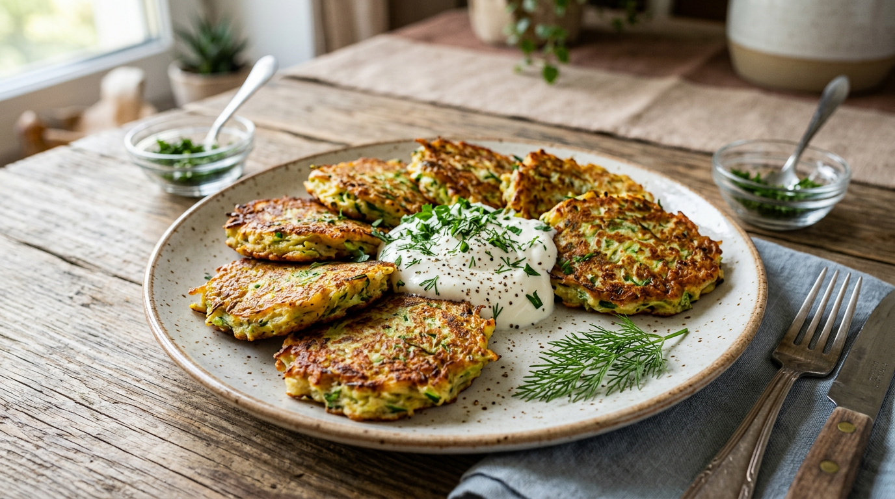
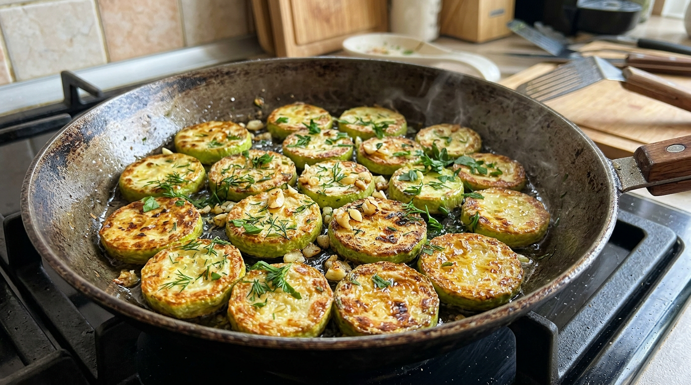
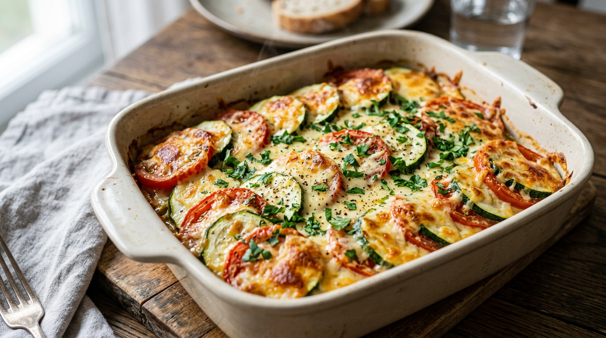
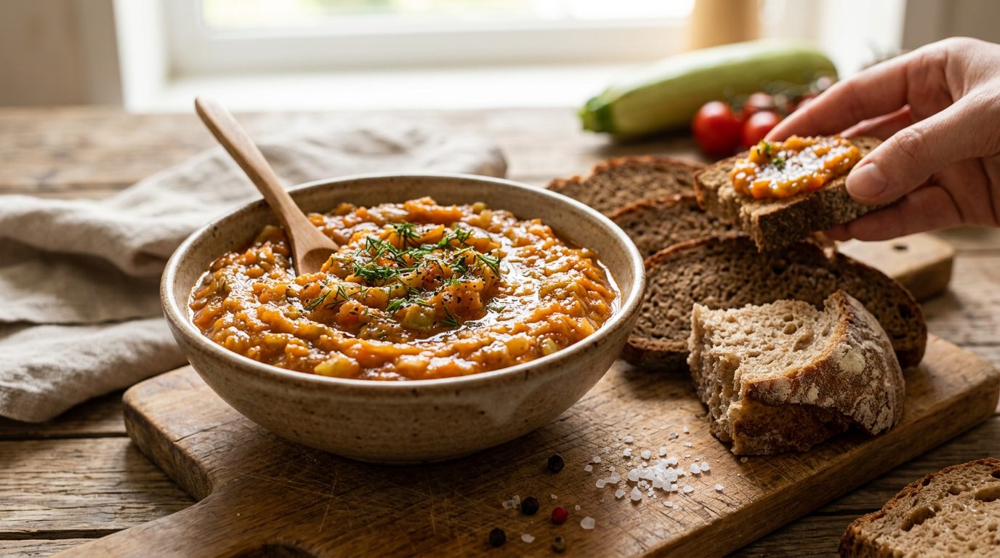
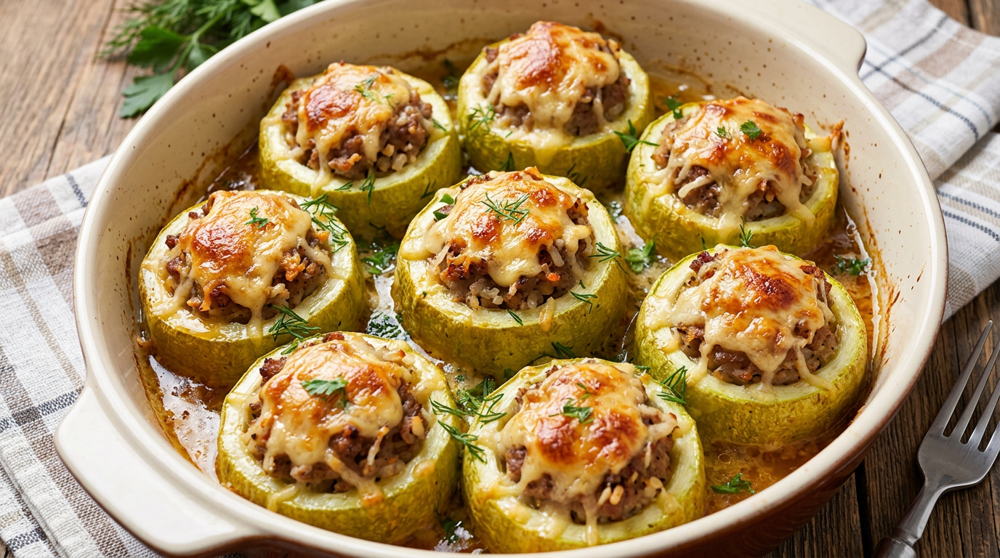

Когда на грядках поспевают кабачки, их обычно бывает много — урожайная это культура. И тут возникает приятный вопрос: что же из них приготовить, чтобы не приелось? К счастью, кабачок невероятно универсален: его жарят, запекают, тушат, фаршируют, делают из него икру, оладьи и даже выпечку. В этой статье собрали простые и вкусные рецепты из кабачков на каждый день — с пошаговым описанием и советами, чтобы блюда получались с первого раза. Все рецепты рассчитаны на обычные продукты и не требуют кулинарного опыта, так что справится даже начинающий.

## 🥒 Чем хороши кабачки

Прежде чем перейти к рецептам, стоит сказать пару слов о самом овоще. Кабачки заслуженно любят за универсальность и доступность — вот почему они так выручают летом:

- **Готовятся быстро** — кабачок мягкий и нежный, ему нужно совсем немного времени.
- **Дёшево и в изобилии** — в сезон их всегда много со своей грядки.
- **Диетичны** — низкокалорийны, легко усваиваются, подходят почти всем.
- **Универсальны** — сочетаются с овощами, мясом, сыром, идут и в основные блюда, и в выпечку.
- **Нейтральны по вкусу** — впитывают вкус специй и соусов, поэтому из них получаются самые разные блюда.

А чтобы кабачков было вдоволь, важно правильно за ними ухаживать — вовремя поливать и подкармливать. Об этом — в статьях о [летних подкормках овощей](https://mir-doma.pro/letnie-podkormki-ovoshchey/) и [капельном поливе](https://mir-doma.pro/kapelnyy-poliv-svoimi-rukami/). А теперь — к рецептам.

## 🍳 Оладьи из кабачков

Самое популярное и быстрое блюдо — нежные кабачковые оладьи. Отличный вариант для завтрака или лёгкого ужина.

**Ингредиенты:** 2 средних кабачка, 1 яйцо, 4–5 ложек муки, 2 зубчика чеснока, соль, перец, зелень, растительное масло для жарки.

**Как приготовить:**

1. Натрите кабачки на крупной тёрке, посолите и оставьте на 10 минут, затем отожмите лишнюю жидкость — это главный секрет, чтобы оладьи не расплывались.
2. Добавьте яйцо, измельчённый чеснок, рубленую зелень, соль и перец, перемешайте.
3. Всыпьте муку и замесите тесто консистенции густой сметаны.
4. Выкладывайте ложкой на разогретую с маслом сковороду и обжаривайте по 2–3 минуты с каждой стороны до румяной корочки.

Подавайте со сметаной или чесночным соусом. По желанию в тесто можно добавить тёртый сыр или мелко нарезанный лук. Любители сладкого варианта делают оладьи без чеснока и зелени, добавляя немного сахара, — получается нежный нейтральный вкус, который нравится детям. А чтобы оладьи были пышнее, в тесто кладут немного разрыхлителя.

## 🍤 Жареные кабачки с чесноком

Простая и любимая многими закуска — золотистые ломтики кабачка с чесноком.

**Ингредиенты:** 2 кабачка, мука для панировки, 3 зубчика чеснока, соль, растительное масло, по желанию — сметана или майонез для подачи.

**Как приготовить:**

1. Нарежьте кабачки кружочками толщиной около сантиметра.
2. Посолите, обваляйте в муке.
3. Обжарьте на разогретом масле с двух сторон до румяной корочки.
4. Готовые кабачки натрите или смажьте чесноком, можно выложить на бумажное полотенце, чтобы убрать лишнее масло.

Такие кабачки вкусны и горячими, и холодными. Часто их подают слоями с помидорами и чесночно-сметанным соусом — получается нарядная закуска. Вместо муки для более хрустящей корочки кабачки панируют в кляре из яйца и муки или в сухарях. Чтобы блюдо было менее жирным, ломтики можно не жарить, а запечь в духовке.

## 🧀 Запеканка из кабачков

Сытная и при этом лёгкая запеканка — отличное горячее блюдо для всей семьи.

**Ингредиенты:** 2–3 кабачка, 2 яйца, 100 г сыра, 2 помидора, 3–4 ложки муки, соль, перец, зелень.

**Как приготовить:**

1. Натрите кабачки, посолите, отожмите лишнюю жидкость.
2. Смешайте их с яйцами, мукой, половиной тёртого сыра, солью и перцем.
3. Выложите массу в смазанную форму, сверху разложите кружочки помидоров.
4. Посыпьте оставшимся сыром и запекайте в духовке при 180 °C около 35–40 минут до золотистой корочки.

Такую запеканку можно дополнить курицей или фаршем, превратив её в полноценное второе блюдо. Очень удачно сочетание кабачков с картофелем слоями — получается сытно, как овощной гратен. А чтобы запеканка лучше держала форму, дайте ей немного остыть перед нарезкой.

## 🥫 Кабачковая икра

Классика лета — нежная кабачковая икра. Её едят свежей или закатывают на зиму.

**Ингредиенты:** 1 кг кабачков, 2 моркови, 2 луковицы, 2–3 ложки томатной пасты, соль, сахар, растительное масло.

**Как приготовить:**

1. Кабачки, морковь и лук нарежьте и обжарьте (или потушите) на масле до мягкости.
2. Добавьте томатную пасту, посолите, по вкусу добавьте немного сахара и тушите ещё 10–15 минут.
3. Измельчите массу блендером до однородности и проварите ещё несколько минут, помешивая.

Готовую икру подают как закуску или намазку на хлеб. Если хотите заготовить её на зиму, горячую икру раскладывают по стерилизованным банкам и закатывают — получается отличная домашняя заготовка, которая хранится до весны. Для более насыщенного вкуса в икру добавляют обжаренный болгарский перец и чеснок, а для густоты дольше уваривают.

## 🫑 Фаршированные кабачки

Эффектное и сытное блюдо — кабачки, фаршированные мясом и овощами.

**Ингредиенты:** 2–3 кабачка, 300 г фарша, 1 луковица, 1 морковь, 100 г сыра, соль, перец, зелень.

**Как приготовить:**

1. Кабачки нарежьте поперёк на «бочонки» высотой 4–5 см и выньте ложкой серединку, сделав «стаканчики».
2. Обжарьте фарш с измельчённым луком и морковью, посолите и поперчите.
3. Наполните кабачковые «стаканчики» начинкой, выложите в форму.
4. Запекайте при 180 °C около 30–40 минут, за 10 минут до готовности посыпьте сыром.

Вместо мяса начинку можно сделать овощной или с рисом — получится не менее вкусно. Можно фаршировать и кабачок целиком, разрезав его вдоль лодочкой и наполнив начинкой, — так блюдо выглядит особенно эффектно на праздничном столе.

## 🍲 Что ещё приготовить из кабачков

Перечисленными рецептами дело не ограничивается — кабачки настолько универсальны, что список блюд можно продолжать почти бесконечно. Вот ещё идеи на каждый день, когда хочется разнообразия:

- **Кабачковый суп-пюре** — нежный крем-суп с зеленью и сливками, готовится за полчаса и хорош даже холодным в жару.
- **Овощное рагу** — кабачки тушат с картофелем, перцем, помидорами и луком.
- **Маринованные кабачки** — хрустящая закуска и заготовка на зиму.
- **Кабачковые котлеты** — постный и диетический вариант оладий.
- **Кабачки на гриле** — ломтики, замаринованные в масле с травами и обжаренные на решётке; идеальный летний гарнир к мясу.
- **Кабачковые кексы и оладьи-маффины** — да, из кабачков получается и выпечка, даже сладкая.
- **Соте из кабачков** — лёгкое овощное блюдо с баклажанами и томатами.

Как видите, из одного урожая кабачков можно приготовить десятки разных блюд и ни разу не повториться.

## 💡 Советы по приготовлению кабачков

Несколько хитростей помогут блюдам получаться вкуснее:

- **Молодые кабачки** не нужно чистить и удалять семена — у них нежная кожица; у крупных и перезрелых кожуру и семена убирают.
- **Убирайте лишнюю влагу.** Кабачок очень сочный: натёртую мякоть солят и отжимают, иначе оладьи и запеканки расплываются.
- **Не пережаривайте.** Кабачок готовится быстро — достаточно лёгкой румяной корочки, иначе он раскиснет.
- **Добавляйте специи и яркие продукты.** Сам по себе кабачок нейтрален, поэтому чеснок, зелень, перец, помидоры и сыр раскрывают и обогащают его вкус.
- **Используйте разные кабачки.** Цукини (зелёные кабачки) имеют более плотную мякоть и хороши на гриле и в салатах.
- **Заготавливайте впрок.** Если кабачков много, часть переработайте в икру или маринады на зиму, а часть заморозьте — так урожай не пропадёт.

## ❓ Частые вопросы

### Что быстро приготовить из кабачков?

Быстрее всего — оладьи или жареные кабачки с чесноком: на них уходит 15–20 минут. Натёртые или нарезанные кабачки готовятся очень быстро, поэтому это идеальные блюда, когда нужно покормить семью без долгой возни.

### Нужно ли чистить кабачки перед приготовлением?

Молодые кабачки с нежной кожицей чистить не нужно — их готовят целиком, с кожурой и семенами. У крупных, перезрелых кабачков кожуру срезают, а рыхлую серединку с семенами удаляют.

### Как убрать лишнюю влагу из кабачков?

Натрите кабачки, посолите и оставьте на 10 минут, затем хорошо отожмите руками или через марлю. Это обязательный шаг для оладий, запеканок и котлет, иначе тесто будет слишком жидким и блюдо расплывётся.

### Можно ли заморозить кабачки на зиму?

Да, кабачки отлично замораживаются. Их нарезают кубиками или натирают (для оладий), при желании бланшируют, расфасовывают по пакетам и убирают в морозилку. Зимой из таких заготовок готовят рагу, икру и оладьи.

### Что приготовить из кабачков на зиму?

На зиму из кабачков делают кабачковую икру, маринованные и солёные кабачки, салаты-ассорти и заготовки «как грибы». Также кабачки замораживают кубиками или в натёртом виде. Зимой такие заготовки выручают и как закуска, и как основа для горячих блюд.

### Сколько готовятся кабачки?

Кабачки готовятся очень быстро: жарятся по 2–3 минуты с каждой стороны, тушатся 10–15 минут, запекаются 30–40 минут. Главное — не передержать, иначе нежная мякоть раскиснет. Готовность легко проверить: кабачок должен стать мягким, но не разваливаться.

### Из старых кабачков что можно приготовить?

Из крупных перезрелых кабачков, очищенных от кожуры и семян, получаются отличные икра, рагу, запеканки и фаршированные блюда. А ещё их можно потушить или пустить на заготовки — в этих блюдах плотность мякоти не мешает.

## Заключение

Кабачки — настоящая палочка-выручалочка летнего стола: из них можно приготовить и быстрый завтрак, и сытный ужин, и закуску, и заготовку на зиму. Начните с простых оладий или жареных кабачков с чесноком, попробуйте запеканку и икру, а распробовав — экспериментируйте с фаршированными кабачками, рагу и даже выпечкой. Главное — отжимать лишнюю влагу и не пережаривать, и тогда каждое блюдо получится вкусным. Так урожай кабачков превратится в десятки разных блюд, и он точно не пропадёт. А излишки всегда можно переработать в икру или заморозить — и кабачковые блюда будут радовать вас даже зимой.

А что вы любите готовить из кабачков? Делитесь любимыми рецептами в комментариях и подписывайтесь, чтобы не пропустить новые подборки блюд из урожая.
