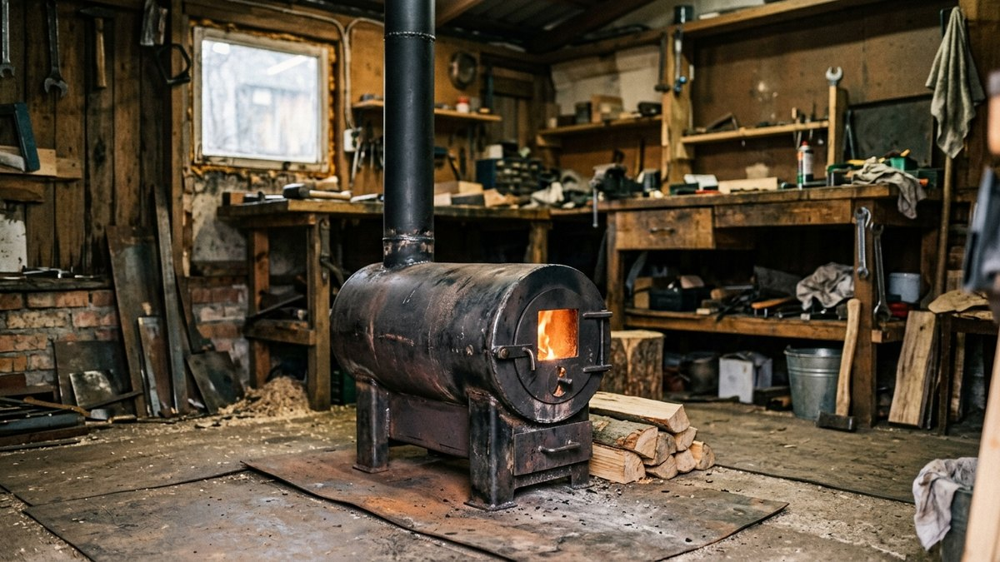
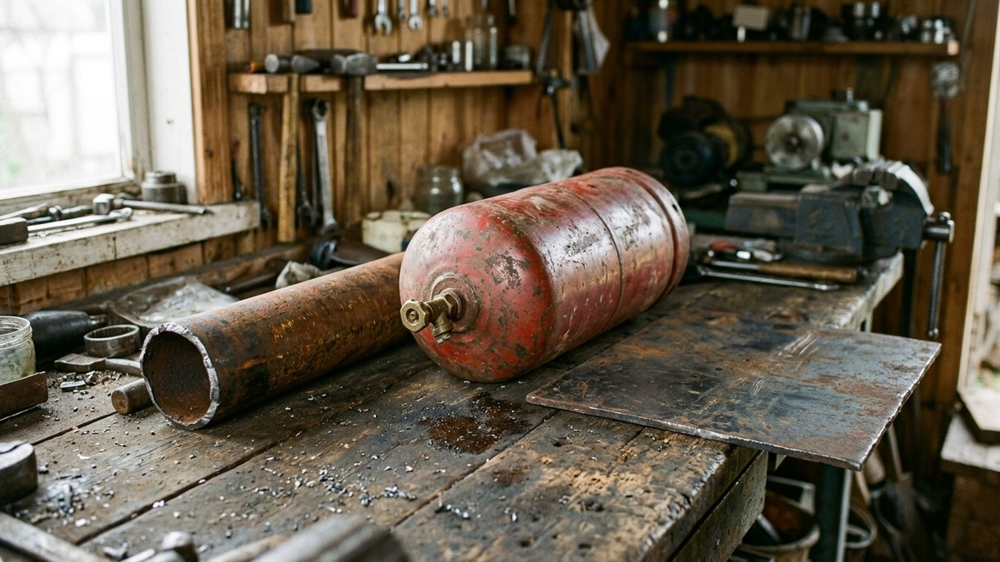
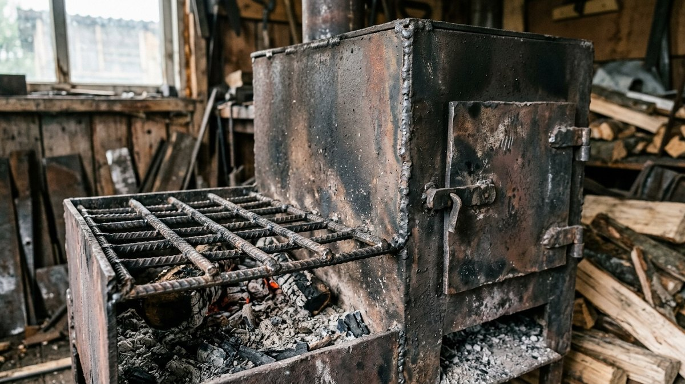
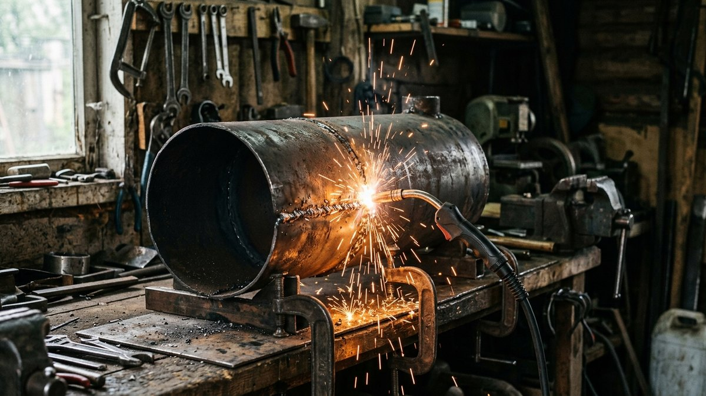
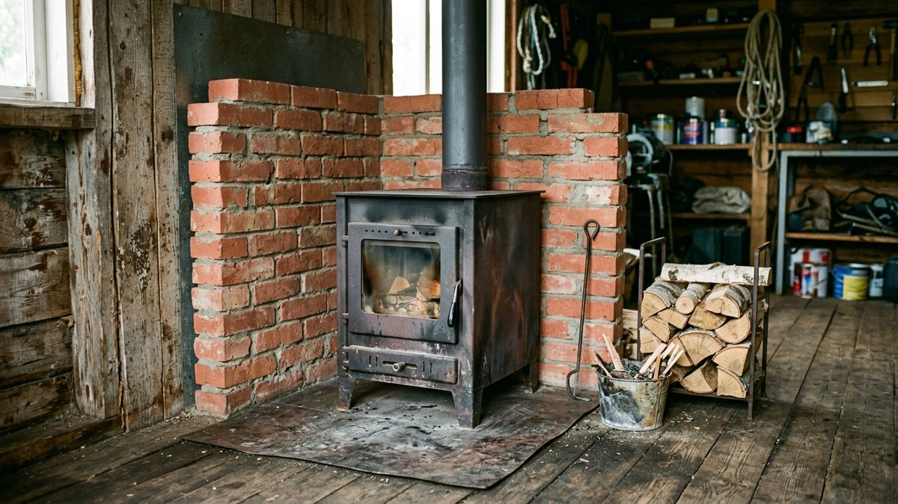
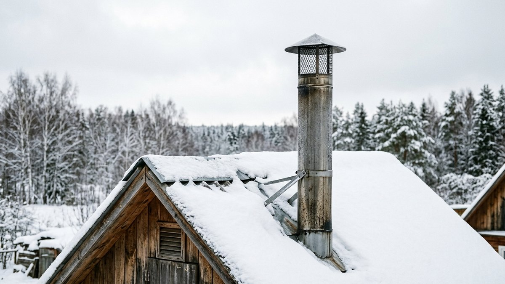

# Буржуйка своими руками: из трубы, баллона или листа — чертёж, сборка, безопасность

Буржуйка — самая простая металлическая печь: топка, колосник, зольник и
труба. Сварить её может любой, кто уверенно держит электрод, а обойдётся
она в разы дешевле заводской. Но у самодельной печи два слабых места —
прогорающий тонкий металл и пожарная безопасность. Разберём, как сделать
буржуйку своими руками из трубы, газового баллона или листовой стали,
какой нужен металл и дымоход, на каком расстоянии от стен её ставить и
где самоделка уместна, а где лучше купить заводскую печь.

## Где уместна самодельная буржуйка

Честно о границах:

- **Гараж, мастерская, теплица, бытовка, сарай** — классическое место
  для буржуйки. Помещение нужно прогреть быстро на несколько часов, а
  равномерное тепло не требуется.
- **Жилой дом** — возможно, но с оговорками. Самоделка без сертификата
  может стать проблемой при страховании дома, а металлическая печь без
  теплоёмкого экрана быстро остывает. Для постоянного отопления дачи
  лучше заводская печь с экраном или кирпичная. Их сравнение — в статье
  [печь для дачи](https://mir-doma.pro/pech-dlya-dachi/).
- **Баня** — нет. Для парной нужна каменка с другими требованиями к
  конструкции.

## Из чего сделать: три варианта

| Основа | Толщина стенки | Плюсы | Минусы |
|---|---|---|---|
| Стальная труба Ø 300–400 мм | 5–8 мм | Готовый корпус, толстый металл, долго служит | Тяжело найти отрезок, тяжёлая |
| Газовый баллон 50 л | около 3 мм | Готовая форма, легко достать | Тонкий металл прогорает, нужна дегазация |
| Листовая сталь | от 4 мм | Любая форма и размер | Больше сварки, нужен навык |

Главный параметр — **толщина металла**. Стенка 3 мм в зоне огня
прогорает за несколько сезонов активной топки, 5–6 мм служит годами.
Если корпус тонкий, дно топки и зону над колосником можно усилить
вторым слоем или футеровать огнеупорным кирпичом изнутри.

## Если основа — газовый баллон

Резать баллон без подготовки нельзя: даже «пустой» баллон содержит
газ и конденсат, и искра от болгарки вызывает взрыв. Порядок один и
тот же для печи и для мангала:

1. Выпустить остатки газа на улице, вдали от огня.
2. Выкрутить вентиль.
3. Заполнить баллон водой доверху и оставить на сутки.
4. Слить воду и резать, не давая баллону высохнуть.

Подробно подготовка баллона разобрана в статье
[мангал из газового баллона своими руками](https://mir-doma.pro/mangal-iz-gazovogo-ballona-svoimi-rukami/).
Для печи баллон ставят вертикально (компактнее) или горизонтально
(длиннее топка, удобнее закладывать дрова).

## Устройство и размеры

Любая буржуйка состоит из пяти узлов:

- **Топка** — основной объём. Для гаража или мастерской 15–25 м² это
  обычно корпус высотой 60–80 см при диаметре 30–40 см.
- **Колосник** — решётка, на которой горят дрова. Сваривается из арматуры
  12–16 мм или уголка с зазором 1–1,5 см, располагается на 10–15 см
  выше дна.
- **Зольник** — пространство под колосником со своей дверцей. Через
  неё регулируют подачу воздуха.
- **Дверцы** — топочная и зольниковая, с плотным притвором и надёжной
  защёлкой.
- **Патрубок дымохода** — вверху корпуса, обычно Ø 100–120 мм.

Простая доработка, которая заметно повышает КПД, — **отражатель**:
стальная пластина внутри топки под патрубком. Газы огибают её, дольше
остаются в печи и отдают больше тепла, а не улетают в трубу.

## Сборка по шагам

1. **Разметьте корпус**: вырезы под топочную и зольниковую дверцы,
   отверстие под патрубок.
2. **Вырежьте проёмы.** Вырезанные куски часто используют как сами
   дверцы — приварив к ним рамку для плотного притвора.
3. **Приварите опоры колосника** и уложите колосник.
4. **Приварите дно и крышку**, если основа — труба.
5. **Установите отражатель** под верхним патрубком.
6. **Приварите патрубок дымохода.**
7. **Навесьте дверцы** на петли, сделайте задвижки.
8. **Приварите ножки** высотой 10–15 см, чтобы дно не лежало на полу.
9. **Проверьте швы**: сплошные, без прожогов и щелей.
10. **Первая протопка на улице**, с небольшой закладкой. Сгорит заводская
    смазка и краска, проявятся непровары.

Красить печь можно только термостойкой эмалью (от 600 °C), после
первой протопки.

## Дымоход: от него зависит тяга

- **Диаметр** не меньше патрубка печи, обычно 100–120 мм.
- **Высота** — не менее 5 м от колосника до верха трубы. Это
  требование СП 7.13130 для печей. Короткая труба не даёт тяги.
- **Утеплённая «сэндвич»-труба** на улице и в холодном чердаке. Голая
  труба на морозе копит конденсат и смолу.
- **Проход через потолок и крышу** — только через противопожарную
  разделку с негорючим утеплителем.
- **Горизонтальные участки** — минимум, не больше 1 м суммарно.
- **Искрогаситель** на выходе трубы, особенно над деревянной или мягкой
  кровлей. Его несложно сделать самому из сетки и обрезка трубы —
  конструкция и расчёт сетки, при которой тяга не падает, есть
  в статье про [искрогаситель на дымоход своими руками](https://mir-doma.pro/iskrogasitel-na-dymokhod-dlya-bani/).
- **Колпак от дождя** — на высоте 0,5–1 диаметра трубы над срезом, иначе
  тяга упадёт. Выкройку зонта под ваш диаметр считает калькулятор
  в статье про [колпак на трубу дымохода](https://mir-doma.pro/kolpak-na-trubu-dymokhoda-svoimi-rukami/).

Как чистить дымоход и узнать, что он забился, объяснено в статье
[ремонт печи на даче](https://mir-doma.pro/remont-pechi-na-dache/).

## Где поставить: отступы и основание

Металлическая печь без футеровки раскаляется, и расстояния здесь
больше, чем у кирпичной. Ориентиры по СП 7.13130:

- **до незащищённых деревянных стен — 1 м**;
- **до стен, защищённых** негорючим экраном (металлический лист по
  базальтовому картону, кирпичный экран) — 0,7 м;
- **пол под печью** — негорючий: лист стали по базальтовому картону,
  плитка, кирпич;
- **предтопочный лист** перед дверцей — не меньше 50×70 см.

Кирпичный экран вокруг печи на расстоянии 5–10 см решает сразу две
задачи: защищает стены и накапливает тепло, которое буржуйка иначе
отдаёт только пока горит.

## Какой мощности нужна печь

Ориентир для помещения с потолком до 2,7 м — **около 1 кВт на 10 м²** в
утеплённом помещении и в полтора-два раза больше в холодном гараже или
теплице. Калькулятор считает мощность и подсказывает размер корпуса.

<!-- wp:html -->

  
Какой мощности нужна буржуйка

  <label class="md-calc__label" for="mdBuA">Площадь помещения, м²</label>
  <input type="number" id="mdBuA" class="md-calc__input" min="5" step="1" value="24">
  <label class="md-calc__label" for="mdBuI">Помещение</label>
  <select id="mdBuI" class="md-calc__input">
    <option value="1">Утеплённое (дом, мастерская)</option>
    <option value="1.5" selected>Слабо утеплённое (гараж, бытовка)</option>
    <option value="2">Холодное (теплица, сарай)</option>
  </select>
  
Введите площадь

<!-- /wp:html -->

Сравнить, во что обходится отопление дровами против электричества и
газа за сезон, можно в статье
[отопление дачи: что дешевле](https://mir-doma.pro/otoplenie-dachi-chto-deshevle/),
а сколько кубов дров понадобится на зиму — в статье
[сколько дров нужно на зиму](https://mir-doma.pro/skolko-drov-nuzhno-na-zimu/).

## Частые ошибки

- **Тонкий металл в зоне огня.** Баллон или труба 3 мм прогорает за
  пару сезонов. Усиливайте дно и зону над колосником.
- **Короткий дымоход.** Меньше 5 м от колосника — слабая тяга, дым в
  помещении.
- **Печь вплотную к деревянной стене.** Нужен 1 м или экран.
- **Резка баллона без дегазации.** Смертельно опасно.
- **Обычная краска.** Сгорит с едким дымом при первой протопке.
- **Закрытая заслонка при недогоревших углях.** Угарный газ не пахнет.
  Датчик угарного газа в помещении с печью стоит копейки.

## Частые вопросы

### Из чего лучше сделать буржуйку своими руками

Из толстостенной стальной трубы диаметром 300–400 мм со стенкой от 5 мм:
готовый корпус, долго служит. Баллон проще достать, но металл у него
тонкий.

### Можно ли поставить самодельную буржуйку в доме

Технически да, при соблюдении отступов, негорючего основания и
правильного дымохода. Но для жилого дома надёжнее заводская печь: у
самоделки быстро остывает корпус, и с ней могут быть сложности при
страховании.

### Какой нужен дымоход для буржуйки

Диаметром не меньше патрубка, обычно 100–120 мм, высотой не менее 5 м от
колосника, утеплённый на улице, с разделкой при проходе через потолок и
крышу.

### Как сделать, чтобы буржуйка дольше держала тепло

Обложить её кирпичным экраном на расстоянии 5–10 см и поставить
отражатель внутри топки. Экран накапливает тепло и отдаёт его после
того, как дрова прогорели.

### На каком расстоянии от стены ставить буржуйку

От незащищённой деревянной стены — не ближе 1 м, от стены с негорючим
экраном — 0,7 м.

## Итог

Буржуйка своими руками — хорошее решение для гаража, мастерской и
теплицы. Берите толстый металл, делайте колосник, зольник и отражатель,
ставьте дымоход не ниже 5 м и соблюдайте отступы: метр до деревянной
стены, негорючий пол и предтопочный лист. Для постоянного отопления
жилого дома разумнее заводская печь.
