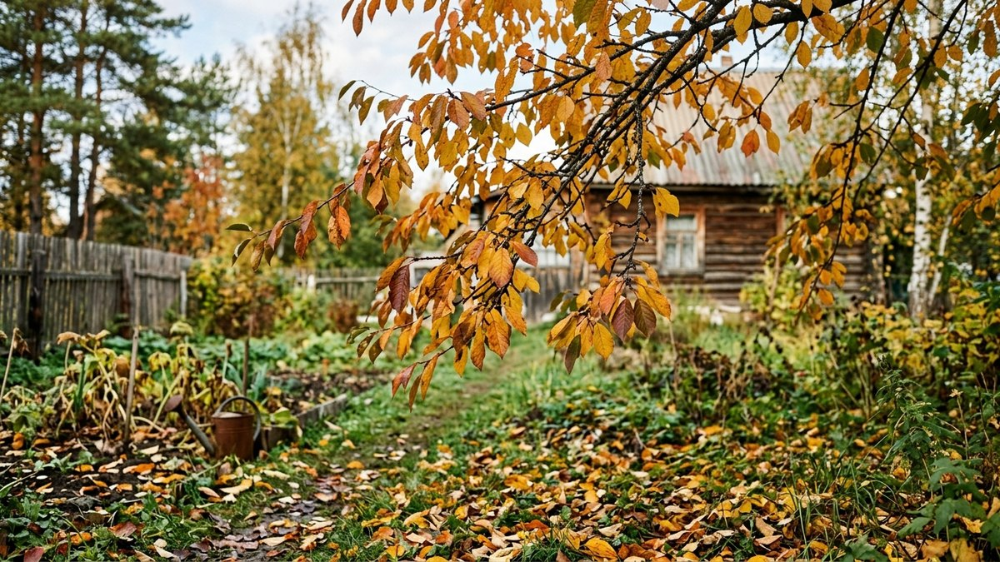
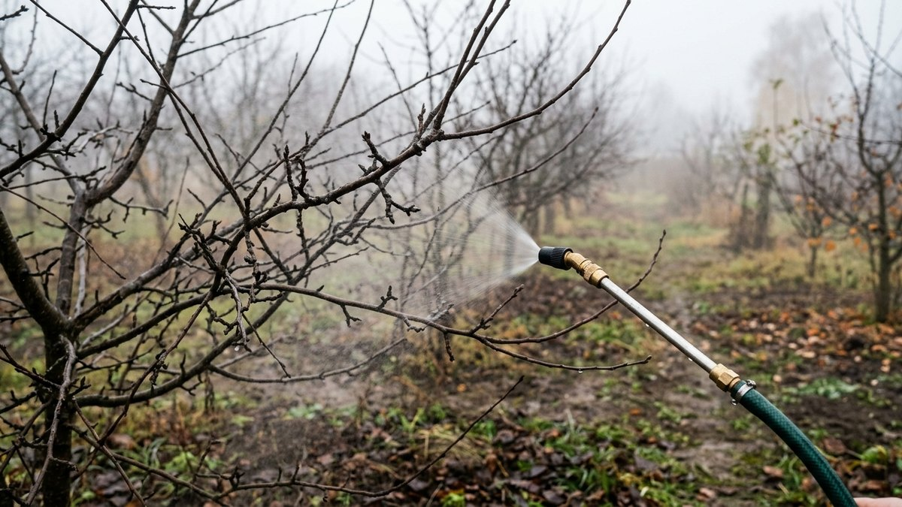
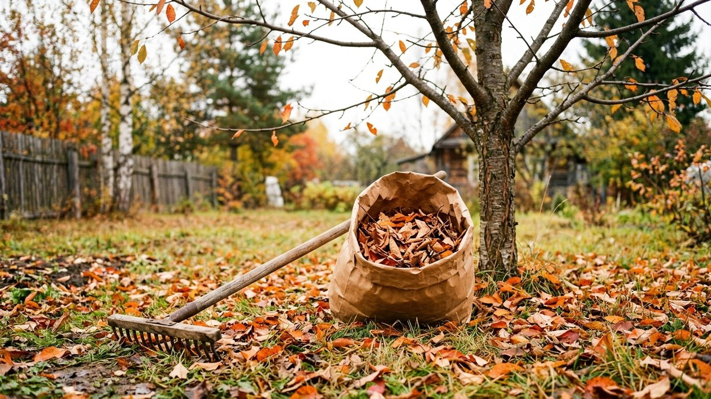
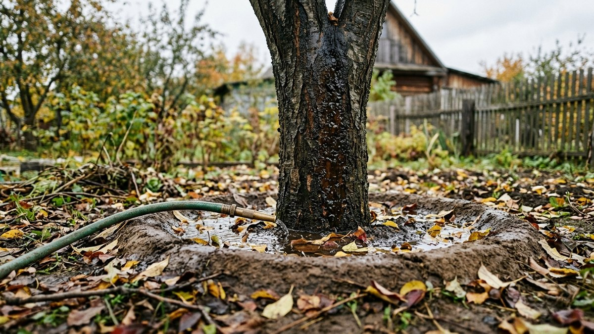
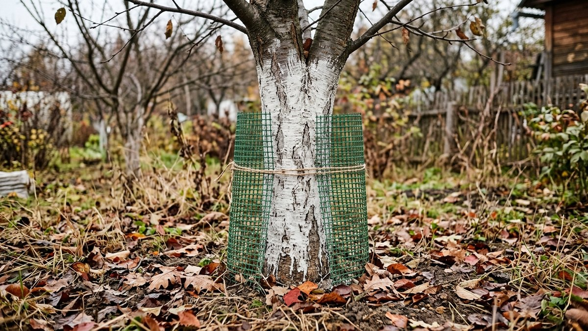
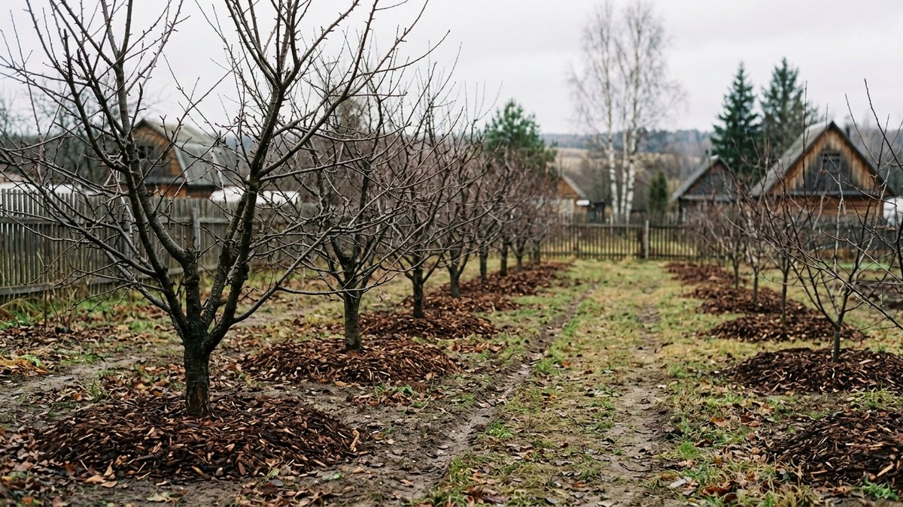

Чем обработать вишню осенью, решает, будет ли она летом с листьями.
Главные болезни вишни — коккомикоз и монилиоз — зимуют не где-нибудь,
а прямо под деревом: в опавших листьях, в засохших ягодах-«мумиях»
и в больных ветках. Осенняя обработка уничтожает этот запас инфекции,
пока он не проснулся весной. Разберём, что делать с листьями, когда
и чем опрыскивать — мочевиной, медным или железным купоросом, — чем
подкормить вишню под зиму, сколько воды нужно для влагозарядкового полива
и почему осенью вишню обрезают только санитарно. Калькулятор посчитает
граммы препарата и литры раствора на ваши деревья.

## Что зимует на вишне и где

| Болезнь или вредитель | Где зимует | Что делать осенью |
|---|---|---|
| Коккомикоз | В опавших листьях | Собрать и вынести листья, опрыскать мочевиной |
| Монилиоз | В засохших ягодах на ветках и больных побегах | Снять «мумии», вырезать засохшие побеги, медный препарат |
| Клястероспориоз (дырчатая пятнистость) | В коре побегов и почках | Медный препарат после листопада |
| Вишнёвая муха, слизистый пилильщик | В почве под кроной | Перекопать приствольный круг на 10–15 см |
| Тля | Яйца у почек | Осенью почти не достать, работа — ранней весной |
| Лишайники, мох на коре | На штамбе и скелетных ветвях | Железный купорос, побелка |

Отсюда порядок работ: сначала убрать то, где зимует инфекция, потом
опрыскать, потом подкормить, полить и побелить.

## Чем обработать вишню осенью: растворы и сроки

**Мочевина (карбамид), 5 %** — 500 г на 10 л воды. Опрыскивают крону,
когда начался листопад и пожелтела примерно половина листьев: раствор
попадает и на листья, и на ветки. Опавшие листья и землю под кроной
проливают более крепким раствором — 7–8 %, 700–800 г на 10 л. Мочевина
в такой концентрации действует не как удобрение, а как средство,
которое «сжигает» споры на листьях. Подробнее о том, почему в низких дозах
азот по листу осенью вредит, — в статье про
[внекорневую подкормку осенью](https://mir-doma.pro/vnekornevaya-podkormka-osenyu/).

**Медный купорос, 3 %** — 300 г на 10 л, или **бордоская смесь 3 %** —
300 г медного купороса и 400 г извести на 10 л. Это обработка после
полного листопада «по голым веткам» от монилиоза и дырчатой пятнистости.
Если мочевину уже давали, медь — не раньше чем через 7–10 дней.

**Железный купорос, 3–5 %** — 300–500 г на 10 л. Поздней осенью по
штамбу и толстым ветвям: против мхов и лишайников. По листьям его не
дают, он их обжигает.

| Препарат | Концентрация | На 10 л воды | Когда | Куда |
|---|---|---|---|---|
| Мочевина | 5 % | 500 г | Начало листопада | Крона |
| Мочевина | 7–8 % | 700–800 г | После листопада | Опавшие листья, земля под кроной |
| Медный купорос | 3 % | 300 г | После полного листопада | Голые ветви и штамб |
| Бордоская смесь | 3 % | 300 г купороса + 400 г извести | После полного листопада | Голые ветви и штамб |
| Железный купорос | 3–5 % | 300–500 г | Поздняя осень | Штамб и толстые ветви |

Опрыскивают в сухой безветренный день при плюсовой температуре, лучше
от +5 °C, чтобы раствор успел высохнуть до заморозка. Работают в
перчатках, очках и респираторе: медь и концентрированная мочевина
раздражают кожу и глаза. Растворы готовят в пластиковой посуде.

## Калькулятор раствора для вишни

Выберите препарат, число деревьев и их размер. Калькулятор подскажет,
сколько раствора нужно и сколько граммов препарата отвесить.

<!-- wp:html -->

  
Калькулятор осенней обработки вишни

  <label class="md-calc__label" for="mdVsP">Препарат</label>
  <select id="mdVsP" class="md-calc__input">
    <option value="u5">Мочевина 5 % — по кроне в начале листопада</option>
    <option value="u7">Мочевина 7 % — по листьям и земле под кроной</option>
    <option value="cu">Медный купорос 3 % — после листопада</option>
    <option value="bor">Бордоская смесь 3 % — после листопада</option>
    <option value="fe">Железный купорос 4 % — штамб и ветви</option>
  </select>
  <label class="md-calc__label" for="mdVsN">Число деревьев</label>
  <input type="number" id="mdVsN" class="md-calc__input" min="1" step="1" value="3">
  <label class="md-calc__label" for="mdVsS">Размер</label>
  <select id="mdVsS" class="md-calc__input">
    <option value="s">Молодая, до 4–5 лет</option>
    <option value="m" selected>Взрослая кустовая вишня</option>
    <option value="l">Взрослая древовидная вишня</option>
  </select>
  
Заполните поля

<!-- /wp:html -->

Расход раствора на дерево — ориентир: опрыскивают до равномерного
смачивания, без стекания капель. Обычный ранцевый опрыскиватель на 5 л
уходит на 1–2 взрослые кустовые вишни.

## Санитария: листья, «мумии», приствольный круг

Без уборки опрыскивание работает вполсилы.

1. **Опавшие листья** сгребите и вынесите с участка или сожгите, если
   это разрешено. В компост листья с коккомикозом не кладут: в обычной
   куче споры переживают зиму.
2. **Засохшие ягоды** на ветках и под деревом соберите все. Каждая
   «мумия» — источник монилиоза весной.
3. **Приствольный круг** перекопайте на 10–15 см, не глубже, чтобы не
   повредить корни: зимующие в почве личинки вишнёвой мухи и пилильщика
   окажутся на поверхности и вымерзнут.
4. **Камедь** — янтарные потёки на коре. Зачистите рану ножом до здоровой
   ткани, промойте 1 % медным купоросом (100 г на 10 л) и закройте
   садовым варом.

## Чем подкормить вишню осенью

Осенью вишне нужны фосфор и калий: они помогают вызреть древесине
и заложить цветковые почки. Азот не дают — он гонит рост, побеги не
успевают одревеснеть и вымерзают.

| Удобрение | Доза на 1 м² приствольного круга | Как вносить |
|---|---|---|
| Суперфосфат двойной | 20–30 г | В бороздки по краю кроны, заделать |
| Сульфат калия | 15–20 г | Вместе с суперфосфатом |
| Зола | 150–200 г (стакан — около 100 г) | Вместо калия, раз в 2–3 года |
| Перегной или компост | 3–5 кг | Мульчей по кругу после полива |

Удобрения вносят по краю кроны, а не у ствола: всасывающие корни там.
Какие ещё удобрения работают осенью и в каком порядке их вносить,
разобрано в статье про [осенние подкормки](https://mir-doma.pro/osennie-podkormki/).
Вишня любит нейтральную почву: если земля кислая, известь или
доломитовую муку вносят отдельно от золы и навоза.

## Влагозарядковый полив

Если осень сухая, перед заморозками вишню поливают обильно: сухая почва
промерзает глубже, корни страдают сильнее. Норма — 4–6 вёдер под молодое
дерево и 8–10 вёдер под взрослое, медленно, в несколько приёмов, чтобы
вода ушла на глубину 50–60 см. После дождливой осени полив не нужен.

## Можно ли обрезать вишню осенью

Только санитарно. Вишня — косточковая, раны у неё заживают медленно
и легко дают камедетечение, а срез, сделанный в октябре, уходит в зиму
открытым и подмерзает. Поэтому:

- **осенью** вырезают засохшие, сломанные и поражённые монилиозом
  ветви — на 10–15 см ниже границы поражения, по здоровой древесине;
- **формирующую обрезку** — укорачивание, прореживание кроны, удаление
  волчков — переносят на раннюю весну, до набухания почек.

Почему осенью можно только санитарную обрезку и как обработать срезы,
подробно разобрано в статье про
[обрезку плодовых деревьев осенью](https://mir-doma.pro/obrezka-plodovyh-derevev-osenyu/).

## Побелка и защита от грызунов

После обработок, в конце октября — ноябре, штамб и основания скелетных
ветвей белят известью или садовой краской: побелка защищает кору от
солнечных ожогов в феврале — марте. Молодые вишни обвязывают сеткой
или лапником от зайцев и мышей. Как приготовить побелку и что ещё
сделать в саду до морозов, разобрано в статье про
[подготовку сада к зиме](https://mir-doma.pro/podgotovka-sada-k-zime/).

## Частые ошибки

- **Опрыскали, но оставили листья под деревом.** Коккомикоз весной
  стартует снова.
- **Мочевина и медь в один день.** Ожог и падение эффективности. Интервал
  7–10 дней.
- **Медь по зелёным листьям в сентябре.** Ожог листьев и преждевременный
  листопад, а инфекция всё равно перезимует.
- **Азот под зиму.** Побеги растут до морозов и вымерзают.
- **Формирующая обрезка в октябре.** Камедетечение и подмерзание срезов.
- **Перекопка на штык у ствола.** Повреждение корней: у вишни они
  поверхностные, глубже 10–15 см под кроной не копают.

## Частые вопросы

### Чем обработать вишню осенью от болезней

В начале листопада — мочевиной 5 % по кроне, после листопада — мочевиной
7–8 % по опавшим листьям и земле, затем, через 7–10 дней, медным
купоросом или бордоской смесью 3 % по голым веткам. Листья и засохшие
ягоды из-под дерева предварительно убирают.

### Когда обрабатывать вишню осенью

Мочевиной — когда пожелтело и начало опадать около половины листьев.
Медью — после полного листопада. Опрыскивают в сухую погоду при
температуре от +5 °C.

### Чем подкормить вишню осенью

Фосфором и калием: 20–30 г двойного суперфосфата и 15–20 г сульфата
калия на 1 м² приствольного круга или 150–200 г золы. Азот осенью не
дают.

### Можно ли обрезать вишню осенью

Только санитарно: сухие, сломанные и больные ветви. Формирующую обрезку
переносят на раннюю весну, иначе срезы подмерзают и начинается
камедетечение.

### Чем обработать вишню от коккомикоза осенью

Соберите и уничтожьте опавшие листья, затем пролейте землю под кроной
мочевиной 7–8 % (700–800 г на 10 л). Если листья ещё на дереве и болезнь
сильная, сначала опрыскайте крону 5 % мочевиной в начале листопада.
