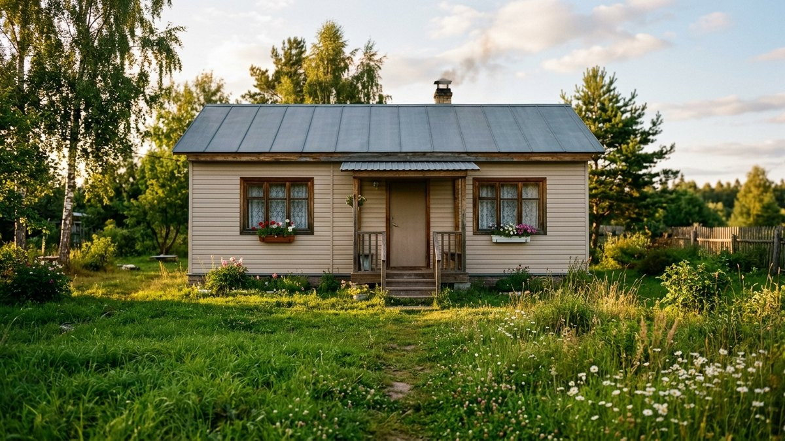
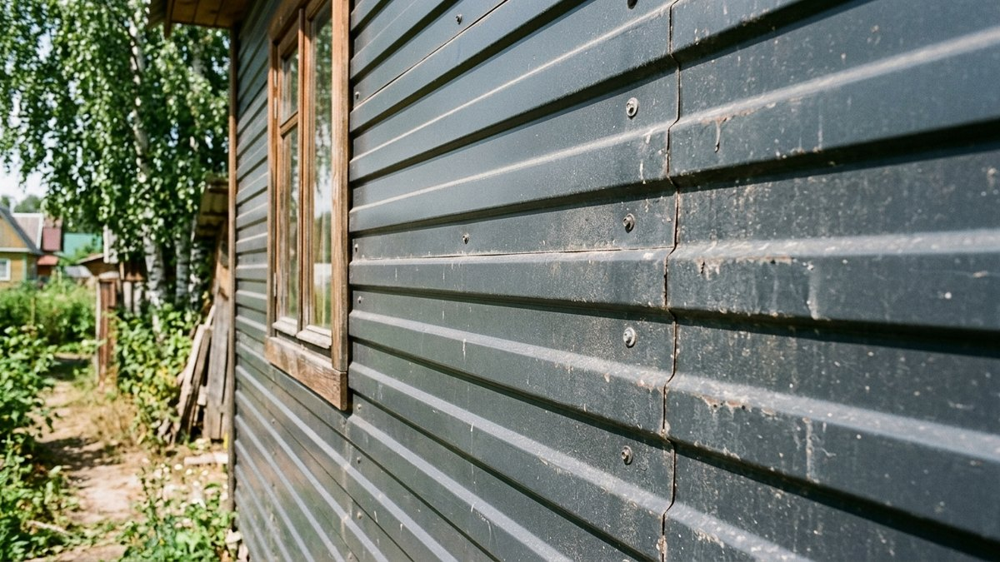
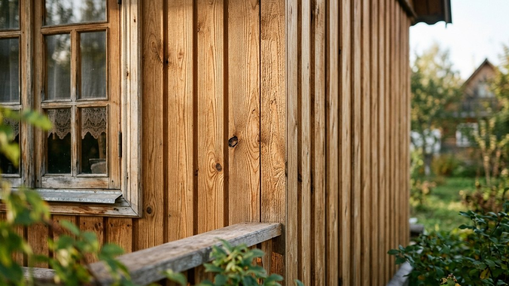
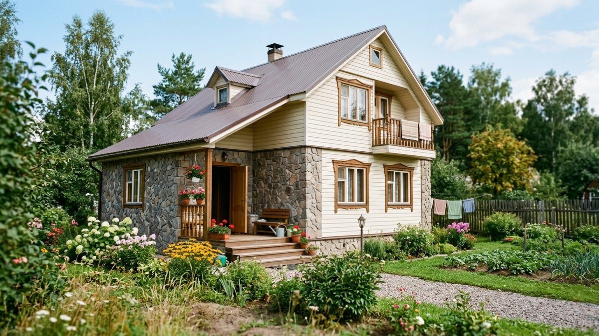
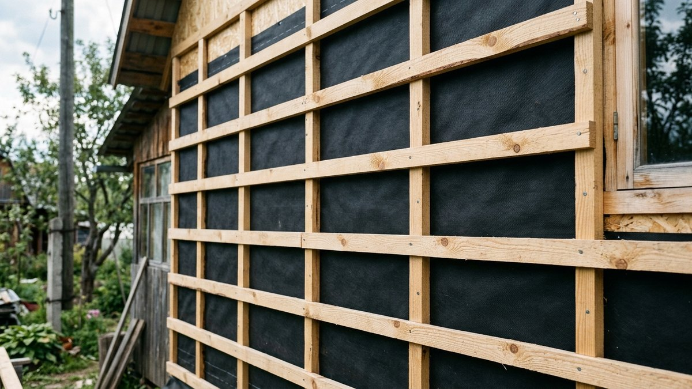
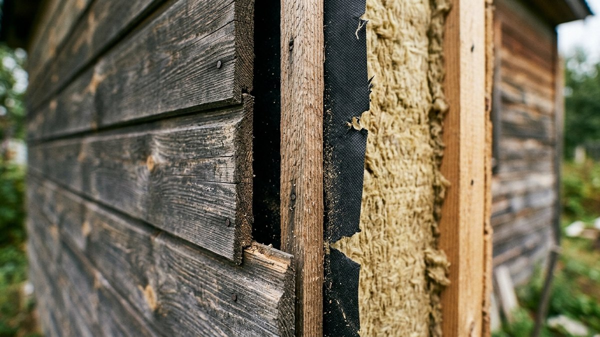

Дачный дом обычно строят из того, что дешевле и быстрее — бруса, каркаса, газоблока, — а потом решают, чем закрыть стены снаружи. Выбор большой: виниловый и металлический сайдинг, блок-хаус, имитация бруса, вагонка, термопанели, штукатурка по утеплителю. Разберём, чем они отличаются по цене, долговечности и монтажу, и что выбрать под конкретный дом и бюджет.

## Что учитывать при выборе

Прежде чем сравнивать материалы, определитесь с тремя вещами:

- **Нужно ли утепление.** Если стены холодные (каркас без утепления, старый брус), обшивка почти всегда идёт вместе с утеплителем — тогда смотрите в сторону сайдинга или термопанелей по каркасу, куда утеплитель встаёт «в тело» конструкции. Подробный расчёт — в статье [сколько стоит утеплить дачный дом](https://mir-doma.pro/skolko-stoit-uteplit-dachnyy-dom/).
- **Кто будет монтировать.** Сайдинг и блок-хаус может закрепить один человек с шуруповёртом за выходные. Штукатурка по утеплителю — работа для бригады, в одиночку сложно выдержать технологию.
- **Бюджет на м² или бюджет на дом целиком.** Материалы дешевле по метру не всегда дешевле по факту — если нужна обрешётка, пароизоляция и утеплитель, конечная смета может сравняться с более дорогим, но самодостаточным вариантом.

## Виниловый сайдинг

Самый популярный материал для дачи: панели из ПВХ имитируют доску, крепятся на обрешётку с зазором для вентиляции.

**Плюсы:** не гниёт, не ржавеет, не требует покраски, десятки цветов и фактур, монтаж своими руками за выходные.
**Минусы:** на морозе становится хрупким — удар может расколоть панель; дешёвые серии выгорают за 5–7 лет; ощутимо «пластиковый» вид вблизи.

Цена материала — от 250 до 500 ₽/м², монтаж под ключ — от 600 до 900 ₽/м² с учётом обрешётки.

## Металлический сайдинг

Та же логика панелей, но из оцинкованной стали с полимерным покрытием.

**Плюсы:** не боится мороза и ударов, срок службы 40–50 лет, не выгорает так, как винил.
**Минусы:** дороже винила почти вдвое, при сильном граде или ударе может остаться вмятина без возможности выправить, летом сильнее нагревается.

Цена материала — от 450 до 800 ₽/м², монтаж — от 700 до 1000 ₽/м².

## Блок-хаус

Панели — деревянные или виниловые — имитируют оцилиндрованное бревно. Деревянный блок-хаус чаще берут для дома «под сруб», виниловый — как бюджетную имитацию.

**Плюсы:** деревянный — натуральный материал, дышит, живой вид; виниловый — не гниёт и не требует ухода.
**Минусы:** деревянный требует обработки антисептиком и подкраски раз в 3–5 лет; виниловый выглядит менее убедительно, чем настоящее дерево, особенно вблизи.

Цена: виниловый — от 350 до 550 ₽/м², деревянный — от 700 до 1500 ₽/м² в зависимости от породы и сечения.

## Имитация бруса

Панели с гладкой плоской лицевой стороной, имитируют оштукатуренный или гладко оструганный брус. Материал — дерево или ПВХ, монтаж аналогичен блок-хаусу.

**Плюсы:** аккуратный, «городской» вид фасада, хорошо смотрится на домах в современном стиле.
**Минусы:** деревянная версия требует такого же ухода, как блок-хаус; ПВХ-версия при нагреве на солнце может слегка «поплыть» по геометрии на дешёвых сериях.

Цена материала — от 400 до 1200 ₽/м², монтаж — как у блок-хауса, от 700 до 1000 ₽/м².

## Вагонка

Классическая деревянная доска с профилем шип-паз. Для наружной обшивки берут вагонку класса не ниже А, лучше — с антисептической пропиткой на производстве.

**Плюсы:** живой материал, приятный на ощупь и вид, ремонтопригодна — повреждённую доску можно заменить точечно.
**Минусы:** без регулярной обработки (раз в 2–4 года) темнеет и трескается от УФ и влаги; дороже сайдинга в пересчёте на трудозатраты по уходу за весь срок службы. Какой состав выбрать для этой обработки и сколько его нужно на фасад — в статье [чем покрасить фасад дачного дома](https://mir-doma.pro/chem-pokrasit-fasad/).

Цена — от 350 до 900 ₽/м² в зависимости от породы дерева и сорта.

## Термопанели

Готовые плиты «утеплитель + декоративное покрытие под кирпич или камень» крепятся прямо на стену без отдельной обрешётки под утеплитель.

**Плюсы:** утепление и отделка за один монтаж, хорошая имитация кирпичной или каменной кладки, не требует ухода.
**Минусы:** дороже сайдинга, монтаж требует ровных стен или дополнительной подготовки, при повреждении декоративного слоя заплатка заметна.

Цена — от 1200 до 2500 ₽/м² с монтажом.

## Штукатурка по утеплителю (мокрый фасад)

Технология «мокрый фасад»: пенополистирол или минвата крепится к стене, поверх — армирующая сетка и штукатурный слой с декоративной фактурой.

**Плюсы:** бесшовная поверхность, хорошее утепление, много вариантов фактуры и цвета, долговечность при правильном монтаже — от 25 лет.
**Минусы:** требует сухой тёплой погоды на монтаже (весна-лето), ошибки в технологии ведут к трещинам и отслоению, ремонт своими руками почти невозможен без опыта.

Цена под ключ — от 1500 до 2800 ₽/м² в зависимости от толщины утеплителя и фактуры.

## Сравнение: цена за м² с монтажом

| Материал | Материал, ₽/м² | Монтаж, ₽/м² | Срок службы | Утепление в комплекте |
|---|---|---|---|---|
| Виниловый сайдинг | 250–500 | 600–900 | 20–30 лет | нет |
| Металлический сайдинг | 450–800 | 700–1000 | 40–50 лет | нет |
| Блок-хаус виниловый | 350–550 | 600–900 | 25–30 лет | нет |
| Блок-хаус деревянный | 700–1500 | 800–1200 | 15–25 лет с уходом | нет |
| Имитация бруса | 400–1200 | 700–1000 | 15–30 лет | нет |
| Вагонка | 350–900 | 600–900 | 10–20 лет с уходом | нет |
| Термопанели | 1200–2500 | включено | 30+ лет | да |
| Штукатурка (мокрый фасад) | — | 1500–2800 | 25+ лет | да |

## Что подойдёт под какой дом

- **Каркасный дом без утепления стен** — термопанели или сайдинг по утеплителю: закрываете сразу две задачи.
- **Старый брусовой дом, который хочется обновить, не утепляя капитально** — блок-хаус или имитация бруса: сохраняет «деревянный» вид без замены сруба. Больше вариантов — в статье [как обновить старую дачу](https://mir-doma.pro/kak-obnovit-staruyu-dachu/).
- **Дом для постоянного проживания зимой, где важно утепление** — мокрый фасад или термопанели, с расчётом утеплителя по актуальным нормам — детали в статье [утепление стен снаружи](https://mir-doma.pro/uteplenie-sten-snaruzhi/).
- **Бюджетный вариант на дачу выходного дня** — виниловый сайдинг: дешевле всего в монтаже и обслуживании.

## Расчёт на дом 6×8

Площадь обшивки считается просто: периметр дома × высота стен минус площадь окон и дверей. Для дома 6×8 м с высотой стен 2,8 м периметр — 28 м, площадь стен без вычетов — около 78 м², а за вычетом проёмов (обычно 10–15%) — 66–68 м². При цене под ключ 1100 ₽/м² для винилового сайдинга это даёт примерно 73 000–75 000 ₽. Чтобы не считать вручную под свои размеры и материал — калькулятор ниже.

## Калькулятор: сколько будет стоить обшивка вашего дома

Введите размеры дома и выберите материал — калькулятор посчитает площадь обшивки за вычетом окон и дверей и прикинет стоимость под ключ по средним ценам из таблицы выше. Если знаете точную цену по своему региону — впишите её вручную, расчёт пересчитается по ней.

<!-- wp:html -->

<h3 class="md-fo__title">Калькулятор обшивки дома</h3>

Средние цены под ключ по России; для точного расчёта уточните цену в своём регионе.

<label class="md-fo__f">Длина дома, м<input type="number" id="foLen" value="8" min="1" max="60" step="0.1"></label>
<label class="md-fo__f">Ширина дома, м<input type="number" id="foWid" value="6" min="1" max="60" step="0.1"></label>
<label class="md-fo__f">Высота стен, м<input type="number" id="foH" value="2.8" min="1.5" max="12" step="0.1"></label>
<label class="md-fo__f">Этажей<input type="number" id="foFl" value="1" min="1" max="4" step="1"></label>
<label class="md-fo__f">Площадь окон и дверей, %<input type="number" id="foOp" value="12" min="0" max="40" step="1"></label>
<label class="md-fo__f">Материал
<select id="foMat">
<option value="1100" selected>Виниловый сайдинг — 1100 ₽/м²</option>
<option value="1500">Металлический сайдинг — 1500 ₽/м²</option>
<option value="1200">Блок-хаус виниловый — 1200 ₽/м²</option>
<option value="2100">Блок-хаус деревянный — 2100 ₽/м²</option>
<option value="1650">Имитация бруса — 1650 ₽/м²</option>
<option value="1400">Вагонка — 1400 ₽/м²</option>
<option value="1850">Термопанели — 1850 ₽/м²</option>
<option value="2150">Штукатурка (мокрый фасад) — 2150 ₽/м²</option>
</select></label>
<label class="md-fo__f">Своя цена под ключ, ₽/м² (необязательно)<input type="number" id="foPrice" value="" min="0" max="20000" step="1" placeholder="если знаете точную"></label>

Площадь стен<b id="foWall">0 м²</b>

За вычетом проёмов<b id="foArea">0 м²</b>

Стоимость под ключ<b id="foCost">—</b>

Расчёт ориентировочный: не учитывает сложную геометрию фасада, леса на 2+ этажах и доставку.

<button type="button" id="foCopy" class="md-fo__btn md-fo__btn--main">Скопировать результат</button>
<a id="foVk" class="md-fo__btn md-fo__btn--vk" href="#" target="_blank" rel="noopener noreferrer">Поделиться ВКонтакте</a>
<a id="foTg" class="md-fo__btn md-fo__btn--tg" href="#" target="_blank" rel="noopener noreferrer">Поделиться в Telegram</a>
<button type="button" id="foPrint" class="md-fo__btn">Печать</button>

<!-- /wp:html -->

## Частые ошибки

- **Монтаж без вентиляционного зазора.** Под сайдингом и блок-хаусом обязателен зазор 2–3 см для вентиляции — без него конденсат копится в обрешётке, и она гниёт изнутри.
- **Экономия на крепеже.** Оцинкованные саморезы и кляммеры на дешёвом металле ржавеют за пару сезонов и разводами портят фасад.
- **Штукатурка в дождь или мороз.** Мокрый фасад, нанесённый при температуре ниже +5°C или в дождь, трескается уже в первый год.
- **Монтаж сайдинга «внатяг».** Панели ПВХ расширяются от жары — крепить нужно с зазором в отверстиях крепежа, иначе фасад «поведёт» летом.

## Частые вопросы

### Чем дешевле всего обшить дом снаружи?

Виниловый сайдинг — самый доступный вариант и по материалу, и по монтажу, особенно если делать своими руками.

### Можно ли обшивать дом сайдингом зимой?

Монтировать можно, но панели ПВХ на морозе становятся хрупкими — крепить нужно аккуратно, без ударных нагрузок, лучше при температуре не ниже −10°C.

### Нужна ли пароизоляция под сайдинг?

Если под сайдингом есть утеплитель — да, обязательна пароизоляционная плёнка со стороны помещения и ветрозащита со стороны улицы. Без утеплителя пароизоляция не нужна, достаточно вентзазора.

### Сколько служит виниловый сайдинг?

Заявленный производителями срок — 20–30 лет, но цвет и глянец заметно тускнеют уже через 7–10 лет на солнечной стороне дома.

### Что дешевле: сайдинг или штукатурка?

Сайдинг дешевле в 2–3 раза по деньгам монтажа, но не даёт утепления «в комплекте» — если стены холодные, посчитайте отдельно утеплитель, и разница в итоговой смете может сократиться.

### Можно ли комбинировать разные материалы на одном фасаде?

Да, и это частое решение: например, цоколь — термопанели под камень, а верх — сайдинг. Так экономят на материале для основной площади и получают акцент внизу.
