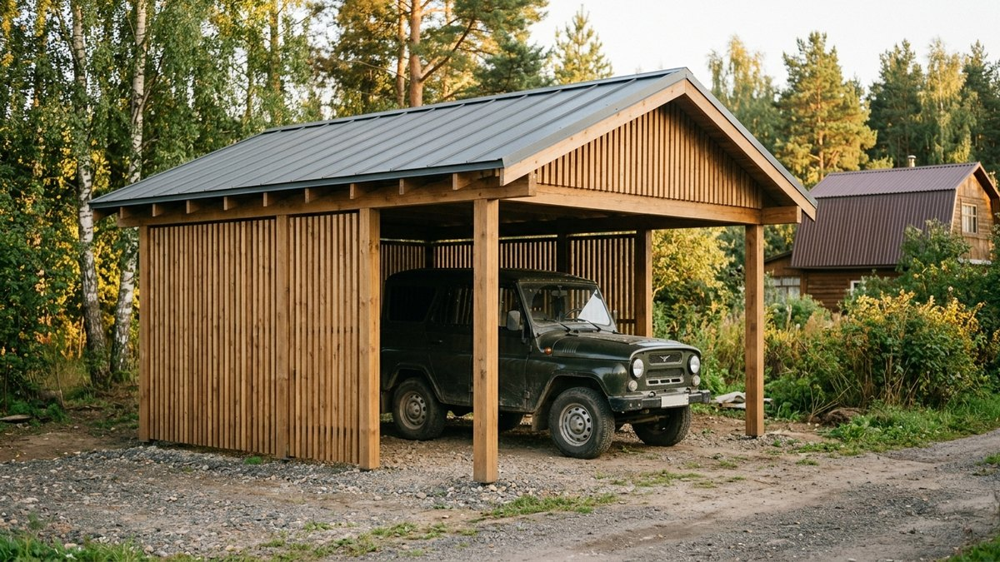
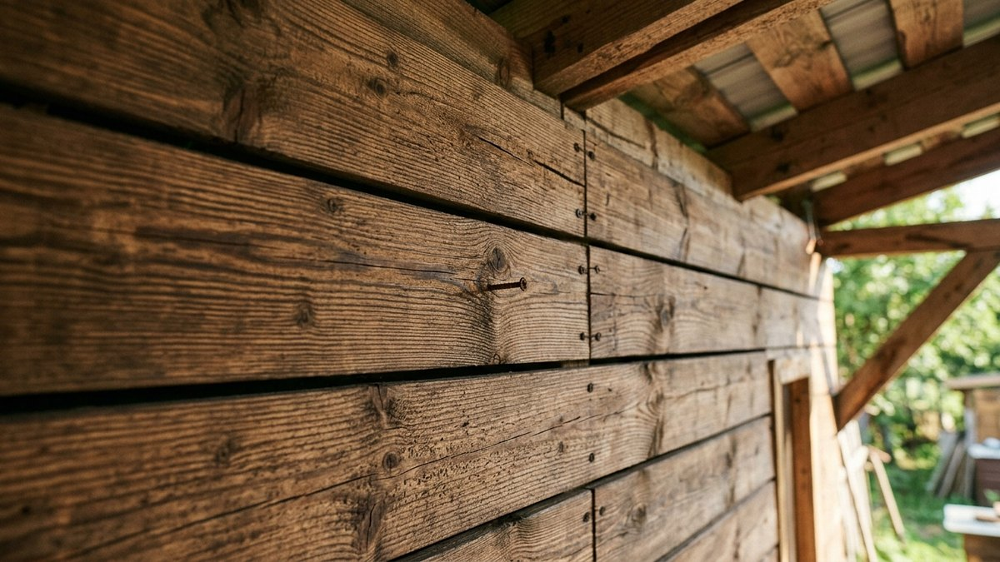
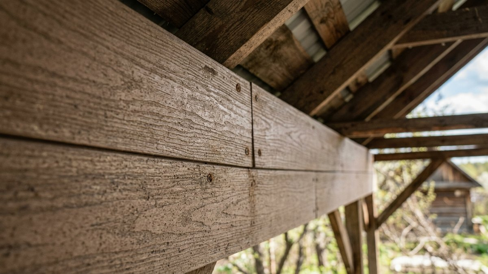
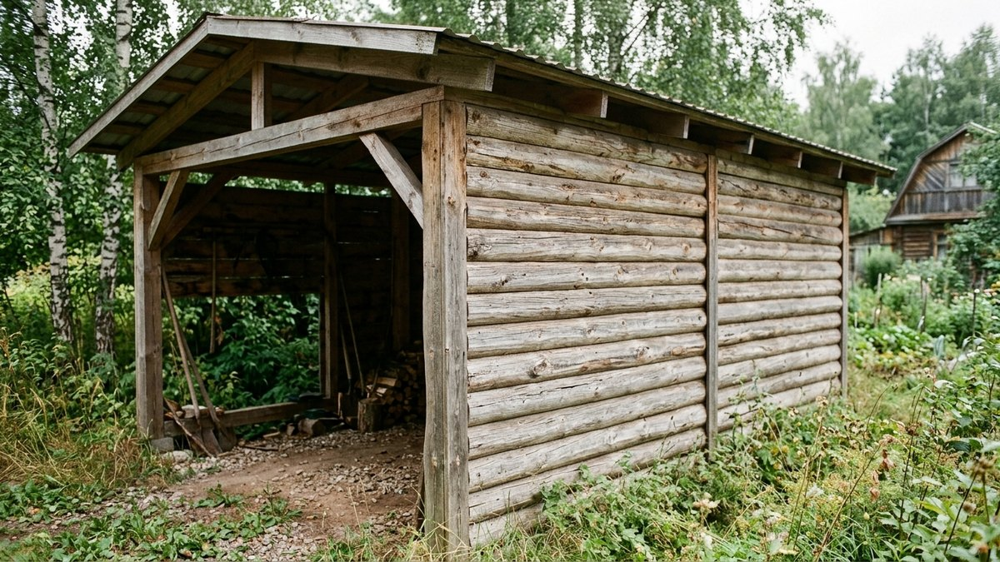
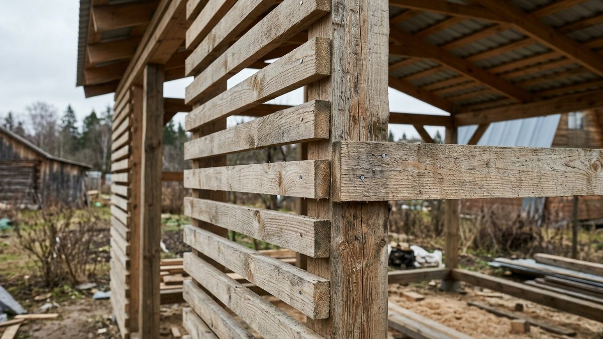
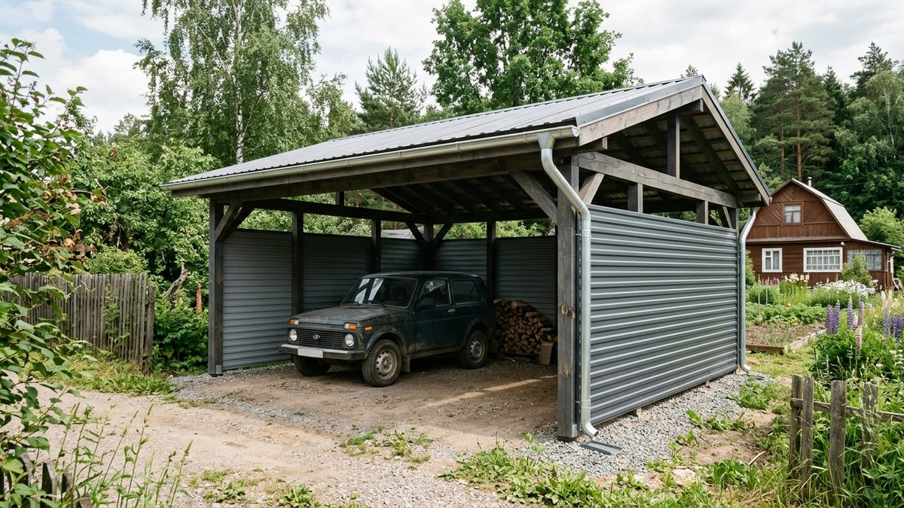

# Чем обшить навес изнутри: материалы для открытых конструкций

Навес — это не веранда: у него нет стен, которые отсекают дождь и ветер, и
чаще всего нет утепления, а значит, и точки росы, от которой защищает
пароизоляция. Материал обшивки навеса работает в открытую — с обеих сторон
на него давит один и тот же уличный воздух, зимой это −30, летом +40, а
косой дождь и снеговой намёт достают отделку так же, как кровлю. Разбираем,
какие материалы держат такой режим, а какие рассчитаны на защищённые от
осадков помещения и на навесе быстро придут в негодность.

Если навес строится не для парковки, а над мангалом или барбекю, к выбору
материалов и конструкции добавляются требования пожарной безопасности —
негорючее основание, отступы от построек, огнезащитная обработка каркаса.
Разбор конструкции и монтажа именно для такого навеса — в статье
[навес для мангала своими руками](https://mir-doma.pro/naves-dlya-mangala-svoimi-rukami/).

## Почему обшивка навеса — это не то же самое, что обшивка веранды

У веранды есть периметр стен, который защищает внутреннюю отделку от прямого
контакта с осадками и ветром — даже на холодной веранде разница между
уличной и внутренней стороной ощутима. Материалы для такой обшивки подробно
разобраны в статье [чем обшить веранду изнутри](https://mir-doma.pro/chem-obshit-verandu-vnutri/):
там работают вагонка, МДФ, гипсокартон — материалы, которые боятся прямой
воды и рассчитаны на защищённое от осадков пространство.

Навес — открытая конструкция: крыша есть, стен нет или есть частично.
Отделка получает косой дождь, ветровую нагрузку на парусность подшивки и
циклы промерзания-оттаивания без всякого буфера. Отсюда три требования,
которых нет у веранды:

- **Влагостойкость по всей толщине материала**, а не только защитное
  покрытие сверху — вода идёт с обеих сторон листа или доски.
- **Запас по ветровой нагрузке**: подшивка навеса парусит, крепёж должен
  держать не только вес, но и рывок при порыве — сама парусность каркаса
  сильно зависит и от формы крыши, разбор в статье [односкатный или
  двускатный навес: как выбрать](https://mir-doma.pro/odnoskatnyy-ili-dvuskatnyy-naves/).
- **Работа без пароизоляции**: греть и удерживать тепло внутри незачем,
  задача материала — не разбухать и не трескаться от перепада температур,
  а не удерживать точку росы в нужном слое пирога.

## Материалы, которые подходят для навеса

### Термообработанная доска и террасная доска (декинг)

Термодоска и декинг создавались именно для открытой эксплуатации: обработка
паром при 180–200°C меняет структуру древесины так, что она перестаёт
активно впитывать влагу и почти не разбухает. Подходит и для подшивки
потолка навеса, и для вертикальной зашивки боковин.

- Служит 25–30 лет без гниения при открытом монтаже.
- Не требует покраски, только периодическое масло для внешнего вида.
- Дороже обычной вагонки в 2–3 раза.

### Профнастил и металлическая кассета

Оцинкованный профнастил с полимерным покрытием (полиэстер, пурал, PVDF) —
самый ходовой вариант обшивки открытых хозяйственных навесов и козырьков:
не боится воды в принципе, легко режется под конструкцию произвольной формы.
Порядок монтажа обрешётки и крепления профнастила подробно разобран в
статье [крыша из профнастила своими руками](https://mir-doma.pro/krysha-iz-profnastila-svoimi-rukami/) —
для стеновой обшивки навеса действуют те же правила нахлёста и крепления
саморезами с резиновой шайбой.

- Полимерное покрытие держит 15–20 лет без коррозии при целостном слое.
- Царапина до металла — точка ржавчины, поэтому резать нужно ножницами по
  металлу, а не «болгаркой» с абразивным диском.
- Шумит под дождём и градом сильнее дерева и композита.

### ДПК — древесно-полимерный композит

Композитная доска (смесь древесной муки и полимера) не гниёт, не разбухает
и не выцветает так быстро, как дерево, при этом выглядит как дерево. Хорошо
работает на подшивке потолка навеса и на вертикальных экранах, где важен
внешний вид.

- Не требует ежегодной обработки антисептиком.
- При сильном морозе становится более хрупким — крепёж без перетяжки, с
  зазором на температурное расширение (2–3 мм на погонный метр).
- Дороже профнастила, но дешевле термодоски.

### Блок-хаус и имитация бруса с классом влагостойкости для фасада

Обычная вагонка для навеса не годится, а вот блок-хаус фасадного класса
(не путать с внутренней отделкой) с многослойной пропиткой антисептиком и
УФ-фильтром держит открытую эксплуатацию. Дерево при этом остаётся деревом:
нужна пропитка раз в 3–4 года, иначе покрытие теряет защитные свойства
раньше, чем истирается визуально.

## Что нельзя использовать на открытом навесе

- **МДФ, ламинированный гипсокартон, обычная фанера и ОСБ** — впитывают
  влагу торцами и по плоскости, разбухают и расслаиваются за один сезон под
  открытыми осадками. Это интерьерные и верандные материалы, для навеса они
  не подходят в принципе, не только «если протечёт».
- **ПВХ-панели без специальной морозостойкой рецептуры** — на морозе ниже
  −15…−20°C становятся хрупкими и трескаются от ветровой нагрузки; обычный
  интерьерный ПВХ для веранды навесу не подходит.
- **Вагонка без пропитки фасадного класса** — сереет, растрескивается и
  впитывает воду по всей толщине за 1–2 сезона под прямыми осадками.

## Сравнение материалов для обшивки навеса

| Материал | Влагостойкость | Ветровая нагрузка | Срок службы | Цена |
|---|---|---|---|---|
| Термодоска / декинг | Высокая | Хорошо держит при обрешётке с шагом 40 см | 25–30 лет | Высокая |
| Профнастил / кассета | Максимальная | Отлично, но парусит на больших пролётах | 15–20 лет | Средняя |
| ДПК (композит) | Высокая | Хорошо, с зазором на расширение | 20–25 лет | Средне-высокая |
| Блок-хаус фасадный | Средняя (нужна пропитка) | Хорошо | 10–15 лет без обновления пропитки | Средняя |

## Как крепить обшивку навеса: порядок работ

1. **Обрешётка** — брус или металлопрофиль с шагом, который рассчитан под
   конкретный материал (40 см для декинга, 60–80 см для профнастила).
   Обрешётку крепят к стойкам и стропильной системе; если стропила и опоры
   уже требуют ремонта, сначала смотрите [ремонт крыши на даче](https://mir-doma.pro/remont-kryshi-na-dache/) —
   зашивать обрешётку по гнилым стропилам смысла нет.
2. **Гидроизоляционный зазор**, а не пароизоляционный слой: между обшивкой и
   обрешёткой оставляют вентиляционный зазор 2–3 см, чтобы влага, попавшая
   с боков, уходила, а не задерживалась у древесины.
3. **Крепёж** — только нержавеющий или оцинкованный: на открытом воздухе
   обычный чёрный саморез ржавеет за один сезон и оставляет потёки на
   отделке.
4. **Отвод воды с обшивки** — по нижнему краю навеса нужен капельник или
   готовая система водостока, иначе вода со ската будет стекать прямо по
   обшивке и разрушать её на 2–3 года быстрее расчётного срока; порядок
   монтажа — в статье [водосток своими руками](https://mir-doma.pro/vodostok-svoimi-rukami/).
5. **Финишная обработка** (для дерева и блок-хауса) — пропитка с УФ-фильтром
   наносится до монтажа, по всем срезам и торцам, а не только по лицевой
   стороне.

## Частые ошибки

- **Ставят материалы для веранды.** МДФ, ламинированный гипсокартон и обычную
  вагонку без фасадной пропитки берут «потому что дешевле» — и переделывают
  обшивку через сезон, когда материал разбухает от прямых осадков.
- **Экономят на крепеже.** Обычный крепёж без антикоррозийного покрытия
  ржавеет и портит вид всей обшивки потёками задолго до того, как выйдет
  срок службы самого материала.
- **Не оставляют зазор на расширение.** Композит и металл двигаются от
  перепада температур; жёсткая обвязка без зазора коробит обшивку уже за
  первую зиму.
- **Забывают про водоотвод.** Без капельника или водостока вода со ската
  стекает прямо по обшивке и ускоряет её разрушение в разы.

## Частые вопросы

**Чем обшить навес для машины, чтобы не боялся дождя?**
Лучший вариант — профнастил с полимерным покрытием или ДПК: оба материала
не впитывают влагу и не разбухают при прямом контакте с осадками, в отличие
от дерева без фасадной пропитки.

**Можно ли обшить навес обычной вагонкой?**
Только вагонкой фасадного класса с многослойной пропиткой антисептиком и
УФ-фильтром, обновляемой раз в 3–4 года. Обычная интерьерная вагонка на
открытом навесе растрескается за 1–2 сезона.

**Нужна ли пароизоляция под обшивку навеса?**
Нет — пароизоляция нужна там, где есть утеплённый контур и точка росы
внутри пирога. У открытого навеса такого контура нет, обе стороны обшивки
контактируют с уличным воздухом.

**Какой материал выдержит открытый навес зимой при −30?**
Термообработанная доска, ДПК и металл с полимерным покрытием держат такой
перепад без потери свойств. Обычный ПВХ и необработанное дерево на таком
морозе теряют прочность и трескаются под ветровой нагрузкой.

**Чем лучше обшить навес: профнастилом или деревом?**
Профнастил дешевле и совсем не боится воды, но шумнее и менее декоративен.
Термодоска или блок-хаус фасадного класса дороже, зато выглядят как жилая
постройка — выбор зависит от бюджета и от того, видно ли навес от дома.

**Как часто нужно обновлять обшивку навеса?**
Металл и ДПК не требуют обслуживания весь срок службы. Дерево — раз в
3–4 года пропитка с УФ-фильтром, иначе защитный слой перестаёт работать
раньше, чем истирается визуально.
