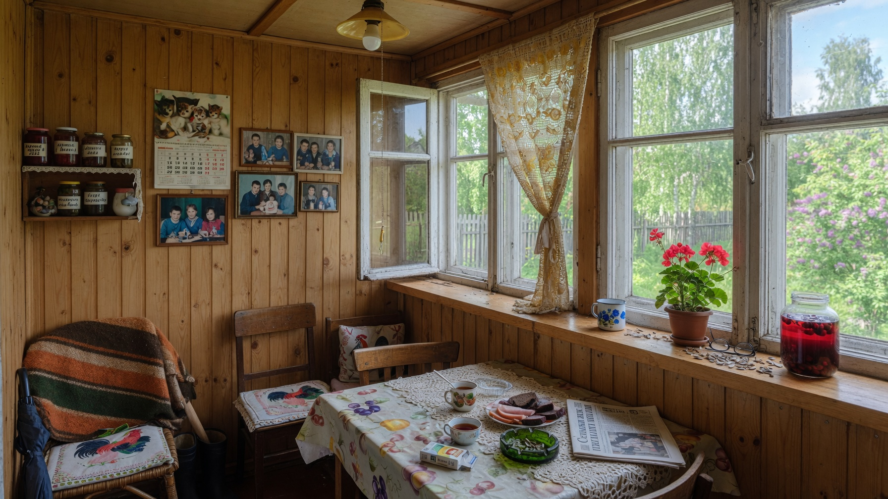
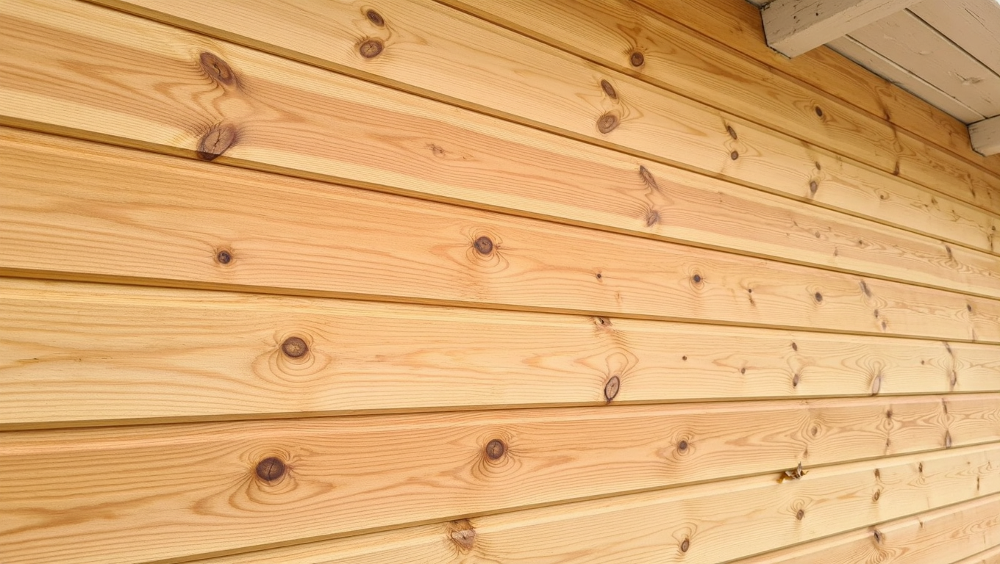
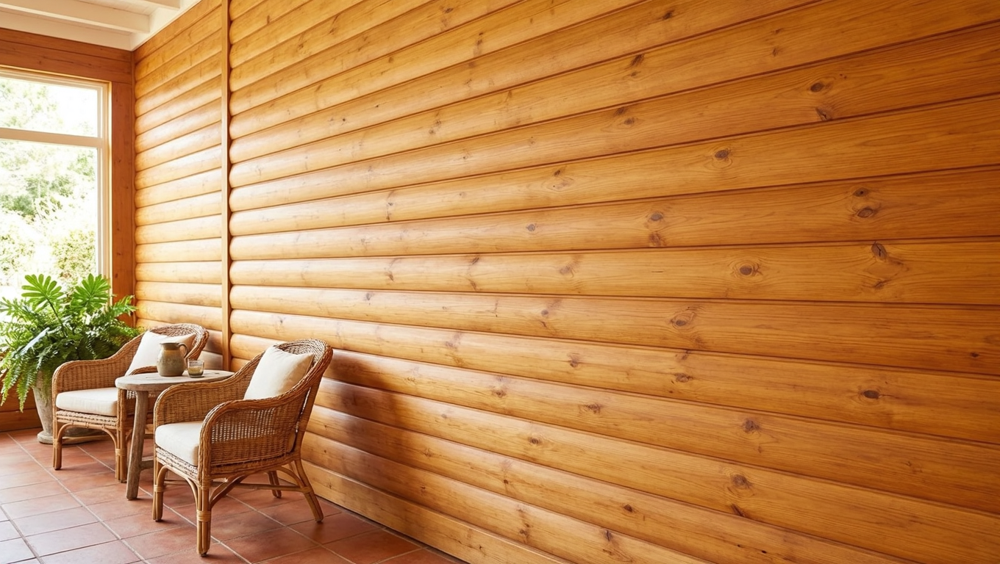
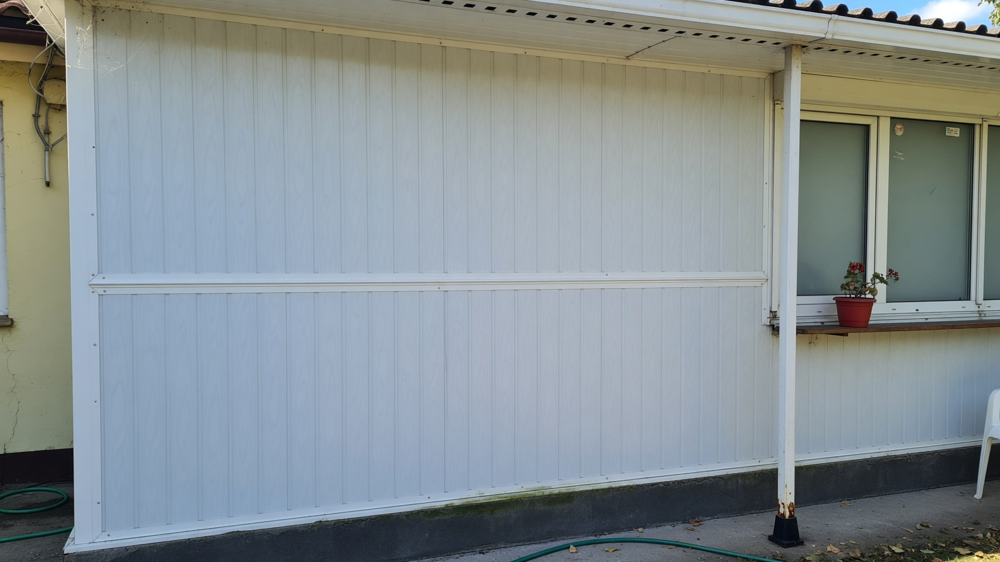
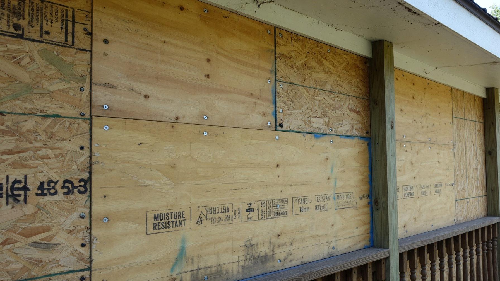
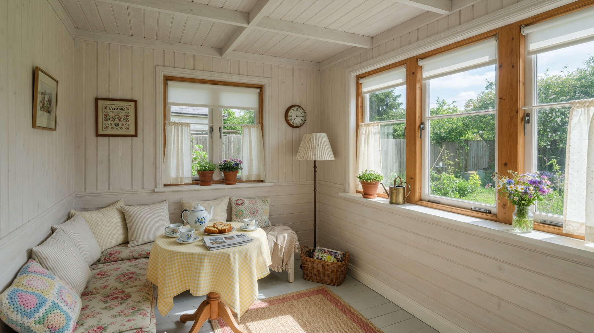

Обшивка стен — то, что превращает голый каркас веранды в уютное помещение. Материалов для этого десяток, и цена ошибки высокая: то, что годами служит на тёплой веранде, на холодной вздуется за одну зиму. Разберём, чем обшить веранду внутри: сравним вагонку, блок-хаус, ПВХ и МДФ-панели, фанеру и гипсокартон и определим, что выбрать под вашу веранду — отапливаемую или нет.

## 🌡️ Главный вопрос: тёплая веранда или холодная

Прежде чем выбирать материал, ответьте на один вопрос — будет ли веранда отапливаться. От этого зависит всё:

- **Тёплая (отапливаемая) веранда** — условия как в комнате, подходят почти любые материалы, включая МДФ-панели и гипсокартон.
- **Холодная (неотапливаемая) веранда** — зимой минус, перепады температур и конденсат. Здесь выживают только влагостойкие и не боящиеся мороза материалы, а обычный гипсокартон, МДФ и ламинат отпадают.

Если веранда неотапливаемая, выбор материалов и все нюансы подробно разобраны в отдельной статье про [отделку холодной веранды внутри](https://mir-doma.pro/otdelka-holodnoy-verandy/) — там же про пароизоляцию, утепление и что нельзя использовать. Ниже — обзор материалов в целом.

## 🪵 Деревянная вагонка

Классика для веранды и самый популярный выбор:

- **Плюсы:** натуральное дерево, тёплый вид, хорошо держит форму, ремонтопригодна, подходит и для тёплой, и для холодной веранды.
- **Минусы:** требует защиты (антисептик, лак или краска), дороже пластика.
- Крепится на обрешётку, между ламелями работает замок «шип-паз». Для холодной веранды — только с защитным покрытием.

Универсальный вариант, который смотрится дорого и служит десятилетиями. Как работать с этим материалом, подробно в статье про [отделку стен вагонкой](https://mir-doma.pro/otdelka-sten-vagonkoy/).

## 🏡 Блок-хаус и имитация бруса

Разновидности той же деревянной обшивки, но с фактурой:

- **Блок-хаус** имитирует оцилиндрованное бревно (округлый профиль), **имитация бруса** — ровную стену из бруса.
- Плюсы и уход те же, что у вагонки: натуральное дерево, нужна защита.
- Смотрится основательно, особенно в деревенском и скандинавском стиле.
- Толще обычной вагонки, поэтому чуть «съедает» пространство — на маленькой веранде это учитывают.

## 🧩 ПВХ-панели (пластик)

Самый бюджетный и практичный вариант:

- **Плюсы:** дёшево, влагостойко, легко мыть, простой монтаж, не боятся сырости — подходят и для холодной веранды.
- **Минусы:** выглядят проще дерева, могут трескаться от удара, на морозе становятся хрупкими (берут морозостойкие).
- Идеальны для дачной веранды, где важны цена и неприхотливость.

## 🟫 МДФ-панели

Красивые, но капризные:

- **Плюсы:** богатый выбор фактур (под дерево, камень), ровная поверхность, простой монтаж.
- **Минусы:** **боятся влаги и мороза** — разбухают. Годятся **только для тёплой, отапливаемой веранды**.
- На холодной веранде МДФ использовать нельзя — это частая и дорогая ошибка.

## 🪚 Фанера и ОСБ

Практичный вариант «под покраску» или как основа:

- **Плюсы:** прочные, быстро закрывают большие площади, дёшево. Влагостойкая фанера (ФСФ) переносит и холодную веранду.
- **Минусы:** нужна финишная отделка (покраска, лак), стыки требуют обработки; обычная фанера и ОСБ боятся сырости.
- Хороший бюджетный вариант, особенно под покраску в современном стиле.

## 🧱 Гипсокартон

Только для тёплой веранды:

- **Плюсы:** идеально ровная поверхность под любую финишную отделку (краска, обои, штукатурка).
- **Минусы:** **боится влаги**, даже влагостойкий ГКЛ на неотапливаемой веранде разбухает и крошится.
- Подходит **исключительно для отапливаемой** веранды с стабильной температурой.

## ⚖️ Сравнение: что выбрать

| Материал | Тёплая | Холодная | Цена | Вид |
|---|---|---|---|---|
| Вагонка | ✅ | ✅ | Средняя | Натуральное дерево |
| Блок-хаус | ✅ | ✅ | Выше средней | Дерево, фактура |
| ПВХ-панели | ✅ | ✅ | Низкая | Простой |
| МДФ-панели | ✅ | ❌ | Средняя | Богатый выбор |
| Фанера/ОСБ | ✅ | ✅ (влагостойкая) | Низкая | Под покраску |
| Гипсокартон | ✅ | ❌ | Низкая | Под любую отделку |

**Короткий вывод:**

- **для тёплой веранды** — что угодно: вагонка и блок-хаус для уюта, гипсокартон и МДФ для гладких стен;
- **для холодной веранды** — вагонка, блок-хаус, ПВХ-панели или влагостойкая фанера;
- **бюджетно и неприхотливо** — ПВХ-панели;
- **красиво и надолго** — деревянная вагонка или блок-хаус.

## 🔨 Общие правила монтажа

Независимо от материала:

- обшивку крепят **на обрешётку**, а не прямо на стену — так образуется вентиляционный зазор, и стена «дышит»;
- обрешётку выставляют по уровню, иначе обшивка пойдёт волной;
- деревянные материалы до монтажа обрабатывают антисептиком;
- на холодной веранде под обшивкой оставляют вентзазор и при необходимости укладывают пароизоляцию;
- начинают от угла, контролируя вертикаль первого элемента — от него зависит вся плоскость.

## ❌ Частые ошибки

- **МДФ или гипсокартон на холодной веранде** — разбухают за первую же зиму.
- **Крепление прямо на стену без обрешётки** — нет вентзазора, копится конденсат.
- **Дерево без защитной обработки** — темнеет и гниёт от сырости.
- **Неморозостойкий пластик на холодной веранде** — трескается на морозе.
- **Кривая обрешётка** — обшивка идёт волной, видны все огрехи.

## ❓ Частые вопросы

**Чем лучше обшить веранду внутри?**
Для тёплой веранды подойдёт любой материал — от вагонки до гипсокартона. Для холодной выбирают влагостойкие и морозостойкие: деревянную вагонку, блок-хаус, ПВХ-панели или влагостойкую фанеру.

**Чем обшить холодную (неотапливаемую) веранду?**
Вагонкой, блок-хаусом, морозостойкими ПВХ-панелями или влагостойкой фанерой ФСФ. МДФ-панели, обычный гипсокартон и ламинат для холодной веранды не годятся — разбухают от влаги и мороза.

**Можно ли обшить веранду гипсокартоном?**
Только тёплую, отапливаемую. На холодной веранде гипсокартон, даже влагостойкий, разбухает и крошится от сырости и перепадов температур.

**Что дешевле всего для обшивки веранды?**
Самый бюджетный вариант — ПВХ-панели: дёшево, влагостойко и просто в монтаже. Из деревянного бюджетна фанера под покраску.

**Нужна ли обрешётка под обшивку?**
Да, обшивку крепят на обрешётку — она создаёт вентиляционный зазор и позволяет выровнять плоскость стены. Крепление прямо на стену приводит к конденсату и волнам.

**Чем обшить веранду, чтобы было красиво и недорого?**
Оптимальный баланс — деревянная вагонка эконом-класса или имитация бруса: натуральный тёплый вид за разумные деньги. Совсем бюджетно — ПВХ-панели под дерево.

---

Выбор обшивки для веранды упирается в один вопрос — будет ли она отапливаться. Для тёплой веранды подойдёт что угодно, для холодной — только влагостойкие вагонка, блок-хаус, ПВХ или влагостойкая фанера. А все тонкости неотапливаемого помещения — утепление, пароизоляция, что нельзя использовать — разобраны в статье про [отделку холодной веранды внутри](https://mir-doma.pro/otdelka-holodnoy-verandy/). За идеями по стилю и цвету загляните в статью про [дизайн веранды на даче](https://mir-doma.pro/dizayn-verandy-na-dache/).
