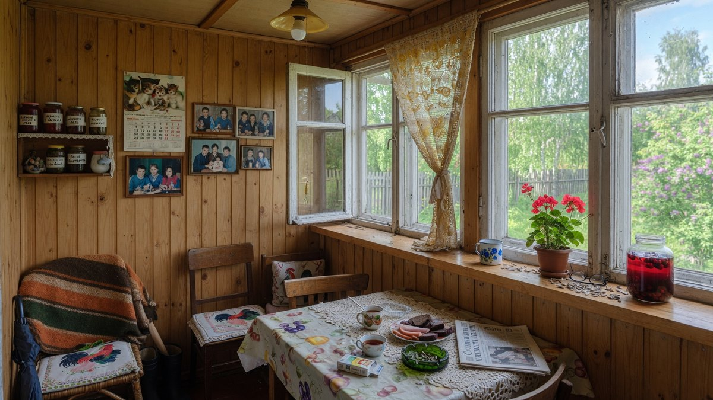
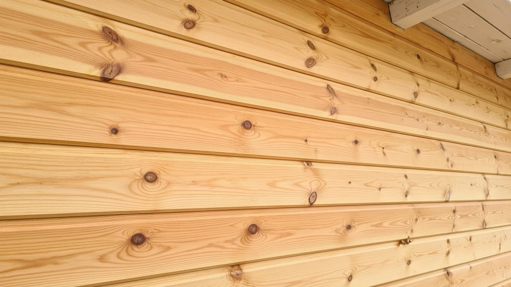
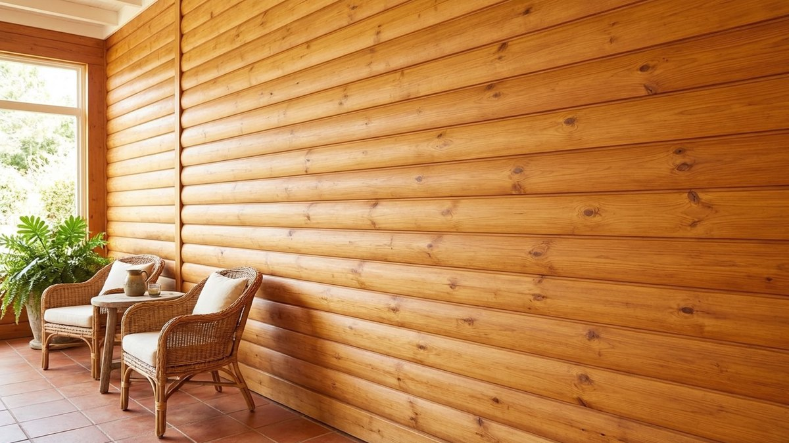
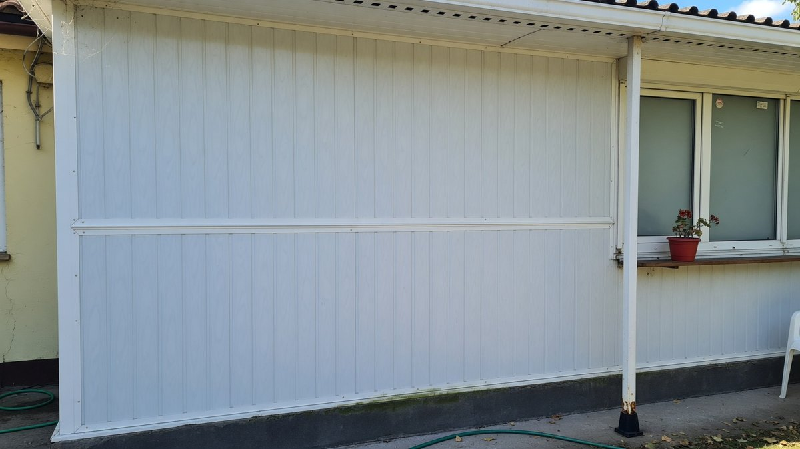
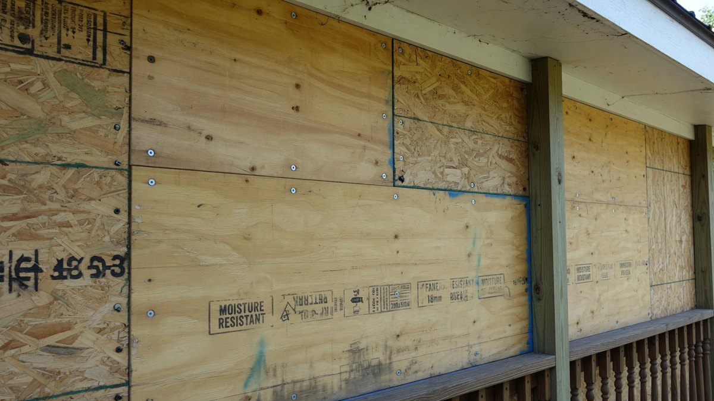
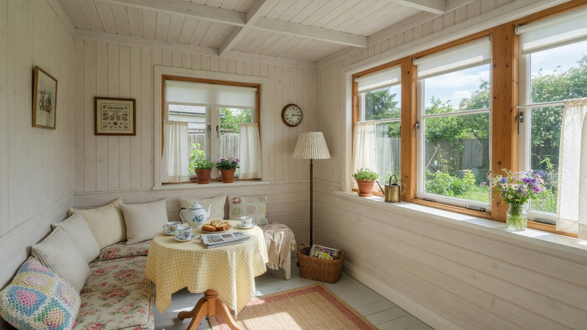
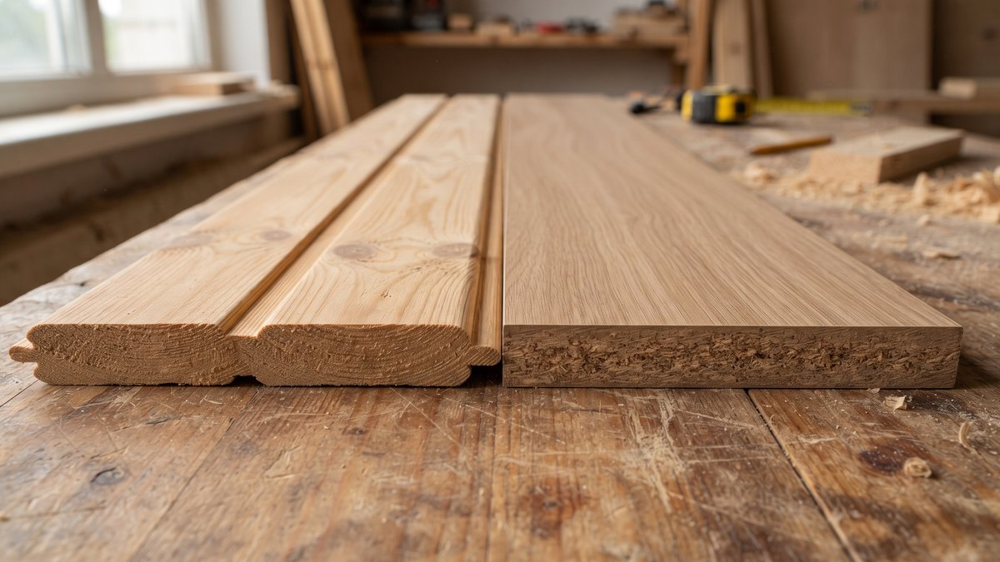
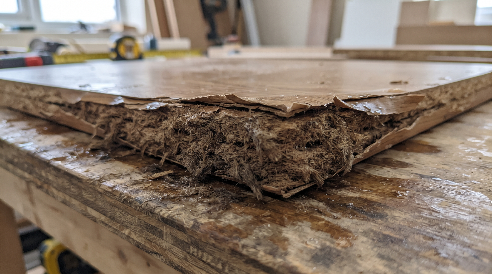
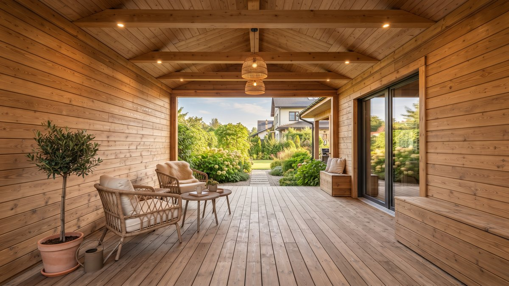

Обшивка стен — самая заметная часть отделки веранды: именно она задаёт вид помещения и определяет, сколько оно проживёт без ремонта. Материалов около десятка, и различаются они прежде всего ценой, влагостойкостью и сложностью монтажа. Разберём, чем обшить стены веранды изнутри: сравним вагонку, блок-хаус, ПВХ и МДФ-панели, фанеру и ОСБ по всем ключевым параметрам и разберём, как крепить обшивку на обрешётку.

## 🌡️ Одно условие, от которого зависит выбор

Прежде чем смотреть на материалы, ответьте на один вопрос: **веранда отапливается или нет**.

- **Тёплая (отапливаемая)** — условия как в комнате, подходит любой материал из списка ниже, включая МДФ и гипсокартон.
- **Холодная (неотапливаемая)** — зимой минус, весной конденсат. Здесь выживают только влагостойкие и морозостойкие материалы: вагонка, блок-хаус, морозостойкий ПВХ, влагостойкая фанера.

Полный разбор отделки веранды целиком — включая потолок, пол и утепление — в статье про [внутреннюю отделку веранды](https://mir-doma.pro/vnutrennyaya-otdelka-verandy/).

Всё, что специфично именно для неотапливаемой веранды — утепление, пароизоляция, борьба с конденсатом, отделка пола и потолка, какие обои выдержат мороз, — разобрано в статье про [отделку холодной веранды внутри](https://mir-doma.pro/otdelka-holodnoy-verandy/). Здесь дальше — только про стены и материалы обшивки.

## 🪵 Деревянная вагонка

Классика для веранды и самый популярный выбор:

- **Плюсы:** натуральное дерево, тёплый вид, хорошо держит форму, ремонтопригодна, подходит и для тёплой, и для холодной веранды.
- **Минусы:** требует защиты (антисептик, лак или краска), дороже пластика.
- Крепится на обрешётку, между ламелями работает замок «шип-паз». Для холодной веранды — только с защитным покрытием.

Универсальный вариант, который смотрится дорого и служит десятилетиями. Как работать с этим материалом, подробно в статье про [отделку стен вагонкой](https://mir-doma.pro/otdelka-sten-vagonkoy/).

## 🏡 Блок-хаус и имитация бруса

Разновидности той же деревянной обшивки, но с фактурой:

- **Блок-хаус** имитирует оцилиндрованное бревно (округлый профиль), **имитация бруса** — ровную стену из бруса.
- Плюсы и уход те же, что у вагонки: натуральное дерево, нужна защита.
- Смотрится основательно, особенно в деревенском и скандинавском стиле.
- Толще обычной вагонки, поэтому чуть «съедает» пространство — на маленькой веранде это учитывают.

## 🧩 ПВХ-панели (пластик)

Самый бюджетный и практичный вариант:

- **Плюсы:** дёшево, влагостойко, легко мыть, простой монтаж, не боятся сырости — подходят и для холодной веранды.
- **Минусы:** выглядят проще дерева, могут трескаться от удара, на морозе становятся хрупкими (берут морозостойкие).
- Идеальны для дачной веранды, где важны цена и неприхотливость.

## 🟫 МДФ-панели

Красивые, но капризные:

- **Плюсы:** богатый выбор фактур (под дерево, камень), ровная поверхность, простой монтаж.
- **Минусы:** **боятся влаги и мороза** — разбухают. Годятся **только для тёплой, отапливаемой веранды**.
- На холодной веранде МДФ использовать нельзя — это частая и дорогая ошибка.

## 🪚 Фанера и ОСБ

Практичный вариант «под покраску» или как основа:

- **Плюсы:** прочные, быстро закрывают большие площади, дёшево. Влагостойкая фанера (ФСФ) переносит и холодную веранду.
- **Минусы:** нужна финишная отделка (покраска, лак), стыки требуют обработки; обычная фанера и ОСБ боятся сырости.
- Хороший бюджетный вариант, особенно под покраску в современном стиле.

## 🧱 Гипсокартон

Только для тёплой веранды:

- **Плюсы:** идеально ровная поверхность под любую финишную отделку (краска, обои, штукатурка).
- **Минусы:** **боится влаги**, даже влагостойкий ГКЛ на неотапливаемой веранде разбухает и крошится.
- Подходит **исключительно для отапливаемой** веранды с стабильной температурой.

## ⚖️ Сравнение: что выбрать

| Материал | Тёплая | Холодная | Цена | Вид |
|---|---|---|---|---|
| Вагонка | ✅ | ✅ | Средняя | Натуральное дерево |
| Блок-хаус | ✅ | ✅ | Выше средней | Дерево, фактура |
| ПВХ-панели | ✅ | ✅ | Низкая | Простой |
| МДФ-панели | ✅ | ❌ | Средняя | Богатый выбор |
| Фанера/ОСБ | ✅ | ✅ (влагостойкая) | Низкая | Под покраску |
| Гипсокартон | ✅ | ❌ | Низкая | Под любую отделку |

**Короткий вывод:**

- **для тёплой веранды** — что угодно: вагонка и блок-хаус для уюта, гипсокартон и МДФ для гладких стен;
- **для холодной веранды** — вагонка, блок-хаус, ПВХ-панели или влагостойкая фанера;
- **бюджетно и неприхотливо** — ПВХ-панели;
- **красиво и надолго** — деревянная вагонка или блок-хаус.

## 📐 Сколько материала нужно: как посчитать

Расчёт простой, и он избавляет от двух проблем — недостачи в разгар работы и лишних денег на остатки.

1. **Посчитайте площадь стен:** длину каждой стены умножьте на высоту и сложите.
2. **Вычтите проёмы** — окна и двери (на веранде их обычно много, и это заметная экономия).
3. **Добавьте запас 10–15%** на подрезку. Для диагональной укладки — 20%.

**Обрешётка:** брусок обычно ставят с шагом 40–60 см, поэтому её метраж считают отдельно: длина стены разделить на шаг, умножить на высоту.

**Крепёж:** вагонку и блок-хаус крепят на кляймеры (примерно 15–20 штук на м²), ПВХ-панели — на кляймеры или саморезы, фанеру и ОСБ — на саморезы по периметру и по промежуточным лагам.

Практический совет: **берите материал одной партией**. У дерева и ПВХ оттенок между партиями отличается, и разница будет видна на стене.

## ⚔️ Вагонка или МДФ: что лучше на веранде

Прямое сравнение двух материалов, между которыми чаще всего выбирают.

| Критерий | Деревянная вагонка | МДФ-панели |
|---|---|---|
| Холодная веранда | ✅ Подходит | ❌ **Не подходит** |
| Тёплая веранда | ✅ Подходит | ✅ Подходит |
| Влагостойкость | Средняя, с покрытием высокая | **Низкая — разбухает** |
| Морозостойкость | Высокая | Низкая |
| Цена | Средняя | Средняя |
| Внешний вид | Натуральное дерево | Богатый выбор фактур |
| Ремонтопригодность | Ламель меняется отдельно | Панель меняется отдельно |
| Уход | Обновлять покрытие раз в 2–3 года | Не требует |
| Срок службы на веранде | Десятилетия | 1–3 сезона на холодной |

**Вывод простой:** если веранда **отапливается** — выбирайте по вкусу и бюджету, оба материала работают, и МДФ даже удобнее (ровная поверхность, готовая фактура, не нужно красить). Если веранда **холодная** — вагонка без вариантов, МДФ там не живёт.

## 🚫 Можно ли использовать МДФ на холодной веранде

Короткий ответ: **нельзя**, и это не перестраховка.

МДФ — это древесноволокнистая плита средней плотности: измельчённая древесина, спрессованная со связующим. По сути спрессованные волокна, которые ведут себя как губка.

**Что с ней происходит в неотапливаемом помещении:**

- **впитывает влагу из воздуха** — на веранде влажность скачет, конденсат оседает на стенах и за обшивкой;
- **разбухает по краям и в местах реза** — торцы панелей набухают первыми, появляются волны и вздутия;
- **расслаивается** при циклах замерзания и оттаивания: вода внутри плиты превращается в лёд и рвёт структуру;
- **декоративная плёнка отходит** от основы — сначала на стыках, потом полотнами;
- **деформируется необратимо** — выпрямить разбухшую панель невозможно, только менять.

**Реальный срок службы МДФ на холодной веранде — один-три сезона**, причём вид она теряет уже после первой зимы.

**Что если очень хочется такую фактуру:** возьмите **влагостойкие ПВХ-панели под дерево** — внешне похоже, а к влаге и морозу пластик равнодушен. Или **имитацию бруса** из натурального дерева, если нужен именно деревянный вид.

**То же касается террасы.** Открытая или полуоткрытая терраса — условия ещё жёстче, чем на закрытой холодной веранде: там и прямая влага, и полный уличный температурный режим. МДФ на террасе не проживёт и сезона.

## 🧱 Можно ли обшить неотапливаемое помещение влагостойким гипсокартоном

Тоже частый вопрос, и ответ такой же: **влагостойкий гипсокартон (ГКЛВ) не спасает в неотапливаемом помещении.**

Приставка «влагостойкий» означает, что лист выдерживает **повышенную влажность в отапливаемом помещении** — ванной, кухне, санузле. Это защита от пара и брызг, а не от промерзания.

**Что происходит на холодной веранде:**

- гипсовый сердечник **гигроскопичен** — набирает влагу из воздуха, несмотря на пропитку картона;
- при замерзании влага **разрушает структуру гипса** изнутри, лист начинает крошиться;
- **картонные слои отходят** от сердечника;
- лист **провисает и деформируется** между профилями;
- финишная отделка поверх (шпаклёвка, краска, обои) идёт трещинами.

**Чем заменить, если нужна ровная поверхность под покраску:** влагостойкой фанерой ФСФ или ОСП-3. Они переносят перепады, держат нагрузку и точно так же красятся или шпаклюются.

**Гипсокартон на веранде уместен только тогда**, когда она полноценно отапливается и зимой там устойчивый плюс.

## 🏡 А если это терраса, а не веранда

Терминология путается, но разница принципиальна для выбора материала.

- **Веранда** — закрытая пристройка с остеклением, примыкающая к дому. Даже неотапливаемая, она защищена от прямого дождя, снега и ветра.
- **Терраса** — открытая или полуоткрытая площадка, часто без сплошного остекления. Условия там фактически уличные: прямая влага, ультрафиолет, полный температурный диапазон.

**Что это значит для отделки:**

| Материал | Холодная веранда | Терраса (открытая/полуоткрытая) |
|---|---|---|
| Деревянная вагонка | ✅ с защитным покрытием | ⚠️ только лиственница/термодерево + регулярное обновление |
| Блок-хаус, имитация бруса | ✅ с покрытием | ⚠️ с усиленной защитой |
| ПВХ-панели | ✅ морозостойкие | ✅ морозостойкие, но выцветают на солнце |
| Влагостойкая фанера, ОСП-3 | ✅ | ⚠️ только под навесом, с покраской торцов |
| МДФ-панели | ❌ | ❌ |
| Гипсокартон | ❌ | ❌ |
| Планкен, термодревесина | ✅ | ✅ **оптимально для террасы** |

**Главное правило для террасы:** материал должен переносить **прямое воздействие воды и ультрафиолета**. Поэтому там, где на веранде хватает обычной сосновой вагонки с лаком, на террасе берут лиственницу, термодерево, планкен или композит — и обновляют защитное покрытие чаще.

**Коротко: чем обшить террасу внутри неотапливаемую** — лиственницей, термодревесиной, планкеном, морозостойкими ПВХ-панелями или композитом. Каким материалом отделать террасу внутри точно не стоит: МДФ, гипсокартоном, ламинатом и обычной ДСП — они не переносят уличных условий.

Ещё один шаг в сторону улицы — навес без стен вообще, например для машины.
Там условия жёстче, чем на террасе: нет даже частичного укрытия по бокам,
обшивка получает косой дождь и ветровую нагрузку в полный рост. Материалы,
которые для этого подходят, и почему в их число не входят даже
террасные ПВХ-панели без морозостойкой рецептуры, разобраны в статье
[чем обшить навес изнутри](https://mir-doma.pro/chem-obshit-naves-iznutri/).

## 🔨 Как крепить обшивку: порядок работ

1. **Подготовить стену** — убрать старую отделку, проверить на сырость и плесень, при необходимости обработать антисептиком.
2. **Смонтировать обрешётку** из бруска по уровню, с шагом 40–60 см. Именно она создаёт **вентиляционный зазор**, без которого за обшивкой копится конденсат.
3. **Обработать деревянные элементы** антисептиком до монтажа — потом до изнанки уже не добраться.
4. **Начать от угла**, тщательно выставив первый элемент по вертикали: от него зависит вся плоскость. Перекос первой доски уводит всю стену.
5. **Крепить на кляймеры** (для вагонки и блок-хауса) — скрытое крепление, не видно шляпок и не расколется замок.
6. **Оставить зазор 1–2 см** у пола и потолка на температурное расширение — дерево «дышит», и без зазора обшивку выгнет.
7. **Закрыть стыки** плинтусом, уголками и наличниками.
8. **Нанести финишное покрытие** — антисептик, масло, лак или краску (для неотапливаемого помещения — составы для наружных работ).

Дереву дают отлежаться в помещении несколько дней до монтажа, чтобы оно приняло влажность веранды — иначе после обшивки появятся щели.

Если вместо обшивки рассматриваете обои, учтите: на неотапливаемой веранде подойдут не все типы — разбор в статье про [обои на холодной веранде](https://mir-doma.pro/oboi-na-holodnoy-verande/).

## ❌ Частые ошибки

- **МДФ или гипсокартон на холодной веранде** — разбухают за первую же зиму.
- **Крепление прямо на стену без обрешётки** — нет вентзазора, копится конденсат.
- **Дерево без защитной обработки** — темнеет и гниёт от сырости.
- **Неморозостойкий пластик на холодной веранде** — трескается на морозе.
- **Кривая обрешётка** — обшивка идёт волной, видны все огрехи.

## ❓ Частые вопросы

**Можно ли монтировать МДФ панели на холодную веранду?**
Нет. МДФ впитывает влагу, разбухает по краям и в местах реза, а при замерзании расслаивается — декоративная плёнка отходит от основы. Реальный срок службы на неотапливаемой веранде — один-три сезона, причём вид теряется уже после первой зимы. Возьмите морозостойкие ПВХ-панели под дерево или деревянную вагонку.

**Можно ли МДФ использовать на холодной террасе?**
Тем более нет: на террасе условия жёстче, чем на закрытой веранде — прямая влага, ультрафиолет и полный уличный температурный режим. МДФ там не проживёт и сезона. Для террасы подходят лиственница, термодревесина, планкен, композит или морозостойкий ПВХ.

**Вагонка или МДФ на веранде — что лучше?**
На холодной веранде — однозначно вагонка: она переносит мороз и сырость, а МДФ разбухает. На тёплой отапливаемой веранде работают оба варианта, и МДФ там даже удобнее — ровная готовая поверхность, не нужно красить и обновлять покрытие.

**Можно ли отделать влагостойким гипсокартоном неотапливаемое помещение?**
Нет. Пометка «влагостойкий» означает стойкость к повышенной влажности в отапливаемом помещении, а не к промерзанию. Гипсовый сердечник набирает влагу, при замерзании разрушается изнутри, лист крошится и провисает. Для ровной поверхности под покраску используйте влагостойкую фанеру ФСФ или ОСП-3.

**Чем лучше обшить веранду внутри?**
Для тёплой веранды подойдёт любой материал — от вагонки до гипсокартона. Для холодной выбирают влагостойкие и морозостойкие: деревянную вагонку, блок-хаус, ПВХ-панели или влагостойкую фанеру.

**Чем обшить холодную (неотапливаемую) веранду?**
Вагонкой, блок-хаусом, морозостойкими ПВХ-панелями или влагостойкой фанерой ФСФ. МДФ-панели, обычный гипсокартон и ламинат для холодной веранды не годятся — разбухают от влаги и мороза.

**Можно ли обшить веранду гипсокартоном?**
Только тёплую, отапливаемую. На холодной веранде гипсокартон, даже влагостойкий, разбухает и крошится от сырости и перепадов температур.

**Что дешевле всего для обшивки веранды?**
Самый бюджетный вариант — ПВХ-панели: дёшево, влагостойко и просто в монтаже. Из деревянного бюджетна фанера под покраску.

**Нужна ли обрешётка под обшивку?**
Да, обшивку крепят на обрешётку — она создаёт вентиляционный зазор и позволяет выровнять плоскость стены. Крепление прямо на стену приводит к конденсату и волнам.

**Чем обшить веранду, чтобы было красиво и недорого?**
Оптимальный баланс — деревянная вагонка эконом-класса или имитация бруса: натуральный тёплый вид за разумные деньги. Совсем бюджетно — ПВХ-панели под дерево.

---

Выбор обшивки сводится к трём параметрам: цена, влагостойкость и то, как материал переносит мороз. Для тёплой веранды годится что угодно, для холодной — вагонка, блок-хаус, морозостойкий ПВХ или влагостойкая фанера. Посчитайте площадь с запасом 10–15%, не забудьте про обрешётку с вентзазором — и обшивка прослужит десятилетия.

**Куда идти дальше:**

- Если веранда неотапливаемая, стенами дело не ограничится: чем застелить пол, что делать с потолком, какие обои выдержат мороз и как победить конденсат — в статье про [отделку холодной веранды внутри](https://mir-doma.pro/otdelka-holodnoy-verandy/).
- Решили обшивать вагонкой? Технология монтажа на кляймеры со всеми тонкостями разобрана отдельно: [отделка стен вагонкой](https://mir-doma.pro/otdelka-sten-vagonkoy/).
- Стены готовы — осталось наполнить веранду: за идеями по стилю, цвету и мебели загляните в [дизайн веранды на даче](https://mir-doma.pro/dizayn-verandy-na-dache/).
