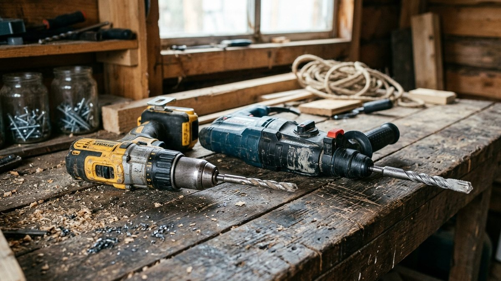
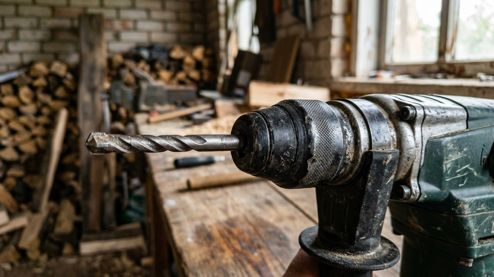
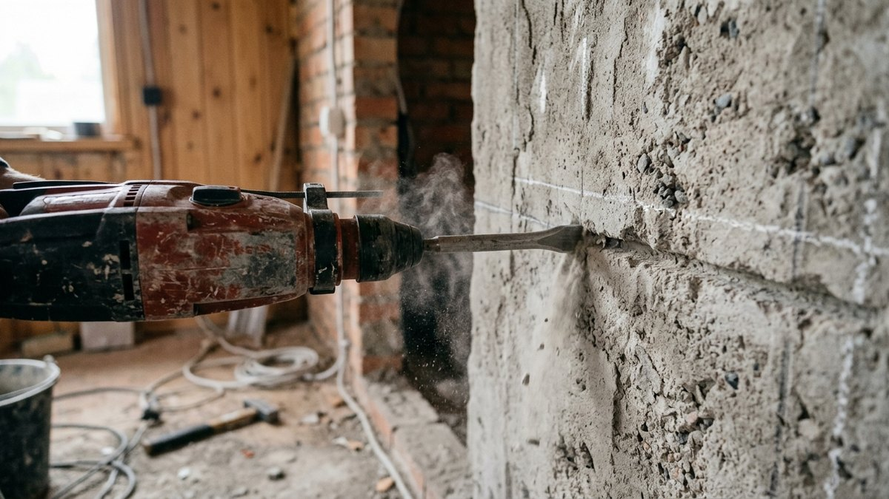
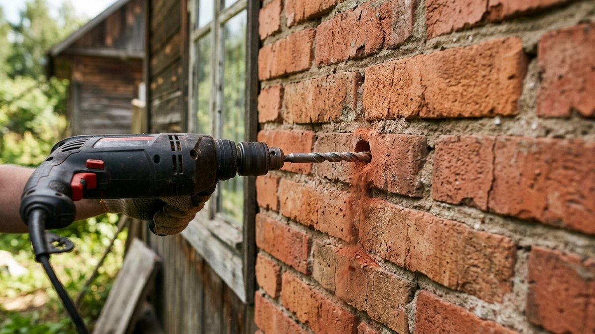
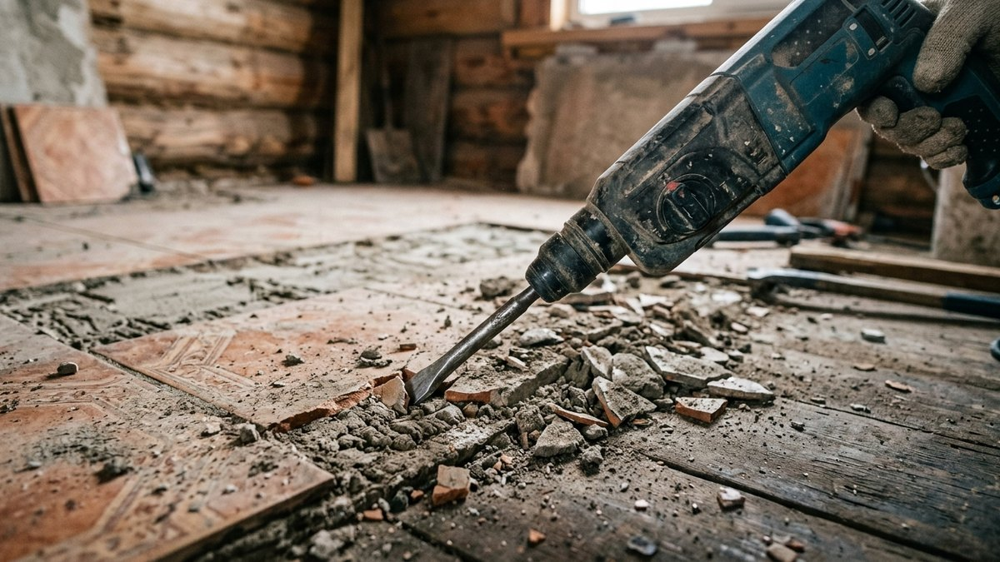
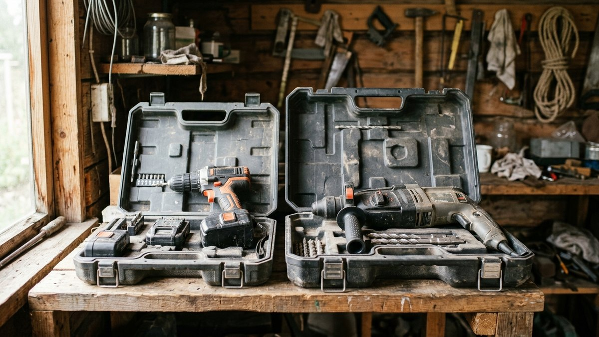

# Чем отличается ударная дрель от перфоратора: что выбрать для дачи

В магазине оба инструмента выглядят похоже, продавец говорит «оба сверлят и
бетон берут», а цена отличается в разы. На деле это разные по принципу
инструменты, и путаница между ними — частая причина, почему купленная
ударная дрель «не тянет» бетонную стену, а переплата за перфоратор для
редкой картины на кирпичной перегородке оказывается бессмысленной. Разберём,
чем они отличаются механически и как это сказывается на реальных задачах.

## Разный принцип удара — вот в чём главное отличие

**Ударная дрель** создаёт удар механически: два зубчатых диска (храповый
механизм) трутся друг о друга при вращении патрона, создавая частую, но
слабую осевую вибрацию. Удар напрямую связан с вращением и пропадает, если
снизить обороты.

**Перфоратор** создаёт удар отдельным электропневматическим механизмом —
поршень нагнетает воздух в закрытой камере, и этот удар передаётся бойку
независимо от вращения. Именно поэтому перфоратор умеет работать в режиме
чистого долбления вообще без вращения — ударной дрели такой режим
недоступен принципиально.

## Сравнение: цифры и на что смотреть

| Параметр | Ударная дрель | Перфоратор |
|---|---|---|
| Механизм удара | Храповый диск (механический) | Электропневматический поршень |
| Энергия удара | До 3–5 Дж (слабая) | От 1,5 до 15+ Дж в зависимости от класса |
| Долбление без вращения | Нет | Да (режим только удар) |
| Патрон | Обычный быстрозажимной | SDS-plus или SDS-max |
| Материалы | Кирпич, пеноблок, лёгкий бетон точечно | Бетон, в том числе армированный, штробление |
| Вес | 1,5–2,5 кг | 2,5–5+ кг |
| Цена | Ниже | Выше |

Энергия удара в джоулях — главный ориентир: у ударной дрели она в разы
меньше, поэтому даже с победитовым сверлом дрель быстро перегревается и
теряет скорость на плотном бетоне, где перфоратор работает без напряжения.

## Когда хватит ударной дрели

- Редкое сверление отверстий под дюбели в кирпиче или пеноблоке — повесить
  полку, зеркало, карниз.
- Задачи, где дрель по совместительству нужна и как обычный шуруповёрт —
  ударный режим включается только при необходимости.
- Бюджет ограничен, а бетонных стен на объекте нет вообще.

## Когда нужен перфоратор

- Регулярное сверление в бетоне, тем более армированном.
- Штробление стен под проводку или трубы.
- Долбление — снятие плитки, выемка ниш, демонтаж старой стяжки.
- Объём работ большой: перфоратор не перегревается там, где ударная дрель
  выходит из строя за один рабочий день.

Если на даче кроме сверления регулярно возникают задачи по дереву — спил
веток, дров, — тот же принцип выбора «под объём и регулярность работ», что
и для перфоратора, работает и при выборе [бензопилы для
дачи](https://mir-doma.pro/kak-vybrat-benzopilu/): инструмент выбирают не по
абстрактной мощности, а по тому, как часто и в каком объёме он будет
использоваться.

## Частые заблуждения

- **«Ударная дрель тоже сверлит бетон, зачем платить больше».** Сверлит, но
  только с победитовым сверлом и на небольшую глубину; армированный бетон
  или большой объём отверстий такой дрели не по силам — перегрев и быстрый
  износ гарантированы.
- **«Перфоратором нельзя закручивать шурупы».** Можно, если отключить
  ударный режим и снизить обороты, но для регулярной работы с шурупами
  всё равно удобнее отдельный шуруповёрт — перфоратор для этого тяжёлый и
  менее точный по моменту затяжки.
- **«Чем больше джоулей, тем лучше в любом случае».** Для точечного
  сверления в кирпиче мощный перфоратор избыточен, тяжелее в руке и
  разбивает отверстие крупнее нужного — под конкретную задачу берут
  инструмент по энергии удара, а не с запасом «на всякий случай».
- **«Раз есть генератор, можно работать перфоратором где угодно».** Мощные
  перфораторы дают высокий пусковой ток при запуске под нагрузкой — если
  электричество на участке только от генератора, его мощность стоит
  проверить заранее, как и для [любого другого
  электроинструмента](https://mir-doma.pro/kakoy-generator-nuzhen-dlya-dachi/).

## Частые вопросы

### Можно ли обойтись одним перфоратором и не покупать дрель

Можно, если объём обычного сверления и закручивания шурупов небольшой —
перфоратор способен на оба режима. Но он тяжелее и менее удобен для мелких
повседневных задач вроде сборки мебели, поэтому многие держат отдельно
лёгкий шуруповёрт для этого.

### В чём разница между SDS-plus и обычным патроном

SDS-plus — патрон с фиксацией сверла по пазам, без зажимного ключа: сверло
вставляется и фиксируется само, при этом может свободно двигаться вдоль
оси, что и нужно для передачи удара от поршня. Обычный быстрозажимной
патрон удерживает сверло жёстко и для такой передачи удара не подходит —
поэтому перфораторы и ударные дрели используют разные типы оснастки.

### Почему перфоратор дороже ударной дрели того же бренда

Электропневматический ударный механизм сложнее и дороже в производстве,
чем механический храповый узел ударной дрели. Плюс перфоратор рассчитан на
больший ресурс работы под нагрузкой, что тоже сказывается на цене
комплектующих.

### Нужен ли перфоратор, если на даче стены только из дерева и пеноблока

Если бетонных конструкций и армированных стен на участке нет, а пеноблок и
дерево сверлятся легко даже без ударного режима, обычной ударной дрели
хватит с запасом — переплата за перфоратор в этом случае не окупится.

## Заключение

Разница между ударной дрелью и перфоратором — не маркетинг, а механика:
храповый удар против электропневматического, с прямыми последствиями для
того, какой бетон и в каком объёме инструмент реально осилит. Для редких
отверстий в кирпиче или пеноблоке достаточно ударной дрели, для регулярной
работы с бетоном и штробления нужен перфоратор. Если формируете набор
инструментов для дачи с нуля, весь остальной список — в статье [какие
инструменты нужны на даче](https://mir-doma.pro/instrumenty-dlya-dachi/).
