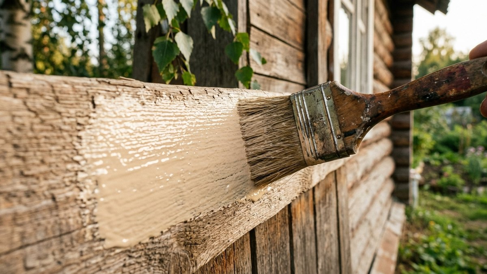
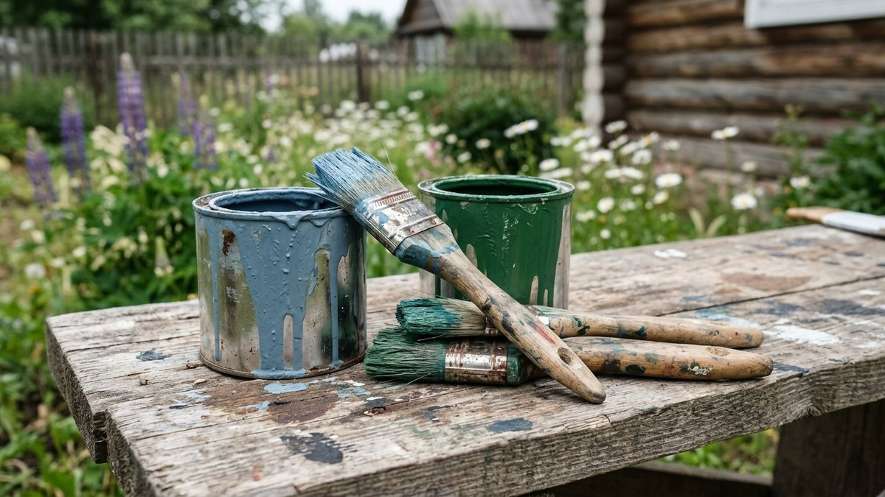
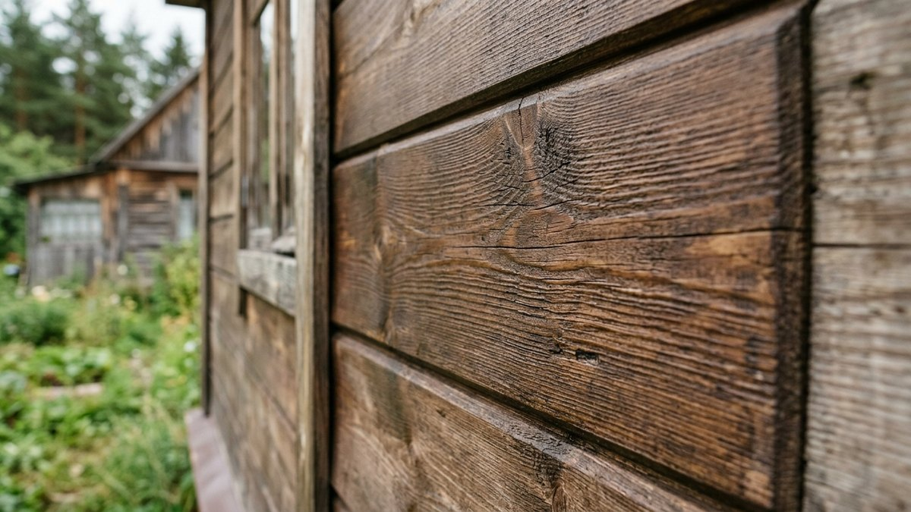
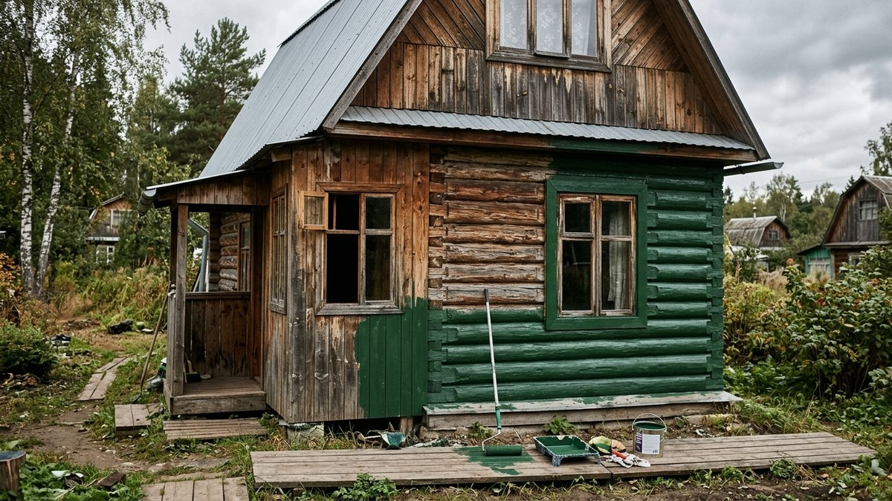
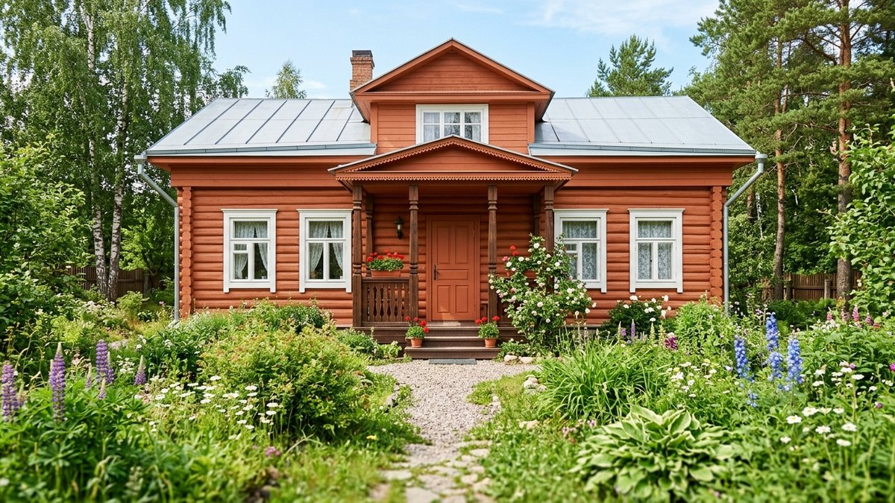
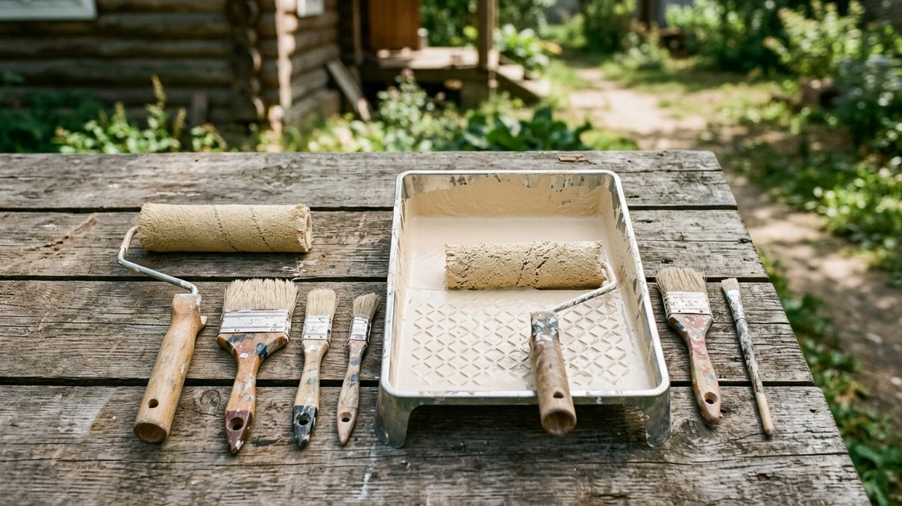

Деревянный фасад — [вагонку, блок-хаус, имитацию бруса](https://mir-doma.pro/chem-obshit-dom-snaruzhi/), обычную доску — нужно периодически красить или пропитывать заново, иначе древесина темнеет и трескается от УФ и влаги. Разберём 5 видов составов для наружных работ по дереву: чем они отличаются, сколько расходуются и при какой погоде их вообще можно наносить. В конце — калькулятор количества краски под площадь фасада.

## Акриловая краска

Водно-дисперсионная краска на акриловой основе — самый популярный вариант для наружных работ по дереву.

**Плюсы:** не имеет резкого запаха, сохнет за 1–2 часа между слоями, эластична — не трескается при усадке дерева, легко моется от инструмента водой.
**Минусы:** держится хуже алкидной на сильно продуваемых и мокрых фасадах, требует минимальной температуры не ниже +5°C.

Расход — 120–150 г/м² на слой, обычно 2 слоя. Срок службы покрытия — 5–7 лет.

## Алкидная эмаль

Краска на основе алкидных смол с органическим растворителем.

**Плюсы:** глубже проникает в структуру дерева, лучше защищает от влаги, прочнее к истиранию и механическим воздействиям.
**Минусы:** резкий запах при нанесении и высыхании (сохнет 12–24 часа), со временем желтеет и трескается на солнечной стороне, инструмент моется только растворителем.

Расход — 100–130 г/м² на слой, 2 слоя. Срок службы — 4–6 лет.

## Масло для дерева

Масляная пропитка (льняное, тунговое или их смеси с добавками) впитывается в древесину, а не образует плёнку на поверхности.

**Плюсы:** сохраняет фактуру и «живой» вид дерева, не трескается и не шелушится — просто истирается со временем, обновлять можно без снятия старого слоя.
**Минусы:** защита слабее плёночных покрытий, обновлять нужно чаще — раз в 2–3 года, дороже за литр, чем акрил.

Расход — 80–100 мл/м² на слой, обычно 1–2 слоя. Срок службы — 2–3 года до обновления.

## Лазурь (пропитка-лазурь)

Полупрозрачный состав, который подчёркивает текстуру дерева, но при этом даёт цвет — от бесцветного тонирования до имитации ценных пород.

**Плюсы:** дерево «дышит», не скрывает фактуру, проще в уходе, чем плёночная краска — не нужно счищать перед обновлением.
**Минусы:** защита от влаги слабее полноценной краски, на солнечной стороне выцветает быстрее, чем на затенённой.

Расход — 100–150 мл/м² на слой, 2 слоя. Срок службы — 3–5 лет.

## Антисептик с тонировкой

Защитная пропитка от грибка, плесени и гниения, с добавлением пигмента для лёгкого оттенка.

**Плюсы:** главная задача — не декор, а защита древесины изнутри от биологического разрушения, обязателен на нижних венцах и в местах контакта с землёй.
**Минусы:** не даёт полноценного декоративного цвета, часто наносится как база под финишное покрытие лазурью или маслом.

Расход — 150–200 мл/м² на слой из-за высокой впитываемости, 1–2 слоя. Действует 5–8 лет для защиты, декоративный оттенок бледнеет быстрее.

## Сравнение составов

| Состав | Расход на слой | Слоёв | Срок службы | Запах при работе |
|---|---|---|---|---|
| Акриловая краска | 120–150 г/м² | 2 | 5–7 лет | нет |
| Алкидная эмаль | 100–130 г/м² | 2 | 4–6 лет | резкий |
| Масло для дерева | 80–100 мл/м² | 1–2 | 2–3 года | слабый |
| Лазурь | 100–150 мл/м² | 2 | 3–5 лет | слабый |
| Антисептик с тонировкой | 150–200 мл/м² | 1–2 | 5–8 лет (защита) | зависит от состава |

## При какой погоде красить

Наносить любой состав нужно на сухую древесину при плюсовой температуре — большинство составов держат диапазон +5…+30°C. Прямой солнцепёк тоже вреден: краска сохнет неравномерно быстро и остаются следы кисти. Оптимально — сухой день без дождя в прогнозе на ближайшие сутки, утро или вечер, чтобы поверхность не нагревалась под прямым солнцем. Свежеструганную или только что смонтированную обшивку красят не раньше чем через 2–3 недели естественной просушки на улице.

## Калькулятор: сколько нужно краски на фасад

Укажите площадь фасада, выберите состав и число слоёв — калькулятор посчитает нужный объём и, если знаете цену за литр, прикинет стоимость.

<!-- wp:html -->

<h3 class="md-pf__title">Калькулятор краски для фасада</h3>

Расход — средний по типу состава; на шершавой или сильно впитывающей древесине закладывайте на 10–15% больше.

<label class="md-pf__f">Площадь фасада, м²<input type="number" id="pfArea" value="70" min="1" max="2000" step="1"></label>
<label class="md-pf__f">Состав
<select id="pfMat">
<option value="135" selected>Акриловая краска — 135 мл/м² на слой</option>
<option value="115">Алкидная эмаль — 115 мл/м² на слой</option>
<option value="90">Масло для дерева — 90 мл/м² на слой</option>
<option value="125">Лазурь — 125 мл/м² на слой</option>
<option value="175">Антисептик с тонировкой — 175 мл/м² на слой</option>
</select></label>
<label class="md-pf__f">Число слоёв<input type="number" id="pfCoats" value="2" min="1" max="4" step="1"></label>
<label class="md-pf__f">Цена за литр, ₽ (необязательно)<input type="number" id="pfPrice" value="" min="0" max="10000" step="1" placeholder="0"></label>

Нужно краски<b id="pfLiters">0 л</b>

Стоимость<b id="pfCost">—</b>

Расчёт без запаса на впитываемость — для новой шершавой древесины прибавьте 10–15%.

<button type="button" id="pfCopy" class="md-pf__btn md-pf__btn--main">Скопировать результат</button>
<a id="pfVk" class="md-pf__btn md-pf__btn--vk" href="#" target="_blank" rel="noopener noreferrer">Поделиться ВКонтакте</a>
<a id="pfTg" class="md-pf__btn md-pf__btn--tg" href="#" target="_blank" rel="noopener noreferrer">Поделиться в Telegram</a>
<button type="button" id="pfPrint" class="md-pf__btn">Печать</button>

<!-- /wp:html -->

## Как подготовить фасад перед покраской

Старое отслаивающееся покрытие счищают шпателем или щёткой, поверхность шлифуют, пыль убирают. Трещины и щели заделывают герметиком для дерева — подробно в статье [чем заделать щели в деревянном доме](https://mir-doma.pro/chem-zadelat-shcheli-v-derevyannom-dome/). Новую, ещё не крашенную древесину сначала грунтуют антисептиком — даже если финишный слой не он, база защищает от грибка изнутри, а декоративный состав ложится ровнее. Если фасад давно не обновлялся, а не только красился, — общий план работ по обновлению старой дачи разобран в статье [как обновить старую дачу](https://mir-doma.pro/kak-obnovit-staruyu-dachu/).

## Частые ошибки

- **Красить по сырому дереву.** Влажность древесины перед покраской должна быть ниже 20% — иначе покрытие вздувается и отслаивается уже через сезон.
- **Пропустить грунтовку-антисептик.** Без базовой защиты декоративный слой не спасает от грибка и гнили изнутри — со временем это проявится тёмными пятнами под краской.
- **Красить под прямым солнцем в жару.** Состав сохнет неравномерно, остаются полосы и пузыри — лучше работать утром или вечером.
- **Экономить на количестве слоёв.** Один слой почти никогда не даёт заявленной защиты — большинство составов рассчитаны именно на два нанесения.

## Частые вопросы

### Сколько раз в год нужно красить фасад?

Не ежегодно — по сроку службы состава: масло и лазурь обновляют раз в 2–5 лет, акрил и антисептик держат дольше. Пятна износа обычно появляются сначала на солнечной и подветренной стороне — их можно подкрашивать точечно.

### Можно ли красить фасад поверх старой краски?

Да, если старое покрытие держится прочно и не отслаивается — достаточно зашкурить для адгезии. Если краска шелушится, её нужно счистить полностью, иначе новый слой сойдёт вместе со старым.

### Чем лучше красить фасад из хвойных пород?

Хвоя выделяет смолу, которая может проступать через покрытие — для неё лучше подходят лазурь или масло, которые не образуют плотной плёнки и не трескаются от смоляных карманов.

### Нужно ли красить фасад с северной стороны, где меньше солнца?

Да — там меньше страдает от УФ, но больше от влаги и мха из-за постоянной тени, поэтому защитный состав нужен не меньше, чем на солнечной стороне.

### Какая краска для фасада самая долговечная?

Антисептик с тонировкой и качественная акриловая краска держатся дольше остальных — 5–8 лет, но антисептик слабее по декоративному эффекту, это в первую очередь защита, а не цвет.

### Сколько сохнет краска для фасада между слоями?

Акриловые составы — 1–2 часа, алкидные эмали — до суток. Точное время всегда указано на банке и зависит от температуры и влажности воздуха.
