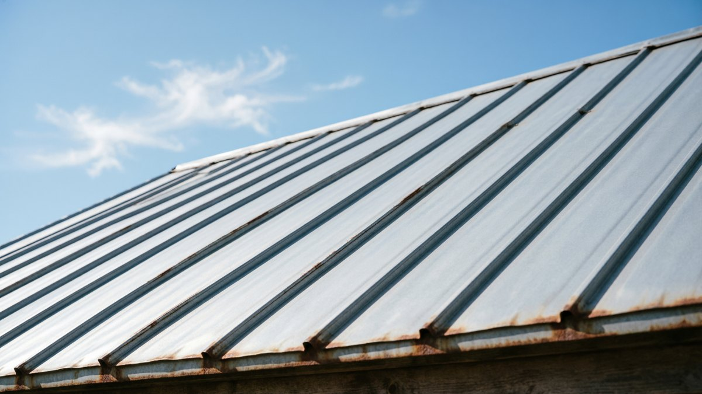
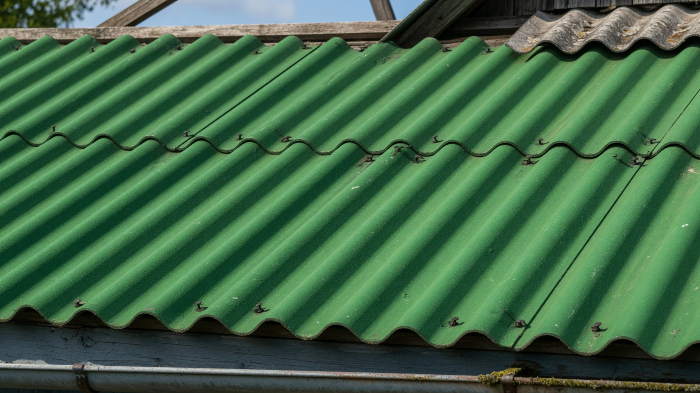
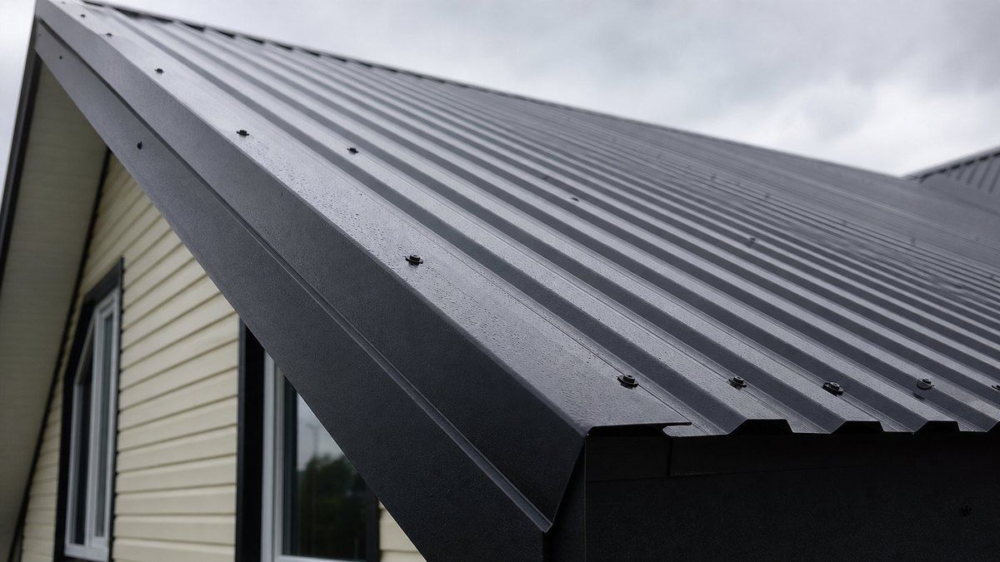
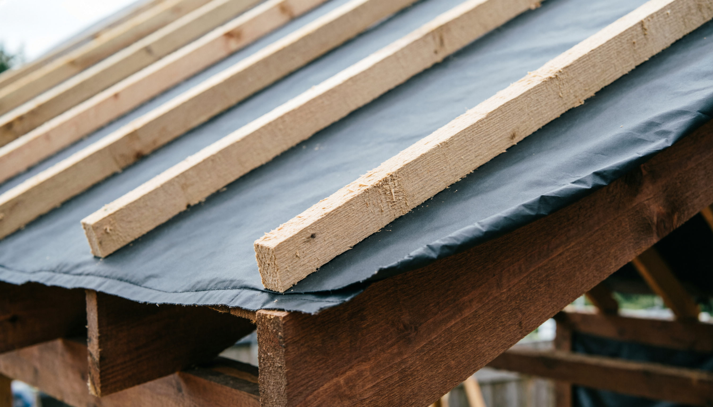
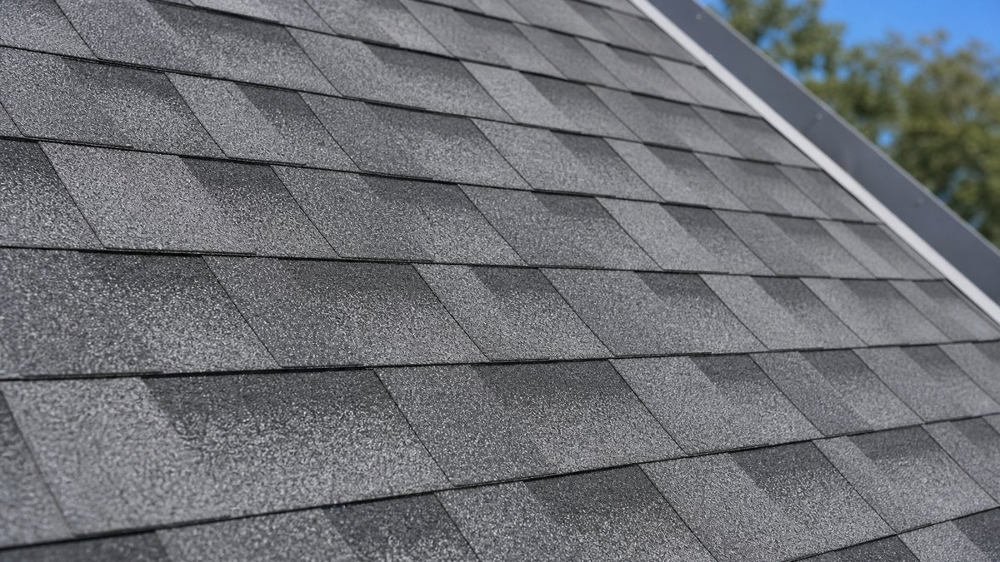
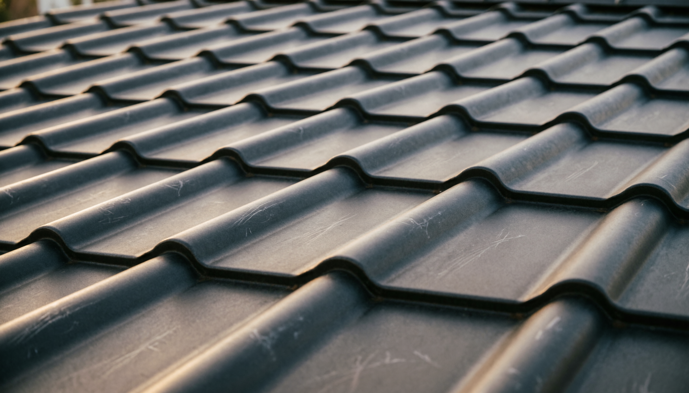
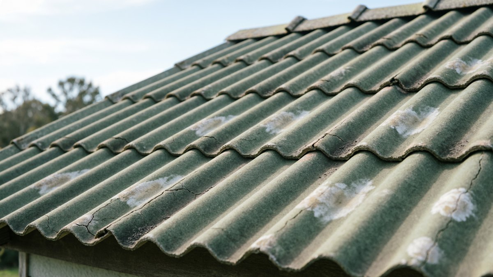

Кровлю выбирают один раз на двадцать лет, и решает здесь не картинка в каталоге, а два жёстких ограничения: **уклон вашей крыши** и **несущая способность стропил**. Пологая крыша просто не позволит уложить металлочерепицу, а старые стропила не выдержат шифер. Разберём пять материалов по семи параметрам, определим, что можно смонтировать в одиночку, и посчитаем количество прямо в статье.

## 📐 Уклон крыши: главный ограничитель

С этого начинается выбор, потому что тут не пожелания, а физика: чем меньше уклон, тем дольше вода задерживается на кровле и тем выше риск затекания под стыки.

| Материал | Минимальный уклон | Комментарий |
|---|---|---|
| **Фальцевая кровля** | от 3–7° | Единственный вариант для очень пологих крыш |
| **Ондулин** | от 5° | При уклоне до 10° нужна сплошная обрешётка |
| **Профнастил** | от 8–12° | При малом уклоне — увеличенные нахлёсты и герметизация стыков |
| **Мягкая черепица** | от 12° | Сплошное основание обязательно всегда |
| **Шифер** | от 12–15° | При меньшем уклоне затекает под нахлёсты |
| **Металлочерепица** | от 14° | **Жёсткое ограничение** — профиль не рассчитан на меньший |

**Как определить свой уклон**, если он неизвестен: измерьте высоту конька над уровнем опоры стропил (H) и половину ширины дома (L). Уклон в градусах примерно соответствует отношению H к L: если H равна половине L — это около 27°, если H составляет треть от L — около 18°, четверть — около 14°.

**Практический вывод:** если у вас пологая крыша до 12°, металлочерепица и шифер отпадают сразу, как бы они ни нравились. Не пытайтесь «уложить с запасом нахлёста» — производитель не зря ставит ограничение, и гарантия на такой монтаж не распространяется.

## ⚖️ Сравнение материалов: таблица

| Параметр | Профнастил | Металлочерепица | Ондулин | Мягкая черепица | Шифер |
|---|---|---|---|---|---|
| **Вес, кг/м²** | 4–7 | 4–6 | 3–4 | 8–12 (+ основание) | 10–14 |
| **Мин. уклон** | 8–12° | **от 14°** | от 5° | от 12° | 12–15° |
| **Шумность в дождь** | Высокая | Высокая | Низкая | Низкая | Низкая |
| **Срок службы** | 20–30 лет | 20–40 лет | 15–25 лет | 25–50 лет | 30–40 лет |
| **Монтаж в одиночку** | Сложно (парусность) | Сложно | **Реально** | Реально, но долго | Нет (тяжёлый, хрупкий) |
| **Обрешётка** | Разреженная | Разреженная, шаг под волну | Разреженная / сплошная | **Только сплошная** | Разреженная |
| **Отходы на сложной крыше** | Средние | **Высокие (до 30%)** | Низкие | Низкие | Средние |
| **Цена материала** | Низкая | Средняя | Средняя | Выше средней | Низкая |

## 🔩 Разбор по материалам

**Профнастил** — рабочая лошадка дачного строительства. Дёшево, быстро, листы можно заказать длиной во весь скат — тогда горизонтальных стыков не будет вовсе. Минусы: шумит в дождь и требует шумоизоляции, если под крышей мансарда. Для кровли берут марку с высотой профиля от 20 мм (С21 и выше) — стеновой С8 на крышу не годится. Полный разбор монтажа — в статье про [крышу из профнастила своими руками](https://mir-doma.pro/krysha-iz-profnastila-svoimi-rukami/).

**Металлочерепица** — тот же металл, но с рисунком под черепицу. Красивее профнастила, но **даёт много отходов на сложной крыше**: лист режется кратно волне, и на вальмовой кровле в обрезки уходит до трети материала. Жёсткое ограничение по уклону — от 14°.

**Ондулин** — битумные волнистые листы. Самый лёгкий, тихий и единственный, который реально монтируется в одиночку: режется ножовкой, не парусит, вес листа около 6 кг. Минусы — со временем выцветает, а в жару размягчается (ходить по нему в полдень нельзя). Хороший выбор для хозпостроек, беседок и небольших дачных домов.

**Мягкая (битумная) черепица** — гибкие гонты на сплошном основании. Тихая, не боится сложной геометрии, отходов минимум — идеальна для крыш с ендовами, эркерами и вальмами. Главный нюанс: **требует сплошного основания из ОСП или фанеры плюс подкладочный ковёр**, и это принципиально меняет смету (см. ниже).

**Шифер** — дёшев и до сих пор популярен. Тихий, негорючий, служит десятилетиями. Минусы серьёзные: тяжёлый (нагружает стропила), хрупкий при перевозке и монтаже, со временем обрастает мхом. В одиночку не поднять — нужен помощник.

## 🏗️ Нагрузка на стропила и обрешётка

Здесь важно понимать пропорцию: **снеговая нагрузка в разы превышает вес самого материала**. В средней полосе она составляет порядка 180 кг/м², на Урале и севере — до 320 кг/м² и выше. На этом фоне разница между кровлей в 4 и 12 кг/м² невелика.

**Но вес имеет значение в трёх случаях:**

- **старая крыша** с ослабленными или подгнившими стропилами — там критичен каждый килограмм;
- **замена лёгкой кровли на тяжёлую** (например, ондулина на шифер) — стропила рассчитывались под другую нагрузку;
- **большие пролёты** между опорами.

Если крыша старая, начинать нужно с ревизии стропил и обрешётки, а не с выбора покрытия — иначе новая кровля ляжет на гнилое основание. Как оценить состояние конструкций, разобрано в статье про [ремонт крыши на даче](https://mir-doma.pro/remont-kryshi-na-dache/).

**Тип обрешётки под каждый материал:**

- **Профнастил** — разреженная, шаг 30–50 см в зависимости от марки и уклона;
- **Металлочерепица** — разреженная со строгим шагом, равным шагу волны (обычно 350 мм). Ошибка в шаге означает, что саморез не попадёт в брусок;
- **Ондулин** — разреженная с шагом 45–60 см при нормальном уклоне, сплошная при малом;
- **Мягкая черепица** — **только сплошная**: ОСП-3 или влагостойкая фанера от 9 мм;
- **Шифер** — разреженная, шаг 50–80 см, брусок сечением побольше из-за веса.

**Если под крышей планируется жилая мансарда**, обрешётка — только часть пирога: понадобятся утеплитель, пароизоляция и вентзазоры. Порядок слоёв разобран в статье про [утепление крыши и мансарды](https://mir-doma.pro/uteplenie-kryshi-i-mansardy/).

**Если крыша накрывает открытый навес, а не жилое помещение**, пирог с утеплителем и пароизоляцией не нужен вовсе — но открытая обрешётка снизу всё равно требует отделки, которая выдержит уличную влажность и перепад температур. Какие материалы подходят для такой подшивки, разобрано в статье [чем обшить навес изнутри](https://mir-doma.pro/chem-obshit-naves-iznutri/).

## 👷 Что реально смонтировать в одиночку

Честный ответ по материалам:

- **Ондулин — да.** Лист весит около 6 кг, режется обычной ножовкой, не парусит. Самый реалистичный вариант для работы без помощника.
- **Мягкая черепица — да, но долго.** Гонты лёгкие и удобные, зато сначала нужно смонтировать сплошное основание, а это отдельный этап работы. Плюс монтаж требует температуры выше +5 °C: на холоде гонты не склеиваются.
- **Профнастил — сложно.** Листы длинные и лёгкие одновременно, поэтому работают как парус: при малейшем ветре лист вырывает из рук. На крыше это опасно. Нужен помощник, а при длине от 4 м — двое.
- **Металлочерепица — сложно** по тем же причинам, плюс покрытие легко поцарапать при неаккуратном подъёме.
- **Шифер — нет.** Лист весит 10–15 кг и хрупок: неудачное движение — трещина.

⚠️ **Работа на высоте.** Кровельные работы — самое травмоопасное, что бывает на даче. Не работайте на крыше в одиночку, в ветер и по мокрому покрытию, используйте страховку и устойчивые лестницы. Подробнее про безопасность на кровле — в статье про [крышу из профнастила](https://mir-doma.pro/krysha-iz-profnastila-svoimi-rukami/).

## 💰 Почему дешёвый материал даёт дорогую крышу

Цена за квадратный метр покрытия — обманчивый ориентир. Смотреть нужно на **стоимость кровельного пирога целиком**.

**Из чего складывается смета:**

1. **Кровельное покрытие** — то, что видно в прайсе.
2. **Обрешётка** — брус или доска. Под сплошное основание вместо разреженного расход в разы больше.
3. **Гидроизоляционная плёнка** — по всей площади скатов с нахлёстом.
4. **Доборные элементы** — конёк, торцевые и карнизные планки, ендовы, планки примыкания. На сложной крыше это заметная сумма.
5. **Крепёж** — кровельные саморезы с прокладками, гвозди.
6. **Отходы** — на вальмовой крыше с металлочерепицей до 30%.
7. **Работа**, если не своими руками.

**Три ловушки, на которых теряют деньги:**

- **Мягкая черепица** сама по себе стоит умеренно, но требует **сплошного основания из ОСП плюс подкладочный ковёр** — итоговая крыша выходит дороже металлической, хотя за метр материал казался сопоставимым.
- **Шифер** дёшев, но тяжёл: если стропила под него не рассчитаны, добавляется усиление конструкции.
- **Металлочерепица на сложной крыше** — низкая цена метра съедается 30% отходов.

**Практический вывод:** дешёвая кровля получается на **простой двускатной крыше с достаточным уклоном** — там профнастил или ондулин закрывают задачу минимальными средствами. Чем сложнее геометрия, тем выгоднее становится мягкая черепица, несмотря на дорогое основание.

## 🧮 Калькулятор кровельных материалов

Посчитайте площадь скатов и количество материала под свою крышу. Размеры листов типовые — перед покупкой сверьтесь с параметрами конкретного производителя.

<!-- wp:html -->

<h3 class="md-rc__title">Калькулятор кровельных материалов</h3>

Укажите размеры дома и уклон — калькулятор посчитает площадь скатов и материал.

<label class="md-rc__f">Тип крыши
<select id="rcType"><option value="1">Односкатная</option><option value="2" selected>Двускатная</option><option value="4">Вальмовая (4 ската)</option></select></label>
<label class="md-rc__f">Длина дома, м<input type="number" id="rcLen" value="8" min="2" max="40" step="0.1"></label>
<label class="md-rc__f">Ширина дома, м<input type="number" id="rcWid" value="6" min="2" max="30" step="0.1"></label>
<label class="md-rc__f">Уклон крыши, градусов<input type="number" id="rcAng" value="30" min="3" max="60" step="1"></label>
<label class="md-rc__f">Свес кровли, м<input type="number" id="rcOver" value="0.5" min="0" max="1.5" step="0.05"></label>
<label class="md-rc__f">Материал
<select id="rcMat">
<option value="prof" selected>Профнастил С21 (полезн. 1,0 м)</option>
<option value="mch">Металлочерепица (полезн. 1,1 м)</option>
<option value="ond">Ондулин (лист 2,0×0,95, полезн. 1,6 м²)</option>
<option value="soft">Мягкая черепица (упак. 3 м²)</option>
<option value="shif">Шифер 8-волновой (полезн. 1,57 м²)</option>
</select></label>

Площадь кровли<b id="rcArea">—</b>

С запасом на подрезку<b id="rcAreaR">—</b>

Длина ската<b id="rcSlope">—</b>

<h4 class="md-rc__outtitle">Что понадобится</h4><ul id="rcList" class="md-rc__list"></ul>

Размеры листов типовые. Сверьтесь с параметрами конкретного производителя: полезная ширина и длина у систем различаются.

<button type="button" id="rcCopy" class="md-rc__btn md-rc__btn--main">Скопировать список</button>
<button type="button" id="rcPrint" class="md-rc__btn">Распечатать</button>

<!-- /wp:html -->

## ❌ Частые ошибки

- **Выбрали материал, не проверив уклон** — металлочерепица на пологой крыше начнёт течь через стыки.
- **Шаг обрешётки не под материал** — саморезы не попадают в брусок, крепление ненадёжное.
- **Металлочерепица на сложной вальмовой крыше** — треть материала уходит в отходы.
- **Уложили новую кровлю на старые стропила** без ревизии — через год всё придётся вскрывать.
- **Мягкая черепица по разреженной обрешётке** — она требует только сплошного основания.
- **Считали только цену покрытия**, забыв про обрешётку, плёнку и доборку.
- **Профнастил в одиночку в ветреный день** — лист парусит, это прямая опасность.
- **Стеновой профнастил С8 на крышу** — не рассчитан на снеговую нагрузку.

## ❓ Частые вопросы

**Чем дешевле всего покрыть крышу дачи?**
На простой двускатной крыше с нормальным уклоном — профнастилом или шифером. Но считать нужно всю смету: обрешётку, гидроизоляцию, доборные элементы и отходы. Шифер дёшев, но тяжёл и может потребовать усиления стропил.

**Какой минимальный уклон крыши для металлочерепицы?**
От 14 градусов — это жёсткое ограничение производителей. На более пологой крыше вода задерживается на стыках и затекает под покрытие. Для пологих крыш подойдут ондулин (от 5°), профнастил (от 8–12°) или фальцевая кровля (от 3–7°).

**Что можно уложить на крышу в одиночку?**
Реально — ондулин: лёгкий, режется ножовкой, не парусит. Мягкую черепицу тоже можно, но сначала придётся смонтировать сплошное основание. Профнастил и металлочерепицу в одиночку укладывать опасно из-за парусности листов, а шифер слишком тяжёл и хрупок.

**Какая кровля самая тихая?**
Ондулин, мягкая черепица и шифер — они гасят звук дождя. Металлические покрытия (профнастил, металлочерепица) шумят, и под жилой мансардой к ним нужна дополнительная шумоизоляция в кровельном пироге.

**Сколько весит кровельный материал?**
Ондулин — 3–4 кг/м², профнастил и металлочерепица — 4–7 кг/м², мягкая черепица — 8–12 кг/м² плюс вес сплошного основания, шифер — 10–14 кг/м². Для сравнения: снеговая нагрузка в средней полосе около 180 кг/м², поэтому вес покрытия критичен в основном для старых крыш.

**Нужна ли сплошная обрешётка?**
Обязательно для мягкой черепицы — она укладывается только на сплошное основание из ОСП или влагостойкой фанеры. Для профнастила, металлочерепицы, ондулина и шифера достаточно разреженной обрешётки с шагом под конкретный материал.

**Почему мягкая черепица оказывается дороже, чем кажется?**
Сам материал стоит умеренно, но к нему обязательно идут сплошное основание из ОСП или фанеры и подкладочный ковёр по всей площади. В итоге крыша выходит дороже металлической, хотя цена за метр покрытия выглядела сопоставимой.

---

Выбор кровли для дачи сводится к трём вопросам по порядку: какой у крыши уклон, выдержат ли стропила и будете ли вы монтировать сами. Ответы на них отсекают лишнее быстрее любых сравнений — а из оставшихся вариантов уже можно выбирать по цене и внешнему виду. Посчитайте материал в калькуляторе выше и обязательно добавьте запас на подрезку.

**Куда идти дальше:**

- Выбрали профнастил — там есть свои тонкости с маркой листа, шагом обрешётки и последовательностью укладки: [крыша из профнастила своими руками](https://mir-doma.pro/krysha-iz-profnastila-svoimi-rukami/).
- Крыша старая и требует ремонта — начинать нужно с ревизии стропил, а не с покупки покрытия: [ремонт крыши на даче](https://mir-doma.pro/remont-kryshi-na-dache/).
- Под крышей планируется жилая мансарда — кровельный пирог собирается по другим правилам, с утеплителем и двумя вентзазорами: [утепление крыши и мансарды](https://mir-doma.pro/uteplenie-kryshi-i-mansardy/).
- И сразу после кровли стоит заняться водостоком, иначе вода пойдёт под фундамент: [водосток своими руками](https://mir-doma.pro/vodostok-svoimi-rukami/).
