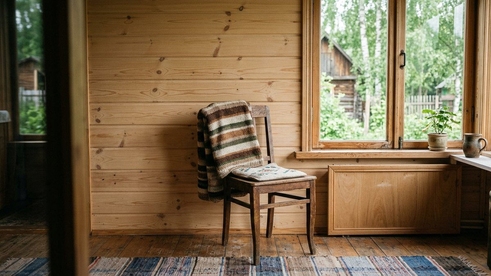
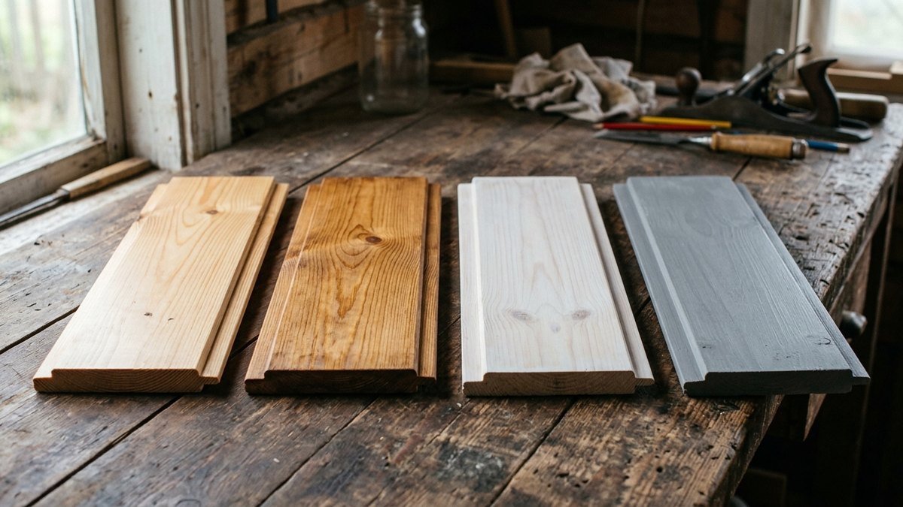
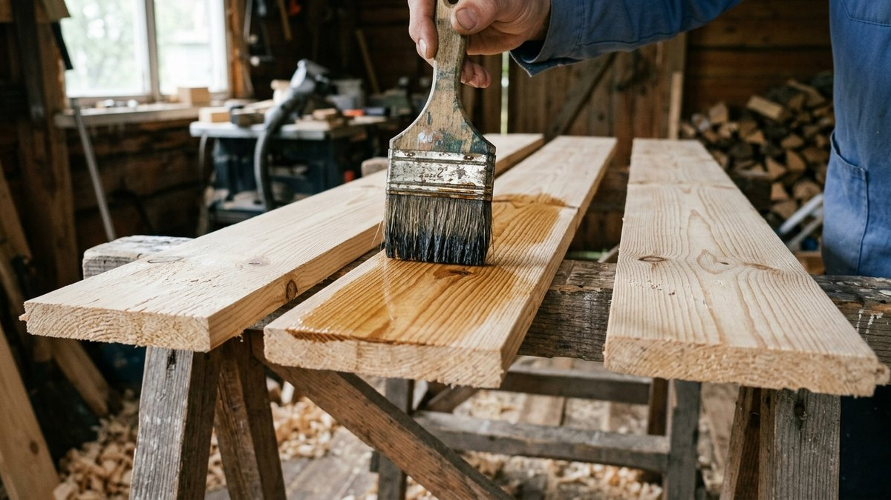
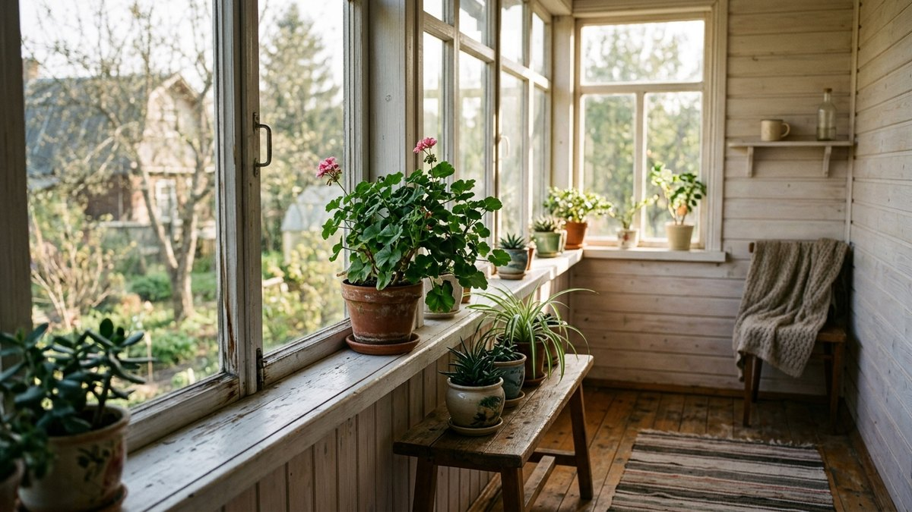
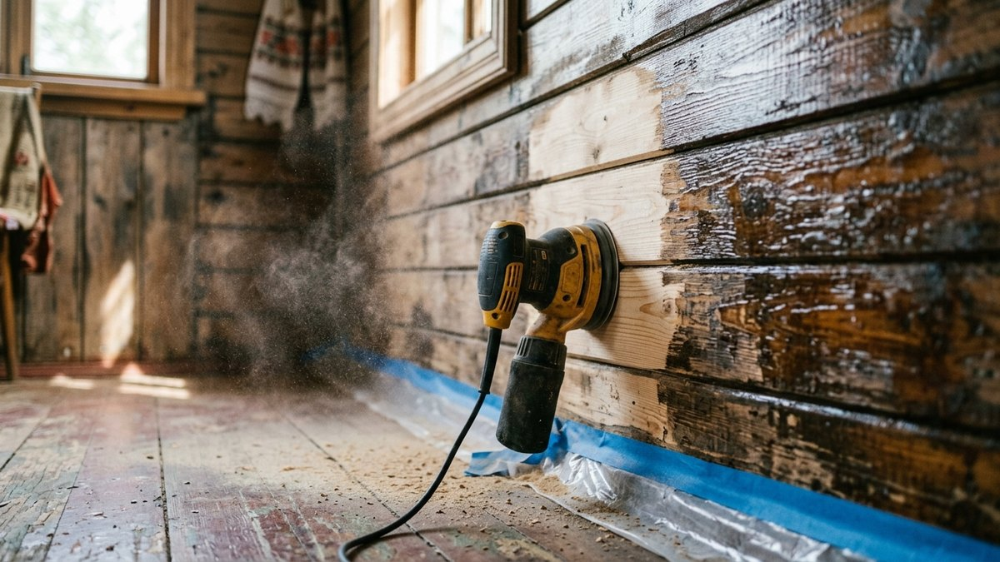
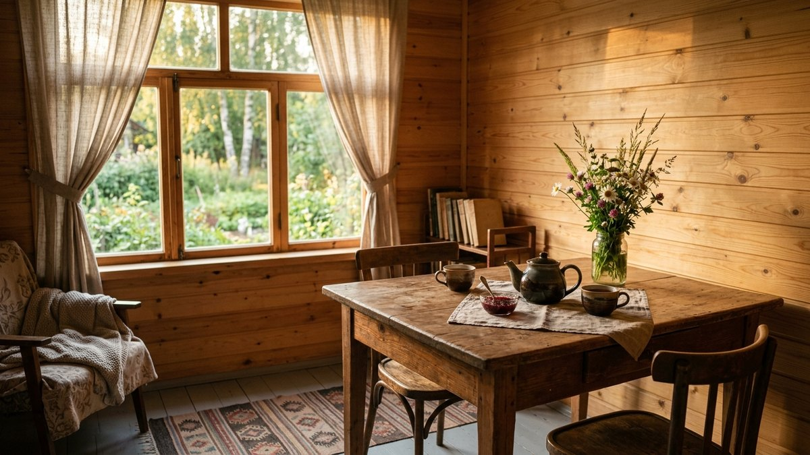

Чем покрыть вагонку внутри дома — решение, которое потом трудно
переиграть. Лак не ляжет на масло, масло не впитается в лак, а чтобы
перекрасить лакированную стену, её придётся шлифовать целиком. Выбор
зависит от трёх вещей: отапливается ли дом зимой, хотите ли вы
сохранить цвет дерева и сколько готовы обновлять покрытие. Ниже —
сравнение лака, масла, воска, лазури и краски по одной таблице, что
выбрать для дачи без отопления, для бани и балкона, почему сосна
желтеет под любым прозрачным покрытием и как этого избежать. Калькулятор
посчитает, сколько литров нужно на вашу площадь с учётом слоёв.

## Сравнение покрытий для вагонки

| Покрытие | Вид | Как ведёт себя | Обновление | Расход на слой | Слоёв |
|---|---|---|---|---|---|
| Акриловый лак на воде | Глянец или мат, дерево видно | Плёнка, защищает от грязи | Шлифовка перед новым слоем | 80–120 мл/м² | 2–3 |
| Масло с воском (твёрдое масло) | Мат, «живое» дерево | Впитывается, дерево дышит | Новый слой без шлифовки | 40–60 мл/м² | 2 |
| Воск | Мягкий сатиновый блеск | Тонкий слой, боится тепла и грязи | Раз в 1–2 года | 30–50 мл/м² | 1–2 |
| Лазурь (тонирующая пропитка) | Цвет дерева меняется, текстура видна | Пропитывает, часто с УФ-фильтром | Новый слой поверх | 80–120 мл/м² | 2 |
| Укрывная краска (акриловая) | Сплошной цвет, текстуры нет | Плёнка, закрывает сучки | Новый слой поверх | 100–150 мл/м² | 2 |

Расход — ориентир, точнее смотрите на банке: мягкая сосна без шлифовки
впитывает заметно больше, чем ель или шлифованная лиственница.

## Что выбрать под ваш дом

**Отапливаемый дом, где живут круглый год.** Подойдёт всё. Если нужно
дерево без изменения цвета и стена, которую легко протереть, — акриловый
лак на воде, матовый или полуматовый. Если хочется тёплого вида и ремонта
без шлифовки — масло с воском.

**Дача без отопления зимой.** Лучше то, что не образует плёнку: масло
или лазурь. Дерево зимой отсыревает, весной высыхает, вагонка «ходит»,
и плёночный лак трескается по стыкам доски и шелушится. Подробнее о том,
что выдерживают перепады температуры и сырость, — в статье про
[отделку холодной веранды](https://mir-doma.pro/otdelka-holodnoy-verandy/):
те же правила работают для любой неотапливаемой комнаты.

**Кухня, прихожая, детская.** Здесь стену трогают руками и моют:
лак или краска, которые выдерживают влажную уборку. Масло тоже можно,
но пятна в нём заметнее и подновлять придётся чаще.

**Под цвет интерьера.** Белая или светлая лазурь сохраняет текстуру
и делает стену светлее — классический приём для интерьера в стиле
[прованс](https://mir-doma.pro/interer-dachi-v-stile-provans/). Укрывная
краска закрывает сучки и смолу полностью.

## Почему вагонка желтеет и как этого избежать

Сосна и ель темнеют и желтеют под любым прозрачным покрытием: древесина
реагирует на свет, а смола выходит к поверхности. Под лаком с годами
сосна становится медово-оранжевой. Что помогает:

- **составы с УФ-фильтром** — на банке это указано. Они замедляют
  изменение цвета, но не останавливают его совсем;
- **белая или светлая лазурь** — белый пигмент перекрывает желтизну,
  дерево остаётся светлым;
- **отбеливатель для древесины** перед покрытием, если вагонка уже
  потемнела, — затем обязательно смыть и высушить;
- **липа, осина, ольха** — эти породы желтеют меньше сосны, поэтому
  их выбирают для светлых интерьеров и бань.

## Калькулятор: сколько покрытия нужно

Укажите площадь стен и потолка без окон и дверей, выберите покрытие.
Калькулятор возьмёт средний расход из таблицы, умножит на число слоёв
и добавит антисептик-грунт для первого слоя.

<!-- wp:html -->

  
Калькулятор покрытия для вагонки

  <label class="md-calc__label" for="mdVgS">Площадь вагонки, м²</label>
  <input type="number" id="mdVgS" class="md-calc__input" min="0" step="1" value="40">
  <label class="md-calc__label" for="mdVgT">Покрытие</label>
  <select id="mdVgT" class="md-calc__input">
    <option value="lak">Акриловый лак на воде</option>
    <option value="oil" selected>Масло с воском</option>
    <option value="wax">Воск</option>
    <option value="laz">Лазурь</option>
    <option value="paint">Укрывная краска</option>
  </select>
  <label class="md-calc__label" for="mdVgL">Слоёв</label>
  <input type="number" id="mdVgL" class="md-calc__input" min="1" step="1" value="2">
  <label class="md-calc__label" for="mdVgW">Древесина</label>
  <select id="mdVgW" class="md-calc__input">
    <option value="1.15">Сосна или ель без шлифовки — впитывает больше</option>
    <option value="1" selected>Шлифованная вагонка</option>
    <option value="0.9">Лиственница, плотная древесина</option>
  </select>
  
Заполните поля

<!-- /wp:html -->

Пример: 40 м² шлифованной вагонки под масло в 2 слоя — около 4,4 л масла.
Под акриловый лак в 3 слоя на ту же площадь понадобится около 13 л.

## Как покрыть вагонку: порядок работ

1. **Влажность дерева не выше 15–18 %.** Свежую вагонку из магазина
   выдерживают в комнате 3–7 дней, иначе покрытие ляжет пятнами.
2. **Шлифовка** наждачной бумагой P120–P150 вдоль волокон. Ворс,
   поднятый первым слоем водного лака, снимают P180–P240 перед вторым
   слоем.
3. **Обеспыливание** — пылесос и влажная тряпка, затем просушка.
4. **Сучки и смоляные кармашки** на сосне под светлую краску
   обезжиривают и закрывают изолирующим грунтом, иначе через год
   проступят жёлтые пятна.
5. **Антисептик-грунт**, если он нужен под выбранное покрытие.
6. **Первый слой** — тонко, вдоль волокон, кистью или валиком из
   микрофибры. Масло через 15–20 минут растирают ветошью, излишки
   снимают.
7. **Второй слой** после полного высыхания — время указано на банке,
   обычно 4–12 часов для водных составов и 8–24 часа для масел.

Лучше покрывать вагонку до монтажа хотя бы первым слоем: так прокрашиваются
шпунт и гребень, и при усыхании доски на стыках не появляются светлые
полосы. Как собрать стену после этого, разобрано в статье про
[отделку стен вагонкой](https://mir-doma.pro/otdelka-sten-vagonkoy/).

## Баня, балкон, душевая

**Парилка.** Стены и потолок в парилке чаще оставляют без покрытия:
при 80–100 °C любой лак или краска размягчаются и пахнут. Полки
и спинки можно пропитать специальным маслом для полков бани —
на банке так и написано «для саун». Лак в парилке — нет.

**Моечная и предбанник.** Влаги много, температура ниже — здесь нужны
акриловые составы с пометкой «для бань и саун», они паропроницаемые
и выдерживают влагу. Подробнее о материалах предбанника — в статье про
[предбанник своими руками](https://mir-doma.pro/predbannik-svoimi-rukami/).

**Балкон и лоджия.** Главный враг — солнце: под ним вагонка выгорает
за сезон. Берите лазурь или краску с УФ-фильтром, а на солнечной стороне —
укрывную краску светлого тона, она меньше нагревается.

**Душевая на даче.** Только укрывные составы для влажных помещений или
яхтный лак, и только при хорошей вентиляции: постоянная вода съедает
масло и воск за сезон.

## Как перекрасить вагонку, покрытую лаком

Краска на глянцевом лаке держится плохо и отслаивается пластами.
Порядок:

1. **Шлифовка до матовости** — P120–P180, глянца не должно остаться.
   Снимать лак до дерева не нужно, достаточно лишить его блеска.
2. **Обеспылить и обезжирить**.
3. **Адгезионный грунт** по старому покрытию — он создаёт сцепление.
4. **Укрывная краска** в 2 слоя.

Если старый лак трескается и шелушится, точечной подготовкой не
обойтись: его снимают целиком шлифмашиной или смывкой. На масло
краска и лак не ложатся вообще — масляное покрытие обновляют только
маслом.

## Частые ошибки

- **Лак на сырую вагонку.** Пятна, пузыри и отслоение через сезон.
- **Плёночный лак на даче без отопления.** Трескается на стыках досок.
- **Покрасили смонтированную стену.** При усыхании на стыках появляются
  непрокрашенные полосы — покрывайте шпунт заранее.
- **Сосна под белую краску без изолирующего грунта.** Сучки проступают
  жёлтыми пятнами.
- **Масло без растирки.** Остаётся липкий слой, на котором собирается
  пыль.
- **Лак или краска в парилке.** Запах при нагреве и размягчение покрытия.

## Частые вопросы

### Чем покрыть вагонку внутри дома

В отапливаемом доме — акриловым лаком на воде, маслом с воском, лазурью
или краской, в зависимости от того, нужен ли цвет дерева. На даче
без отопления лучше масло или лазурь: они не образуют плёнку и не
трескаются от сырости и перепадов температуры.

### Чем покрыть вагонку, чтобы она не желтела

Составом с УФ-фильтром или светлой лазурью с белым пигментом. Прозрачный
лак не остановит пожелтение сосны полностью. Меньше всего желтеют
липа, осина и ольха.

### Чем покрыть вагонку внутри дома на даче без отопления

Маслом или лазурью — паропроницаемыми составами без плёнки. Плёночный
лак при перепадах влажности трескается по стыкам досок.

### Чем покрыть вагонку в бане

В парилке стены оставляют без покрытия, полки пропитывают маслом для
саун. В моечной и предбаннике — акриловыми составами с пометкой «для
бань и саун».

### Можно ли покрасить вагонку, покрытую лаком

Да, но только после шлифовки до матовости, обеспыливания и адгезионного
грунта. Без шлифовки краска на глянцевом лаке отслаивается. На масло
краска не ложится.
