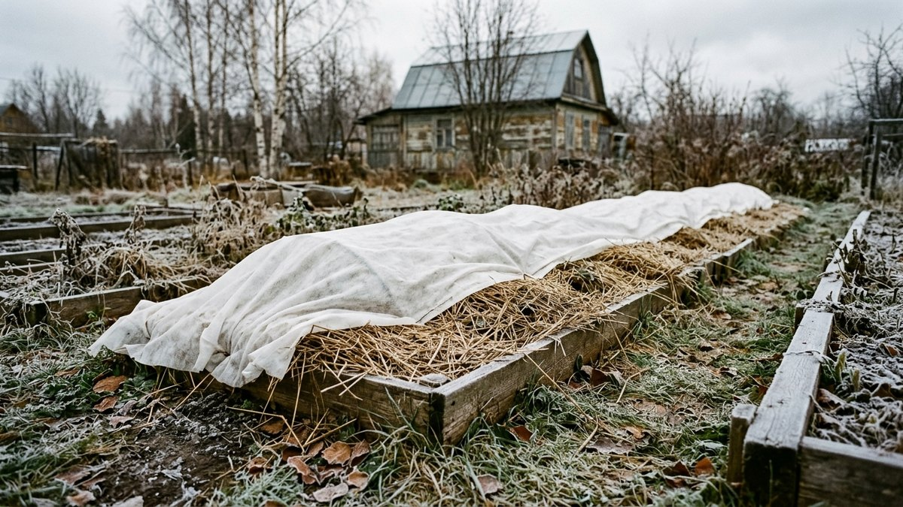
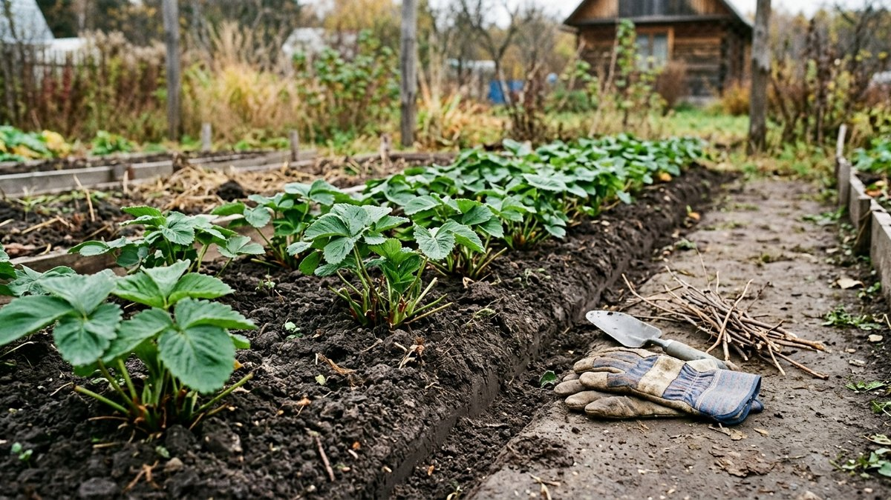
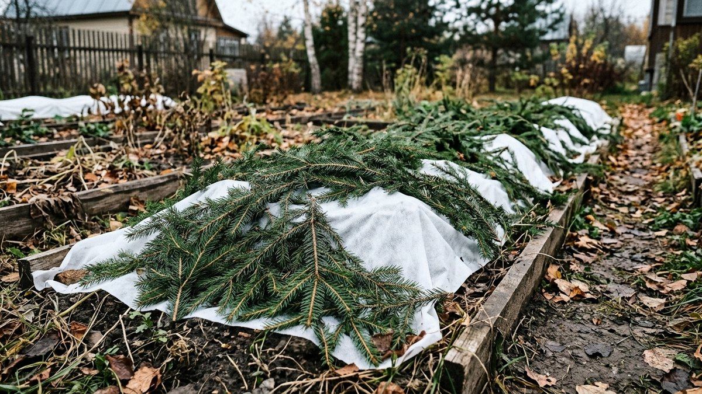
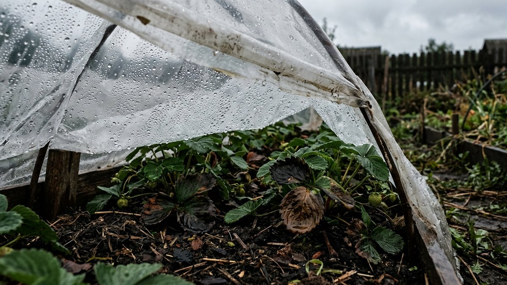
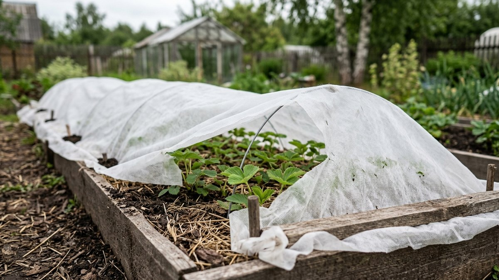
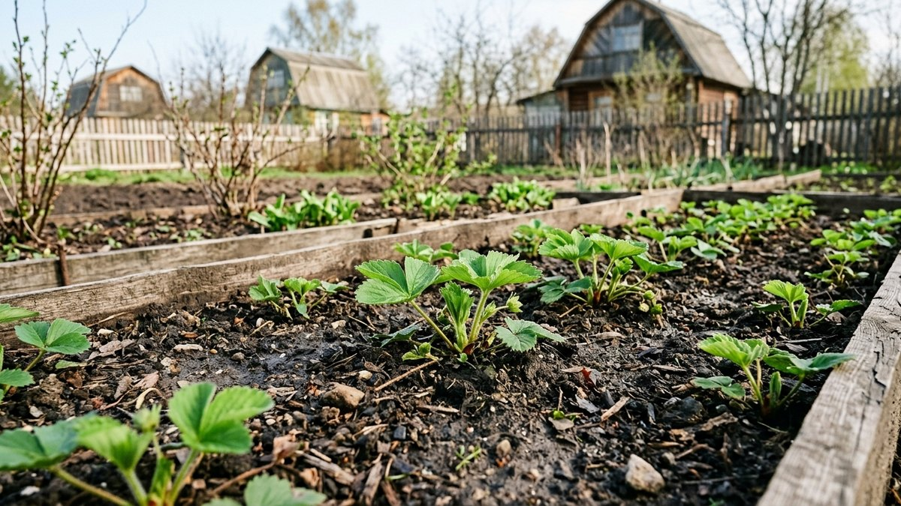

Корневая система клубники залегает в верхних 20–25 см почвы — намного мельче, чем у большинства ягодных кустарников, поэтому она куда сильнее рискует вымерзнуть без укрытия. Но и здесь легко ошибиться в другую сторону: укрыть слишком рано или слишком плотно — и кусты выпреют под слоем прелой листвы ещё до снега. Разберём, когда укрывать клубнику, каким материалом и как избежать обеих крайностей.

## Нужно ли вообще укрывать клубнику

Зависит от сорта и региона. Большинство сортов садовой земляники выдерживают морозы до −15…−18 °C при наличии снежного покрова — снег сам по себе отличный утеплитель. Проблема возникает при малоснежных морозных зимах или резких перепадах температуры без снега: тогда открытая корневая система промерзает даже у зимостойких сортов.

Ремонтантные сорта и клубника первого года после посадки нуждаются в укрытии почти всегда — у них слабее развита корневая система и ниже морозостойкость по сравнению со старыми, разросшимися кустами.

## Когда укрывать: не раньше нужного срока

Главная ошибка — укрыть слишком рано, «на всякий случай», как только похолодало. Если температура ещё колеблется около 0 °C и случаются оттепели, под укрытием скапливается конденсат, кусты преют и подгнивают у корневой шейки — а такое повреждение куда опаснее вымерзания.

Правильный ориентир — устойчивые заморозки **−5…−7 °C** и промёрзший верхний слой почвы. В средней полосе это обычно конец октября — начало ноября, но точная дата зависит от погоды текущего года, а не от календаря.

## Подготовка грядки перед укрытием

1. **Убрать старые и повреждённые листья.** Здоровую свежую листву в средней полосе обычно не обрезают — она сама участвует в снегозадержании, но всё сухое, пятнистое и поражённое болезнями удаляют, иначе инфекция перезимует под укрытием.
2. **Прополоть и порыхлить междурядья**, не задевая корни.
3. **Замульчировать почву** — соломой, торфом, перегноем или хвойным опадом слоем 5–7 см. Мульча защищает корни даже при частичном сдувании верхнего укрывного слоя.
4. **Пролить влагозарядковым поливом**, если осень сухая: сухая почва промерзает глубже влажной.

Если рядом с клубникой на участке растут малина или смородина, их санитарную обрезку удобно сделать в те же выходные — сроки и техника для каждой культуры разобраны в статьях про [обрезку малины осенью](https://mir-doma.pro/obrezka-maliny/) и [обрезку смородины осенью](https://mir-doma.pro/obrezka-smorodiny/).

## Чем укрывать: сравнение материалов

| Материал | Плюсы | Минусы |
|---|---|---|
| Агроволокно (спанбонд) плотностью 60 г/м² | Пропускает воздух, не даёт преть, недорогое | Нужно прижимать по краям от ветра |
| Еловый или сосновый лапник | Отличная вентиляция, отпугивает грызунов | Не везде доступен, колется при укладке |
| Солома | Дешёвая, хорошо утепляет | Привлекает мышей, слёживается от влаги |
| Опавшая листва (здоровая, не от клубники) | Бесплатная, доступна везде | Слёживается в плотный ком, преет без вентиляции |
| Снег (естественный) | Лучший природный утеплитель, бесплатно | Не помогает в малоснежные зимы |

Оптимальная схема для большинства регионов — мульча слоем 5–7 см плюс агроволокно или лапник сверху: воздух проходит, а влага и грызуны не скапливаются, как под плотной плёнкой.

## Почему нельзя укрывать плёнкой

Плёнка — самая частая ошибка новичков: кажется, что раз она не пропускает воду, значит, надёжно защищает. На деле плёнка не пропускает и воздух, поэтому под ней скапливается конденсат от перепадов температуры, а с приходом первых оттепелей кусты преют и загнивают у корневой шейки — куда быстрее, чем просто замёрзли бы без укрытия вовсе.

Если используете плёнку как верхний слой от дождя и снега, между ней и кустами обязательно должна остаться воздушная прослойка и вентиляционные зазоры по краям.

## Особенности для разных ситуаций

Молодые розетки, посаженные в конце лета или осенью, укрывают в первую очередь и плотнее обычного — их корневая система ещё не разрослась и промерзает быстрее. Общие принципы осенней посадки и защиты молодых растений в первую зиму разобраны в статье про [подготовку сада к зиме](https://mir-doma.pro/podgotovka-sada-k-zime/).

Если на участке помимо клубники укрываются ещё и розы или виноград — принцип «не преть под плотным укрытием» и сроки по устойчивым заморозкам работают точно так же, детали разобраны в статье про [укрытие роз на зиму](https://mir-doma.pro/ukrytie-roz-na-zimu/).

## Когда снимать укрытие весной

Снимают укрытие постепенно, при устойчивом потеплении и таянии основного снега — обычно это конец марта — апрель в зависимости от региона. Сначала укрытие приоткрывают для проветривания в тёплые дни, полностью убирают, когда минует угроза сильных возвратных заморозков. Резкое снятие в солнечный день может привести к ожогу отвыкших от света листьев.

## Частые ошибки

- **Укрыли слишком рано**, при неустойчивой погоде — кусты выпревают под конденсатом ещё до настоящих морозов.
- **Использовали плёнку без вентиляции** — тот же результат, только гарантированный.
- **Забыли замульчировать почву**, ограничившись только верхним укрывным материалом — при сдувании укрытия ветром корни остаются голыми.
- **Укрыли слишком плотно ремонтантные сорта**, у которых вегетация продолжается дольше — растения не успевают уйти в состояние покоя и подмерзают сильнее укрытых вовремя обычных сортов.
- **Не убрали больную листву** перед укрытием — грибковые споры благополучно перезимовывают в тепле под укрывным материалом.

## Частые вопросы

### Нужно ли укрывать клубнику, если зимы снежные?

При стабильном снежном покрове от 20 см большинство сортов зимуют без дополнительного укрытия — снег служит естественным утеплителем. Мульчирование почвы всё же не помешает: оно защищает корни в период до установления снега.

### Можно ли укрывать клубнику опилками?

Можно, но только хвойными и в меру: опилки лиственных пород слёживаются и закисляют почву при разложении. Слой не толще 5 см, иначе корневая шейка преет.

### Обязательно ли обрезать листья клубники перед укрытием?

Полную обрезку в среднюй полосе делают редко — здоровая листва участвует в снегозадержании и защищает точку роста. Убирают только сухие, пятнистые и явно больные листья.

### Что делать, если клубника уже подмёрзла зимой?

Весной такие кусты часто восстанавливаются сами, если подмёрзли только листья, а не корневая шейка. Дайте им время до конца мая — если розетка не тронулась в рост, куст выкапывают и заменяют.

### Чем отличается укрытие ремонтантной клубники от обычной?

Ремонтантные сорта плодоносят до поздней осени и позже уходят в состояние покоя, поэтому их укрывают немного позже обычных сортов — раньше срока растения не успевают подготовиться к зиме, и укрытие только вредит.

## Заключение

Клубнику укрывают не «пораньше», а точно по сроку — после устойчивых заморозков −5…−7 °C, дышащим материалом поверх слоя мульчи. Эти два правила снимают обе главные угрозы: и вымерзание, и выпревание.
