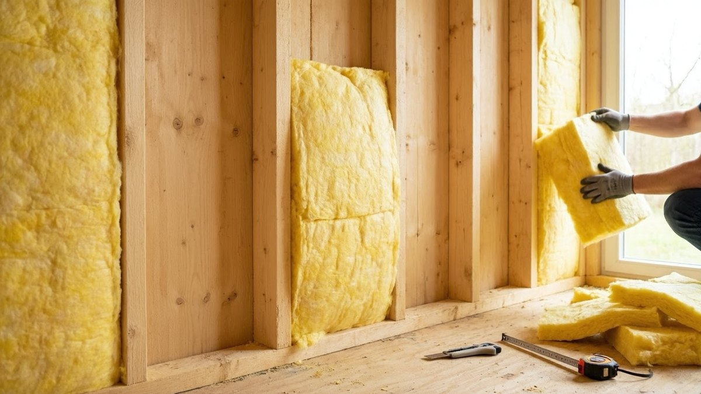
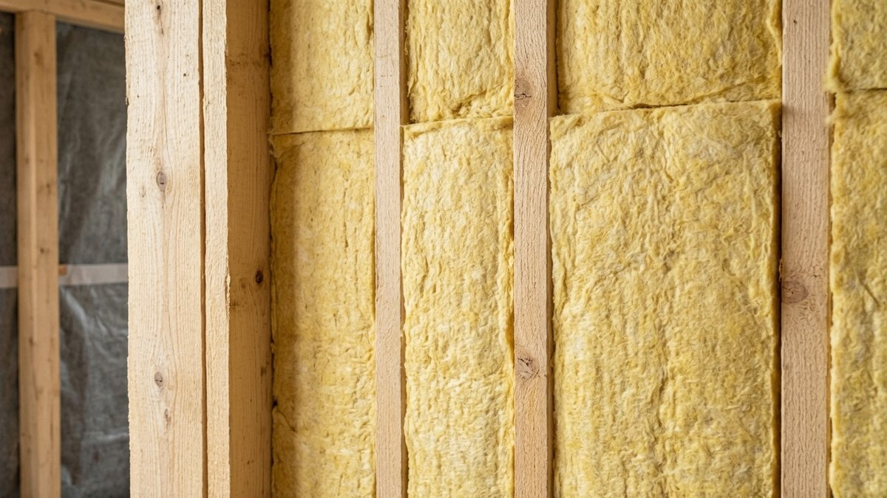
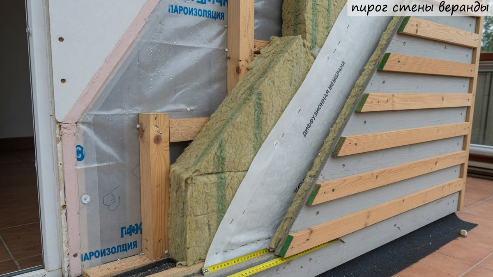
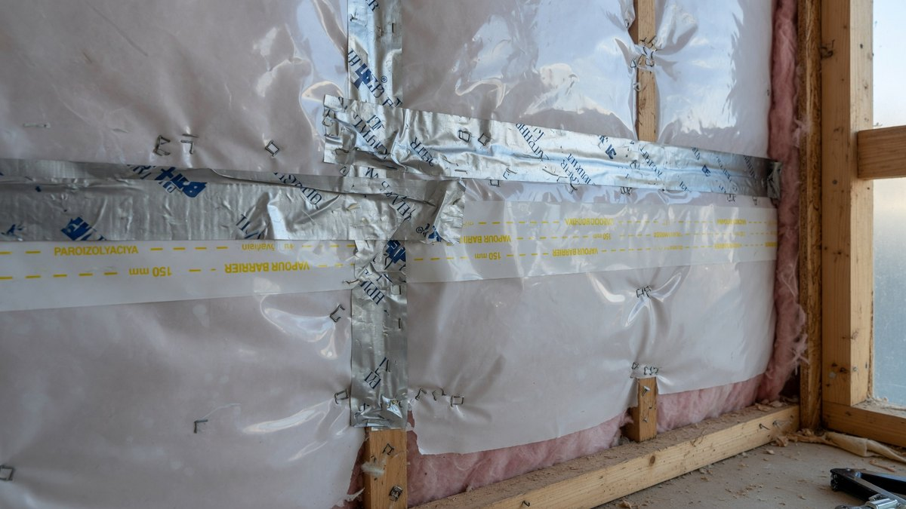
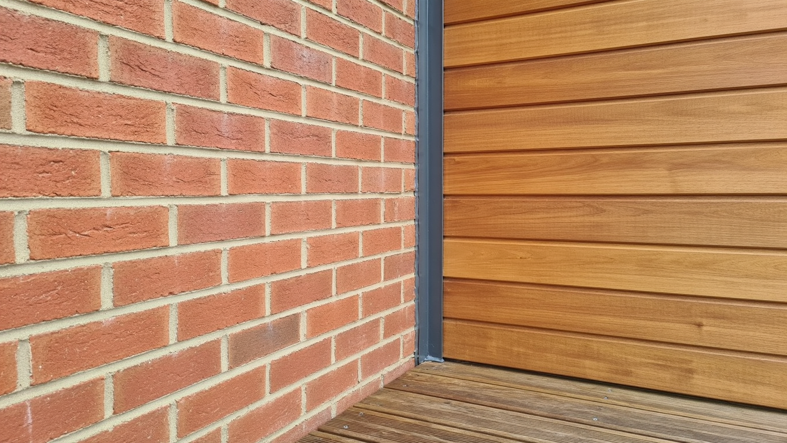
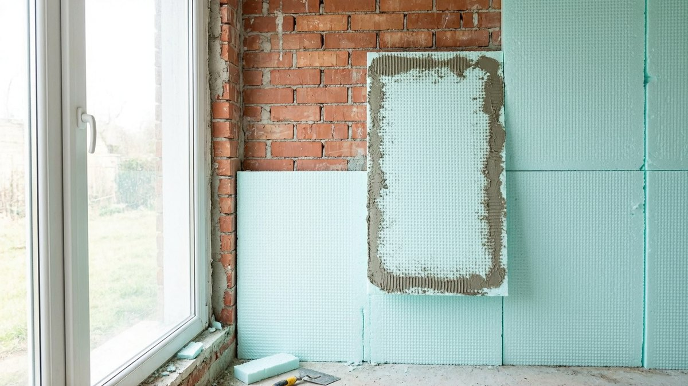

Утеплить веранду изнутри — задача, которая на первый взгляд решается покупкой рулона минваты, а на деле упирается в два вопроса: **будет ли здесь тепло вообще** и **правильно ли собран пирог стены**. Ошибка в любом из них означает, что деньги потрачены зря: в первом случае утеплитель просто не работает, во втором — намокает и гноит каркас. Разберём, чем утеплять, какой толщины, в каком порядке укладывать слои и что делать с примыканием к дому.

## ⚠️ Сначала главное: будет ли веранда отапливаться

Это не философский вопрос, а техническая развилка, от которой зависит, нужны ли вам утеплитель и эта статья вообще.

**Утеплитель не производит тепло — он замедляет его уход.** Работает он только тогда, когда внутри есть источник тепла: батарея, конвектор, тёплый пол, печь, открытая дверь в дом.

- **Веранда будет отапливаться** (постоянно или хотя бы когда вы приезжаете) — утепление обязательно и окупается: без него обогреватель будет греть улицу.
- **Веранда останется холодной** — утепление в классическом виде **бессмысленно и вредно**. Температура всё равно сравняется с уличной, а внутри пирога начнёт скапливаться конденсат: утеплитель намокнет, каркас будет сыреть.

**Что делать, если отопления не планируется:** работать не с утеплением, а с герметичностью — заделать щели, поставить уплотнители на окна и дверь и обязательно утеплить **стену и дверь между домом и верандой**, чтобы она не вытягивала тепло из жилой части. Как это сделать, разобрано в статье про [утепление окон и дверей](https://mir-doma.pro/uteplenie-okon-i-dverey/).

Дальше в статье исходим из того, что веранда станет тёплой.

## 🧰 Чем утеплить: сравнение материалов

| Материал | Теплопроводность (Вт/м·К) | Паропроницаемость | Где применять | Цена | Монтаж |
|---|---|---|---|---|---|
| **Минеральная вата** | 0,035–0,045 | Высокая, «дышит» | Каркасные стены, между стойками | Средняя | Своими руками |
| **Эковата** | 0,037–0,042 | Высокая | Каркасные полости | Средняя | Нужна техника (задувка) |
| **ЭППС** (экструдированный пенополистирол) | 0,029–0,034 | Очень низкая | Каменные и бетонные стены, пол | Выше средней | Своими руками |
| **Пенопласт (ПСБ)** | 0,033–0,040 | Низкая | Каменные стены, бюджетный вариант | Низкая | Своими руками |
| **ППУ** (напыляемый) | 0,020–0,028 | Зависит от типа | Сложная геометрия, бесшовно | Высокая | Только бригада |
| **Фольгированный вспененный ПЭ** | 0,037–0,051 | Не пропускает | **Дополнение, не самостоятельный слой** | Низкая | Своими руками |

**Как выбирать под свою веранду:**

- **каркасная веранда (дерево)** → минвата или эковата. Они паропроницаемы, и деревянный каркас под ними может отдавать влагу. Это основной выбор для дачи.
- **кирпичная или блочная веранда** → ЭППС или пенопласт (см. раздел про пирог — там есть нюанс).
- **сложная геометрия, много узлов** → ППУ, если бюджет позволяет: ложится бесшовно, но требует бригады с оборудованием. Подробнее — в статье про [утепление ППУ](https://mir-doma.pro/uteplenie-ppu/).

⚠️ **Отдельно про фольгированный «пенофол».** Его часто продают как полноценный утеплитель с формулировкой «3 мм заменяют 10 см минваты» — это неправда. Тонкий вспененный полиэтилен работает как **отражающий барьер и дополнительный слой**, но по теплосопротивлению не заменяет нормальный утеплитель. Использовать его можно, но **вместе** с основным слоем, а не вместо него.

## 📏 Какая нужна толщина утеплителя

Толщина зависит от климата и типа стены. Ориентиры для минеральной ваты:

| Регион | Толщина утеплителя |
|---|---|
| Юг России | 50–80 мм |
| Средняя полоса, Подмосковье | 100–150 мм |
| Северо-Запад | 150 мм |
| Урал, Сибирь, Север | 150–200 мм |

**Поправки к базовому расчёту:**

- **ЭППС и ППУ** можно брать тоньше — у них ниже теплопроводность. Ориентировочно 100 мм минваты ≈ 80 мм ЭППС ≈ 60–70 мм ППУ.
- **Каменная стена** уже даёт часть сопротивления — на кирпичной веранде слой может быть меньше, чем на каркасной с тонкой обшивкой.
- **Много остекления** (а на веранде его обычно много) — смысла наращивать стены сверх нормы нет: тепло всё равно уйдёт через окна. Сначала окна, потом стены.

**Практическое правило укладки:** если нужен слой 100 мм, а плиты по 50 — берите **два слоя вразбежку**, со смещением стыков. Перекрытые швы убирают мостики холода, и это заметно эффективнее одного толстого слоя.

Не забывайте, что стены — лишь часть контура: через холодный пол уходит не меньше. Как утеплить его, разобрано в статье про [утепление пола на даче](https://mir-doma.pro/uteplenie-pola-na-dache/).

## 🥪 Пирог стены: два варианта

Порядок слоёв — то, где ошибаются чаще всего. Он различается для каркасной и каменной веранды.

### Каркасная веранда (дерево)

Изнутри наружу:

1. **Внутренняя отделка** (вагонка, панели, фанера).
2. **Вентзазор 2–3 см** — обрешётка между отделкой и плёнкой.
3. **Пароизоляция** — со стороны тёплого помещения, стыки проклеены лентой.
4. **Утеплитель** между стойками каркаса, плотно, враспор.
5. **Ветро-влагозащитная мембрана** — снаружи утеплителя.
6. **Вентзазор 3–5 см** — контробрешётка.
7. **Наружная обшивка.**

**Ключ к пониманию:** пароизоляция изнутри не пускает пар в утеплитель, мембрана снаружи выпускает наружу ту влагу, что всё же попала. Плёнки нельзя менять местами.

### Кирпичная или блочная веранда

Изнутри наружу:

1. **Внутренняя отделка.**
2. **Пароизоляция** (при использовании минваты; для ЭППС он сам работает как пароизоляция).
3. **Утеплитель** — ЭППС на клей или минвата между стойками каркаса.
4. **Стена.**

⚠️ **Важный нюанс.** Утепление каменной стены **изнутри** смещает точку росы внутрь конструкции — стена перестаёт прогреваться и может отсыревать. Поэтому здесь критично:

- **герметичная пароизоляция** без разрывов (или ЭППС, приклеенный сплошным слоем без щелей);
- **никаких зазоров** между утеплителем и стеной, где мог бы гулять влажный воздух;
- по возможности — рассмотреть **наружное утепление**: оно всегда предпочтительнее, а как его сделать, разобрано в статье про [утепление стен снаружи](https://mir-doma.pro/uteplenie-sten-snaruzhi/).

## 💨 Пароизоляция: главная ошибка утепления

Если из статьи запомнить одну вещь — пусть это будет она. **Утепление без пароизоляции гарантированно приводит к намоканию утеплителя.**

Как это работает: воздух в тёплом помещении содержит водяной пар — от дыхания, чайника, мокрой обуви. Пар стремится наружу, в холодную зону. Если на его пути нет барьера, он проходит в утеплитель и конденсируется там, встретив холод.

Последствия предсказуемы:

- **мокрая вата не греет** — её теплопроводность растёт в разы, и утепление перестаёт работать;
- **каркас начинает гнить** — влага остаётся в конструкции;
- **появляется плесень**, а за ней запах сырости;
- внешне всё выглядит нормально, пока не вскроешь обшивку.

**Правила монтажа пароизоляции:**

- всегда **со стороны тёплого помещения**, не наоборот;
- **стыки проклеивать** специальной лентой, а не класть внахлёст «на глазок»;
- аккуратно обходить розетки, выключатели и примыкания — каждый прокол это дырка в барьере;
- **не путать с ветрозащитной мембраной**: пароизоляция не дышит, мембрана дышит. Перепутаете местами — запрёте влагу в утеплителе.

## 🏠 Узел примыкания к дому и что делать с окнами

**Стена между домом и верандой.** Здесь есть развилка:

- **веранда станет тёплой** — эту стену утеплять не нужно, она оказывается внутри тёплого контура;
- **веранда останется холодной или отапливается изредка** — стену и дверь нужно утеплять **как наружные**, иначе веранда будет вытягивать тепло из дома.

Промежуточный вариант, который выбирают чаще всего на даче: веранда прогревается только когда вы приезжаете. Тогда утепляют и веранду, и стену между ней и домом — так дом не остывает, пока веранда стоит холодной.

**Окна — слабое место любой веранды.** Площадь остекления здесь обычно больше, чем в комнатах, и через неё уходит основная часть тепла. Утеплять стены до 200 мм при старых одинарных рамах — деньги на ветер.

Что делать в порядке приоритета:

1. **Загерметизировать щели** по периметру рам и в притворе — это дёшево и даёт быстрый эффект.
2. **Поставить уплотнители** на створки и дверь.
3. **Утеплить откосы и монтажный шов** — часто дует именно вокруг окна, а не через него.
4. **Заменить остекление** на тёплое, если веранда становится полноценной комнатой — сравнение систем и вопрос нагрузки на фундамент в статье про [остекление веранды](https://mir-doma.pro/osteklenie-verandy/).

Подробно про работу с окнами — в статье про [утепление окон и дверей](https://mir-doma.pro/uteplenie-okon-i-dverey/).

## 🧊 Пол и потолок: не забыть про весь контур

Утеплённые стены при холодном поле дают половину результата. Полный контур веранды — это четыре плоскости:

- **пол** — через него уходит много тепла, особенно если под верандой продуваемое подполье. Утепляют по лагам минватой или ЭППС; подробно — [утепление пола на даче](https://mir-doma.pro/uteplenie-pola-na-dache/);
- **потолок** — тёплый воздух поднимается вверх, и это самый выгодный узел. Как собрать пирог и какой шаг обрешётки нужен — в статье про [потолок на веранде](https://mir-doma.pro/potolok-na-verande/);
- **стены** — эта статья;
- **окна и двери** — см. выше.

Если бюджет ограничен, начинайте с **пола и потолка**: эффект от них чувствуется сразу.

## ❌ Частые ошибки

- **Утеплили неотапливаемую веранду** — утеплитель намок, каркас сыреет, тепла не прибавилось.
- **Забыли пароизоляцию** — вата намокла и перестала греть.
- **Перепутали плёнки местами** — пароизоляция снаружи заперла влагу внутри пирога.
- **Не проклеили стыки** пароизоляции — барьер работает вполсилы.
- **Уложили утеплитель неплотно** — щели у стоек стали мостиками холода.
- **Примяли минвату** — сжатый утеплитель греет заметно хуже.
- **Взяли пенофол вместо утеплителя** — 3 мм не заменяют 100 мм минваты.
- **Утеплили стены, оставив старые окна** — основной поток тепла всё равно уходит через остекление.
- **Утеплили стены, забыв про пол** — снизу тянет холодом, комфорта нет.

## ❓ Частые вопросы

**Чем утеплить веранду изнутри?**
Для каркасной веранды — минеральной ватой или эковатой между стойками: они паропроницаемы и подходят для дерева. Для кирпичной или блочной — ЭППС либо пенопластом. Напыляемый ППУ хорош для сложной геометрии, но требует бригады.

**Какая толщина утеплителя нужна для веранды?**
Для минваты: 50–80 мм на юге, 100–150 мм в средней полосе, 150–200 мм на Урале и в Сибири. ЭППС и ППУ можно брать тоньше. Если плиты по 50 мм, а нужно 100 — укладывайте два слоя вразбежку со смещением стыков.

**Нужна ли пароизоляция при утеплении веранды?**
Обязательно, со стороны тёплого помещения и с проклейкой стыков. Без неё пар проникает в утеплитель, конденсируется, вата намокает и перестаёт греть, а каркас начинает гнить.

**Имеет ли смысл утеплять неотапливаемую веранду?**
Нет. Утеплитель не производит тепло, а только замедляет его уход — в помещении без источника тепла он бесполезен, зато внутри пирога будет копиться конденсат. Холодной веранде нужны герметизация щелей и утеплённая дверь в дом.

**Можно ли утеплять веранду пенофолом?**
Только как дополнительный отражающий слой вместе с основным утеплителем. Формулировка «3 мм пенофола заменяют 10 см минваты» не соответствует действительности: по теплосопротивлению тонкий вспененный полиэтилен полноценный слой не заменяет.

**Чем утеплить кирпичную веранду изнутри?**
ЭППС на клей сплошным слоем или минватой по каркасу с герметичной пароизоляцией. Важно понимать риск: утепление каменной стены изнутри смещает точку росы внутрь конструкции, поэтому по возможности лучше утеплять снаружи.

**С чего начинать утепление веранды, если бюджет ограничен?**
С пола и потолка — через них уходит больше всего тепла, и эффект чувствуется сразу. Затем герметизация окон и дверей, и только потом стены.

---

Утепление веранды изнутри держится на трёх решениях: честно ответить, будет ли здесь отопление; собрать пирог в правильном порядке; не сэкономить на пароизоляции. Материал при этом вторичен — минвата в каркасе работает не хуже дорогих решений, если слои уложены правильно.

**Куда идти дальше:**

- Утепление — только часть работ: чем обшить стены поверх, чем застелить пол и подшить потолок, собрано в статье про [внутреннюю отделку веранды](https://mir-doma.pro/vnutrennyaya-otdelka-verandy/).
- Если веранда остаётся неотапливаемой, задача другая — не утеплять, а бороться с конденсатом и подобрать материалы, которые переживут мороз: [отделка холодной веранды внутри](https://mir-doma.pro/otdelka-holodnoy-verandy/).
- Потолок на веранде утепляют первым делом, и там своя технология: [потолок на веранде](https://mir-doma.pro/potolok-na-verande/).
- А чтобы утеплённая веранда действительно стала тёплой, ей понадобится источник тепла — варианты разобраны в статье про [тёплый пол на даче](https://mir-doma.pro/teplyy-pol-na-dache/).
