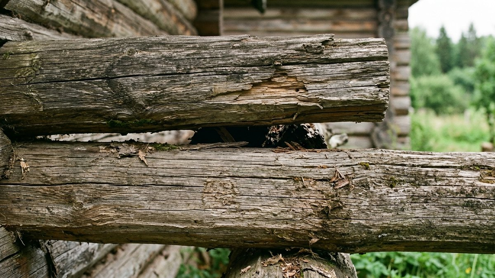
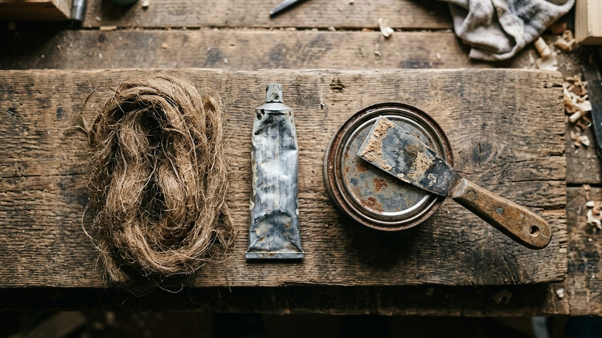
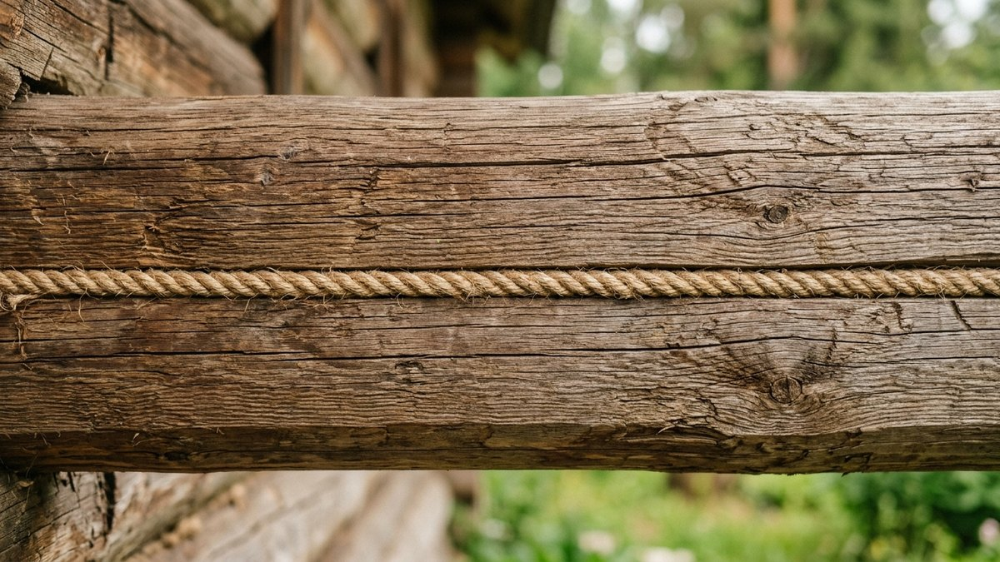
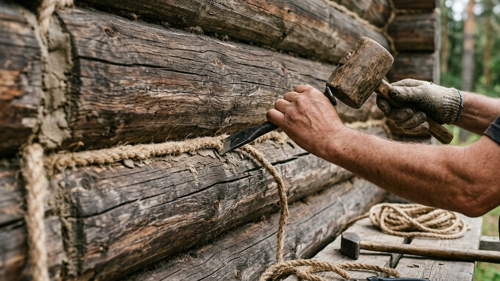
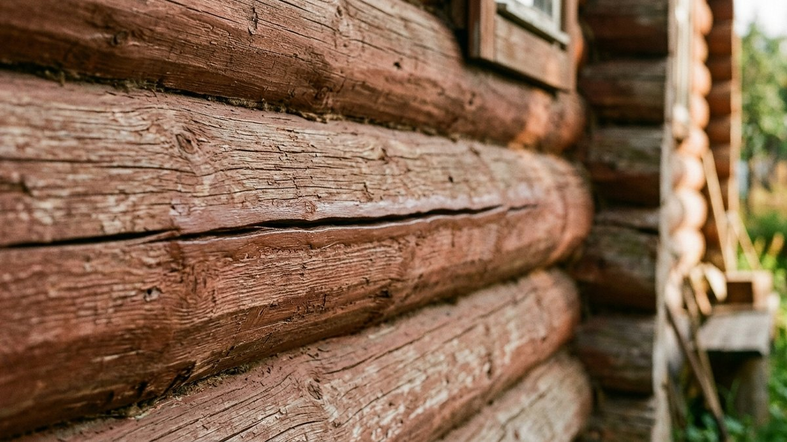
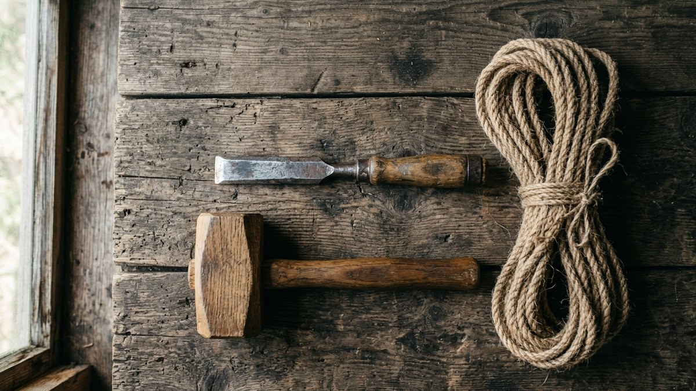

Деревянный дом продолжает "дышать" и после стройки: брёвна и брус рассыхаются, дом даёт усадку, и в стенах появляются щели, через которые зимой ощутимо тянет холодом. Разберём, чем заделывать щели между венцами и трещины в самой древесине, чтобы результат держался не один сезон, а материал не потрескался при следующей усадке.

## Почему появляются щели в деревянном доме

- **Естественная усадка сруба** — брус и брёвна теряют влагу и уменьшаются в сечении в первые 1–3 года после сборки, конопатка между венцами при этом растягивается и местами расходится.
- **Некачественная конопатка при строительстве** — если утеплитель между венцами уложен неровно или недостаточно плотно, щели проявляются уже в первую зиму.
- **Рассыхание отдельных брёвен** — трещины прямо в древесине (не между венцами, а поперёк или вдоль бревна) от перепадов влажности.
- **Продольная усушка бруса** — особенно у клеёного бруса низкого качества или при нарушении технологии сушки.

Разница важна: щель между венцами и трещина в самом бревне заделываются разными материалами. Речь здесь именно о стенах — если щели появились в половицах, там другая технология и материалы, разобранные в статье [ремонт деревянного пола на даче](https://mir-doma.pro/remont-derevyannogo-pola/).

## Чем заделать: сравнение материалов

| Материал | Для чего подходит | Плюсы | Минусы |
|---|---|---|---|
| Пакля, джут, мох | Щели между венцами (конопатка) | Дышащий материал, традиционная технология, дёшево | Трудоёмко, требует навыка забивки |
| Акриловый герметик для дерева | Небольшие трещины в брёвнах и брусе, финишная заделка после конопатки | Эластичный, красится, служит 8–10 лет | Не годится для щелей шире 1–1,5 см |
| Силиконовый герметик | Влажные зоны (санузел, цоколь) | Влагостойкий | Не красится, хуже держится на дереве без грунтовки |
| Шпаклёвка по дереву | Мелкие трещины, сколы, неровности | Шлифуется вровень с поверхностью, под покраску | Со временем трескается на активно "играющей" древесине |
| Монтажная пена | Не рекомендуется для швов между венцами | — | Не пропускает пар, стена под ней преет, пена разрушается на солнце без защиты |

Главная ошибка — использовать монтажную пену как замену конопатке. Она быстро закрывает щель, но не пропускает пар: влага из дома скапливается в венце под пеной, и древесина начинает гнить изнутри, а сама пена без защиты от УФ рассыпается за 2–3 года.

## Конопатка щелей между венцами: пошагово

1. **Очистите щель** от старого утеплителя, пыли и мусора шпателем или узкой стамеской.
2. **Скрутите паклю или джутовый шнур в жгут** толщиной чуть больше ширины щели.
3. **Забейте жгут в щель конопаткой** (специальная лопатка) и молотком-киянкой, начиная с середины стены к углам — так нагрузка распределяется равномернее.
4. **Пройдите паз дважды**: сначала набейте утеплитель неплотно по всей длине, затем вернитесь и уплотните — это классическая технология "в набор", она даёт более ровный результат, чем конопатка в один проход.
5. **Закройте видимый шов герметиком или декоративным джутовым канатом**, если нужен аккуратный вид снаружи.

## Заделка трещин в самом бревне или брусе

Трещины вдоль волокон в самой древесине (не в шве между венцами) заделывают иначе:

1. Расчистите трещину от отслоившейся древесины и пыли, при необходимости расширьте узкой стамеской для лучшего сцепления.
2. Обработайте антисептиком — трещина открывает доступ влаге вглубь бревна.
3. Небольшие трещины (до 5 мм) заделайте акриловым герметиком для дерева, вдавив его шпателем и разгладив вровень с поверхностью.
4. Трещины шире 5 мм и глубокие расщелины заполните шпаклёвкой по дереву на основе опилок или специальным составом-герметиком для брёвен — они не дают усадку при высыхании.
5. После высыхания зашлифуйте и, если стена окрашена, подкрасьте заделанный участок в тон.

## Когда заделывать щели

Конопатку и заделку трещин делают в сухую погоду при плюсовой температуре — весной после схода снега или в начале осени, до заморозков. Не стоит откладывать до зимы: щели, продутые морозным воздухом, промораживают венец сильнее, чем летом, и заделывать их приходится уже вместе с обмерзшим утеплителем. Если дом требует более глубокого ремонта — не только щелей, но и повреждённых нижних венцов, — читайте статью [треснул фундамент и сгнили венцы: можно ли спасти старый дом](https://mir-doma.pro/remont-fundamenta-i-venczov/).

Заделка щелей — обычно лишь один пункт в общем плане обновления старой дачи; если предстоит более широкий ремонт, план по всем узлам дома собран в статье [как обновить старую дачу: бюджетный ремонт своими руками](https://mir-doma.pro/kak-obnovit-staruyu-dachu/).

## Частые ошибки

- **Заделывать щели монтажной пеной вместо конопатки.** Пена перекрывает паропроницаемость стены, и венец под ней преет и гниёт изнутри.
- **Конопатить в один проход, не возвращаясь для уплотнения.** Утеплитель садится, и через сезон щель открывается заново.
- **Заделывать трещины сразу после стройки, не дождавшись основной усадки.** Свежий сруб продолжает "играть" 1–3 года, и заделанные слишком рано швы разойдутся снова.
- **Игнорировать антисептик перед заделкой.** Влага, попавшая в трещину до обработки, начинает разрушать древесину под свежим герметиком незаметно для глаз.

## Частые вопросы

### Можно ли заделать щели в деревянном доме монтажной пеной

Не рекомендуется для швов между венцами — пена перекрывает выход пара из стены, и древесина под ней преет. Для утепления щелей между брёвнами используют паклю, джут или мох, а пену оставляют для технических зазоров вокруг окон и дверей.

### Сколько раз нужно конопатить новый деревянный дом

Обычно два раза: первичная конопатка при строительстве и повторная — через 1–2 года после основной усадки сруба, когда утеплитель в швах осел и щели проявились заново. Дальше конопатку подновляют по мере необходимости, обычно раз в 5–7 лет.

### Чем заделать щель между венцами быстро, без конопатки

Для временной заделки можно использовать джутовый канат, вдавленный в щель шпателем, или широкий шнур из вспененного полиэтилена под герметик. Но это временное решение — полноценная конопатка держит дольше и лучше сохраняет паропроницаемость стены.

### Почему заделанная трещина в бревне снова разошлась

Чаще всего трещину заделали слишком рано, до окончания усадки сруба, либо использовали жёсткий, неэластичный состав, который не выдержал сезонного движения древесины. Для активно "играющих" venцов лучше подходят эластичные герметики, а не жёсткая шпаклёвка.

### Нужно ли утеплять щели в деревянном доме снаружи или изнутри

Конопатку делают снаружи и изнутри одновременно, если есть доступ — так утеплитель не проседает в одну сторону. Если доступ только снаружи (обшитые изнутри стены), конопатят с улицы, но проверяют, что паз набит плотно на всю глубину.

## Заключение

Щели в деревянном доме — нормальная часть жизни сруба, а не брак строительства, если их вовремя заделывать: конопаткой между венцами и герметиком или шпаклёвкой — в самой древесине. Главное правило простое: там, где нужна конопатка, не заменяйте её монтажной пеной — стена должна продолжать дышать.
