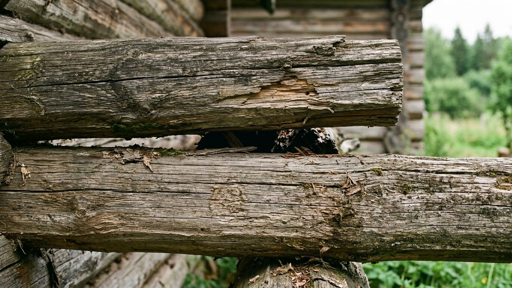
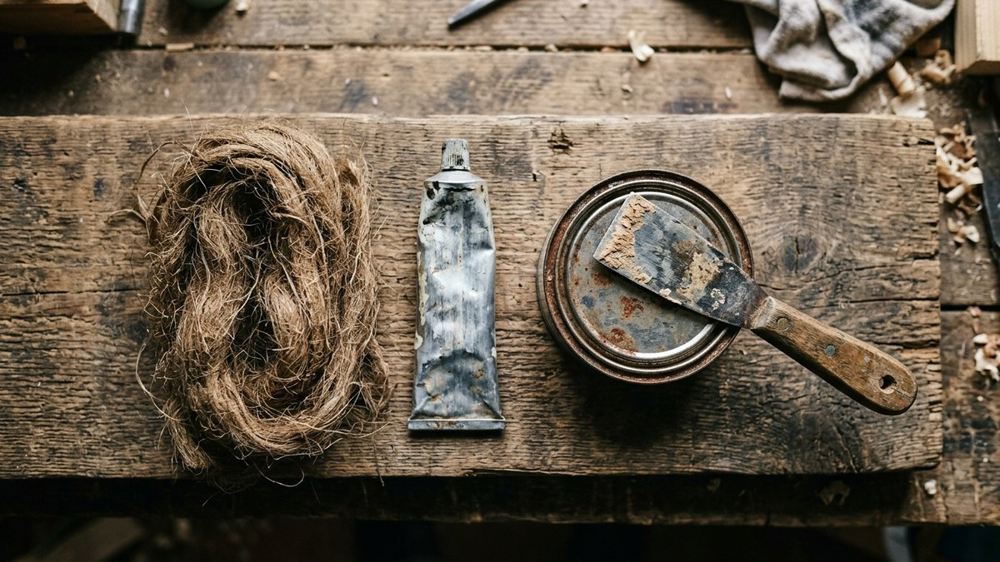
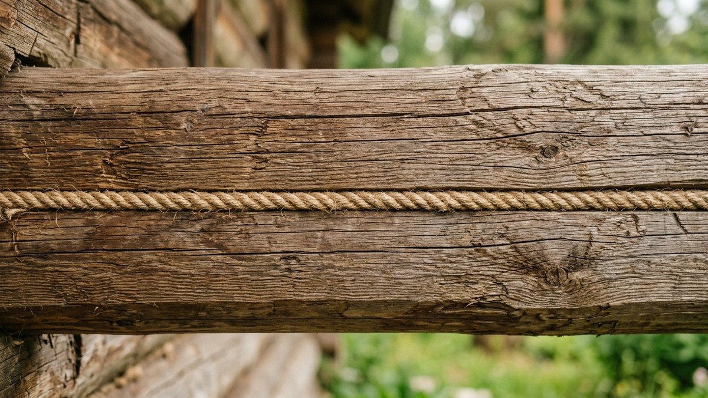
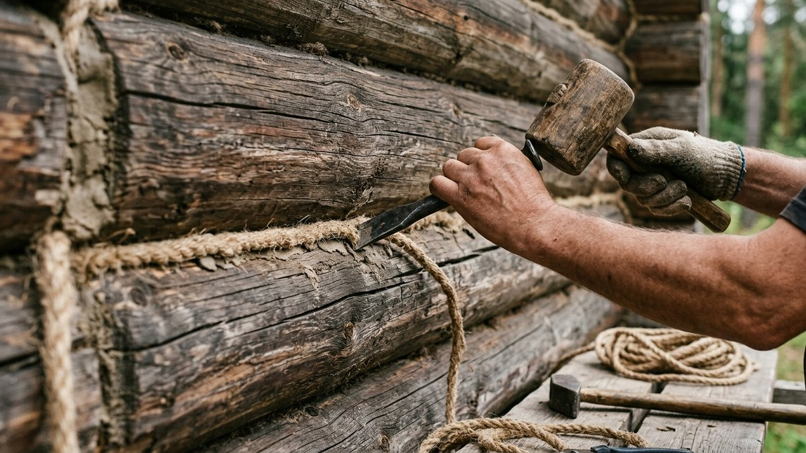
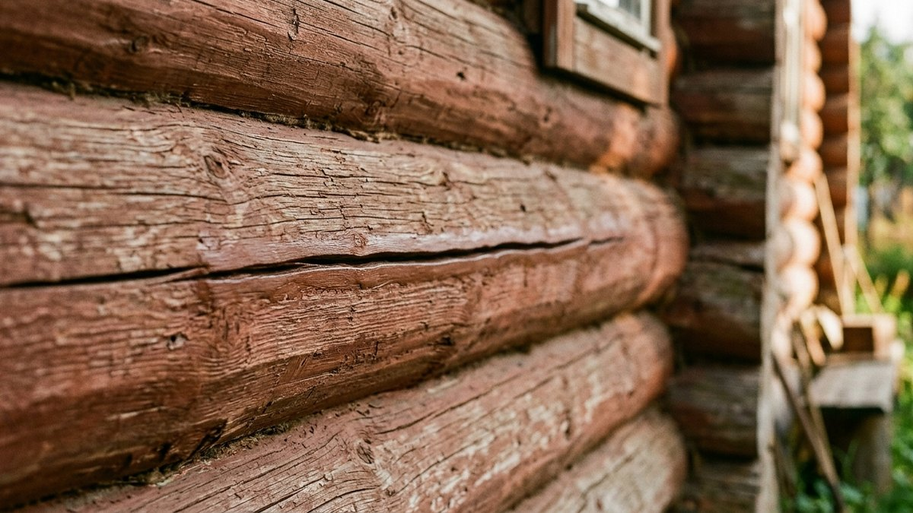
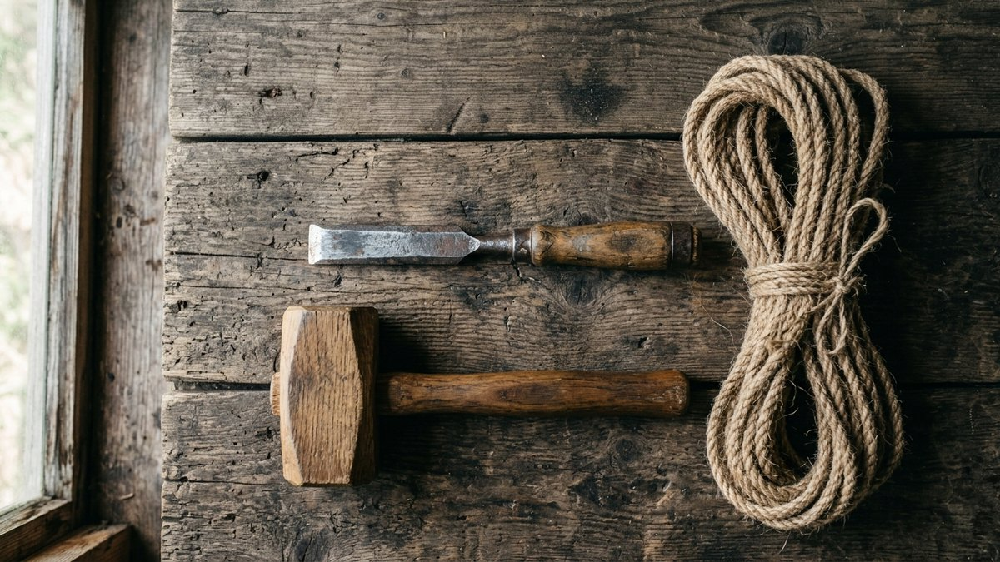

Деревянный дом продолжает "дышать" и после стройки: брёвна и брус рассыхаются, дом даёт усадку, и в стенах появляются щели, через которые зимой ощутимо тянет холодом. Разберём, чем заделывать щели между венцами и трещины в самой древесине, чтобы результат держался не один сезон, а материал не потрескался при следующей усадке.

## Почему появляются щели в деревянном доме

- **Естественная усадка сруба** — брус и брёвна теряют влагу и уменьшаются в сечении в первые 1–3 года после сборки, конопатка между венцами при этом растягивается и местами расходится.
- **Некачественная конопатка при строительстве** — если утеплитель между венцами уложен неровно или недостаточно плотно, щели проявляются уже в первую зиму.
- **Рассыхание отдельных брёвен** — трещины прямо в древесине (не между венцами, а поперёк или вдоль бревна) от перепадов влажности.
- **Продольная усушка бруса** — особенно у клеёного бруса низкого качества или при нарушении технологии сушки.

Разница важна: щель между венцами и трещина в самом бревне заделываются разными материалами. Речь здесь именно о стенах — если щели появились в половицах, там другая технология и материалы, разобранные в статье [ремонт деревянного пола на даче](https://mir-doma.pro/remont-derevyannogo-pola/).

## Как найти, где дует: стены, углы, венцы

В срубе холод редко идёт ровно по всей стене. Обычно дуют 5–10 мест,
и если найти их до конопатки, хватит одного выходного вместо перебивки
всего дома. Сквозняки у окон и дверей ищут так же, но там свой набор
мест. Он разобран в статье [как утеплить окна и двери на
даче](https://mir-doma.pro/uteplenie-okon-i-dverey/). Здесь речь о самих
стенах.

**Создайте перепад давления.** Если на улице безветренно, щель почти не
дует. Выберите ветреный холодный день, закройте окна и двери и включите
кухонную вытяжку или вентилятор на вытяжку в форточке. Воздух начнёт
затягиваться в дом через все неплотности, и найти их станет проще.

**Три способа найти щель, от простого к точному:**

- **Мокрая ладонь.** Проведите медленно вдоль шва, кожа чувствует даже
  слабый холодный поток. Способ бесплатный, но так легко пропустить
  щель за мебелью и в углах.
- **Дым.** Благовонная палочка или дымовой карандаш показывают
  направление потока: дым отклоняется или втягивается в щель. Свечу и
  зажигалку у стен сруба лучше не использовать. Сухая пакля в шве
  вспыхивает от открытого пламени, а у окна, где рядом стекло и пластик,
  риск гораздо меньше.
- **Тепловизор.** Покажет всю стену разом: холодные швы на снимке видны
  тёмными полосами. Наглядной картинка будет при разнице температур
  внутри и снаружи от 15–20 °C, то есть в холодный вечер в протопленном
  доме. Тепловизор берут в аренду на сутки или покупают
  насадку к смартфону. Для разовой проверки дачи этого достаточно.

**Где искать в первую очередь:**

- **Углы сруба**, особенно рубленные «в лапу»: в замке много стыков,
  и при усадке они расходятся первыми.
- **Нижний венец над цоколем.** Здесь холод часто идёт не из шва, а
  из-под бревна. Если оно потемнело или крошится, конопатить
  бессмысленно, нужен ремонт. Как его проверить и заменить, разобрано в
  статье [ремонт фундамента и нижних
  венцов](https://mir-doma.pro/remont-fundamenta-i-venczov/).
- **Верхний венец** под потолком и стыки с балками перекрытия.
- **Обсада окон и дверей**: щели между коробкой и бревном.
- **Вводы** труб, кабеля и дымохода.
- **В обшитых изнутри стенах** холод выходит через розетки, плинтусы и
  стыки вагонки. Сам шов в таком случае конопатят снаружи.

Найденные места отметьте мелом или малярным скотчем сразу. На следующий
день, в тихую погоду, найти их снова будет трудно.

## Чем заделать: сравнение материалов

| Материал | Для чего подходит | Плюсы | Минусы |
|---|---|---|---|
| Пакля, джут, мох | Щели между венцами (конопатка) | Дышащий материал, традиционная технология, дёшево | Трудоёмко, требует навыка забивки |
| Акриловый герметик для дерева | Небольшие трещины в брёвнах и брусе, финишная заделка после конопатки | Эластичный, красится, служит 8–10 лет | Не годится для щелей шире 1–1,5 см |
| Силиконовый герметик | Влажные зоны (санузел, цоколь) | Влагостойкий | Не красится, хуже держится на дереве без грунтовки |
| Шпаклёвка по дереву | Мелкие трещины, сколы, неровности | Шлифуется вровень с поверхностью, под покраску | Со временем трескается на активно "играющей" древесине |
| Монтажная пена | Не рекомендуется для швов между венцами | — | Не пропускает пар, стена под ней преет, пена разрушается на солнце без защиты |

Главная ошибка — использовать монтажную пену как замену конопатке. Она быстро закрывает щель, но не пропускает пар: влага из дома скапливается в венце под пеной, и древесина начинает гнить изнутри, а сама пена без защиты от УФ рассыпается за 2–3 года.

## Конопатка щелей между венцами: пошагово

1. **Очистите щель** от старого утеплителя, пыли и мусора шпателем или узкой стамеской.
2. **Скрутите паклю или джутовый шнур в жгут** толщиной чуть больше ширины щели.
3. **Забейте жгут в щель конопаткой** (специальная лопатка) и молотком-киянкой, начиная с середины стены к углам — так нагрузка распределяется равномернее.
4. **Пройдите паз дважды**: сначала набейте утеплитель неплотно по всей длине, затем вернитесь и уплотните — это классическая технология "в набор", она даёт более ровный результат, чем конопатка в один проход.
5. **Закройте видимый шов герметиком или декоративным джутовым канатом**, если нужен аккуратный вид снаружи.

Эта же техника применяется и при строительстве новых срубов из бруса, включая бани, но там конопатку делают дважды — сразу после сборки и повторно после усадки; подробности в статье про [баню из бруса своими руками](https://mir-doma.pro/banya-iz-brusa-svoimi-rukami/).

## Сколько нужно пакли или джута: калькулятор

Расход зависит от длины швов, а она быстро набирается: в срубе 6×6 м
высотой 2,7 м из бревна диаметром 20 см почти 650 погонных метров швов,
если считать снаружи и изнутри. Калькулятор посчитает длину швов, массу
пакли и длину джутового шнура.

Масса пакли считается по объёму щели при плотной набивке и даёт
ориентир с разбросом около четверти. Чтобы уточнить, законопатьте 1 м
шва, взвесьте, сколько ушло, и умножьте на длину из калькулятора.

<!-- wp:html -->

  
Калькулятор пакли и джута для конопатки

  <label class="md-calc__label" for="mdShP">Периметр стен (сумма длин всех стен), м</label>
  <input type="number" id="mdShP" class="md-calc__input" min="1" step="0.5" value="24">
  <label class="md-calc__label" for="mdShH">Высота стен, м</label>
  <input type="number" id="mdShH" class="md-calc__input" min="0.5" step="0.1" value="2.7">
  <label class="md-calc__label" for="mdShV">Высота венца (диаметр бревна или высота бруса), см</label>
  <input type="number" id="mdShV" class="md-calc__input" min="8" step="1" value="20">
  <label class="md-calc__label" for="mdShW">Ширина щели, мм</label>
  <input type="number" id="mdShW" class="md-calc__input" min="2" step="1" value="10">
  <label class="md-calc__label" for="mdShD">Глубина забивки с одной стороны, мм</label>
  <input type="number" id="mdShD" class="md-calc__input" min="5" step="5" value="30">
  <label class="md-calc__label" for="mdShS">Где конопатить</label>
  <select id="mdShS" class="md-calc__input">
    <option value="2">Снаружи и изнутри</option>
    <option value="1">Только с одной стороны</option>
  </select>
  <label class="md-calc__label" for="mdShK">Какую часть швов конопатить, %</label>
  <input type="number" id="mdShK" class="md-calc__input" min="1" max="100" step="5" value="100">
  
Заполните поля

<!-- /wp:html -->

## Заделка трещин в самом бревне или брусе

Трещины вдоль волокон в самой древесине (не в шве между венцами) заделывают иначе:

1. Расчистите трещину от отслоившейся древесины и пыли, при необходимости расширьте узкой стамеской для лучшего сцепления.
2. Обработайте антисептиком — трещина открывает доступ влаге вглубь бревна.
3. Небольшие трещины (до 5 мм) заделайте акриловым герметиком для дерева, вдавив его шпателем и разгладив вровень с поверхностью.
4. Трещины шире 5 мм и глубокие расщелины заполните шпаклёвкой по дереву на основе опилок или специальным составом-герметиком для брёвен — они не дают усадку при высыхании.
5. После высыхания зашлифуйте и, если стена окрашена, подкрасьте заделанный участок в тон.

## Когда заделывать щели

Конопатку и заделку трещин делают в сухую погоду при плюсовой температуре — весной после схода снега или в начале осени, до заморозков. Не стоит откладывать до зимы: щели, продутые морозным воздухом, промораживают венец сильнее, чем летом, и заделывать их приходится уже вместе с обмерзшим утеплителем. Если дом требует более глубокого ремонта — не только щелей, но и повреждённых нижних венцов, — читайте статью [треснул фундамент и сгнили венцы: можно ли спасти старый дом](https://mir-doma.pro/remont-fundamenta-i-venczov/).

Заделка щелей — обычно лишь один пункт в общем плане обновления старой дачи; если предстоит более широкий ремонт, план по всем узлам дома собран в статье [как обновить старую дачу: бюджетный ремонт своими руками](https://mir-doma.pro/kak-obnovit-staruyu-dachu/).

## Частые ошибки

- **Заделывать щели монтажной пеной вместо конопатки.** Пена перекрывает паропроницаемость стены, и венец под ней преет и гниёт изнутри.
- **Конопатить в один проход, не возвращаясь для уплотнения.** Утеплитель садится, и через сезон щель открывается заново.
- **Заделывать трещины сразу после стройки, не дождавшись основной усадки.** Свежий сруб продолжает "играть" 1–3 года, и заделанные слишком рано швы разойдутся снова.
- **Игнорировать антисептик перед заделкой.** Влага, попавшая в трещину до обработки, начинает разрушать древесину под свежим герметиком незаметно для глаз.

## Частые вопросы

### Можно ли заделать щели в деревянном доме монтажной пеной

Не рекомендуется для швов между венцами — пена перекрывает выход пара из стены, и древесина под ней преет. Для утепления щелей между брёвнами используют паклю, джут или мох, а пену оставляют для технических зазоров вокруг окон и дверей.

### Сколько раз нужно конопатить новый деревянный дом

Обычно два раза: первичная конопатка при строительстве и повторная — через 1–2 года после основной усадки сруба, когда утеплитель в швах осел и щели проявились заново. Дальше конопатку подновляют по мере необходимости, обычно раз в 5–7 лет.

### Чем заделать щель между венцами быстро, без конопатки

Для временной заделки можно использовать джутовый канат, вдавленный в щель шпателем, или широкий шнур из вспененного полиэтилена под герметик. Но это временное решение — полноценная конопатка держит дольше и лучше сохраняет паропроницаемость стены.

### Почему заделанная трещина в бревне снова разошлась

Чаще всего трещину заделали слишком рано, до окончания усадки сруба, либо использовали жёсткий, неэластичный состав, который не выдержал сезонного движения древесины. Для активно "играющих" венцов лучше подходят эластичные герметики, а не жёсткая шпаклёвка.

### Как найти, откуда дует в деревянном доме

Дождитесь ветреного холодного дня, закройте окна и включите вытяжку, чтобы
воздух затягивался в дом. Затем проведите мокрой ладонью или дымящейся
благовонной палочкой вдоль швов, углов, нижнего венца и обсады окон.
Тепловизор покажет все холодные места на стене сразу.

### Сколько пакли нужно на дом

Расход считают по длине швов: периметр стен × число венцов × две стороны.
Для сруба 6×6 м с бревном 20 см это около 650 м швов и, при щели 1 см,
порядка 50 кг пакли. Точнее посчитает калькулятор в статье.

### Нужно ли утеплять щели в деревянном доме снаружи или изнутри

Конопатку делают снаружи и изнутри одновременно, если есть доступ — так утеплитель не проседает в одну сторону. Если доступ только снаружи (обшитые изнутри стены), конопатят с улицы, но проверяют, что паз набит плотно на всю глубину.

## Заключение

Щели в деревянном доме — нормальная часть жизни сруба, а не брак строительства, если их вовремя заделывать: конопаткой между венцами и герметиком или шпаклёвкой — в самой древесине. Главное правило простое: там, где нужна конопатка, не заменяйте её монтажной пеной — стена должна продолжать дышать.

После заделки щелей фасад обычно красят заново, чтобы заплатки не выделялись — какой состав выбрать и сколько его нужно, разобрано в статье [чем покрасить фасад дачного дома](https://mir-doma.pro/chem-pokrasit-fasad/).
