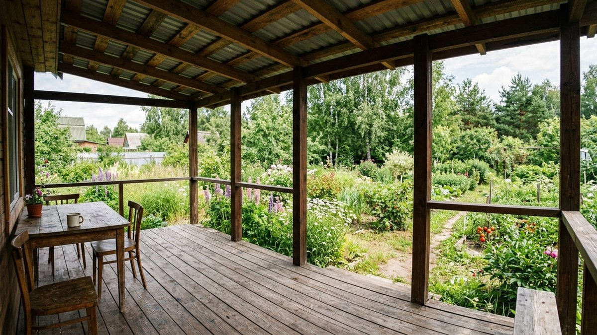
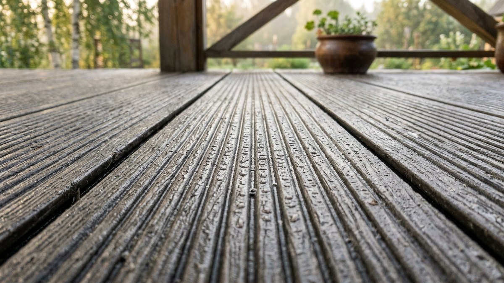
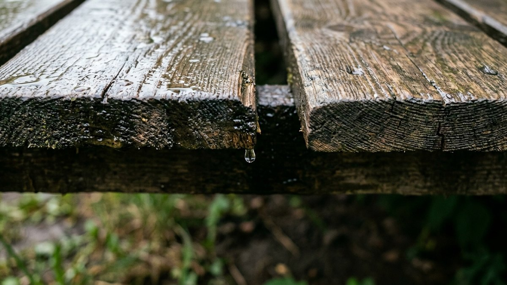
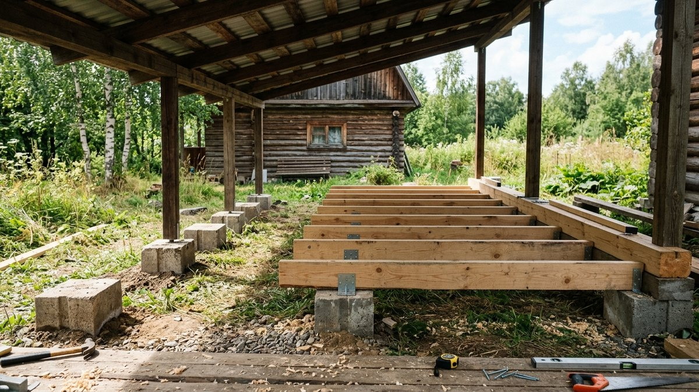
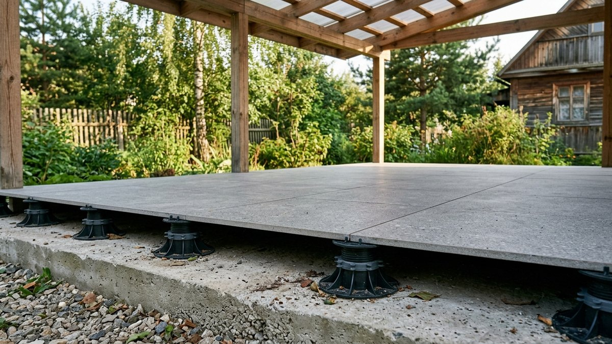
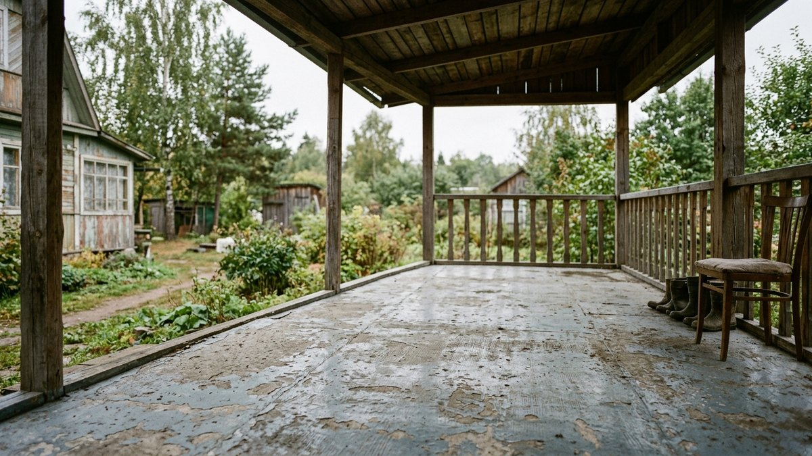

# Чем застелить пол на веранде под крышей: недорого и надолго

Открытая веранда под крышей — это не то же самое, что закрытая холодная веранда: крыша защищает пол сверху, но с боков на него так же летит косой дождь, снег и роса, а зимой — тот же уличный мороз, что и на улице, без единой стены-буфера. Материалы, которые нормально ведут себя за закрытыми окнами, здесь разбухают и трескаются за один сезон. Разберём, что выдерживает такой режим при разумном бюджете, а что сразу можно вычеркнуть.

## Чем открытая веранда под крышей отличается от закрытой

На закрытой холодной веранде пол защищён от прямых осадков стенами и остеклением — там проблема в основном в промерзании и конденсате, и разбор материалов для такого случая — в статье [пол на холодной веранде](https://mir-doma.pro/pol-na-holodnoy-verande/). У открытой веранды или террасы под навесом стен нет вообще или они закрывают только часть периметра: пол получает влагу с боков при любом ветре, УФ-излучение без защиты стекла и перепад температур без какой-либо теплоизоляции снизу. Это ближе по условиям к открытому навесу, чем к жилому помещению.

Отсюда практическое следствие: материалы для такого пола выбирают по тем же критериям, что и уличное покрытие — устойчивость к прямой воде, морозу и УФ, а не по критериям тёплого пола в доме.

## Чем застелить пол: сравнение покрытий

| Материал | Цена ориентир | Срок службы | Монтаж |
|---|---|---|---|
| Террасная доска (декинг, лиственница/термодоска) | средняя | 10–15 лет | лаги + зазор на сток воды |
| ДПК (древесно-полимерный композит) | средне-высокая | 15–25 лет | лаги, крепёж кляймерами |
| Керамогранит уличный (R11) | средняя | 20+ лет | стяжка или регулируемые опоры |
| Бетонная стяжка с окраской по бетону | низкая | 10–15 лет | заливка, гидроизоляция снизу |
| Обычная доска с промасливанием | самая низкая | 2–4 года | лаги, требует ежегодного ухода |
| Ламинат, линолеум, паркетная доска | — | не подходят | разбухают и расслаиваются от влаги за один сезон |

Ламинат и линолеум держатся только там, где нет прямого контакта с водой и перепадов влажности воздуха — на открытой веранде оба варианта вздуваются на стыках уже к концу первого дождливого месяца.

## Самый бюджетный вариант, который не сгниёт за сезон

Обычная строганая доска без обработки — не бюджетный вариант, а вариант на один сезон: без пропитки антисептиком и без вентиляционного зазора снизу она набирает влагу и начинает гнить у торцов уже к следующей осени. Дешевле в пересчёте на срок службы выходит доска, пропитанная антисептиком с УФ-фильтром и уложенная на лаги с зазором для проветривания — это не намного дороже необработанной, но держит 4–6 лет вместо 2.

Если бюджет позволяет чуть больше — термообработанная доска стоит дороже обычной, но не требует ежегодного подновления пропитки и держит форму при перепадах влажности за счёт термической обработки волокон.

## Гидроизоляция и уклон, независимо от материала

Крыша не защищает пол от воды, которая стекает по нему самому или заносится ветром сбоку, поэтому независимо от выбранного покрытия нужны:

- **Уклон 1,5–2° от дома** — чтобы вода не скапливалась у стены, а уходила к внешнему краю веранды.
- **Капельник и водосток по краю крыши** — без него вода со ската будет литься прямо на настил у внешнего края и разрушать его в разы быстрее; порядок монтажа — в статье [водосток своими руками](https://mir-doma.pro/vodostok-svoimi-rukami/).
- **Зазор между досками 3–5 мм** — для стока воды и вентиляции снизу, без него доски удерживают влагу между собой и гниют изнутри, оставаясь сухими на вид сверху.

## Монтаж: лаги и опоры

1. **Основание** — либо бетонные столбики с гидроизоляционной прокладкой, либо готовая стяжка с гидроизоляцией снизу. Дерево нигде не должно лежать прямо на грунте или голом бетоне без прокладки.
2. **Лаги** — брус или металлопрофиль с антикоррозийным покрытием, шаг 40–50 см для декинга и обычной доски, до 60 см для ДПК на жёстком каркасе.
3. **Крепёж** — только оцинкованный или нержавеющий: на открытом воздухе обычный саморез ржавеет за сезон и портит вид настила потёками.
4. **Настил** — с зазорами и уклоном, описанными выше; для плитки и керамогранита — по регулируемым опорам, которые позволяют выставить уклон без стяжки.

Если черновой деревянный пол уже есть, но подгнил или расшатался, порядок ремонта — в статье [ремонт деревянного пола](https://mir-doma.pro/remont-derevyannogo-pola/): часто дешевле заменить лаги и часть досок, чем настилать новое покрытие поверх гнилого основания.

## Частые ошибки

- **Кладут материалы для закрытых помещений** — ламинат, линолеум, паркетную доску — рассчитывая, что крыша защитит от влаги. Крыша не защищает от косого дождя и от влажности воздуха.
- **Экономят на зазорах между досками.** Плотно подогнанный настил удерживает воду между досками, и гниль начинается изнутри, незаметно для глаз.
- **Кладут доску прямо на грунт или бетон без гидроизоляционной прокладки.** Капиллярная влага поднимается в древесину снизу так же успешно, как и осадки сверху.
- **Забывают про уклон.** Без уклона вода застаивается лужами у стены дома и постепенно портит цоколь и нижний венец.

## Частые вопросы

**Чем недорого застелить пол на веранде под крышей?**
Доска, пропитанная антисептиком с УФ-фильтром, уложенная на лаги с зазором и уклоном — это дешевле декинга и ДПК, но при правильном монтаже держит 4–6 лет, а не один сезон, как необработанная доска.

**Нужно ли утеплять пол на открытой веранде?**
Нет смысла: утепление работает только в замкнутом контуре со стенами и остеклением. На открытой веранде утеплитель намокнет от бокового дождя и потеряет свойства за один сезон, а точки росы, которую он должен убирать, здесь попросту нет.

**Можно ли положить плитку на пол открытой веранды?**
Да, уличный керамогранит класса R11 с антискользящей поверхностью — один из самых долговечных вариантов, но требует стяжки с гидроизоляцией или монтажа на регулируемые опоры с уклоном.

**Что будет с ламинатом или линолеумом на открытой веранде?**
Вздуются на стыках и расслоятся от влаги воздуха и осадков в первый же сезон — оба материала рассчитаны на постоянную влажность помещения, а не на уличный режим.

**Как часто нужно обновлять пропитку деревянного настила?**
Для обычной доски — ежегодно перед началом дождливого сезона. Термообработанная доска и декинг из лиственницы держат защитный слой 3–5 лет без подновления.
