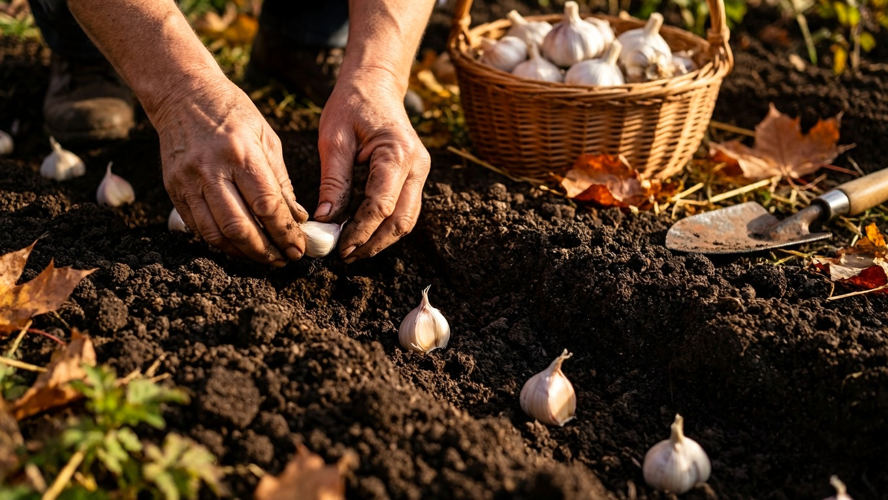
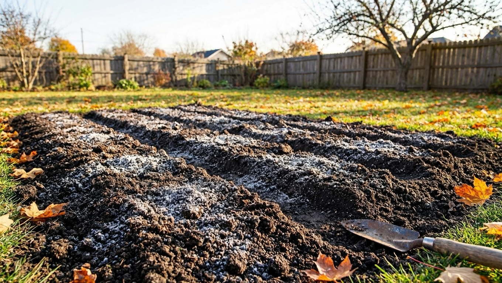
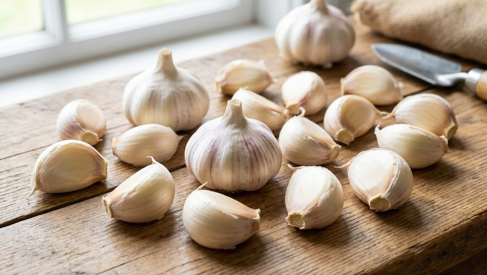
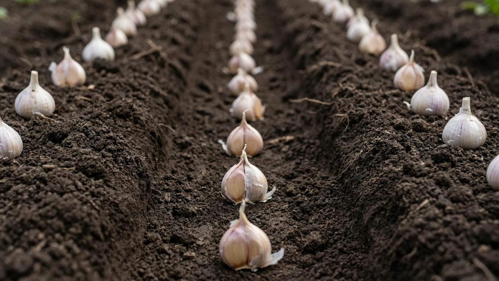
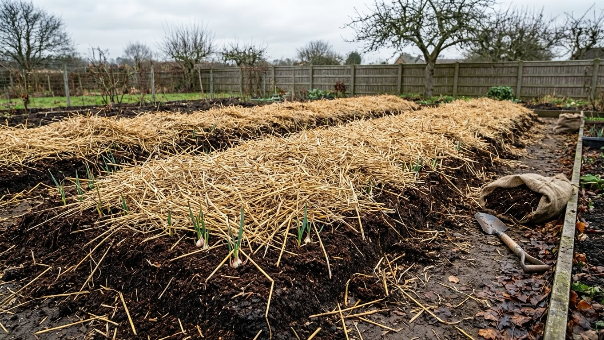
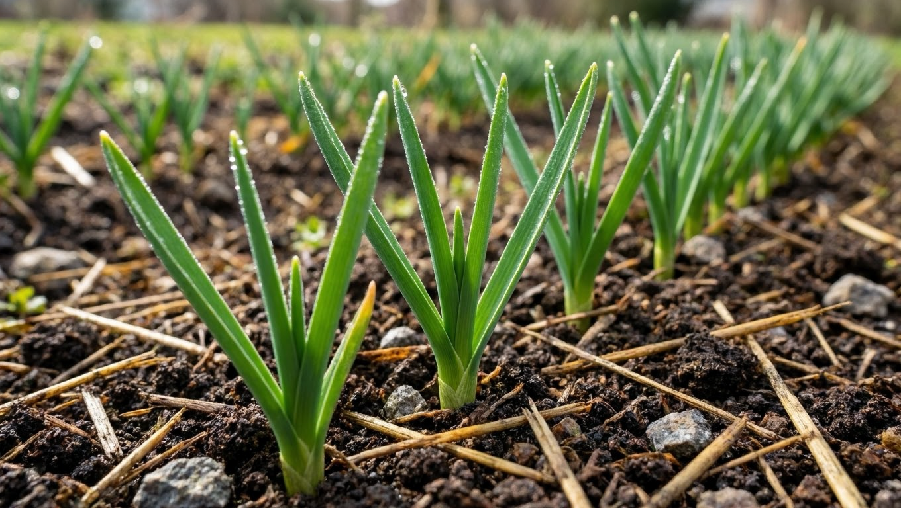

Чеснок, посаженный под зиму, даёт самый ранний и крупный урожай — недаром большинство дачников выращивают именно озимый чеснок. Посадить его несложно, но важно не ошибиться со сроками и правильно подготовить грядку: посадишь рано — зубки прорастут и вымерзнут, поздно — не успеют укорениться. В этой статье разберём, когда сажать чеснок под зиму, как выбрать и подготовить место, посадочный материал и на какую глубину сажать зубки, чтобы весной получить дружные всходы, а летом — крупные головки.

## 🧄 Почему сажают чеснок под зиму

Озимый чеснок, посаженный осенью, имеет заметные преимущества:

- **Крупные головки** — озимый чеснок обычно крупнее ярового.
- **Ранний урожай** — созревает уже к июлю.
- **Меньше хлопот весной** — не нужно спешить с посадкой в разгар работ.
- **Использует осеннюю влагу** — зубки хорошо укореняются до морозов.
- **Обгоняет сорняки** — ранние всходы развиваются быстрее сорняков.

Минус у озимого чеснока один: он хуже [хранится](https://mir-doma.pro/kak-hranit-ovoshchi-zimoy/), чем яровой, поэтому его стараются использовать в первую очередь. О том, [когда убирать чеснок](https://mir-doma.pro/kogda-ubirat-chesnok/) и как определить его зрелость, мы рассказывали отдельно.

## 📅 Когда сажать чеснок под зиму

Главное правило: чеснок сажают **за 3–4 недели до устойчивых морозов**. За это время зубки должны успеть укорениться (отрастить корни), но не тронуться в рост зелёным пером — иначе всходы вымерзнут.

Ориентировочные сроки по регионам:

- **средняя полоса** — конец сентября — октябрь;
- **южные регионы** — октябрь — ноябрь;
- **северные регионы и Урал** — сентябрь.

Точный срок определяют по погоде: сажать лучше, когда температура почвы опустится примерно до +10…+12 °C и установится прохлада, но до настоящих холодов ещё есть время. В тёплую осень посадку сдвигают на попозже. Ошибиться со сроком опасно в обе стороны: слишком ранняя посадка приводит к прорастанию и гибели всходов, слишком поздняя — к тому, что зубки уходят в зиму неукоренёнными. Поэтому за прогнозом погоды в эти недели следят особенно внимательно.

## 🌱 Выбор места и подготовка грядки

Чеснок любит солнечные, ровные места без застоя воды. Важно соблюдать севооборот:

- **Нельзя** сажать чеснок после лука и чеснока (2–3 года), иначе накапливаются болезни и вредители.
- **Хорошие предшественники** — огурцы, кабачки, бобовые, капуста, зелень.

Грядку готовят заранее: перекапывают, вносят перегной или компост, добавляют золу и фосфорно-калийные удобрения. А вот **свежий навоз под чеснок вносить нельзя** — он провоцирует болезни и рыхлые головки. Питание для растений подробно разобрано в статье о [подкормках](https://mir-doma.pro/letnie-podkormki-ovoshchey/).

## 🧄 Подготовка посадочного материала

От качества зубков зависит будущий урожай:

- **Разберите головки на зубки** прямо перед посадкой, а не заранее.
- **Отберите самые крупные и здоровые** зубки без повреждений, пятен и гнили — из мелких вырастут мелкие головки.
- **Обеззаразьте** зубки перед посадкой, выдержав их в слабом растворе марганцовки или специальном препарате.

Для посадки берут зубки от здоровых крупных головок — тогда и урожай будет крепким. Хороший посадочный материал удобно отбирать из собственного урожая: часть самых крупных головок оставляют специально на посадку.

## 🪴 Как сажать чеснок под зиму

Соблюдайте простую схему посадки:

- **Глубина** — 5–7 см от донца зубка (в холодных регионах чуть глубже, до 8–10 см).
- **Расстояние между зубками** — 8–10 см.
- **Между рядами** — 20–25 см.
- **Донцем вниз** — зубки ставят строго вертикально.

Важно **не вдавливать зубки** в плотную землю, а сажать в подготовленные бороздки или лунки: под вдавленным зубком уплотняется почва, и корням труднее расти. На дно бороздки полезно подсыпать немного песка для дренажа — он защищает донце от загнивания. После посадки бороздки засыпают почвой и слегка разравнивают грядку, не утрамбовывая.

## 🍂 Мульчирование на зиму

После посадки грядку мульчируют — это защищает зубки от вымерзания, особенно в бесснежные морозы. В качестве мульчи используют торф, перегной, солому, опавшую листву или лапник слоем 3–5 см. В регионах с холодными малоснежными зимами мульчирование особенно важно — без снежного покрова именно мульча спасает зубки от вымерзания. А вот в тёплых южных краях с укрытием можно не усердствовать. Если стоит сухая осень, грядку после посадки один раз поливают, чтобы зубки начали укореняться.

## ❄️ Весенний уход

Весной, когда сойдёт снег, лишнюю мульчу убирают или прореживают, чтобы всходы легко пробились. Дальнейший уход прост:

- подкормите чеснок азотным удобрением для роста зелени;
- рыхлите почву и удаляйте сорняки;
- поливайте в засуху, прекращая полив за 2–3 недели до уборки;
- у стрелкующегося чеснока обламывайте стрелки (кроме оставленных на семена-бульбочки), чтобы головки были крупнее.

Такой уход обеспечит дружные всходы и крупные головки к середине лета.

## 🛡️ Частые ошибки

- **Слишком ранняя посадка.** Зубки прорастают до морозов, и всходы вымерзают. Сажайте за 3–4 недели до холодов.
- **Слишком поздняя посадка.** Зубки не успевают укорениться и вымерзают. Не тяните до морозов.
- **Свежий навоз.** Провоцирует болезни и рыхлые головки. Вносите только перегной и золу.
- **Посадка после лука и чеснока.** Накапливаются болезни. Соблюдайте севооборот.
- **Слишком мелкая посадка.** Зубки вымерзают. Выдерживайте глубину 5–7 см и мульчируйте.
- **Вдавливание зубков.** Уплотняет почву под донцем. Сажайте в бороздки, не вдавливая.

## ❓ Частые вопросы

### Когда сажать чеснок под зиму?

Чеснок сажают под зиму за 3–4 недели до устойчивых морозов, чтобы зубки укоренились, но не проросли. В средней полосе это обычно конец сентября — октябрь, на юге — октябрь-ноябрь, на севере — сентябрь. Точный срок определяют по погоде: когда почва остынет примерно до +10…+12 °C.

### На какую глубину сажать чеснок под зиму?

Зубки сажают на глубину 5–7 см от донца, а в холодных регионах — чуть глубже, до 8–10 см, чтобы они не вымерзли. Между зубками оставляют 8–10 см, между рядами — 20–25 см. Зубки ставят донцем вниз в бороздки, не вдавливая в землю.

### Нужно ли мульчировать чеснок после посадки?

Да, мульчирование торфом, перегноем, листвой или соломой защищает зубки от вымерзания, особенно в морозные малоснежные зимы. Слой мульчи делают 3–5 см. Весной, когда сойдёт снег, лишнюю мульчу убирают, чтобы всходы легко пробились.

### После чего можно сажать чеснок?

Хорошие предшественники для чеснока — огурцы, кабачки, бобовые, капуста и зелень. А вот после лука и чеснока сажать нельзя 2–3 года, иначе в почве накапливаются болезни и вредители. Соблюдение севооборота — залог здорового урожая.

### Можно ли сажать чеснок под зиму весенним (яровым) сортом?

Под зиму сажают именно озимые сорта — они приспособлены к зимовке в почве. Яровой чеснок для подзимней посадки не подходит: он рассчитан на весеннюю посадку и в мороз может погибнуть. Для осенней посадки берут озимый чеснок, желательно из собственного проверенного урожая.

### Надо ли поливать чеснок после посадки под зиму?

Если осень сухая, грядку после посадки поливают один раз, чтобы зубки начали укореняться. При влажной осенней погоде дополнительный полив не нужен — почве и так хватает влаги. Главное, чтобы к моменту морозов зубки успели отрастить корни.

### Чем подкормить чеснок весной?

Весной для наращивания зелени чеснок подкармливают азотными удобрениями, а позже, для формирования головок, — фосфорно-калийными. Первую подкормку дают после появления всходов. Сбалансированное питание помогает получить крупные и крепкие головки.

## Заключение

Чеснок под зиму — это ранний и крупный урожай при минимуме весенних хлопот. Главное — посадить озимый чеснок за 3–4 недели до морозов, выбрать солнечное место с учётом севооборота, подготовить грядку с перегноем и золой (но без свежего навоза), отобрать крупные здоровые зубки и посадить их на глубину 5–7 см донцем вниз, а затем замульчировать грядку. Весной останется лишь убрать мульчу, подкормить и ухаживать за посадками — и к середине лета вы соберёте отличный урожай крупного чеснока. Посадка под зиму отнимает всего один осенний день, а отдача — самая ранняя и щедрая за сезон.

А когда и как сажаете чеснок под зиму вы? Делитесь опытом в комментариях и подписывайтесь, чтобы не пропустить новые статьи об урожае.
