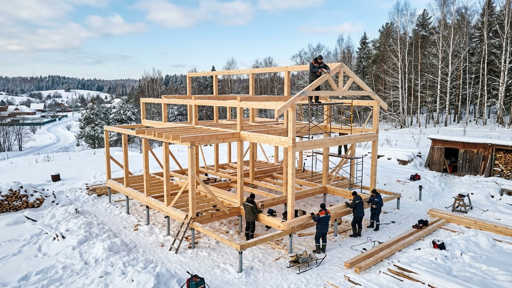
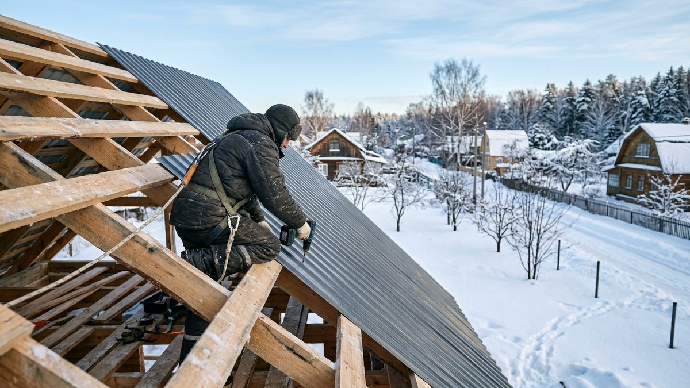
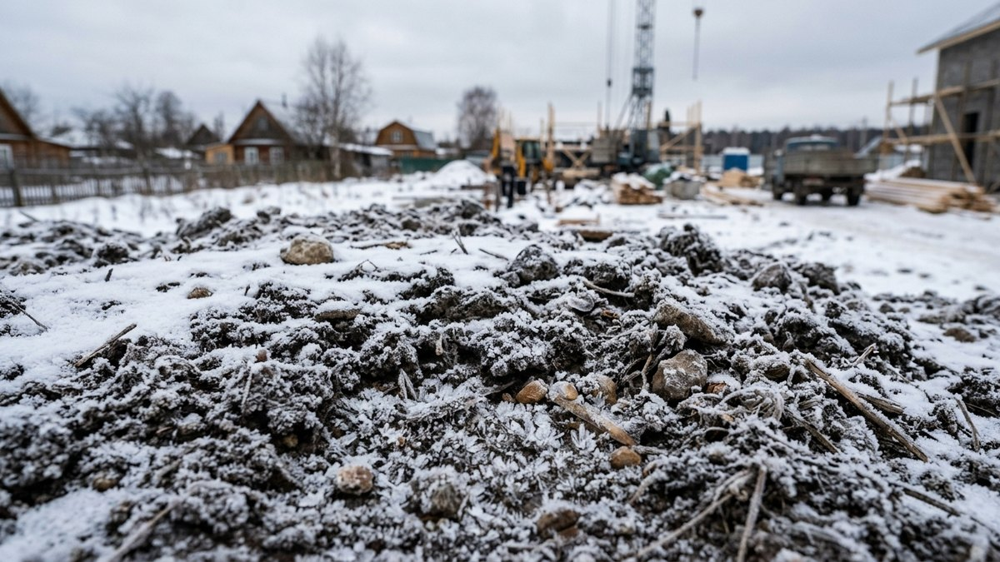
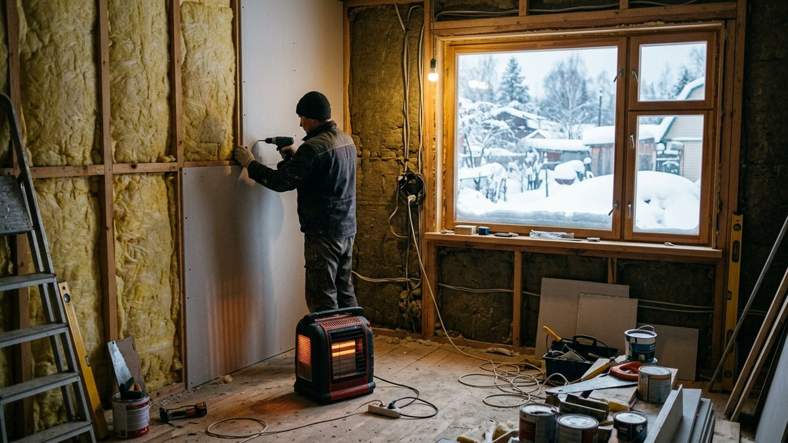
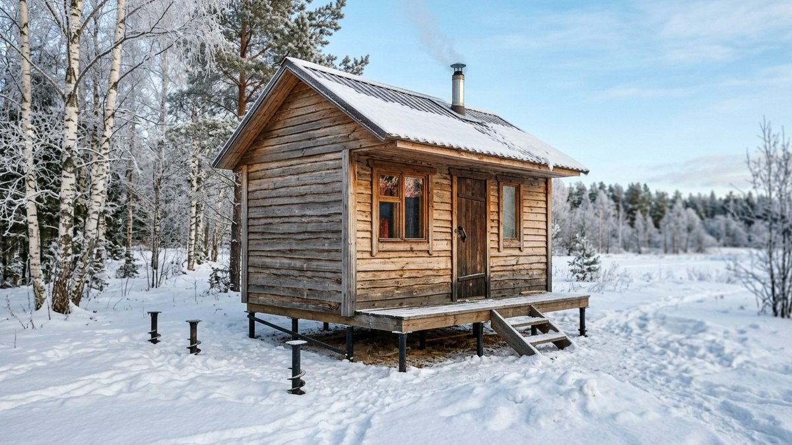
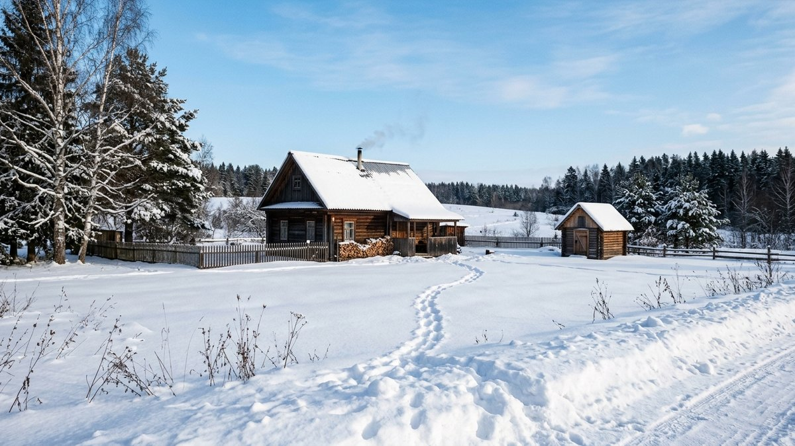

# Что можно построить на участке зимой: работы, которые не ждут тепла

Зима на участке — не значит стройка встала до весны. Часть работ зимой идёт
даже лучше, чем летом: сухой снег вместо грязи под ногами, промёрзший грунт
держит технику, а бригады и материалы в несезон дешевле. Разберём, что
реально строить в мороз, а что откладывать до тепла — и почему.

## Что можно строить зимой без проблем

### Каркасные постройки на винтовых сваях

Хозблок, каркасная баня, беседка или гараж на винтовых сваях не требуют
заливки бетона — свая вкручивается в грунт в любой мороз, кроме случаев
экстремального промерзания у самой поверхности. Дальше идёт обвязка, каркас
и обшивка — вся работа поверх свай не зависит от температуры грунта.
Пошаговый разбор такой конструкции — в статье
[как построить баню на даче](https://mir-doma.pro/kak-postroit-banyu-na-dache/), а
расчёт материала на лёгкий каркасный навес по той же логике свайного
основания — в статье
[расчёт навеса из профильной трубы](https://mir-doma.pro/raschet-navesa-iz-profilnoy-truby/).

### Кровельные и фасадные работы на готовой коробке

Если коробка уже стоит под крышей с прошлого сезона, кровлю и обшивку фасада
можно продолжать зимой — сухой снег легко счищается, а дождя, который мешает
монтажу большинства кровельных материалов, зимой просто нет. Основное
ограничение — работа на высоте при сильном морозе и обледенении настила,
здесь решает уже техника безопасности, а не материал.

### Внутренняя отделка и утепление

Работы внутри уже закрытой снаружи коробки — отделка, утепление, электрика —
идут независимо от погоды на улице: температуру внутри держат тепловой
пушкой или временным обогревателем. Это одна из причин, почему опытные
строители стараются закрыть контур (кровля, окна, двери) до холодов —
дальше стройка продолжается в тепле независимо от сезона.

### Бурение скважины на воду

Зимой грунт промерзает и держит буровую технику лучше, чем раскисшая земля
межсезонья — меньше грязи на участке, легче подъезд техники. Если
водоснабжение ещё не решено, зима — рабочее время для бурения, не
вынужденная пауза. Что выбрать для конкретного участка — скважину или
колодец — разобрано в статье
[скважина или колодец](https://mir-doma.pro/skvazhina-ili-kolodec/).

## Что зимой лучше не начинать

### Заливка монолитного фундамента без зимних присадок

Бетон набирает прочность за счёт химической реакции, которая на морозе
замедляется или останавливается — вода в смеси замерзает раньше, чем бетон
успевает схватиться, и прочность падает необратимо. Заливка зимой возможна
только с противоморозными присадками и прогревом (греющий кабель, тепляк),
что заметно удорожает работу. Для большинства дачных построек проще
дождаться плюсовых температур или заранее выбрать свайный фундамент, который
не требует заливки вообще — сравнение типов под конкретный грунт и нагрузку
разобрано в статье
[какой фундамент выбрать для дома](https://mir-doma.pro/kakoy-fundament-vybrat-dlya-doma/).

### Кладка кирпича и блоков на обычном растворе

Как и с бетоном, обычный кладочный раствор на морозе не набирает прочность —
нужны противоморозные добавки или прогрев кладки, и даже с ними риск выше,
чем при летней кладке. Для дачных построек это тот случай, когда сроки лучше
сдвинуть, чем платить за зимние технологии ради экономии пары месяцев.

### Земляные работы в глубоко промёрзшем грунте

Копать котлован под погреб или траншею под коммуникации в грунте,
промёрзшем на полметра и глубже, — трудоёмко и дорого: технике и людям
приходится сначала пробивать мёрзлый слой. Разовые скважины и точечные
углубления под сваи — не проблема, а вот масштабные земляные работы обычно
откладывают до оттепели.

## Почему зимой строить иногда выгоднее

Спрос на бригады и материалы падает в несезон — расценки на работу зимой
часто ниже, чем в разгар лета, когда очередь к хорошим мастерам расписана на
месяцы вперёд. Материалы дешевеют по той же причине: поставщики снижают
цены, чтобы не простаивать до весны. Для работ, которые не зависят от
температуры (винтовые сваи, кровля на готовой коробке, внутренняя отделка),
зима — не вынужденная пауза, а способ сэкономить на самой дорогой статье
расхода — работе бригады.

## Таблица: что можно, а что нет

| Работа | Зимой | Комментарий |
|---|---|---|
| Винтовые сваи | ✅ | Кроме экстремального промерзания у поверхности |
| Кровля на готовой коробке | ✅ | Мешает только гололёд на настиле |
| Обшивка фасада | ✅ | Сухой снег не мешает монтажу |
| Внутренняя отделка | ✅ | С временным обогревом помещения |
| Бурение скважины | ✅ | Грунт держит технику лучше, чем в межсезонье |
| Монолитный фундамент | ⚠️ | Только с присадками и прогревом — дороже |
| Кладка кирпича/блоков | ⚠️ | Нужны зимние технологии, риск выше летнего |
| Земляные работы (котлован) | ❌ | Промёрзший грунт трудоёмок для техники |

## Частые ошибки

- **Заливка фундамента зимой без присадок «на глаз».** Бетон может выглядеть
  схватившимся, но не набрать проектную прочность — трещины проявятся уже
  после нагрузки весной.
- **Игнорирование техники безопасности на высоте в мороз.** Обледеневшая
  кровля и настил лесов зимой опаснее летних условий сами по себе, отдельно
  от материала.
- **Перенос земляных работ на зиму без необходимости.** Если котлован можно
  выкопать осенью до промерзания, не стоит откладывать его на морозный
  период ради параллельности с другими работами.
- **Работа с деревом при экстремальном морозе без акклиматизации материала.**
  Пиломатериал, занесённый с холода сразу в тёплое помещение под обшивку,
  должен отлежаться и выровнять влажность — иначе поведёт после монтажа.

## Частые вопросы

### Можно ли заливать фундамент зимой

Можно, но только с противоморозными присадками в бетон и часто с прогревом
(греющий кабель или тепляк) — без них бетон не набирает прочность на
морозе. Для дачных построек чаще проще дождаться тепла или выбрать свайный
фундамент, который вообще не требует заливки.

### Можно ли строить баню или хозблок зимой

Да, если конструкция на винтовых сваях — свая вкручивается в любой мороз,
а дальше каркас, обвязка и обшивка не зависят от температуры воздуха.
Ограничение только на бетонные работы, если фундамент выбран монолитный.

### Дешевле ли строить зимой

Часто да — расценки бригад и цены на материалы в несезон ниже, чем летом,
когда спрос на строительство и на мастеров на пике. Экономия ощутима на
работах, которые технологически не зависят от температуры.

### Что точно нельзя строить зимой

Земляные работы в глубоко промёрзшем грунте (котлован, траншеи) и кладка
кирпича или блоков на обычном растворе без зимних присадок — обе работы
резко дорожают или теряют качество при отрицательных температурах.

