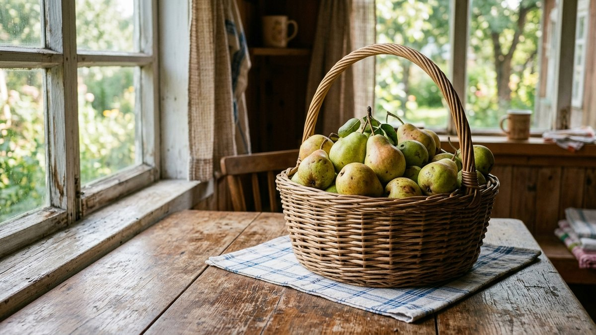
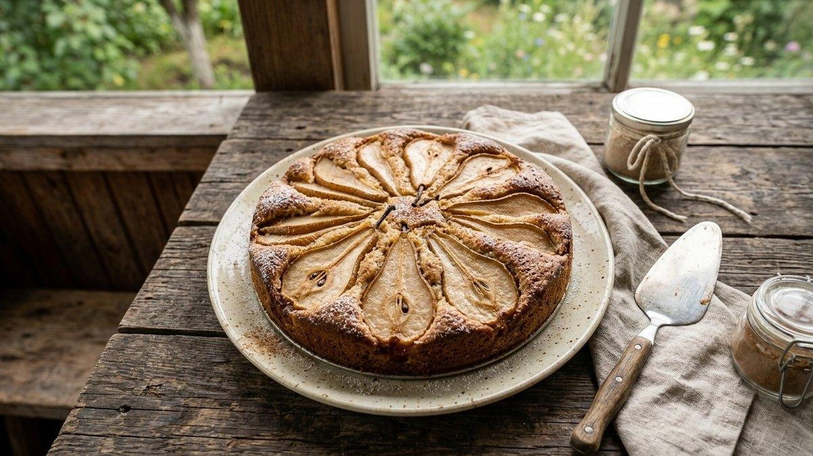
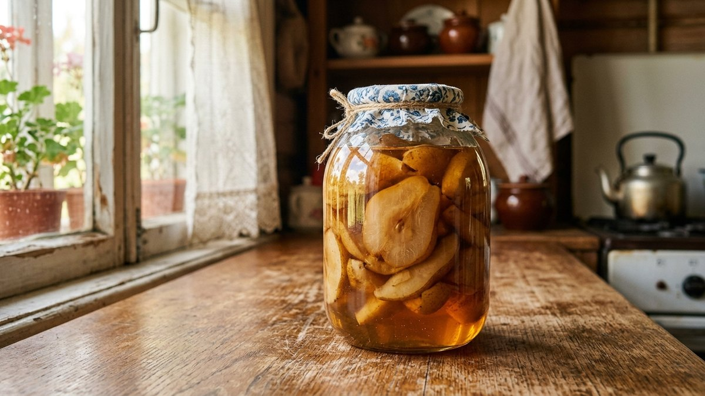
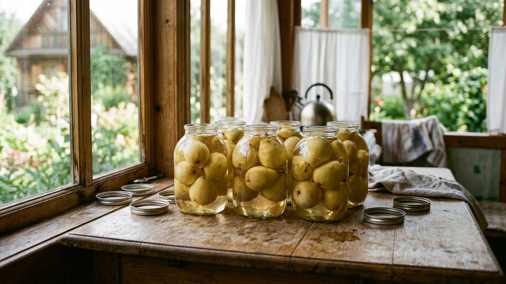
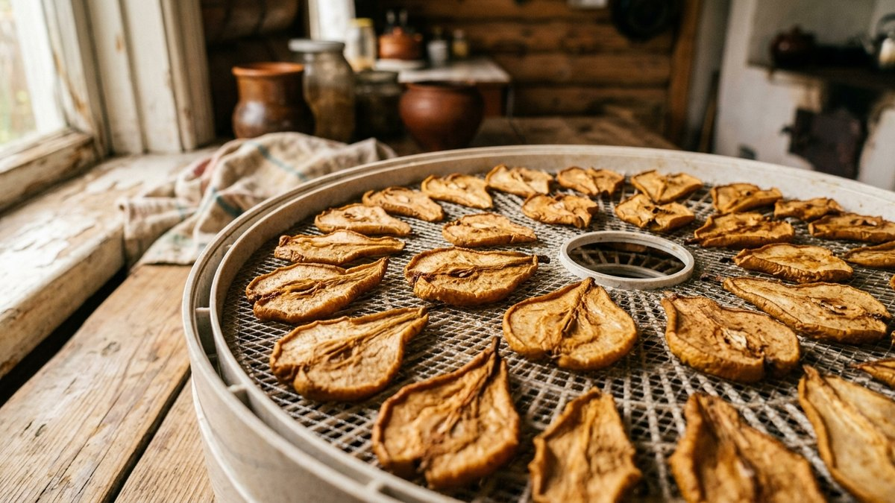
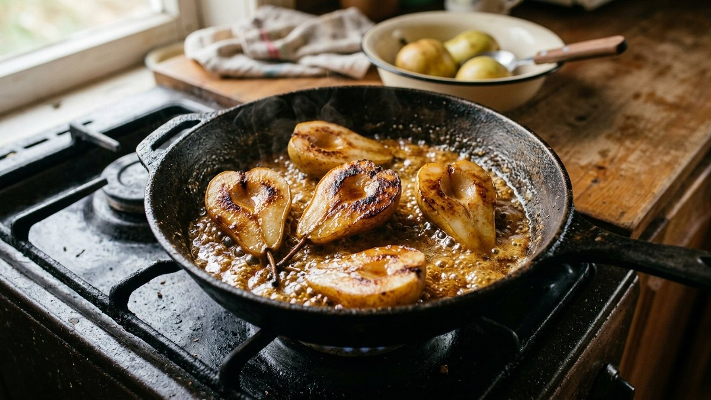

# Что приготовить из груш: простые рецепты и заготовки на зиму

Груши портятся быстрее яблок: перезревший плод за пару дней превращается в мягкую труху, а недозрелый так и остаётся деревянным. Если урожай поспел разом, тянуть с переработкой нельзя. Разберём, что приготовить из груш сразу — пирог и десерты — и что закрыть на зиму, пока плоды ещё держат форму.

## Чем груши урожая отличаются от магазинных

Садовые груши обычно менее сладкие и более плотные, чем магазинные сорта, зато лучше держат форму при варке и не превращаются в кашу в компоте. Твёрдые и слегка недозрелые плоды идут в заготовки, требующие термообработки — компот, варенье дольками; мягкие и переспевшие лучше сразу пустить на пюре, джем или начинку для пирога, где консистенция уже не важна.

## Пирог с грушами

Простой вариант для быстрой переработки небольшого количества плодов.

1. Груши очистить, нарезать дольками толщиной 5–7 мм.
2. Тесто — как для шарлотки: яйца, сахар, мука и разрыхлитель в равных примерно частях по объёму.
3. Дольки груш выложить веером по дну формы или вмешать в тесто целиком — груша даёт меньше сока, чем яблоко, поэтому тесто не расползается.
4. Выпекать 35–40 минут при 180°C до сухой лучины.

Корица или ваниль подчёркивают вкус груши сильнее, чем у яблочной шарлотки — плод менее кислый, и специи не забиваются кислинкой.

## Грушевое варенье на зиму

1. Груши нарезать дольками или кубиками, недозрелые — предварительно бланшировать 2–3 минуты в кипятке, чтобы не разварились в сироп.
2. Сироп — на 1 кг груш 700–800 г сахара и 200 мл воды.
3. Варить в три захода по 15 минут с перерывами по 4–6 часов — так дольки остаются целыми, а не превращаются в повидло.
4. Разложить горячим по стерилизованным банкам, закатать.

Если хочется однородной массы, а не варенья дольками, время варки в один заход можно увеличить до полного разваривания — получится грушевый джем, который заменяет повидло.

## Компот из груш на зиму

Компот — самый быстрый способ закрыть большой объём урожая без долгой варки. Общие пропорции сиропа, время стерилизации и порядок закатки такие же, как в статье [компот на зиму](https://mir-doma.pro/kompot-na-zimu/); разница в самих плодах:

- Твёрдые груши держат форму при заливке кипятком дважды — этот способ (двойная заливка без варки) подходит лучше, чем для мягких фруктов.
- Кожуру у груш обычно не снимают — она не грубеет при варке так, как у некоторых сортов яблок.
- Целую грушу небольшого размера можно закатывать без нарезки — она проваривается насквозь за счёт тонкой мякоти у сердцевины.

## Сушёные груши

Сушка — способ сохранить урожай без сахара и стерилизации. Дольки толщиной 5–8 мм раскладывают в один слой и сушат в электросушилке при 55–60°C 8–12 часов либо в духовке с приоткрытой дверцей при той же температуре. Готовая долька гнётся, но не ломается и не липнет. Хранят сушёные груши в тканевых мешочках или бумажных пакетах — в герметичной таре без доступа воздуха они отсыревают быстрее, чем яблочные дольки, из-за более высокого содержания сахара.

## Что ещё приготовить из груш

- **Груши в карамели** — быстрый десерт: половинки груш обжаривают на сливочном масле с сахаром до карамельной корочки, 5–7 минут на среднем огне.
- **Груши дольками в лёгком сиропе** — заготовка для пирогов и десертов зимой, готовится как компот, но с меньшим количеством жидкости и большей концентрацией сиропа.
- **Груши, замороженные дольками**, — общий порядок заморозки фруктов и то, что для этого не подходит, разобран в статье [что заморозить на зиму](https://mir-doma.pro/chto-zamorozit-na-zimu/).

## Частые ошибки

- **Берут перезревшие груши для компота.** Они разваливаются при заливке кипятком и превращают компот в мутную жижу с плавающей мякотью.
- **Не бланшируют твёрдые груши перед вареньем.** Без бланширования дольки остаются жёсткими даже после долгой варки в сиропе.
- **Хранят сушку в закрытой пластиковой таре.** Из-за высокого содержания сахара сушёные груши отсыревают в герметичной упаковке быстрее, чем яблоки.
- **Тянут с переработкой урожая.** Груши теряют товарный вид за 2–3 дня после полного созревания — в отличие от яблок, которые можно хранить неделями свежими.

## Частые вопросы

**Что приготовить из груш быстро, если урожай уже перезревает?**
Пюре, джем или начинку для пирога — эти рецепты не требуют, чтобы плоды держали форму, и перерабатывают даже перезревшие груши без потерь.

**Нужно ли снимать кожуру с груш перед консервацией?**
Не обязательно: кожура у большинства садовых груш не грубеет при варке. Снимать её имеет смысл только для пюре, где текстура должна быть однородной.

**Можно ли использовать недозрелые груши для заготовок?**
Да, для компота и варенья дольками недозрелые плоды даже предпочтительнее — они лучше держат форму и не разваливаются при термообработке.

**Сколько хранится грушевое варенье в закатанных банках?**
При герметичной закатке и стерилизации — до 1–2 лет в тёмном прохладном месте, как и большинство сахарных заготовок.

**Чем груши в заготовках отличаются от яблок?**
Груши менее кислые, поэтому в варенье и компот часто добавляют лимонную кислоту для баланса вкуса и лучшей сохранности — у яблок это обычно не требуется.
