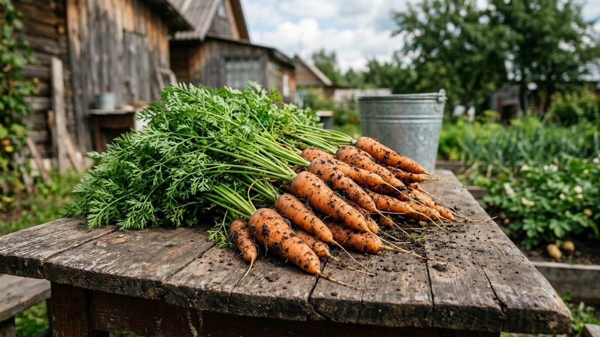
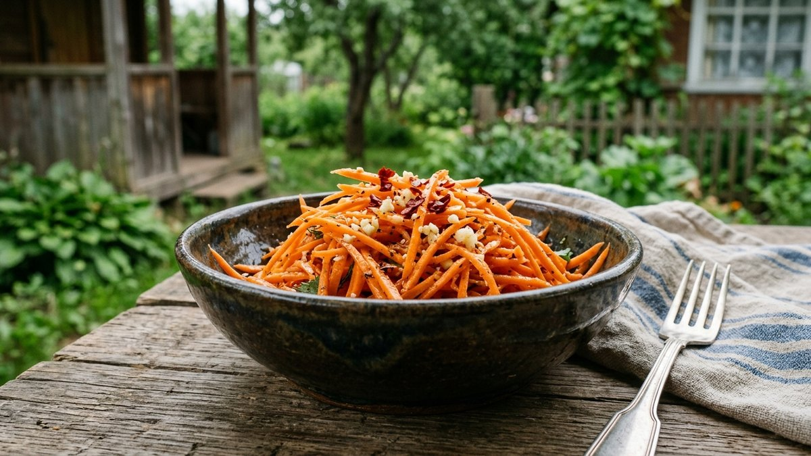
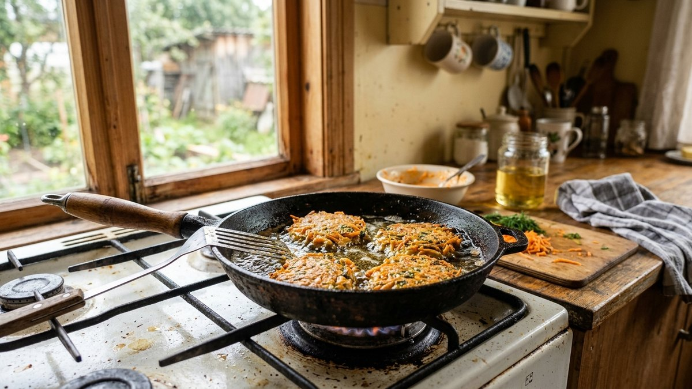
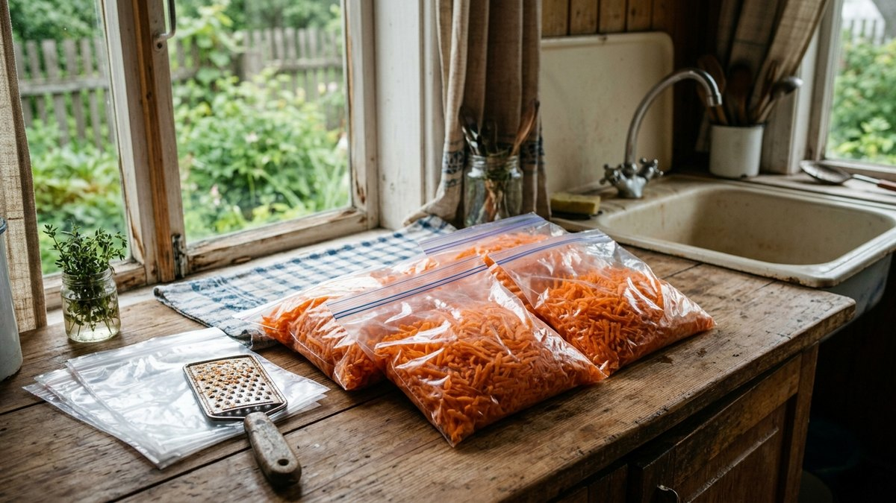
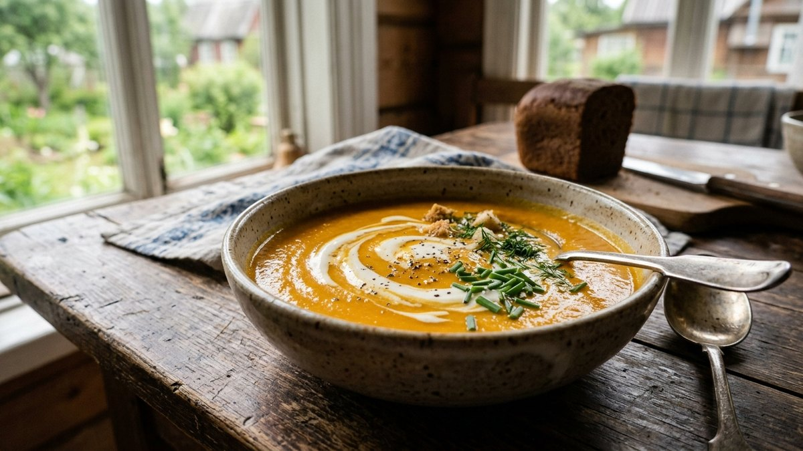

# Что приготовить из моркови: простые рецепты и заготовки на зиму

После уборки урожая моркови обычно остаётся куда больше, чем нужно для
супов и рагу за неделю. Разберём несколько простых блюд для повседневного
стола, заготовки на зиму и что делать с морковной ботвой, которую обычно
просто выбрасывают. Если морковь убирали в один день с кабачками или
тыквой, подборки для них — в статьях [что приготовить из
кабачков](https://mir-doma.pro/blyuda-iz-kabachkov-recepty/) и [что
приготовить из тыквы](https://mir-doma.pro/chto-prigotovit-iz-tykvy/).

## Какую морковь брать под какое блюдо

Сладкие сортовые корнеплоды (ранние сорта, ярко-оранжевые, тонкие) лучше
идут в сыром виде — салаты, соки, морковь по-корейски. Крупная столовая
морковь позднего сбора чуть грубее по вкусу, зато отлично держит форму
при варке и тушении — для супов, рагу и выпечки разница почти не заметна,
а хранится такая морковь дольше.

## Морковь по-корейски

Классика домашних заготовок: морковь тонко нашинковать соломкой (лучше на
тёрке для корейской моркови), посолить и оставить на 20–30 минут, пока не
пустит сок. Отдельно раскалить растительное масло с чесноком, кориандром и
красным перцем до появления запаха, залить морковь горячим маслом,
добавить уксус и сахар по вкусу, перемешать. Дать настояться в холодильнике
не менее 3–4 часов, лучше ночь.

## Морковный суп-пюре с имбирём

Морковь и лук обжарить до мягкости, добавить тёртый имбирь и щепотку
куркумы, залить бульоном или водой, варить 15–20 минут до мягкости моркови.
Пробить блендером до однородности, посолить, при подаче добавить ложку
сливок или сметаны. Согревающий суп, который хорошо заходит и в сезон
простуд.

## Морковные оладьи

Морковь натереть на мелкой тёрке, отжать лишний сок, смешать с яйцом,
мукой, щепоткой соды и солью до консистенции густого теста. Жарить на
среднем огне по 2–3 минуты с каждой стороны до золотистой корочки. Подают
со сметаной — быстрый завтрак или лёгкий ужин из того, что уже есть в
погребе.

## Морковный кекс

Морковь мелко натереть, смешать с мукой, сахаром, яйцами, растительным
маслом, корицей и разрыхлителем. Выпекать при 180°C 35–40 минут до сухой
зубочистки. По желанию — грецкие орехи или изюм в тесто, сверху — крем-сыр
или просто сахарная пудра. Хорошо хранится несколько дней, не черствея
благодаря маслу в составе.

## Заготовки на зиму

- **Заморозка тёртой или нарезанной кубиками моркови** — самый быстрый
  способ сохранить урожай. Морковь моют, чистят, натирают или режут,
  раскладывают по пакетам порциями и замораживают — зимой сразу идёт в
  суп или рагу без разморозки.
- **Морковь по-корейски впрок** — та же заготовка, что выше, но в
  увеличенном объёме, расфасованная по банкам и хранящаяся в холодильнике
  до 2–3 недель.
- **Морковное пюре для заморозки** — отваренная и пробитая блендером
  морковь, удобна как основа для детского питания или загустителя супов.
- **Сушка моркови** — тонкие ломтики или соломка, высушенные в духовке при
  низкой температуре или в сушилке для овощей, хранятся в сухом виде
  месяцами и идут в супы и рагу зимой.

Если морковь идёт не только на заморозку, а ещё и в банки — в лечо, икру
или маринады — сроки хранения там считаются иначе, чем для морозилки: смотрите
[таблицу сроков хранения заготовок](https://mir-doma.pro/skolko-hranyatsya-zagotovki/).

## Морковная ботва — не выбрасывайте

Молодая свежая ботва моркови съедобна и идёт в дело: мелко порубленная —
в салаты вместо части зелени, отваренная — в супы как добавка к обычной
зелени, а измельчённая с маслом, чесноком и орехами — в домашний песто с
характерной травяной горчинкой. Грубую ботву позднего сбора лучше не
использовать — она жёстче и горчит заметнее молодой. У свёклы тот же
принцип работает с молодыми листьями — их тоже не стоит выбрасывать,
разбор — в статье [что приготовить из свёклы](https://mir-doma.pro/chto-prigotovit-iz-svyokly/).

## Частые ошибки

- **Морковь по-корейски без предварительного просаливания.** Без этого шага
  морковь остаётся жёсткой и не пускает сок, заготовка получается сухой.
- **Заморозка немытой и неочищенной моркови.** После разморозки чистить
  кожуру уже неудобно — грязь и песок фиксируются в текстуре овоща.
- **Слишком долгая варка моркови в супе-пюре.** Переваренная морковь теряет
  сладость и часть вкуса — 15–20 минут обычно достаточно до мягкости.
- **Использование грубой ботвы позднего сбора в пищу.** Горчит заметно
  сильнее молодой и портит вкус блюда.

## Частые вопросы

### Сколько хранится морковь в свежем виде

В погребе при температуре около 0…+2 °C и высокой влажности — до полугода
и дольше при правильном хранении в песке или пересыпанной опилками. При
комнатной температуре морковь вянет за одну-две недели. Общий разбор
условий хранения овощей зимой в погребе и дома — в статье [как хранить
овощи зимой](https://mir-doma.pro/kak-hranit-ovoshchi-zimoy/).

### Можно ли замораживать морковь сырой

Да, тёртую или нарезанную кубиками морковь замораживают сырой без
предварительной бланшировки — для супов и рагу разница в текстуре почти
не заметна, а времени экономится больше.

### Что приготовить из моркови быстро, без духовки

Морковные оладьи на сковороде или морковь по-корейски — оба рецепта не
требуют духовки и готовятся за 20–30 минут активного времени, хотя
корейская морковь ещё требует времени на настаивание в холодильнике.

### Почему морковь иногда горчит

Горечь чаще всего дают перезревшие или подмороженные на грядке
корнеплоды, а также верхняя часть моркови у самой ботвы — её можно срезать
перед готовкой, если горечь заметна именно там.

