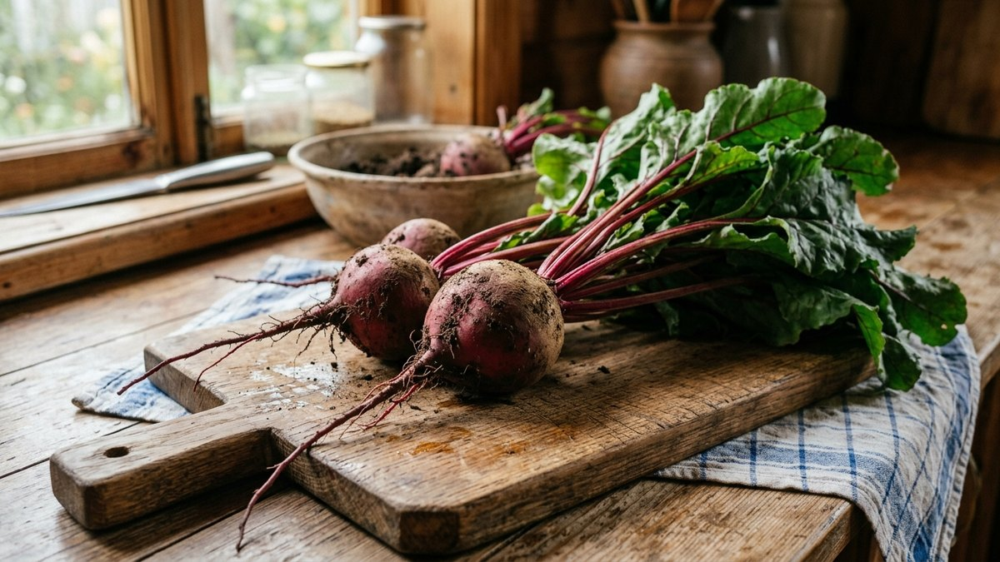
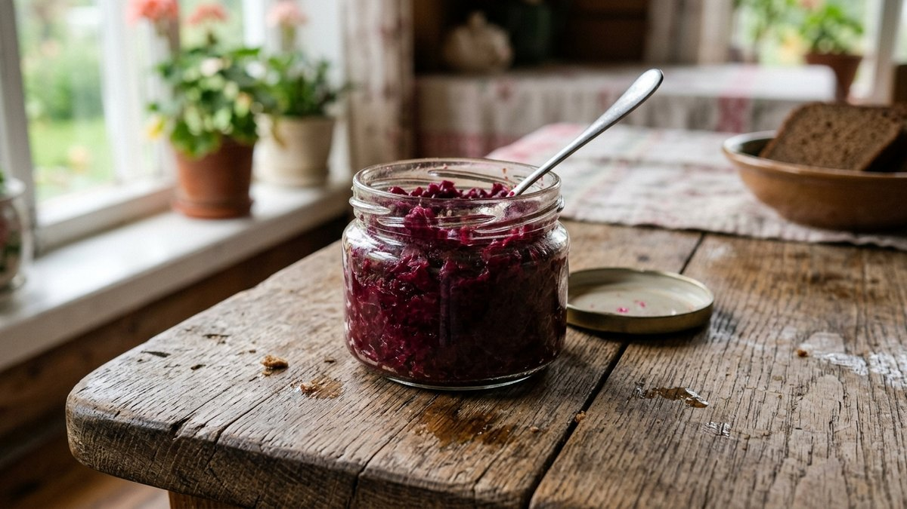
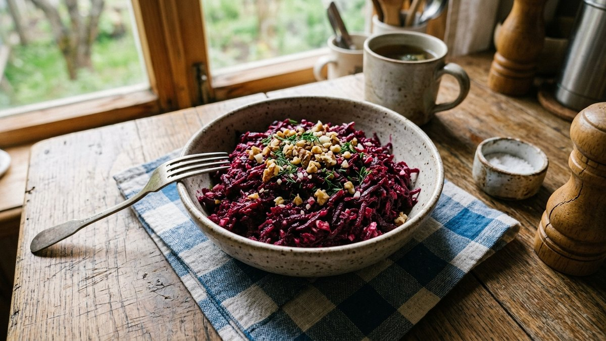
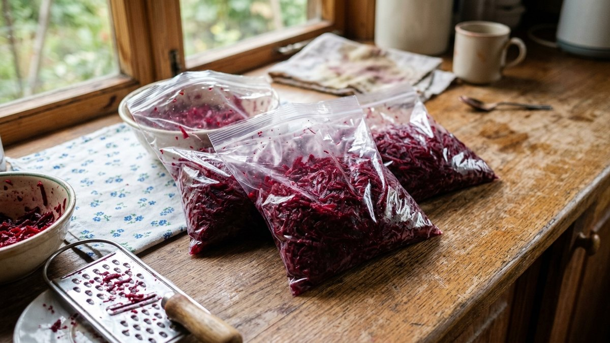
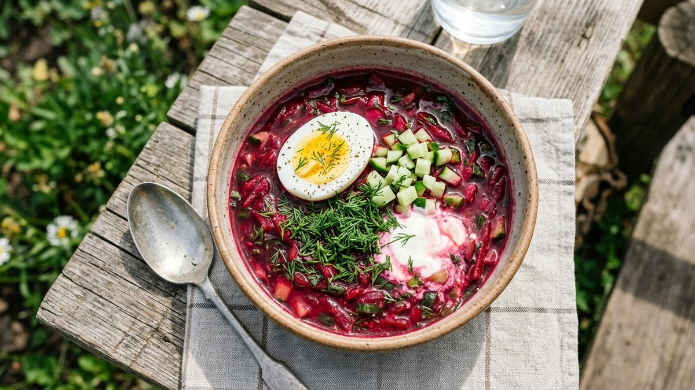
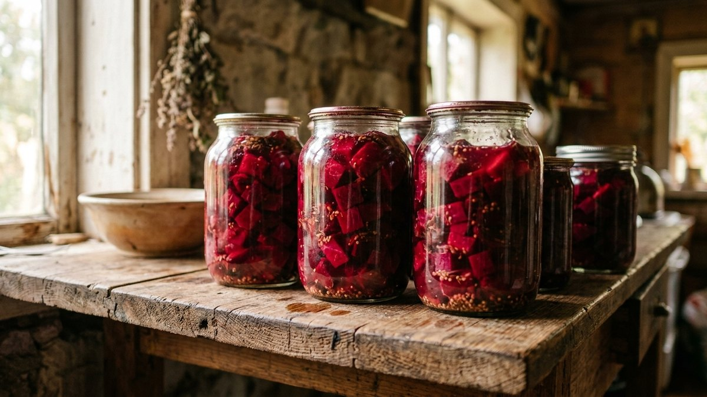

Ведро свёклы с грядки редко заканчивается одним борщом — рано или поздно
корнеплод начинает залёживаться в погребе, пока не найдётся, куда его
пристроить. Разбираем простые рецепты из свёклы: от борщевой заправки
впрок до салатов и икры, которые не стыдно поставить на праздничный стол,
и что сделать с молодой ботвой, пока грядка ещё не убрана до конца.

## Какую свёклу брать под какое блюдо

Не вся свёкла одинаково хороша для разных блюд. Крупные плотные корнеплоды
без сильных прожилок идут на заправки и заготовки, где текстура значения
не имеет — их всё равно натирают или пюрируют. Для салатов и подачи
кусочками лучше выбирать среднего размера свёклу без белых колец на срезе
— наличие колец говорит о жёсткой сердцевине и водянистом вкусе. Молодая
свёкла с грядки, ещё не успевшая нарастить толстую кожуру, хороша в
холодных супах и лёгких салатах — у неё нежнее вкус и меньше земляного
привкуса, который многим не нравится в зрелых корнеплодах.

## Борщевая заправка впрок

Самый практичный способ переработать много свёклы за раз — заправка,
которую остаётся просто добавить в кастрюлю зимой.

1. Свёклу (2 кг) очистить и натереть на крупной тёрке.
2. Морковь (0,5 кг) и лук (0,5 кг) нарезать или натереть отдельно.
3. Обжарить лук и морковь на растительном масле 5–7 минут, добавить
   свёклу, влить 100 мл воды или томатного сока, тушить под крышкой
   15–20 минут до мягкости.
4. Добавить 2 ст. л. уксуса или сок половины лимона — кислота сохраняет
   яркий цвет свёклы при хранении и не даёт ей потемнеть.
5. Разложить горячим по стерилизованным банкам, закатать.

Такая заправка хранится в прохладном месте до года и сокращает готовку
борща до 15–20 минут — остаётся только заложить капусту и картофель.

## Свекольная икра

Похожа по консистенции на кабачковую, но с более насыщенным сладковатым
вкусом. Свёклу (1 кг) отварить или запечь до мягкости, остудить, натереть
или пробить блендером до состояния пасты. Обжарить с луком и морковью,
добавить пару ложек томатной пасты, чеснок по вкусу, соль и немного
сахара для баланса. Тушить 10 минут на слабом огне — икра готова как
самостоятельная закуска или начинка для бутербродов.

## Салат с чесноком и орехами

Отварную или запечённую свёклу натереть на крупной тёрке, добавить
измельчённый чеснок (1–2 зубчика на среднюю свёклу), горсть грецких
орехов и заправить майонезом или сметаной с ложкой растительного масла.
Настаивается лучше 20–30 минут в холодильнике — вкус чеснока и орехов
успевает пропитать свёклу равномернее.

## Холодный свекольник

Летний вариант для жаркой погоды: отварную свёклу натереть, залить
холодным кефиром или свекольным отваром пополам с водой, добавить
нарезанный свежий огурец, варёное яйцо, зелёный лук и укроп. Заправить
сметаной, посолить по вкусу. Готовое блюдо стоит охладить в холодильнике
минимум час перед подачей — на тёплой основе вкус получается более плоским.

## Заготовки на зиму: что сохранить впрок

- **Маринованная свёкла кусочками** — отваренная свёкла заливается
  маринадом (вода, уксус, сахар, соль, специи по вкусу) и закатывается в
  банки, готова к использованию в салатах зимой без варки.
- **Свёкла для борща в морозилке** — сырую или бланшированную свёклу
  натирают, раскладывают порциями по пакетам и замораживают, зимой сразу
  идёт в кастрюлю без разморозки.
- **Хреновина со свёклой** — свёкла, хрен, чеснок и томаты, пробитые
  блендером без варки, консервант — уксус или лимонная кислота, хранится в
  холодильнике до нескольких месяцев.

Если помимо свёклы заготавливаете впрок морковь, тот же принцип заморозки
и заправок работает почти без изменений — сравнение способов разобрано в
статье [что приготовить из моркови](https://mir-doma.pro/chto-prigotovit-iz-morkovi/).

## Ботва свёклы — не выбрасывайте

Молодые листья свёклы (мангольд по вкусу и структуре очень похож) идут в
щи и супы вместо щавеля или шпината, а также в салаты в свежем виде, пока
листья не огрубели. Собирать ботву на еду стоит только с молодых
корнеплодов в начале сезона — у зрелой осенней свёклы листья становятся
жёсткими и менее приятными на вкус. Если для щей или заморозки на зиму
чаще используете щавель, а не свекольную ботву, — тонкости заморозки
разобраны в статье
[как заморозить щавель на зиму](https://mir-doma.pro/kak-zamorozit-shchavel-na-zimu/).

## Частые ошибки

- **Варка свёклы в кожуре с надрезами.** Через надрезы вымывается сок и
  цвет, свёкла становится бледной и водянистой — кожуру перед варкой не
  чистят и не режут.
- **Слишком раннее добавление уксуса или лимонной кислоты в заправки.**
  Кислота, добавленная в начале готовки, мешает свёкле размягчиться —
  её добавляют в конце, уже к мягкому овощу.
- **Использование переросшей грубой свёклы для салатов.** Крупные старые
  корнеплоды с одревесневшей сердцевиной лучше пускать на заправки и
  заготовки, где текстура не критична.
- **Хранение нарезанной сырой свёклы на воздухе.** Срез быстро подсыхает
  и темнеет — очищенную свёклу либо сразу готовят, либо убирают в
  холодильник в закрытой ёмкости.

## Частые вопросы

### Сколько варится свёкла до готовности

Средняя по размеру свёкла варится 40–60 минут в зависимости от размера и
сорта. Проверяется готовность вилкой или ножом — должна легко протыкаться
насквозь без сопротивления.

### Как быстро сварить свёклу

Проще всего запечь в духовке целиком в фольге при 200°C 40–50 минут —
получается быстрее, чем варка, и вкус ярче за счёт запекания без воды.
Ещё быстрее — в скороварке, 15–20 минут вместо часа на плите.

### Можно ли замораживать свёклу сырой

Да, сырую свёклу можно натереть или нарезать и заморозить порциями —
после разморозки она подходит для варки борща или тушения, но не годится
для салатов, где важна плотная текстура.

### Что приготовить из свёклы быстро, без варки

Хреновину или холодный свекольник на основе уже отваренной заранее свёклы,
либо натёртую сырую свёклу с чесноком и маслом как быстрый салат — сырая
свёкла в небольшом количестве вполне съедобна и не требует термообработки.

### Почему свёкла теряет цвет при варке

Цвет вымывается в воду, если варить очищенную и нарезанную свёклу или
добавлять соль в начале варки. Чтобы сохранить яркий цвет, варят
свёклу целиком в кожуре и добавляют немного уксуса или лимонного сока в
воду для варки.
