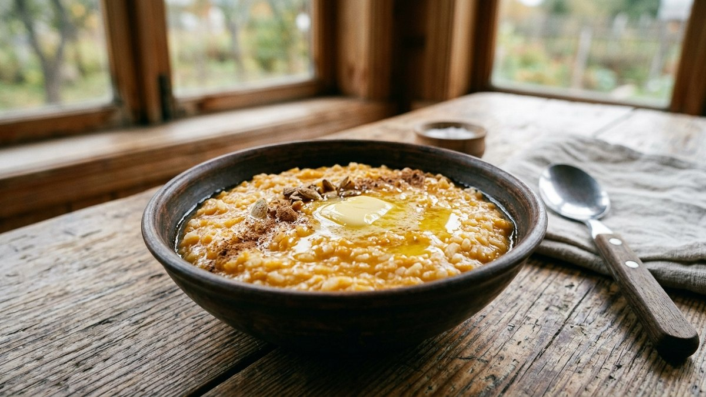
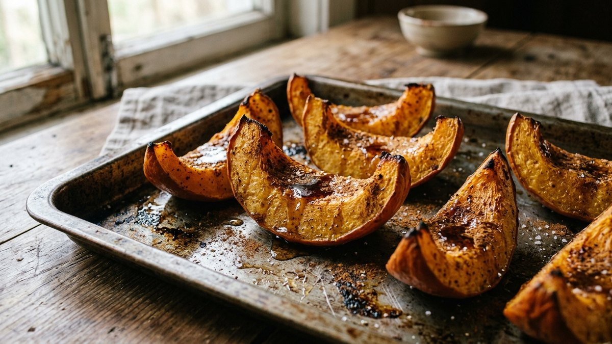
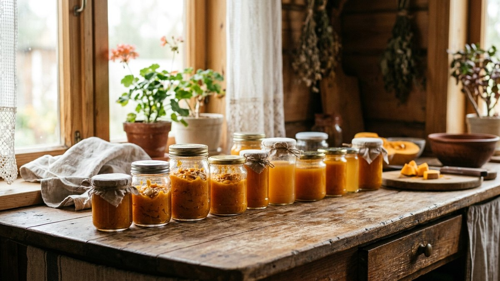

# Что приготовить из тыквы: простые рецепты и заготовки на зиму

После уборки тыква лежит на веранде неделями, потому что руки не доходят
понять, что с ней делать, кроме традиционной каши. На деле тыква — один из
самых универсальных овощей: она идёт и в сладкое, и в несладкое, хорошо
хранится в виде заготовок и почти не имеет отходов — в дело годятся даже
семечки. Разберём самые ходовые рецепты — от повседневной каши до заготовок
на зиму — и как не испортить блюдо на этапе выбора самой тыквы.

## Какую тыкву брать под какое блюдо

Не всякая тыква одинаково хороша для любого рецепта:

- **Мускатная тыква** — сладкая, плотная, мало воды. Лучший выбор для каши,
  пюре, выпечки и запекания.
- **Крупноплодная (обычная столовая)** — универсальна, но суше и менее
  сладкая. Подходит для супов и заготовок.
- **Твердокорая (в том числе декоративные сорта)** — жёсткая мякоть, годится
  скорее для семечек, чем для еды.

Если тыква горчит на срезе — это признак переопыления с декоративными
сортами, такую тыкву лучше не использовать в пищу.

## Тыквенная каша с рисом

Классика, которую легко испортить пропорциями. На 500 г тыквы, очищенной от
кожуры и семян, — полстакана риса, 2 стакана молока, 1 стакан воды, 2–3 ст. л.
сахара, щепотка соли.

1. Тыкву нарежьте кубиками 1,5–2 см, залейте водой и варите 10 минут до
   мягкости.
2. Добавьте промытый рис, влейте молоко, доведите до кипения.
3. Убавьте огонь и варите 20–25 минут, помешивая, чтобы каша не пригорела.
4. Добавьте сахар и соль за 5 минут до готовности, при подаче — сливочное
   масло.

## Суп-пюре из тыквы

Тыква, лук, морковь и немного сливок или сметаны — минимальный набор для
насыщенного супа. Овощи обжаривают до мягкости, заливают бульоном или водой,
варят 15–20 минут и пробивают блендером до однородности. Сливки добавляют в
конце, не доводя до кипения, чтобы они не свернулись. Для остроты кладут
щепотку мускатного ореха или имбиря.

## Тыква, запечённая в духовке

Самый простой способ раскрыть сладость тыквы без лишних усилий:

1. Нарежьте тыкву дольками толщиной 1,5–2 см, не снимая кожуру.
2. Сбрызните маслом, посыпьте солью и, для сладкого варианта, корицей и
   мёдом.
3. Запекайте при 200 °C 25–30 минут до мягкости и лёгкой румяности по краям.

Запечённая тыква — основа и для гарнира, и для десерта, и для пюре, если
позже протереть её через сито.

## Оладьи из тыквы

Отваренную или запечённую тыкву разминают в пюре, смешивают с яйцом, мукой и
щепоткой сахара (пропорции — на глаз, до консистенции густой сметаны) и
жарят на сковороде как обычные оладьи. Получается нежнее и слаще
классических оладий на кефире, отлично идёт с мёдом или сметаной.

## Заготовки на зиму: что сохранить впрок

| Заготовка | Как делать вкратце | Срок хранения |
|---|---|---|
| Тыквенное пюре | Запечь, пробить блендером, разложить по контейнерам, заморозить | До 8–10 месяцев в морозилке |
| Тыквенный сок | Отварить мякоть, пробить блендером, проварить с сахаром, закатать | До 1 года в прохладном месте |
| Цукаты из тыквы | Кубики тыквы уварить в сахарном сиропе, подсушить в духовке | До 6 месяцев в сухой банке |
| Тыква маринованная | Кубики залить маринадом с уксусом, закатать как обычную консервацию | До 1 года |

Тыквенное пюре из морозилки удобнее всего: его можно доставать порциями и
сразу использовать для каши, супа или выпечки, не размораживая всю партию
сразу.

## Тыквенные семечки: не выбрасывайте

Семечки промывают от мякоти, обсушивают полотенцем и подсушивают в духовке
при 150 °C 15–20 минут, периодически помешивая, до лёгкого золотистого
цвета и характерного щёлканья кожуры. Подсоленные подсушенные семечки хранятся
в сухой банке до 2–3 месяцев.

## Частые ошибки

- **Готовить кашу из водянистой тыквы без уваривания** — каша получается
  жидкой; лишнюю воду нужно выпарить на первом этапе варки.
- **Запекать тыкву при слишком высокой температуре** — снаружи подгорает,
  внутри остаётся сырой; 200 °C и умеренное время — надёжнее.
- **Замораживать тыкву крупными кусками** — она промерзает неравномерно и
  после разморозки становится водянистой; лучше замораживать уже готовым
  пюре или мелкими кубиками.
- **Использовать декоративную тыкву в пищу** — горькая и жёсткая мякоть,
  иногда содержит вещества, вызывающие расстройство желудка.

## Частые вопросы

### Сколько хранится тыква в свежем виде

Целая неповреждённая тыква при температуре +5…+15 °C и хорошей вентиляции
хранится 3–6 месяцев в зависимости от сорта. Разрезанную тыкву держат в
холодильнике не дольше недели, дальше её лучше переработать или заморозить.
Подробные условия и место для хранения целых тыкв зимой — в статье [как
хранить овощи зимой](https://mir-doma.pro/kak-hranit-ovoshchi-zimoy/).

### Можно ли замораживать тыкву сырой, кусочками

Можно, но после разморозки текстура станет более рыхлой и водянистой, чем у
свежей. Для каши и выпечки это некритично, а вот для запекания дольками
лучше брать свежую тыкву или замораживать уже в виде готового пюре.

### Что приготовить из тыквы быстро, без духовки

Суп-пюре или тыквенные оладьи на сковороде — оба рецепта готовятся за
20–30 минут без духовки. Тыкву для супа можно отварить или потушить прямо
в кастрюле вместе с остальными овощами.

### Как убрать горечь из тыквы

Убрать горечь у уже горькой тыквы нельзя — горечь означает переопыление с
декоративными сортами и такую тыкву в пищу лучше не использовать. Небольшая
горчинка на конце у плодоножки — это норма для многих сортов, её просто
срезают перед готовкой.

## Заключение

Тыква не требует сложных рецептов: каша, суп-пюре и запекание в духовке
закрывают повседневное меню, а пюре, сок и цукаты сохраняют урожай до весны.
Если кроме тыквы в этом сезоне остались кабачки, для них тоже пригодится
подборка — [что приготовить из кабачков](https://mir-doma.pro/blyuda-iz-kabachkov-recepty/),
а для позднего урожая яблок — [что приготовить из
яблок](https://mir-doma.pro/chto-prigotovit-iz-yablok/): оба овоща созревают
почти одновременно и хорошо сочетаются в одной осенней заготовке.
