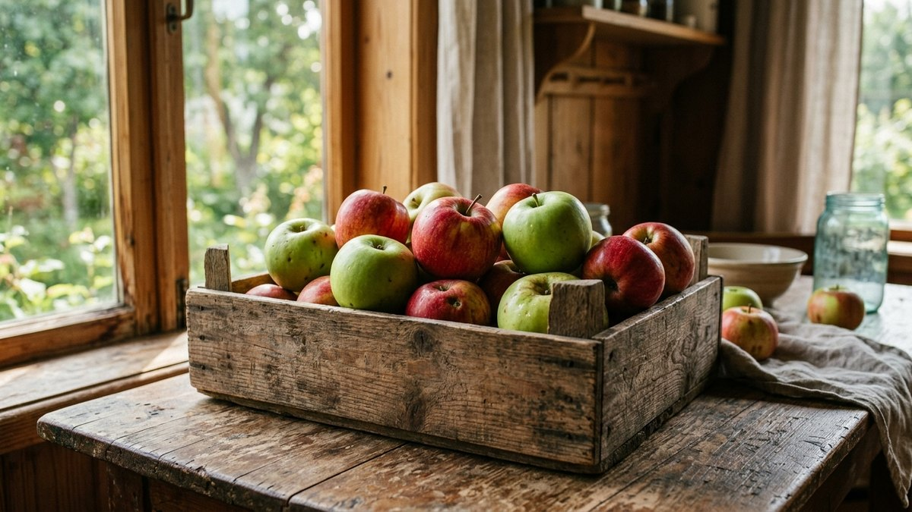
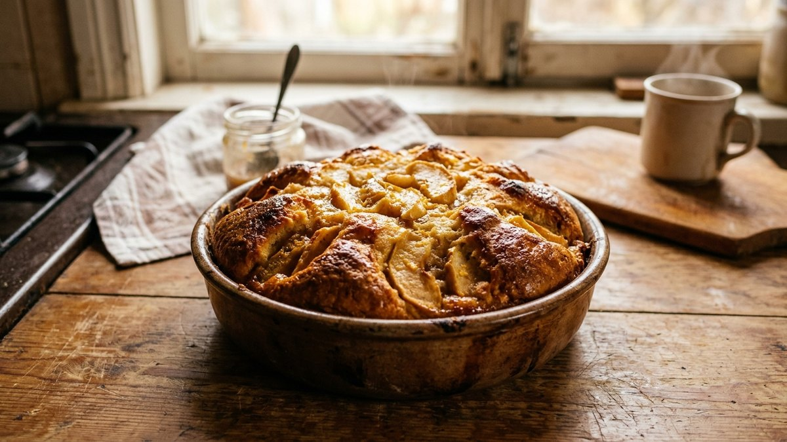
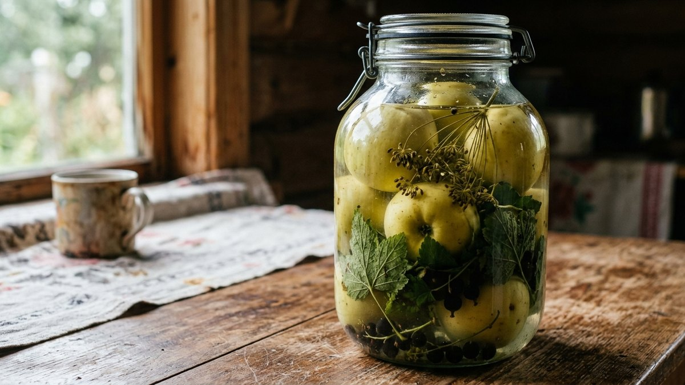
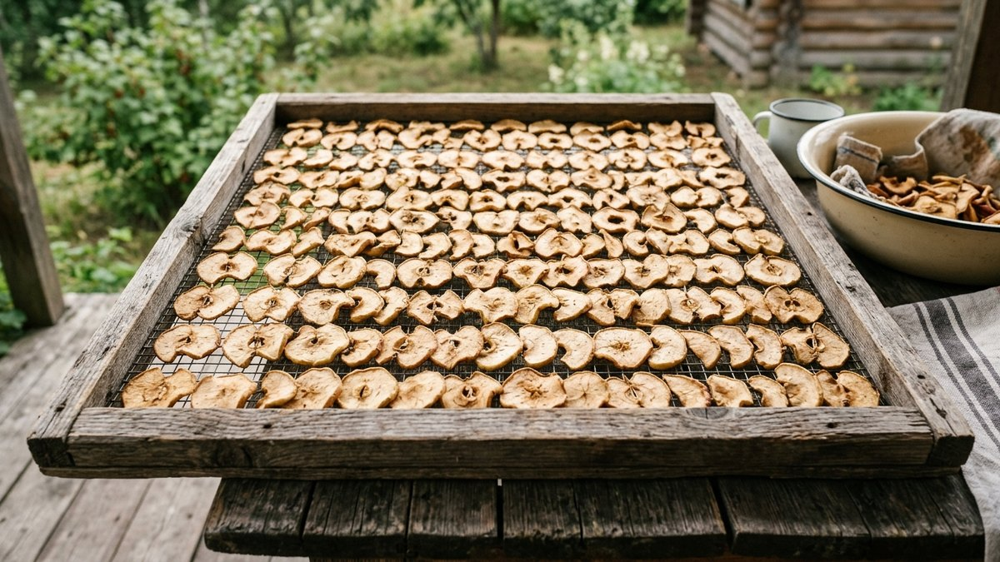
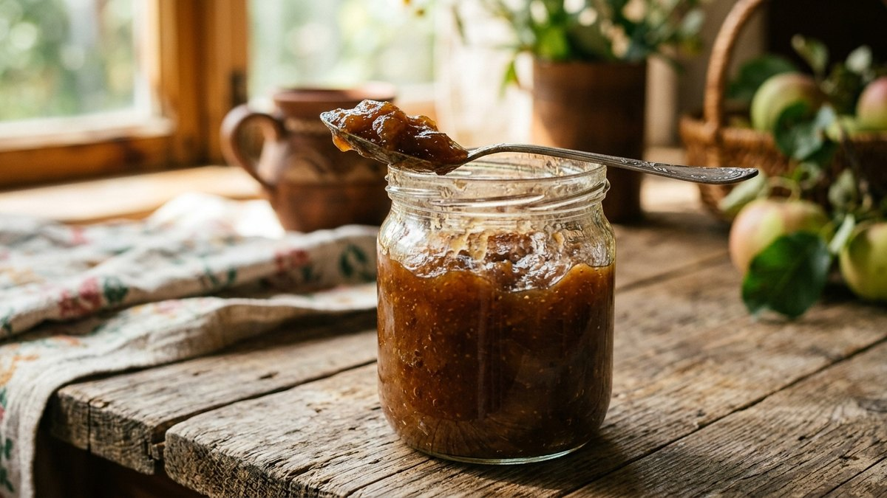
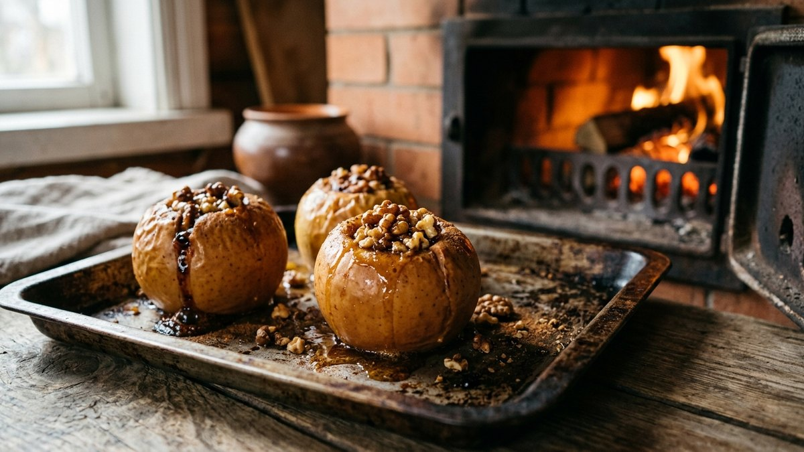

# Что приготовить из яблок: простые рецепты и заготовки на зиму

Ведро яблок с дачи за пару дней превращается в проблему — часть уже
подгнивает, а варить одно и то же варенье не хочется. Разберём рецепты на
любой случай: что приготовить быстро на сегодня, что закатать на зиму и
что сделать из падалицы и мятых плодов, которые для варенья уже не
годятся.

## Чем хороши яблоки урожая

Дачные яблоки чаще неровные и разного размера, зато без воска и обработки
для длительного хранения — годятся и для быстрых блюд, и для заготовок.
Крупные плотные плоды лучше идут на шарлотку и сушку, мягкие и подпорченные
места — на пюре и повидло, где текстура уже не важна.

## Шарлотка с яблоками

Классический быстрый пирог, который выручает, когда яблок много, а
времени мало:

- 4 яйца, 1 стакан сахара, 1 стакан муки, 3–4 крупных яблока.
- Яйца взбить с сахаром до пышной пены, аккуратно вмешать муку.
- Яблоки нарезать дольками, выложить на дно смазанной формы, залить
  тестом.
- Выпекать при 180 °C 35–40 минут до золотистой корочки.

## Яблочное пюре и повидло на зиму

Пюре — способ пустить в дело мятые и подпорченные яблоки без потерь:

- Яблоки очистить от повреждённых мест, нарезать, залить небольшим
  количеством воды и уварить до мягкости.
- Протереть через сито или пробить блендером.
- Для повидла на зиму пюре уварить с сахаром (на 1 кг пюре — 300–400 г
  сахара) до загустения и разложить по стерилизованным банкам.

Похожий принцип уваривания с сахаром используется и для других заготовок
на зиму — общие пропорции и способы без стерилизации разобраны в статье
[компот на зиму](https://mir-doma.pro/kompot-na-zimu/), если из части урожая
удобнее сварить компот, а не пюре.

## Мочёные яблоки

Традиционная заготовка без варки, которая хранится всю зиму в прохладном
месте:

- Крепкие кисло-сладкие яблоки (антоновка и похожие сорта) целиком
  укладывают в бочку или большую банку, перекладывая листьями смородины
  или вишни.
- Заливают рассолом: на 10 л воды — 200 г сахара, 50 г соли, 100 мл
  ржаной муки или немного солода для брожения.
- Оставляют бродить при комнатной температуре 3–5 дней, затем убирают в
  холод на 1–1,5 месяца до готовности.

## Сушёные яблоки

Самый долгий по хранению вариант заготовки, не требующий банок и сахара:

- Яблоки нарезать тонкими дольками или кольцами, при желании сбрызнуть
  лимонным соком, чтобы не темнели.
- Сушить в электросушилке при 60 °C 6–8 часов или в духовке с приоткрытой
  дверцей при минимальной температуре.
- Готовые дольки должны гнуться, но не ломаться и не оставлять влаги при
  сжатии.

## Что ещё приготовить из яблок

- **Печёные яблоки с мёдом и орехами** — быстрый десерт в духовке, 20
  минут при 180 °C.
- **Яблочный соус к мясу** — уваренное пюре без сахара с добавлением
  специй, хорошо идёт к свинине и утке.
- **Яблочные чипсы** — тонкие дольки, подсушенные в духовке до хруста,
  без сахара и добавок.
- **Начинка для пирогов и вареников** — яблоки, нарезанные кубиком и
  слегка притушенные с сахаром и корицей.

Если часть урожая проще не готовить сразу, а заморозить — какие овощи и
фрукты хорошо переносят заморозку и как их правильно подготовить,
разобрано в статье [что заморозить на зиму](https://mir-doma.pro/chto-zamorozit-na-zimu/).
А если после яблок в закромах ещё лежит тыква, для неё тоже пригодится
своя подборка — [что приготовить из тыквы](https://mir-doma.pro/chto-prigotovit-iz-tykvy/).

## Советы по приготовлению

- Для пюре и повидла подходят даже мятые и подпорченные яблоки — плохие
  места просто вырезают.
- Кислые сорта лучше идут в заготовки с сахаром, сладкие — в сушку и
  свежие десерты без добавок.
- Если яблок слишком много для одного захода, часть можно натереть и
  заморозить порциями для будущей выпечки — размораживать перед
  использованием не обязательно.

## Частые вопросы

**Что быстро приготовить из яблок?**
Шарлотку, печёные яблоки с мёдом или яблочные чипсы в духовке — все три
варианта готовятся без долгой подготовки и подходят для небольшого
количества яблок.

**Что приготовить из яблок на зиму без сахара?**
Сушёные яблоки или заморозку дольками — оба способа не требуют сахара
и хорошо сохраняют яблоки на всю зиму.

**Что делать с падалицей и мятыми яблоками?**
Вырезать повреждённые места и пустить на пюре, повидло или яблочный
соус — текстура плодов там не важна, а вкус не страдает.

**Можно ли заморозить яблоки на зиму?**
Да, дольками или тёртыми — для выпечки замороженные яблоки подходят без
предварительной разморозки.

**Сколько хранятся мочёные яблоки?**
При температуре около 0…+5 °C — до весны, если хранить в прохладном
погребе или холодильнике и не нарушать рассол.

## Заключение

Яблочный урожай не обязательно перерабатывать в один день одним способом
— часть идёт в быстрые блюда на сегодня, часть в заготовки на зиму, а
подпорченные плоды находят применение в пюре и соусе, не пропадая
впустую.
