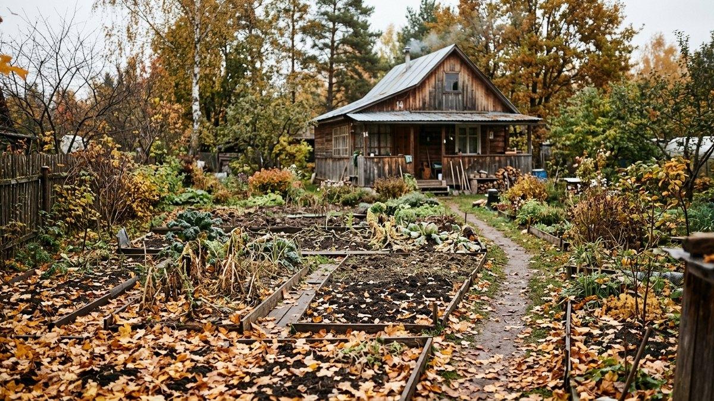
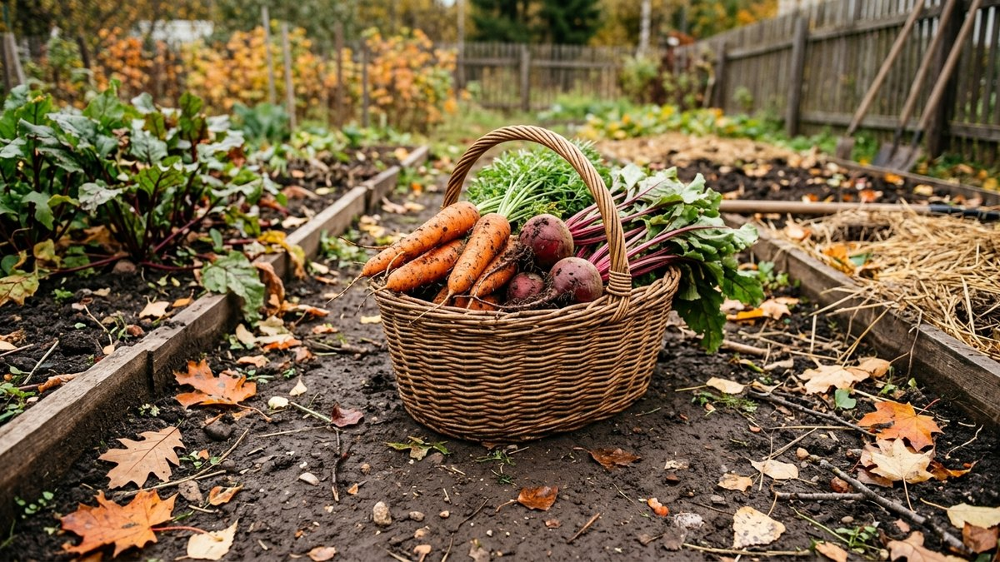
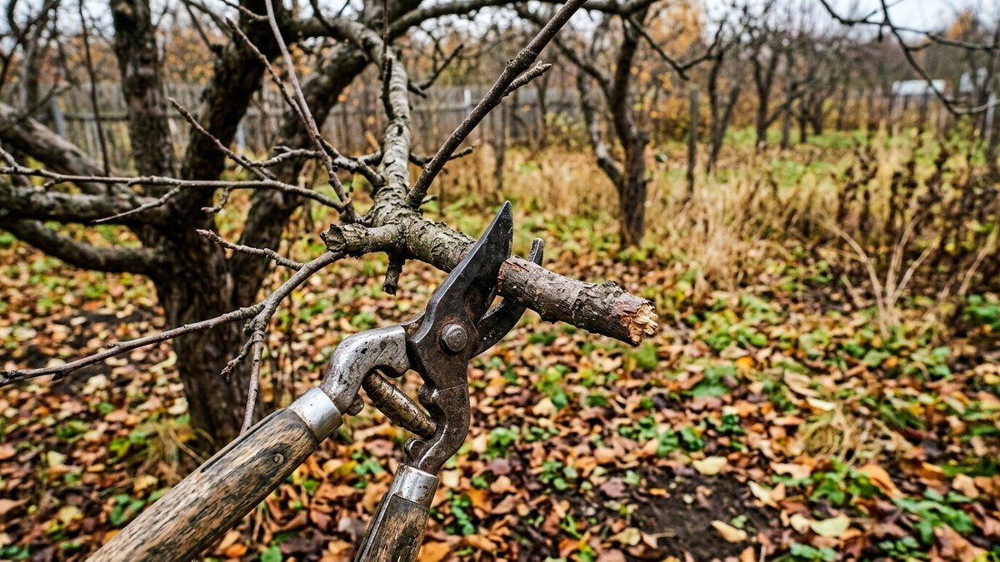
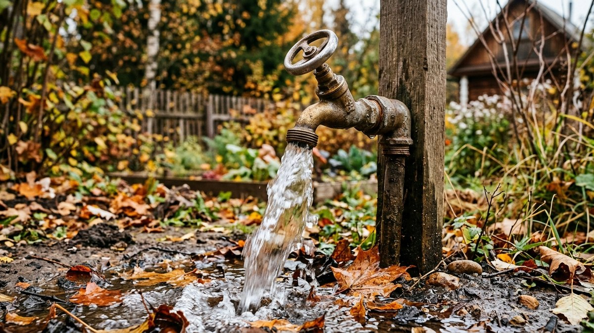
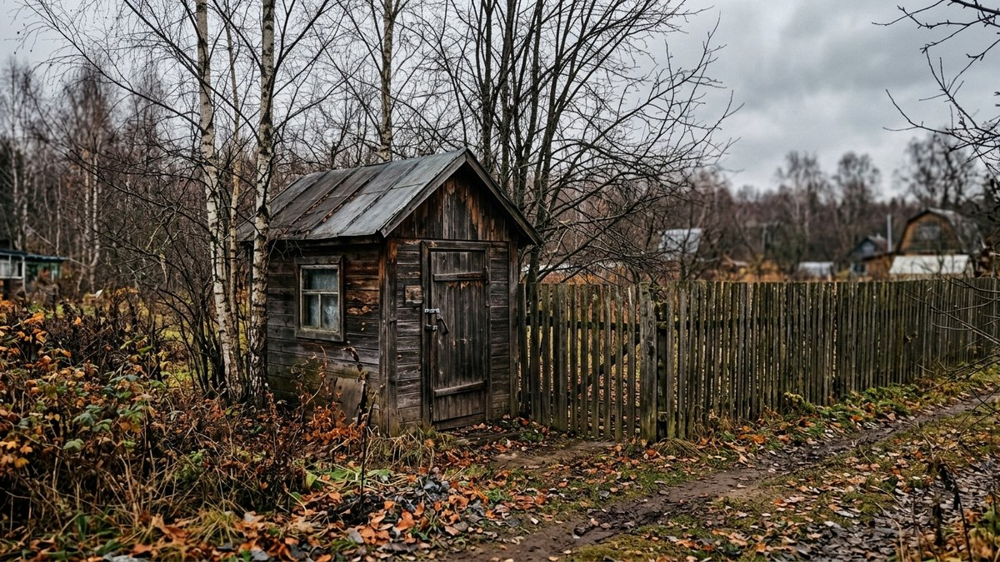
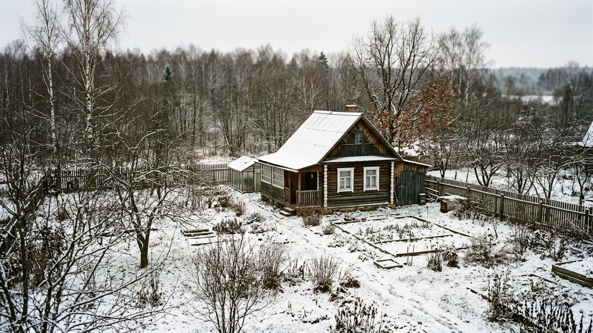

Октябрь — последний месяц, когда ещё можно спокойно, без спешки под первый мороз, подготовить дачу к зиме. Собрали чек-лист по неделям: что сделать в саду и огороде, что — с домом и коммуникациями, и куда заглянуть за подробностями по каждому пункту.

## 1-я неделя: заканчиваем с урожаем и грядками

- Убрать поздние овощи, которые ещё держатся в грунте — свёклу, морковь, капусту поздних сортов.
- Освободить теплицу от растений и обработать её перед зимой — подробный порядок действий в статье [обработка теплицы осенью](https://mir-doma.pro/obrabotka-teplicy-osenyu/).
- Посеять сидераты на освободившихся грядках, если ещё позволяет погода — зачем это нужно и что сеять, в статье [сидераты осенью](https://mir-doma.pro/sideraty-osenyu/).
- Проверить погреб перед закладкой урожая на хранение: температуру, влажность, вентиляцию — в статье [обработка погреба осенью](https://mir-doma.pro/obrabotka-pogreba-osenyu/).

## 2-я неделя: сад и многолетники

- Обрезать плодовые деревья и кустарники, убрать повреждённые ветки — полный порядок действий в статье [подготовка сада к зиме](https://mir-doma.pro/podgotovka-sada-k-zime/).
- Укрыть розы и теплолюбивые многолетники до устойчивых заморозков — в статье [укрытие роз на зиму](https://mir-doma.pro/ukrytie-roz-na-zimu/) разобрано, когда именно это делать.
- Собрать и утилизировать опавшую листву и растительные остатки — рассадник грибка и вредителей на следующий сезон, если оставить всё под снег.
- Проверить и при необходимости обновить укрытие грядок для многолетней зелени и клубники.

## 3-я неделя: дом и коммуникации

- Слить воду из системы полива и наружного водопровода — замёрзшая вода в трубах рвёт их зимой. Полный порядок консервации коммуникаций — в статье [консервация дачи на зиму](https://mir-doma.pro/konservaciya-dachi-na-zimu/).
- Проверить утепление дома, если планируете зимние визиты или хотите избежать промерзания труб — актуальную смету по площади и материалам считает калькулятор в статье [сколько стоит утеплить дачный дом](https://mir-doma.pro/skolko-stoit-uteplit-dachnyy-dom/).
- Если решаете, чем топить дом зимой — печь, котёл или электричество, — сравнение по деньгам за сезон с калькулятором есть в статье [отопление дачи: что дешевле](https://mir-doma.pro/otoplenie-dachi-chto-deshevle/).
- Проверить кровлю и водостоки перед снегом — очистить от листвы, убедиться, что нет протечек.

## 4-я неделя: хозпостройки, урожай на хранении, итоги сезона

- Проверить, как хранится заложенный урожай — оптимальные условия для разных овощей разобраны в статье [как хранить овощи зимой](https://mir-doma.pro/kak-hranit-ovoshchi-zimoy/).
- Если строите погреб только сейчас и хотите успеть до морозов — земляные работы лучше закончить, пока грунт не промёрз; смета по материалам и калькулятор — в статье [погреб своими руками: сколько стоит построить](https://mir-doma.pro/stroitelstvo-pogreba-smeta/).
- Осмотреть заборы, навесы и хозпостройки перед зимой — трещины и перекосы проще заметить и исправить сейчас, чем весной после снеговой нагрузки.
- Если планируете зимние приезды, октябрь — подходящее время подобрать [снегоуборщик для дачи](https://mir-doma.pro/kakoy-snegouborshchik-vybrat-dlya-dachi/) заранее, а не искать его по факту первого снегопада.
- Составить список дел на следующий сезон, пока свежи впечатления: что не удалось, какие грядки не сработали, что хочется поменять.

## Что можно отложить до ноября

Не все дела одинаково срочные. Побелку деревьев и финальную консервацию систем полива можно сдвинуть на начало ноября, если октябрь выдался тёплым — важно успеть до устойчивых заморозков, а не строго к календарной дате. Ориентируйтесь на прогноз погоды в своём регионе, а не только на этот список.

## Частые ошибки

- **Оставить воду в трубах и системе полива.** Замёрзшая вода расширяется и рвёт трубы, шланги, насосные станции — переделка по весне обходится в разы дороже профилактики.
- **Убрать урожай в погреб без проверки условий.** Непроверенная вентиляция или сырость портят запасы за первые же недели хранения.
- **Отложить укрытие роз и многолетников на «попозже».** Первый же резкий заморозок может повредить растения, если укрытие не готово заранее.
- **Забыть про хозпостройки.** Забор, навес, теплица без осмотра перед зимой рискуют не пережить снеговую нагрузку без ремонта, который проще сделать осенью.

## Частые вопросы

### Когда именно в октябре консервировать дачу?

Ориентируйтесь на прогноз устойчивых ночных заморозков в своём регионе — обычно это середина-конец октября для средней полосы, но может сдвигаться на 1–2 недели в любую сторону в зависимости от года.

### Нужно ли утеплять дом, если бываете на даче только летом?

Нет смысла утеплять весь дом, но стоит слить воду из систем и утеплить те узлы, которые могут разморозиться — трубы, насосную станцию, если она остаётся на участке зимой.

### Что делать, если не успели убрать урожай до заморозков?

Большинство корнеплодов (морковь, свёкла) переживают лёгкий заморозок без потерь, если убрать их сразу после потепления. Капусту поздних сортов можно оставить дольше — она устойчивее к холоду, чем большинство овощей.

### Стоит ли начинать стройку или ремонт на даче в октябре?

Для земляных работ (погреб, фундамент) октябрь — ещё рабочий месяц, пока грунт не промёрз. Мокрые фасадные работы (штукатурка) лучше закончить до конца сентября — им нужна плюсовая температура на просушку.

### Как понять, что дом готов к зиме?

Проверьте три вещи: слита вода из всех труб и систем, закрыты и утеплены вентиляционные продухи в фундаменте, если они есть, и убраны с участка предметы, которые могут повредиться под снегом или унести ветром.

### Нужно ли обрабатывать почву в теплице осенью, если не сажали там ничего с болезнями?

Да, профилактическая обработка нужна в любом случае — споры грибков и яйца вредителей зимуют в почве независимо от того, болели ли растения в этом сезоне явно.
