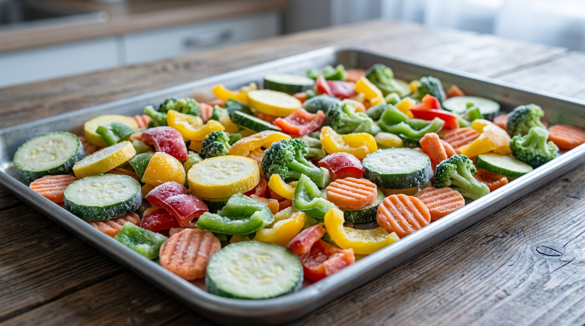
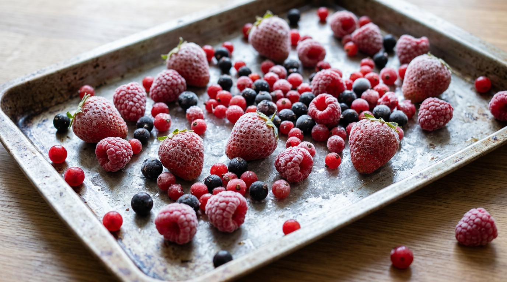
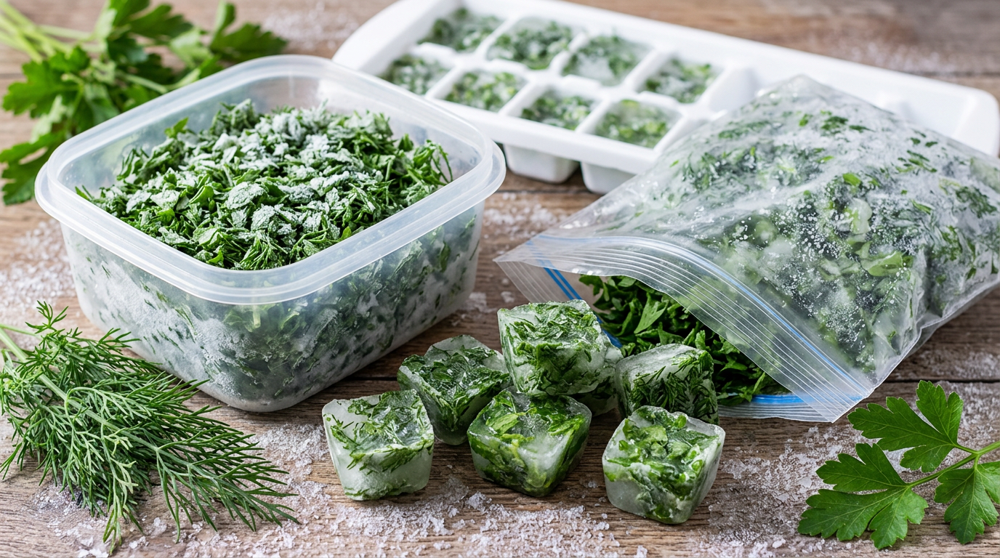
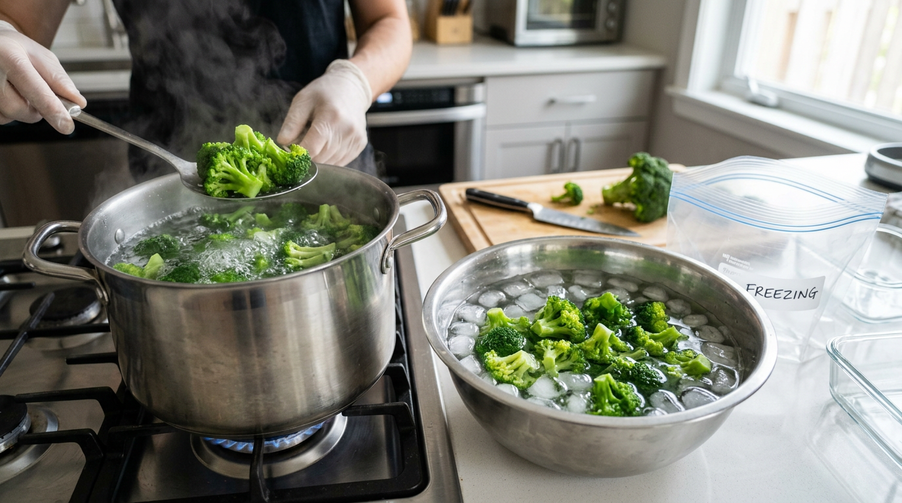
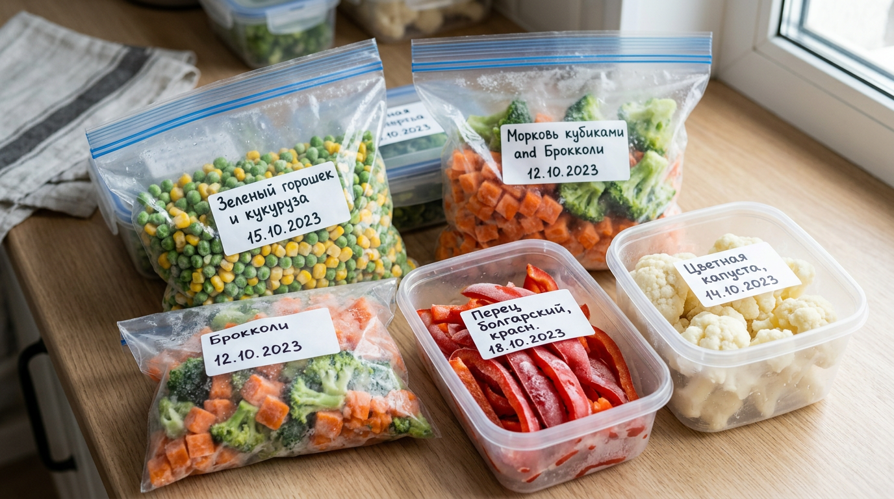
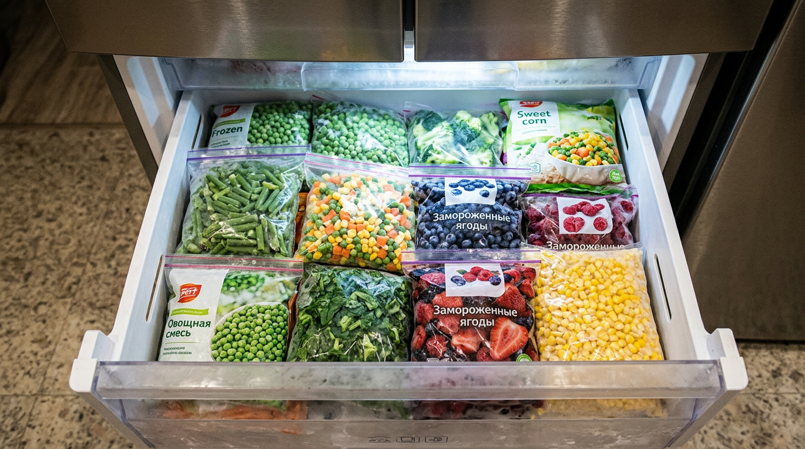

Заморозка — самый простой и быстрый способ сохранить летний урожай и витамины до зимы. В отличие от [консервации и маринования](https://mir-doma.pro/marinovannye-ogurtsy-na-zimu/), она почти не требует времени и усилий, а замороженные овощи, ягоды и зелень сохраняют вкус и пользу свежих продуктов. Но чтобы заготовки удались, важно знать, что можно замораживать, а что нет, нужно ли бланшировать овощи и как правильно их упаковать. В этой статье собрали полный гид по заморозке на зиму: что и как замораживать, сколько хранить и каких ошибок избегать.

## ❄️ Чем хороша заморозка

Заморозка заслуженно считается лучшим способом домашних заготовок. Вот её главные плюсы:

- **Сохраняет витамины.** Быстрая заморозка сохраняет почти все полезные вещества — больше, чем варка или консервация.
- **Быстро и просто.** Не нужно стерилизовать банки и варить — помыл, нарезал, заморозил.
- **Удобно зимой.** Готовая заготовка под рукой: достал порцию — и сразу в суп, на сковороду или в смузи.
- **Без соли и сахара.** В отличие от солений и варенья, заморозка сохраняет натуральный вкус без добавок.
- **Экономит урожай.** Излишки, которые иначе пропали бы, легко сохранить в морозилке.

Главное — соблюдать простые правила, и тогда зимой у вас всегда будут под рукой летние овощи, ягоды и зелень.

## 🥦 Что можно замораживать

Замораживать можно гораздо больше продуктов, чем кажется. Удобнее всего хранятся и лучше всего переносят заморозку:

- **Овощи:** кабачки, перец, морковь, цветная капуста и брокколи, зелёный горошек, стручковая фасоль, тыква, баклажаны, кукуруза.
- **Ягоды:** клубника, малина, смородина, вишня, черника, крыжовник — практически любые.
- **Зелень:** укроп, петрушка, кинза, базилик, зелёный лук, щавель.
- **Грибы:** свежие или предварительно отваренные.
- **Томаты:** для готовки (в соусы, рагу), целиком или в виде пюре.
- **Фрукты:** сливы, абрикосы, яблоки — для компотов и выпечки.

Из замороженных овощей удобно готовить супы, рагу и гарниры — например, [блюда из кабачков](https://mir-doma.pro/blyuda-iz-kabachkov-recepty/) зимой, — а из ягод — компоты, смузи и начинку для пирогов. Как заморозить ягоды, чтобы они не слиплись и не превратились в кашу — по каждой ягоде отдельно — в статье [как заморозить ягоды на зиму](https://mir-doma.pro/kak-zamorozit-yagody/).

Отдельно стоит сказать про зелень: замороженная, она ароматнее и полезнее сушёной, поэтому укроп, петрушку и другую зелень на зиму лучше именно морозить.

## 🚫 Что не стоит замораживать

Некоторые продукты после разморозки раскисают и теряют вид, поэтому их замораживать не стоит:

- **Огурцы, редис, листовой салат** — содержат много воды, после разморозки превращаются в кашу.
- **Целые помидоры для салата** — теряют форму (но для готовки замораживать можно).
- **Сырой картофель** — темнеет и становится водянистым (варёный или жареный замораживается нормально).
- **Арбуз и дыня** — теряют текстуру.

Проще говоря, всё, что состоит в основном из воды и едят свежим, замораживать смысла нет. А вот для термической обработки многие из этих продуктов всё же подходят.

## 🔪 Подготовка продуктов

От подготовки зависит качество заготовки. Общие правила такие:

1. **Вымойте** овощи, ягоды и зелень и переберите, удалив испорченное.
2. **Тщательно обсушите.** Это критично: лишняя вода превращается в лёд, и продукты слипаются в комок. Разложите их на полотенце и дайте обсохнуть.
3. **Нарежьте порционно** — кубиками, кружочками или соломкой, как удобно для будущих блюд. Зелень мелко рубят, ягоды оставляют целыми.

Хорошо обсушенные и правильно нарезанные продукты замораживаются гораздо лучше.

## 🔥 Бланшировать или нет

Бланширование — это кратковременное ошпаривание овощей кипятком (1–3 минуты) с последующим резким охлаждением в ледяной воде. Оно сохраняет цвет, вкус и витамины и продлевает хранение. Дело в том, что бланширование «выключает» ферменты, из-за которых овощи при хранении грубеют, темнеют и теряют вкус. Поэтому для плотных овощей этот недолгий шаг заметно улучшает качество заготовки.

**Бланшируют обычно:** брокколи и цветную капусту, стручковую фасоль, зелёный горошек, морковь, кукурузу — то есть плотные овощи, которые иначе грубеют или теряют цвет.

**Можно замораживать без бланширования:** кабачки, перец, тыкву, баклажаны, зелень, ягоды, помидоры. Они хорошо переносят заморозку и в сыром виде.

После бланширования овощи обязательно остужают в ледяной воде и обсушивают, иначе они слипнутся.

## 🧊 Как правильно замораживать

Несколько приёмов помогут получить рассыпчатую, а не смёрзшуюся в ком заготовку:

- **Сухая заморозка россыпью.** Разложите подготовленные продукты в один слой на доске или подносе и заморозьте, а затем пересыпьте в пакет. Так они не слипнутся, и зимой удобно брать нужную порцию. Этот способ особенно хорош для ягод, нарезанных кабачков, перца и других продуктов, которые иначе смерзаются в один ком. После того как они схватятся на подносе (обычно за пару часов), их пересыпают в пакет уже рассыпчатыми.
- **Быстрая заморозка.** Чем быстрее замёрзнет продукт, тем мельче кристаллы льда и тем лучше сохранится текстура. Если в морозилке есть режим «суперзаморозка», включайте его.
- **Порционность.** Замораживайте небольшими порциями на одно блюдо — повторно замораживать размороженное нельзя.

## 📦 Тара и упаковка

Правильная упаковка защищает заготовку от заветривания и посторонних запахов.

- Используйте **пакеты с зип-застёжкой** или **контейнеры** для заморозки.
- **Выпускайте воздух** из пакетов перед закрытием — это предотвращает иней и заветривание.
- **Фасуйте порциями** — на один раз, чтобы не размораживать лишнее.
- **Подписывайте** каждую упаковку: что внутри и дата заморозки. Зимой это очень выручает.
- **Замораживайте плоско.** Пакеты удобно замораживать в плоском виде — так они компактнее укладываются и быстрее промерзают и оттаивают.

## 🥕 Гид по продуктам: бланшировать или нет

Чтобы не запутаться, держите краткую шпаргалку по популярным продуктам:

| Продукт | Бланшировать | Как замораживать |
|---------|--------------|------------------|
| Кабачки, баклажаны | Нет | Кубиками или кружочками россыпью |
| Перец болгарский | Нет | Полосками или половинками |
| Брокколи, цветная капуста | Да | Соцветиями после бланширования |
| Стручковая фасоль, горошек | Да | Россыпью после бланширования |
| Морковь | Да | Кубиками или тёртой |
| Тыква | Нет | Кубиками или пюре |
| Зелень | Нет | Нарезанной или в кубиках льда |
| Ягоды | Нет | Целыми россыпью |
| Грибы | Желательно отварить | Порциями |

## ⏱️ Сроки хранения

Замороженные продукты хранятся долго, но не бесконечно. Ориентировочные сроки при –18 °C:

- овощи — 8–12 месяцев;
- ягоды и фрукты — 8–12 месяцев;
- зелень — 6–12 месяцев;
- грибы — 6–12 месяцев.

Чтобы ничего не залежалось, удобно вести «оборот»: сначала использовать заготовки прошлого сезона, а свежие убирать в дальний угол.

## 🍳 Как размораживать и использовать

Многие замороженные продукты вообще не нужно размораживать — их сразу кладут в кастрюлю или на сковороду: овощи в суп и рагу, ягоды в компот и выпечку. Если разморозка нужна (например, для салата или начинки), делайте это в холодильнике — медленно и бережно. Главное правило: **повторно замораживать размороженные продукты нельзя** — они теряют вкус, пользу и могут испортиться.

## 🛡️ Частые ошибки

Чтобы заготовки не разочаровали, избегайте типичных промахов:

- **Не обсушили продукты.** Лишняя вода даёт лёд и комкование. Всегда обсушивайте перед заморозкой.
- **Слишком большие порции.** Большой ком долго мёрзнет и тает, и часть приходится выбрасывать. Фасуйте на один раз.
- **Не выпустили воздух.** В пакете с воздухом образуется иней, продукты заветриваются и теряют вкус.
- **Повторная заморозка.** Размороженное замораживать повторно нельзя.
- **Заморозка водянистых продуктов.** Огурцы, редис и салат после разморозки превращаются в кашу — их не замораживают.
- **Нет подписи.** Без даты и названия зимой сложно разобраться, что и когда заморожено.

## ❓ Частые вопросы

### Какие овощи можно замораживать на зиму?

Кабачки, перец, морковь, цветную капусту и брокколи, зелёный горошек, стручковую фасоль, тыкву, баклажаны и кукурузу. Плотные овощи перед заморозкой бланшируют, а кабачки, перец и тыкву можно замораживать без бланширования.

### Какие овощи нельзя замораживать?

Не стоит замораживать огурцы, редис, листовой салат и сырой картофель — они содержат много воды и после разморозки раскисают. Целые помидоры для салата тоже теряют форму, но для готовки их замораживать можно.

### Нужно ли бланшировать овощи перед заморозкой?

Не все. Бланшируют плотные овощи — брокколи, цветную капусту, фасоль, горошек, морковь, чтобы сохранить цвет и витамины. А кабачки, перец, тыкву, баклажаны, зелень и ягоды можно замораживать без бланширования.

### Как заморозить зелень на зиму?

Зелень вымойте, тщательно обсушите и мелко нарежьте, затем разложите по пакетам или контейнерам и заморозьте. Удобно замораживать зелень и порционно в формочках для льда, залив водой или маслом, — получаются готовые кубики для супов и соусов.

### Как заморозить ягоды, чтобы они не слиплись?

Вымойте и тщательно обсушите ягоды, разложите их в один слой на доске или подносе и заморозьте, а затем пересыпьте в пакет или контейнер. При такой «сухой» заморозке россыпью ягоды остаются отдельными, и зимой удобно брать нужную порцию.

### Теряются ли витамины при заморозке?

Нет, при быстрой заморозке сохраняется большинство витаминов — нередко больше, чем при варке или консервации. Поэтому заморозка считается одним из самых полезных способов заготовки. Главное — морозить свежие продукты как можно быстрее.

### Сколько хранятся замороженные овощи и ягоды?

При температуре –18 °C овощи, ягоды и фрукты хранятся около 8–12 месяцев, зелень и грибы — 6–12 месяцев. Чтобы продукты не залёживались, используйте сначала заготовки прошлого сезона.

### Можно ли замораживать продукты повторно?

Нет. Повторно замораживать размороженные продукты нельзя: они теряют вкус, текстуру и пользу, а также могут стать небезопасными. Поэтому замораживайте небольшими порциями — ровно на одно использование.

## Заключение

Заморозка — самый удобный способ сохранить летний урожай: быстро, без лишних хлопот и с максимумом витаминов. Главное — знать, что можно замораживать (большинство овощей, ягоды, зелень) и что не стоит (огурцы, редис, салат), хорошо обсушивать продукты, при необходимости бланшировать плотные овощи и правильно упаковывать порциями с подписью. Соблюдайте эти простые правила — и зимой у вас всегда будут под рукой вкусные и полезные летние заготовки, а урожай не пропадёт. Начните с малого — заморозьте порцию ягод и зелени, — и вы быстро оцените, насколько это удобнее банок с соленьями.

А что вы замораживаете на зиму? Делитесь своими хитростями в комментариях и подписывайтесь, чтобы не пропустить новые статьи о заготовках и хранении урожая.
