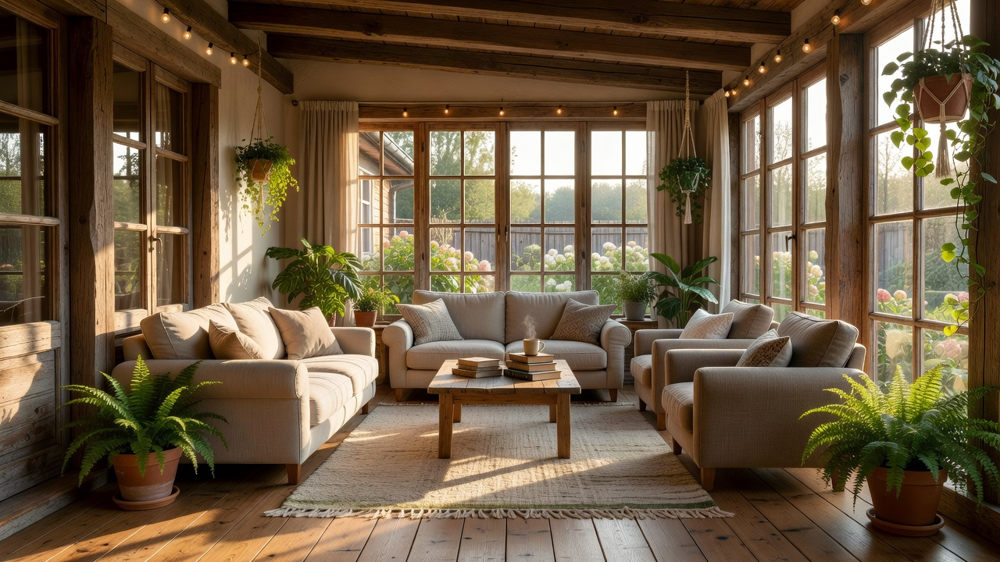
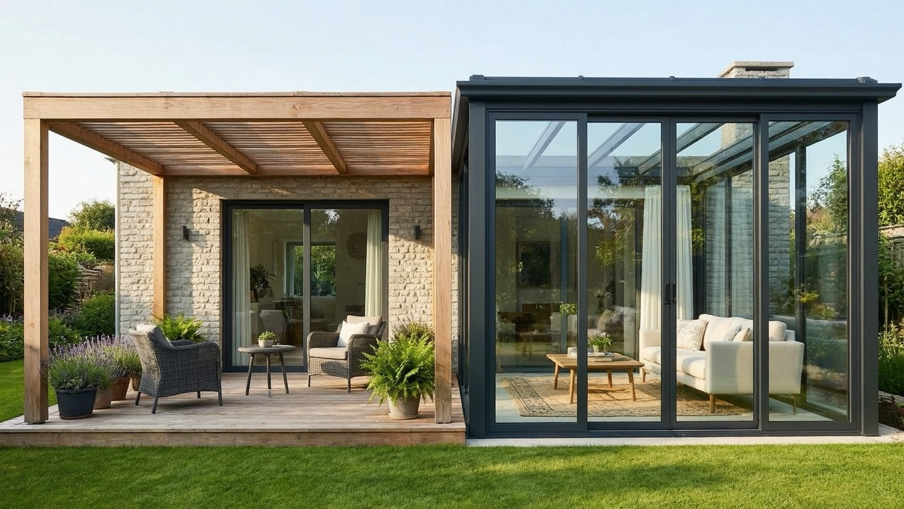
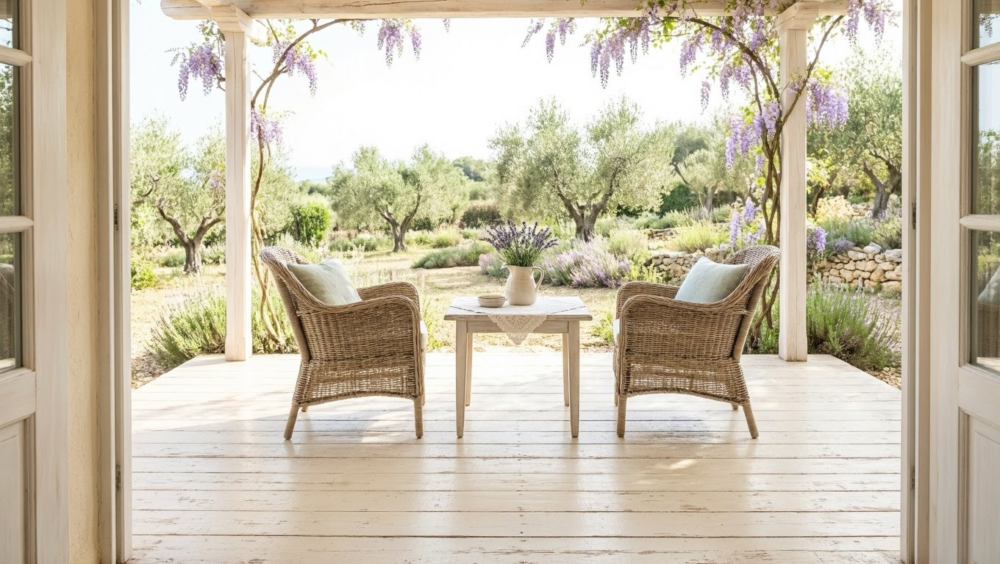
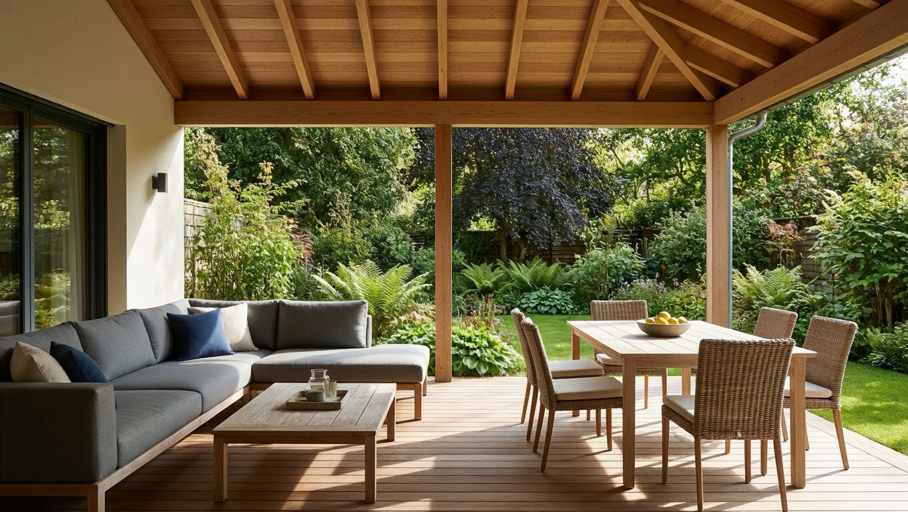
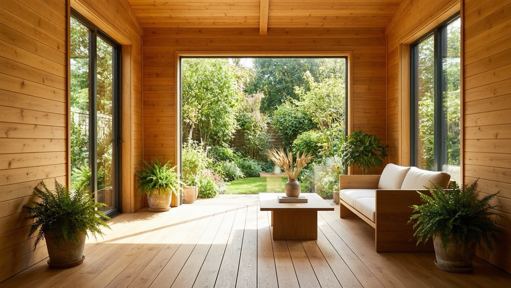
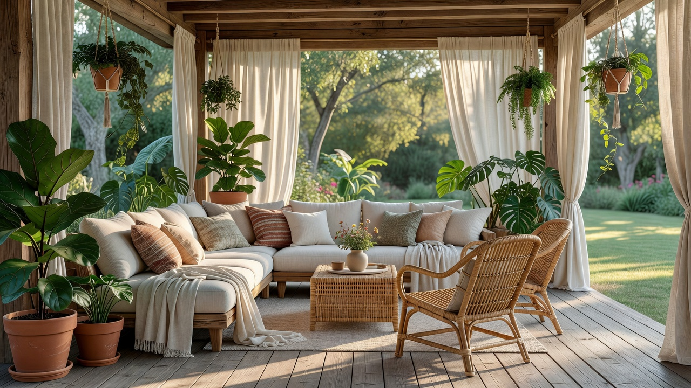

Красивый дизайн веранды превращает пристройку к дому в любимое место всей семьи — уютное, стильное и функциональное. Но чтобы веранда получилась гармоничной, важно продумать всё: тип и планировку, стиль, отделку, цвет и мебель. В этой статье собрали идеи и решения для дизайна веранды на даче — для открытой и застеклённой, большой и маленькой, — чтобы вы легко подобрали подходящий вариант.

Это статья из цикла о веранде. Общие вопросы разобраны в основной статье — [как обустроить веранду](https://mir-doma.pro/kak-obustroit-verandu/), а здесь сосредоточимся на дизайне.

## 🏡 Типы веранд и их дизайн

Дизайн во многом зависит от типа веранды:

- **Открытая веранда** — без остекления, для тёплого сезона. В дизайне упор на лёгкость, зелень и защиту от солнца.
- **Застеклённая (закрытая) веранда** — используется круглый год, поэтому важны отделка, утепление и полноценный интерьер.
- **Полуоткрытая веранда** — компромисс с частичным остеклением или раздвижными конструкциями.

От типа зависит выбор материалов и мебели: для открытой нужны влагостойкие решения, для закрытой подойдёт почти любой интерьер. Определиться с типом стоит в первую очередь — от него зависят все остальные решения по дизайну.

## 🎨 Стили дизайна веранды

Веранду оформляют в едином стиле с домом. Самые популярные направления:

- **[Прованс](https://mir-doma.pro/interer-dachi-v-stile-provans/)** — светлое крашеное дерево, нежные тона, лёгкая старина и уют.
- **Скандинавский** — светлое дерево, простота, минимум декора, много света.
- **Эко и рустик** — натуральные материалы, дерево, зелень, естественные фактуры.
- **Средиземноморский** — белый и синий, керамика, кованые детали, растения.
- **Современный** — лаконичные формы, панорамное остекление, нейтральные цвета.
- **Классический** — симметрия, добротная мебель, сдержанная палитра.

Выбор стиля задаёт и материалы, и цвет, и мебель, поэтому с него удобно начинать. Не обязательно строго следовать одному направлению — можно взять его за основу и добавить своих деталей, главное, чтобы веранда смотрелась цельно.

## 🧩 Планировка и зонирование

Продуманная планировка делает веранду удобной:

- **определите функции** — отдых, столовая, чаепития, рабочее место;
- **расставьте мебель** чаще по периметру, оставляя центр свободным;
- **разделите на зоны** — уголок отдыха с диваном и обеденную зону со столом;
- **обозначьте зоны** ковром, освещением или перегородкой из растений.

Даже маленькую веранду грамотное зонирование делает функциональной. Продумайте и удобные проходы: между мебелью должно быть свободно передвигаться, иначе даже красивая веранда окажется неудобной. Подробнее об оформлении лёгкой сезонной веранды — в статье о [летней веранде на даче](https://mir-doma.pro/letnyaya-veranda-na-dache/).

## 🌈 Цвет и свет

Свет и цвет во многом определяют восприятие веранды:

- **светлые тона** зрительно расширяют пространство и добавляют воздуха;
- **акценты** в текстиле и декоре оживляют интерьер;
- **панорамное остекление** наполняет веранду светом и раскрывает вид на сад;
- **многоуровневое освещение** — общий свет плюс уютные гирлянды и лампы для вечера.

Светлая, наполненная светом веранда всегда выглядит просторнее и уютнее. Тёмные и насыщенные цвета на веранде используют дозированно — в акцентах, иначе пространство визуально уменьшается.

## 🧱 Отделка и материалы

Подробное сравнение материалов обшивки — вагонка, блок-хаус, ПВХ, МДФ, фанера — в отдельной статье про то, [чем обшить веранду внутри](https://mir-doma.pro/chem-obshit-verandu-vnutri/).

Материалы подбирают под тип веранды:

- **Пол** — влагостойкая террасная доска или плитка для открытой веранды, дерево или ламинат для закрытой.
- **Стены** — вагонка, имитация бруса, камень или штукатурка; дерево создаёт особый уют.
- **Потолок** — деревянная обшивка или крашеная поверхность.

Для отделки часто выбирают дерево — оно тёплое, натуральное и подходит почти к любому стилю. Обшить стены можно и своими руками, например вагонкой — это несложно и заметно преображает веранду. Для открытой веранды все материалы выбирают с расчётом на влагу и перепады температур.

## 🪑 Мебель и декор

Мебель и декор довершают образ веранды:

- **мебель в выбранном стиле** — плетёная, деревянная, кованая;
- **[мебель из поддонов](https://mir-doma.pro/sadovaya-mebel-iz-poddonov/)** — бюджетное и модное решение своими руками;
- **текстиль** — подушки, пледы, шторы для уюта;
- **зелень и декор** — растения, свечи, картины, милые мелочи.

Декор и текстиль удобно менять по сезону или настроению, обновляя облик веранды без ремонта.

## 🪟 Дизайн маленькой веранды

Небольшую веранду тоже можно сделать стильной и удобной:

- используйте **светлые тона** и много света — они расширяют пространство;
- выбирайте **компактную и складную мебель**;
- задействуйте **вертикаль** — полки, подвесные кашпо;
- не перегружайте веранду декором, оставляя воздух.

Такие приёмы делают даже маленькую веранду просторной на вид и функциональной. Зеркало или светлая отделка задней стены дополнительно раздвигают границы небольшого пространства.

## ❓ Частые вопросы

### Как оформить дизайн веранды на даче?

Начните с выбора стиля в единой гамме с домом (прованс, сканди, эко и другие), продумайте планировку и зонирование, подберите отделку и материалы под тип веранды, добавьте светлые тона, хорошее освещение, стильную мебель, текстиль и зелень. Такой продуманный подход создаёт гармоничный и уютный дизайн.

### В каком стиле оформить веранду?

Популярны прованс, скандинавский, эко и рустик, средиземноморский, современный и классический стили. Выбор зависит от вашего вкуса и стиля дома — веранду оформляют в единой с ним гамме, чтобы она смотрелась как продолжение дачи, а не отдельный элемент.

### Как оформить маленькую веранду?

Используйте светлые тона и максимум света, выбирайте компактную и складную мебель, задействуйте вертикаль (полки, подвесные кашпо) и не перегружайте пространство декором. Эти приёмы зрительно расширяют маленькую веранду и делают её удобной и уютной.

### Как обустроить открытую веранду?

Для открытой веранды выбирают влагостойкие материалы (террасная доска, плитка) и мебель (ротанг, обработанное дерево), продумывают защиту от солнца, дождя и насекомых (шторы, маркизы, москитные сетки) и активно используют зелень. Упор делают на лёгкость, воздух и связь с садом.

### Чем отделать веранду внутри?

Для пола подойдёт влагостойкая террасная доска или плитка на открытой веранде и дерево или ламинат на закрытой. Стены отделывают вагонкой, имитацией бруса, камнем или штукатуркой, потолок — деревом или краской. Дерево — универсальный тёплый материал, подходящий почти к любому стилю.

### Какая мебель подходит для веранды?

Мебель выбирают под стиль и тип веранды: плетёную из ротанга, деревянную, кованую. Для открытой веранды важна влагостойкость. Бюджетный и модный вариант — мебель из поддонов своими руками. Дополняют интерьер текстилем, растениями и декором.

## Заключение

Дизайн веранды на даче складывается из типа веранды, стиля, планировки, отделки, цвета и мебели. Выберите единый с домом стиль, продумайте зонирование, подберите материалы под открытую или закрытую веранду, добавьте света, зелени и уютного текстиля — и даже небольшая веранда станет стильным и любимым местом отдыха. Не бойтесь экспериментировать с деталями — именно они делают веранду уникальной и по-настоящему вашей. Больше идей — в основной статье о том, [как обустроить веранду](https://mir-doma.pro/kak-obustroit-verandu/), и в статье о [летней веранде](https://mir-doma.pro/letnyaya-veranda-na-dache/).

А какой дизайн веранды нравится вам? Делитесь идеями в комментариях и подписывайтесь, чтобы не пропустить новые статьи об уюте на даче.
