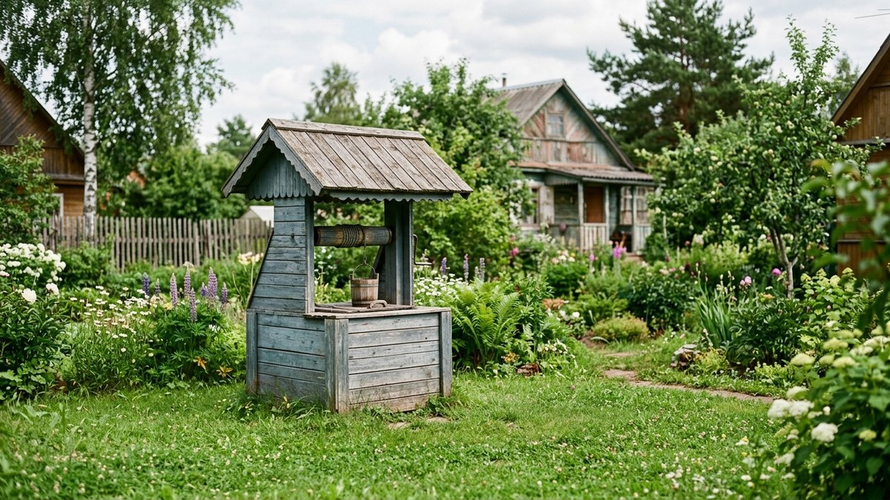
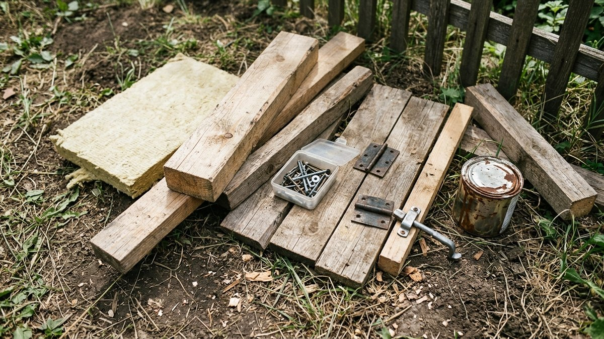
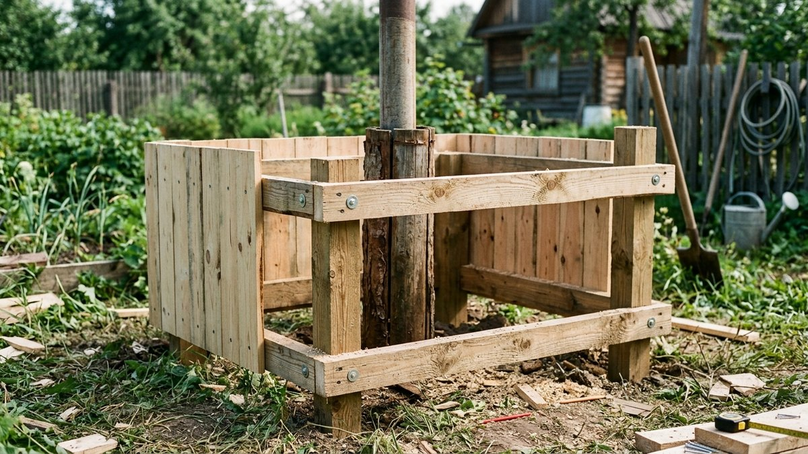
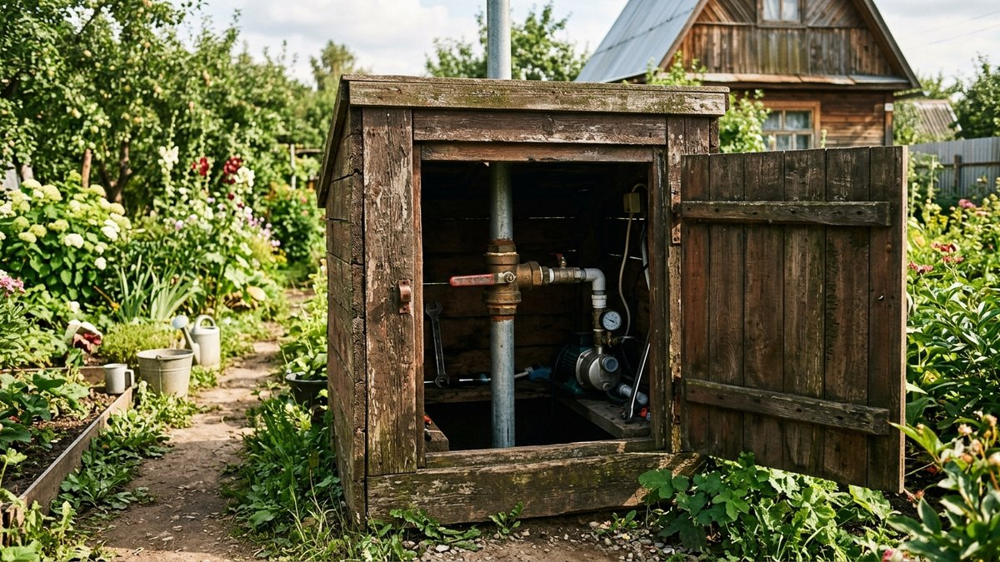
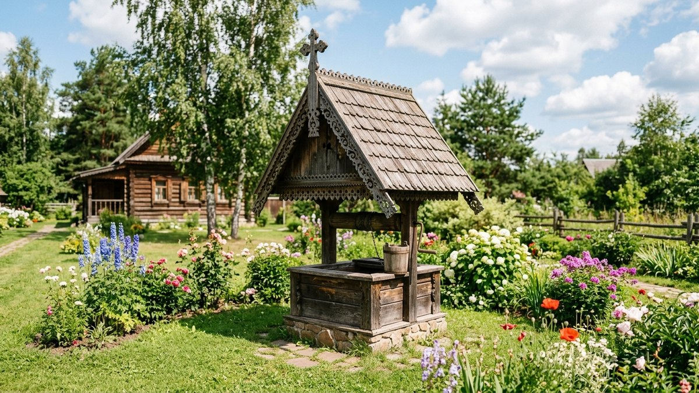
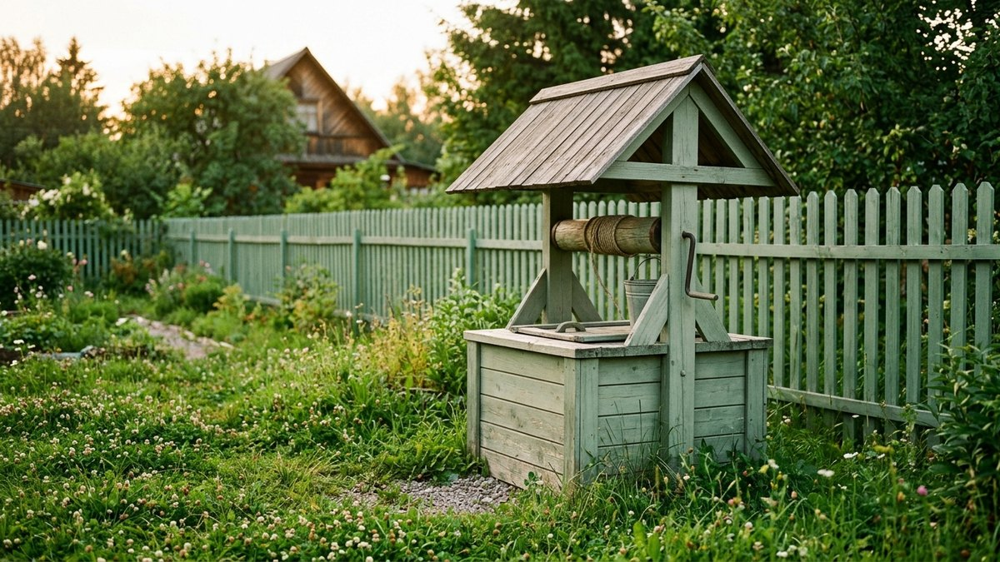

Торчащая из земли труба оголовка скважины редко украшает участок, а зимой ей
ещё и грозит промерзание. Решение простое — построить над скважиной
декоративный домик: он прячет оголовок, защищает от мусора и мороза и заодно
может служить местом для хранения шланга или садового инвентаря. В статье —
размеры, материалы и пошаговая сборка такого короба своими руками.

*Домик для скважины на дачном участке*

## Зачем скважине домик

- **Защита от мусора и осадков** — открытый оголовок собирает листья, снег и
  дождевую воду, которая может попасть в скважину.
- **Утепление на зиму** — если труба и запорная арматура находятся выше
  глубины промерзания, домик с утеплителем внутри спасает их от разрыва
  морозом. Общий принцип зимней защиты водопровода разобран в статье
  [скважина или колодец: что лучше выбрать](https://mir-doma.pro/skvazhina-ili-kolodec/) —
  там же смотрите, чем утеплённый кессон отличается от надземного домика.
- **Эстетика** — торчащая труба или пластиковый оголовок не украшают
  ландшафтный дизайн, а аккуратный домик в виде теремка вписывается в
  оформление участка.
- **Защита от несанкционированного доступа** — запирающийся домик закрывает
  доступ к вентилю и электрике насоса от детей и случайных гостей.

## Материалы и инструменты

- брус 50×50 мм для каркаса, обрезная доска или вагонка для обшивки стен;
- влагостойкая фанера или профлист для крыши;
- утеплитель (минвата или пеноплекс), если домик утепляется на зиму;
- саморезы, петли и защёлка для дверцы;
- антисептик и краска или лак для наружной отделки;
- шуруповёрт, ножовка или циркулярная пила, уровень, рулетка.

*Материалы для сборки декоративного домика*

## Размеры: как рассчитать под свою скважину

Отправная точка — диаметр обсадной трубы и размер кессона или адаптера, если
он уже стоит. Домику нужен запас минимум 15–20 см с каждой стороны от трубы,
чтобы было удобно открывать вентиль и доставать шланги. Стандартный размер
для дачной скважины — короб 60×60 см и высотой 80–100 см, этого достаточно и
под открытый оголовок, и под приямок с насосной автоматикой. Если планируете
хранить в домике ещё и шланг или инструмент, увеличьте короб до 80×80 см.

## Пошаговая сборка

1. **Соберите каркас.** Из бруса сколотите или сшурупьте четыре стойки по
   углам будущего короба и обвяжите их сверху и снизу горизонтальными
   перемычками — получится прямоугольная рама.
2. **Установите каркас над оголовком**, выставив по уровню так, чтобы труба
   проходила по центру, не касаясь стенок.
3. **Обшейте стены** доской или вагонкой снаружи. Одну из стен делают
   съёмной или навешивают как дверцу — доступ к вентилю и оборудованию нужен
   регулярно.
4. **Сделайте крышку.** Проще всего — плоская или двускатная крышка на
   петлях, чтобы открывать домик полностью сверху для обслуживания насоса.
   Для декоративности крышу делают с небольшим напуском и скатом для отвода
   воды.
5. **Утеплите изнутри**, если труба и арматура зимуют выше глубины
   промерзания — минватой или пеноплексом обшивают стены короба изнутри,
   оставляя вентиляционный зазор, чтобы не скапливался конденсат.
6. **Обработайте антисептиком и покрасьте** — древесина на улице без защиты
   темнеет и гниёт за 2–3 сезона.

*Сборка каркаса и обшивка стен домика для скважины*

## Вентиляция и доступ к оборудованию

Полностью герметичный домик — ошибка: конденсат и сырость внутри ускоряют
коррозию металлических частей. В нижней части стенок или под крышей делают
несколько вентиляционных отверстий или щелей, прикрытых сеткой от насекомых.
Дверцу или съёмную панель располагают со стороны, откуда удобнее всего
подходить к вентилю и электрике — обычно со стороны дорожки, а не со стороны
грядок.

*Домик для скважины с доступом к оборудованию*

## Декоративное оформление

Домик для скважины часто оформляют как мини-теремок — с резным коньком,
наличниками, окрашивают в цвет других построек на участке или отделывают под
сруб декоративными панелями. Простой вариант — покрасить короб в тон забора
или садового дома, чтобы он не выделялся отдельным акцентом на участке.

*Домик для скважины, оформленный под мини-теремок*

*Готовый домик для скважины после покраски*

## Частые ошибки

- **Домик впритык к трубе** — без запаса по бокам неудобно закручивать
  вентиль и снимать показания счётчика.
- **Нет вентиляции** — герметичный короб копит конденсат, из-за которого
  металлические детали ржавеют быстрее, чем на открытом воздухе.
- **Глухая стена без дверцы** — при первой же поломке насоса домик придётся
  разбирать целиком.
- **Утеплитель без пароизоляции** — минвата, намокшая от конденсата, теряет
  теплоизолирующие свойства и не защищает трубу от промерзания.

## Частые вопросы

### Как закрыть скважину на даче декоративно

Самый частый вариант — деревянный короб-теремок с дверцей на петлях,
который полностью закрывает оголовок и арматуру, оставляя доступ через
съёмную стенку или крышку. Материал и форму выбирают под общий стиль
участка — от простого щита до резного теремка.

### Нужно ли утеплять домик для скважины на зиму

Нужно, если труба и запорная арматура находятся выше глубины промерзания
грунта — тогда мороз может повредить металл и резьбовые соединения. Если
скважина обвязана ниже точки промерзания и все уязвимые узлы спрятаны в
утеплённом кессоне под землёй, надземный домик можно не утеплять — он играет
только декоративную роль.

### Какого размера делать домик для скважины

Ориентир — 60×60 см и высотой 80–100 см с запасом от трубы 15–20 см с каждой
стороны. Если внутри планируете хранить шланг или инструмент, увеличивайте
короб до 80×80 см.

### Из чего лучше сделать домик для скважины

Дерево — самый доступный и простой в обработке материал, но требует
антисептика и периодической покраски. Вариант с меньшим уходом — короб из
влагостойкой фанеры с отделкой сайдингом или профлистом под цвет других
построек на участке.

### Чем отличается домик для скважины от кессона

Кессон — это герметичная камера под землёй, куда выводят оголовок скважины и
насосное оборудование, она защищает от промерзания на уровне грунта. Домик —
надземная декоративная конструкция, которая просто закрывает трубу и
арматуру сверху от мусора, осадков и посторонних глаз; их часто делают вместе.
