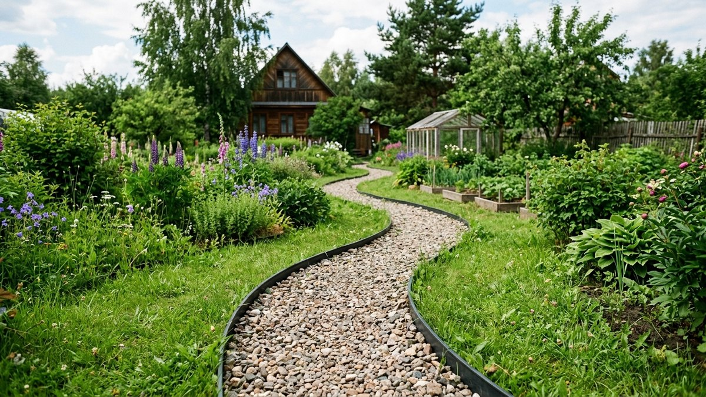
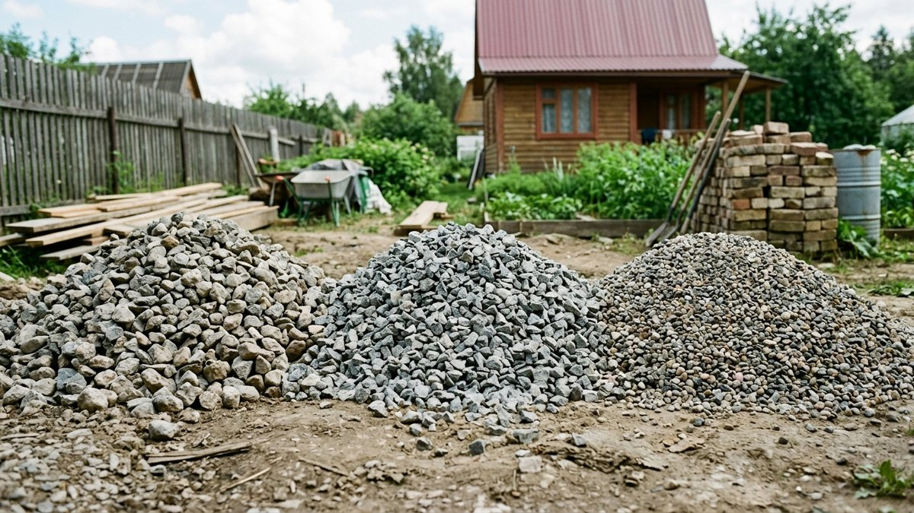
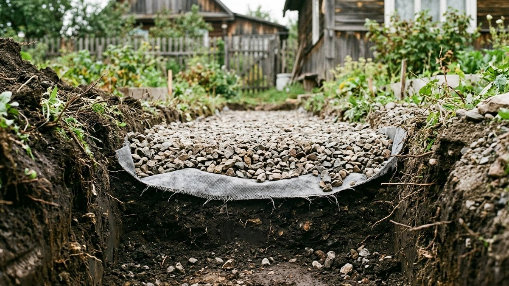
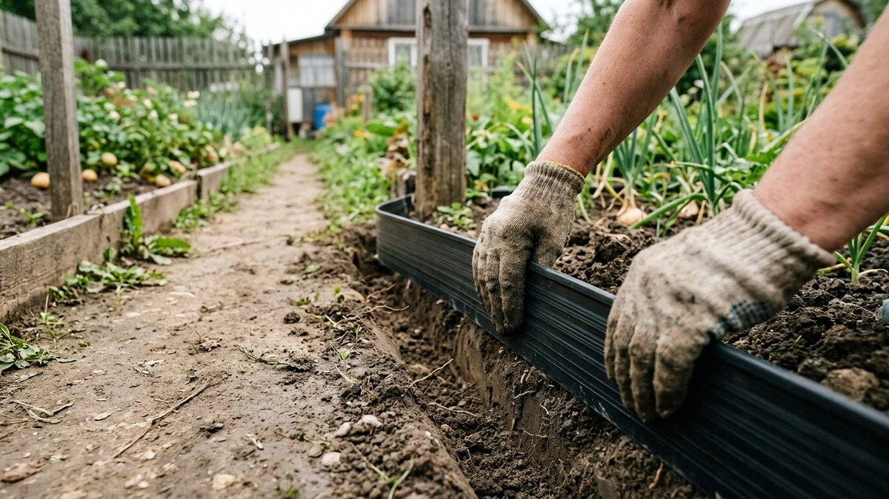
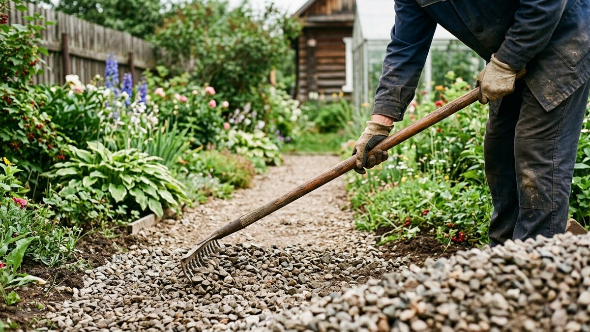
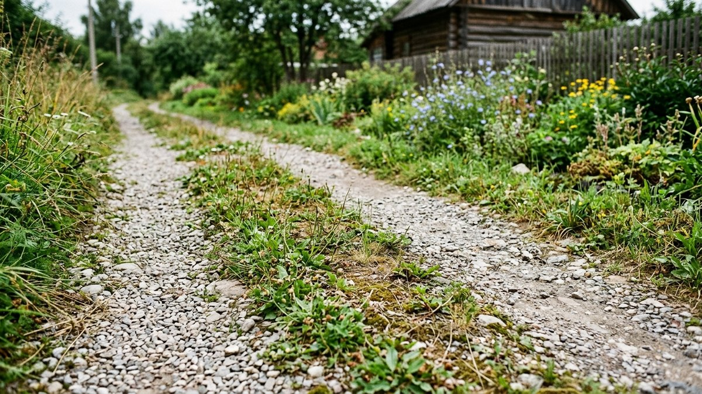

Дорожка из щебня — самый быстрый способ благоустроить участок без бетона и плитки: отсыпать её можно за один день. Но у этой простоты есть цена: без геотекстиля щебень за сезон втаптывается в землю, без бордюра расползается по грядкам, а с одной фракцией на всю глубину дорожка проседает и зарастает травой. Разберём, какие слои нужны в пироге, какую фракцию щебня брать для какого слоя и как сделать дорожку, которая не потребует ежегодной подсыпки.

## Где уместна щебневая дорожка, а где нет

Щебень хорош для второстепенных тропинок — между грядками, к хозблоку, вдоль забора, там, где не критична идеальная ровность и не планируется возить тяжёлую тачку с грузом каждый день. Для главной дорожки от калитки к дому щебень тоже подходит, но потребует более капитального пирога с бортовым камнем — иначе интенсивное хождение быстро разобьёт покрытие. Если участок только благоустраивается и калитки ещё нет, имеет смысл сразу спланировать дорожку под неё — как сделать калитку своими руками, разобрано в статье [здесь](https://mir-doma.pro/kalitka-svoimi-rukami/).

Если нужна дорожка под мощение плиткой с точным расчётом материала, это уже другая задача — она разобрана в статье про [расчёт тротуарной плитки для дорожки](https://mir-doma.pro/raschet-trotuarnoy-plitki/). Общий обзор всех вариантов покрытий для сада — в статье про [садовые дорожки своими руками](https://mir-doma.pro/sadovye-dorozhki-svoimi-rukami/).

## Какую фракцию щебня выбрать

Фракция щебня — это не вопрос вкуса, а вопрос функции слоя:

| Фракция | Где использовать |
|---|---|
| 40–70 мм (крупный) | Нижний дренажный слой на сырых, глинистых участках |
| 20–40 мм (средний) | Основной несущий слой пирога |
| 5–20 мм (мелкий, «отсев» или гравийная крошка) | Верхний финишный слой — по нему приятно ходить босиком и легче катить тачку |

Использовать один и тот же крупный щебень на всю глубину — частая ошибка: сверху он неудобен для ходьбы и проваливается под ногами, а мелкий отсев без крупной подложки внизу быстро смешивается с грунтом и перестаёт держать форму.

## Пирог дорожки послойно

1. **Снять плодородный слой грунта** на глубину 15–20 см по всей ширине будущей дорожки.
2. **Уплотнить дно** траншеи трамбовкой.
3. **Уложить геотекстиль** по дну и заворотом на боковые стенки — это главный элемент, без которого щебень со временем смешивается с землёй и дорожка проседает.
4. **Насыпать дренажный слой** щебня фракции 40–70 мм толщиной 7–10 см (на глинистых и сырых участках; на песчаных грунтах этот слой можно уменьшить), утрамбовать.
5. **Насыпать основной слой** фракции 20–40 мм толщиной 5–7 см, утрамбовать повторно.
6. **Застелить ещё одним слоем геотекстиля** между основным и финишным слоем — это разделяет фракции и не даёт мелкому отсеву проваливаться в крупный щебень снизу.
7. **Насыпать финишный слой** мелкой фракции 5–20 мм толщиной 3–5 см, разровнять граблями.
8. **Утрамбовать финишный слой** ручной трамбовкой или виброплитой для лёгких дорожек.

<!-- wp:html -->

<h3 class="md-sh__title">Калькулятор щебня для дорожки</h3>

Толщины слоёв — из раздела выше, при необходимости поменяйте под свой пирог.

<label class="md-sh__f">Длина дорожки, м<input type="number" id="shLen" value="10" min="0.5" max="500" step="0.1"></label>
<label class="md-sh__f">Ширина дорожки, м<input type="number" id="shWid" value="1" min="0.2" max="20" step="0.1"></label>
<label class="md-sh__f">Дренажный слой (40–70 мм), см<input type="number" id="shD1" value="8" min="0" max="40" step="1"></label>
<label class="md-sh__f">Основной слой (20–40 мм), см<input type="number" id="shD2" value="6" min="0" max="30" step="1"></label>
<label class="md-sh__f">Финишный слой (5–20 мм), см<input type="number" id="shD3" value="4" min="0" max="20" step="1"></label>
<label class="md-sh__f">Цена за 1 м³, ₽ (необязательно, среднее по фракциям)<input type="number" id="shPrice" value="" min="0" max="1000000" step="1" placeholder="0"></label>

Дренажный слой<b id="shV1">0,8 м³</b>

Основной слой<b id="shV2">0,6 м³</b>

Финишный слой<b id="shV3">0,4 м³</b>

Всего щебня<b id="shTotal">1,8 м³</b>

Примерный вес<b id="shWeight">≈2,7 т</b>

Стоимость<b id="shCost">—</b>

Вес — по средней насыпной плотности щебня 1,5 т/м³; для гравия и отсева может отличаться на 10–15%.

<button type="button" id="shCopy" class="md-sh__btn md-sh__btn--main">Скопировать результат</button>
<a id="shVk" class="md-sh__btn md-sh__btn--vk" href="#" target="_blank" rel="noopener noreferrer">Поделиться ВКонтакте</a>
<a id="shTg" class="md-sh__btn md-sh__btn--tg" href="#" target="_blank" rel="noopener noreferrer">Поделиться в Telegram</a>
<button type="button" id="shShareNative" class="md-sh__btn" hidden>Поделиться…</button>
<button type="button" id="shPrint" class="md-sh__btn">Печать</button>

<!-- /wp:html -->

## Бордюры: обязательный элемент, а не украшение

Без бордюра щебень расползается по газону и грядкам уже за первый сезон — особенно на слое, засыпанном мелкой фракцией. Подойдут:

- **Пластиковая бордюрная лента** — самый быстрый и бюджетный вариант, устанавливается по натянутому шнуру.
- **Бетонный бордюрный камень** — надёжнее всего, но требует отдельной подготовки и заливки основания под камень.
- **Металлический бортик** — держит форму лучше пластика, служит дольше, но заметно дороже.
- **Дерево (доска, брус)** — быстро гниёт в постоянном контакте с влажным щебнем, подходит только как временное решение.

Бордюр устанавливают до насыпки финишного слоя щебня, заглубляя минимум на две трети высоты, чтобы он не «гулял» под нагрузкой.

## Как защитить дорожку от прорастания травы

Геотекстиль в основании и под финишным слоем решает большую часть проблемы, но семена сорняков всё равно заносятся ветром и оседают в верхнем слое щебня. Дополнительно помогает:

- периодическая прополка вручную, пока корни сорняков ещё не разрослись сквозь геотекстиль;
- более толстый финишный слой (от 5 см) — чем он глубже, тем меньше света достаётся случайно проросшим семенам;
- обработка гербицидом сплошного действия по краям дорожки, где чаще всего прорастает трава с газона.

## Обслуживание: подсыпка и выравнивание

Даже с правильным пирогом щебневая дорожка со временем требует ухода: финишный слой утаптывается и вымывается дождями на 1–2 см в год, особенно на уклонах. Раз в один-два сезона дорожку подсыпают свежим щебнем той же фракции и разравнивают граблями. Это быстрее и дешевле, чем восстанавливать плиточное или бетонное покрытие, — в этом главное практическое преимущество щебня перед более капитальными вариантами. Такая же дорожка хорошо подходит и как подход к беседке или зоне отдыха — если беседки на участке ещё нет, инструкция по её строительству есть в статье про [беседку своими руками](https://mir-doma.pro/besedka-svoimi-rukami/).

## Частые ошибки

- **Сэкономили на геотекстиле** или уложили его только по дну без заворота на стенки — щебень со временем смешивается с грунтом по бокам и дорожка «плывёт».
- **Использовали одну фракцию на всю глубину.** Дорожка либо неудобна для ходьбы, либо быстро теряет форму.
- **Не поставили бордюр.** Щебень расползается по газону уже за один сезон дождей и покосов.
- **Не утрамбовали слои.** Рыхлый щебень проседает под ногами неравномерно, и на дорожке появляются колеи и лужи.
- **Сделали дорожку без уклона для стока воды.** Плоская поверхность превращается в цепочку луж после дождя.

## Частые вопросы

### Сколько щебня нужно на дорожку?

Расход считают по объёму: ширина × длина × толщина слоя. Для дорожки шириной 1 м и длиной 10 м с пирогом из трёх слоёв общей толщиной 15–20 см потребуется примерно 1,5–2 м³ щебня на все слои вместе.

### Нужен ли геотекстиль, если грунт песчаный?

Нужен в любом случае — он не только не даёт щебню смешиваться с грунтом, но и разделяет фракции между собой и препятствует прорастанию сорняков. На песчаных грунтах можно уменьшить толщину дренажного слоя, но не отказываться от геотекстиля совсем.

### Можно ли ходить по дорожке из щебня зимой?

Да, но при обледенении щебень скользит так же, как и любая другая твёрдая поверхность. Дополнительно посыпать дорожку песком или мелким отсевом для сцепления безопаснее, чем солью, которая разрушает бордюры и вымывается в грунт.

### Чем щебневая дорожка отличается от гравийной?

По сути это одно и то же покрытие — разница только в терминологии и иногда во внешнем виде: щебень получают дроблением камня, он угловатый и лучше «схватывается» между собой, гравий чаще имеет окатанную форму и требует более частой подсыпки.

### Можно ли положить щебень прямо на землю без пирога слоёв?

Можно для временной тропинки на один-два сезона, но постоянная дорожка без геотекстиля и уплотнённого основания быстро продавливается, зарастает травой и требует полной переделки уже через год.

## Заключение

Долговечная дорожка из щебня — это не просто «насыпать камень», а пирог из геотекстиля и минимум двух фракций щебня с обязательным бордюром по краям. При таком монтаже подсыпка требуется раз в один-два сезона, а не полная переделка каждый год.
