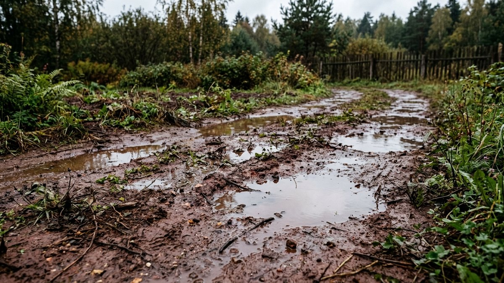
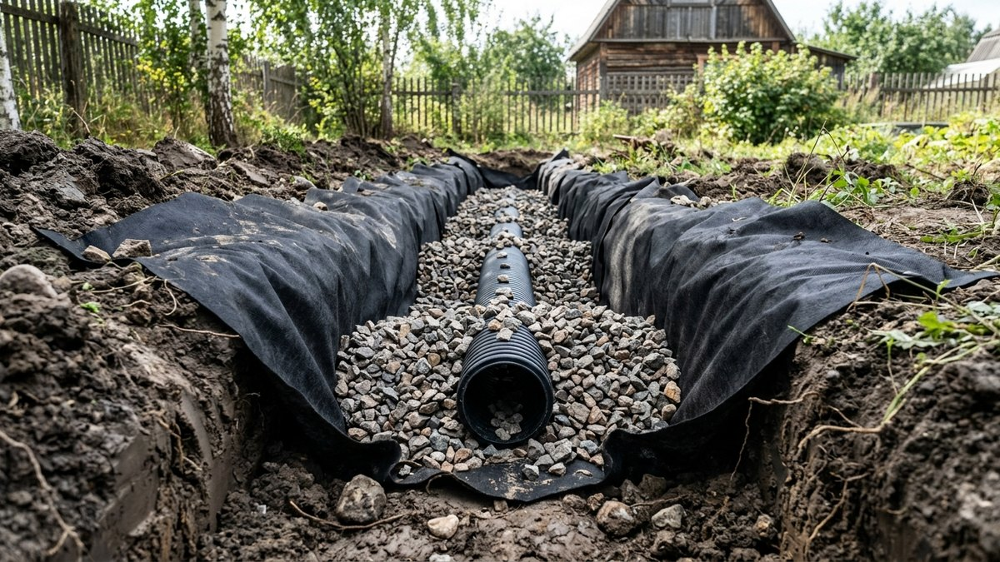
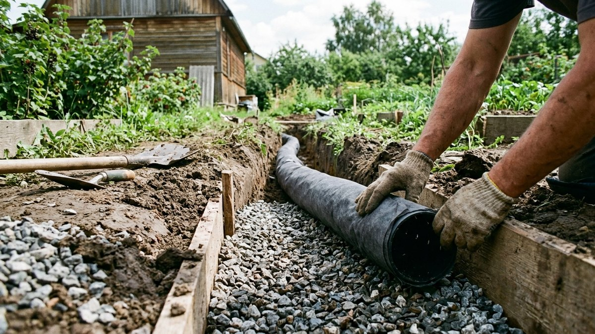
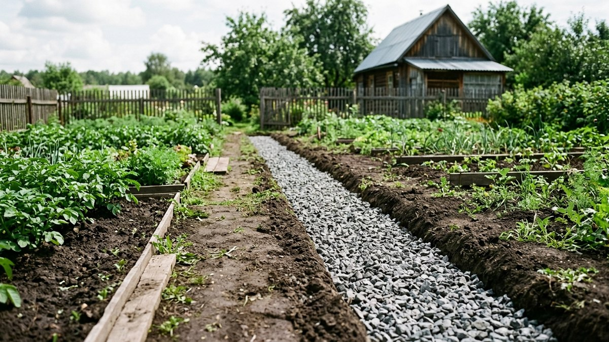
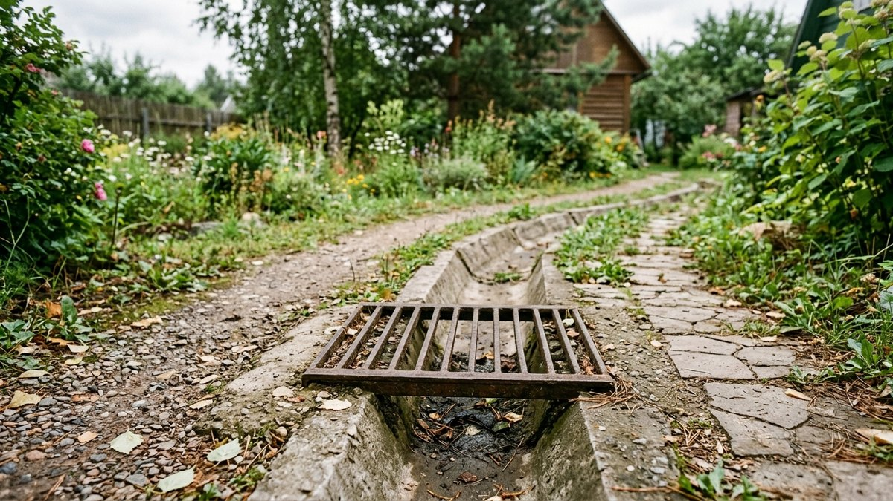
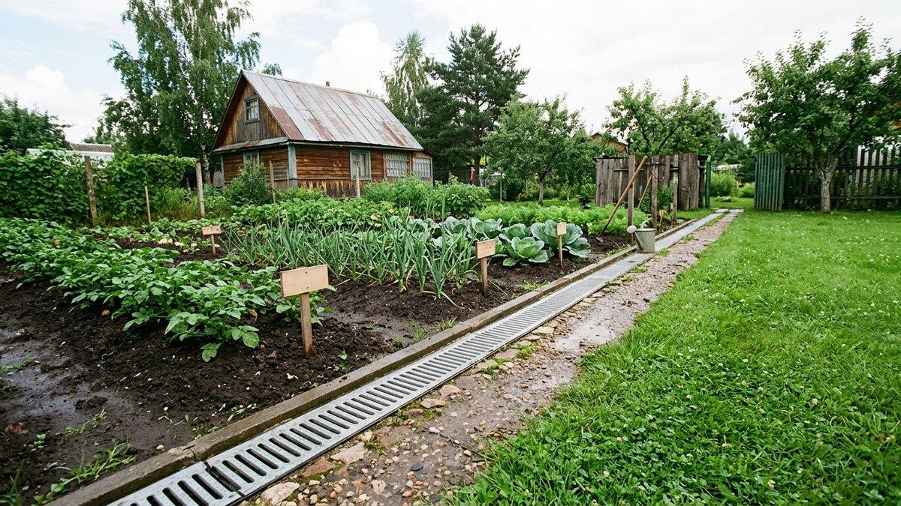

# Дренаж участка на глинистых почвах: устройство и расчёт

На песчаном грунте вода уходит вглубь сама, и дренаж там часто вообще не
нужен. На глине всё иначе: вода почти не просачивается сквозь плотные слои
и стоит лужами на поверхности после каждого дождя, а стандартная схема
дренажа, рассчитанная на обычный грунт, на глине часто просто не работает —
вода physически не успевает дойти до трубы. Разберём, чем устройство
дренажа на глинистой почве отличается и как посчитать материал. Дренаж —
одна из вещей, которые дешевле заложить на этапе планировки участка, чем
переделывать потом; разбор типичных промахов с водоотведением — в статье
[ошибки планировки дачного участка](https://mir-doma.pro/oshibki-planirovki-uchastka/).

## Почему обычная схема дренажа не работает на глине

Глубинный дренаж работает по принципу: вода просачивается сквозь грунт к
перфорированной трубе и уходит по ней самотёком. На песке и суглинке это
происходит быстро — вода находит путь к трубе за часы. На плотной глине
вода почти не двигается сквозь толщу грунта в стороны, и труба, уложенная
по стандартной схеме без широкой фильтрующей обсыпки, физически не успевает
собрать воду, которая стоит у поверхности в паре метров от неё. Отсюда
главный вывод: на глине поверхностный дренаж не менее важен, чем глубинный,
а сама обсыпка должна быть заметно шире.

## Два уровня дренажа: какой нужен на глине

- **Поверхностный дренаж (ливнёвка).** Открытые лотки, канавы и точечные
  дождеприёмники у водостоков — собирают воду прямо с поверхности, пока она
  не впиталась и не растеклась. На глинистом участке это первичная линия
  защиты, а не дополнение к глубинному дренажу.
- **Глубинный (закрытый) дренаж.** Перфорированная труба в траншее,
  обёрнутая геотекстилем и засыпанная щебнем — отводит грунтовые воды и
  осадки, просочившиеся в верхний слой почвы. На глине траншею делают
  шире обычной и обязательно с геотекстилем, иначе труба заиливается за
  один-два сезона.

## Материалы для глинистого грунта

- **Геотекстиль обязателен**, не опционально. Без него частицы глины
  забивают перфорацию трубы и щебень изнутри за один сезон дождей — на
  песчаном грунте это не так критично, на глине без геотекстиля дренаж
  перестаёт работать быстро.
- **Щебень фракции 20–40 мм**, а не гравий или песок — крупная фракция
  оставляет достаточно пустот для стока воды даже когда сама глина вокруг
  почти не пропускает влагу.
- **Труба диаметром от 110 мм** — на глине вода из-за медленного
  просачивания накапливается локально, и узкая труба быстрее не справляется
  с пиковым притоком после ливня.

## Порядок работ

1. Спланировать трассу с уклоном не менее 2 см на метр в сторону
   водоприёмника (колодца, канавы или естественного понижения рельефа) —
   на глине самотёк работает только при достаточном уклоне.
2. Выкопать траншею шире стандартной — на глине обсыпка должна быть не
   менее 15–20 см с каждой стороны трубы, а не 10 см, как на обычном грунте.
3. Застелить дно и стенки траншеи геотекстилем с нахлёстом, оставив запас
   для последующего оборачивания обсыпки сверху.
4. Насыпать слой щебня 10 см, уложить перфорированную трубу перфорацией
   вниз, засыпать щебнем до нужного уровня.
5. Завернуть геотекстиль внахлёст поверх обсыпки, чтобы частицы глины не
   попадали в дренажный слой сверху.
6. Засыпать траншею грунтом, оставив верхние 10–15 см под дёрн или
   декоративную отсыпку.
7. Организовать точки поверхностного сбора воды (лотки, дождеприёмники) в
   местах, где вода на глине скапливается быстрее всего — у отмостки дома
   и в естественных понижениях рельефа.

## Расчёт материала

### Калькулятор дренажной траншеи

<!-- wp:html -->

<h3 class="md-dr__title">Калькулятор дренажной траншеи</h3>

Считает объём выемки грунта, щебня и площадь геотекстиля по длине трассы.

<label class="md-dr__f">Длина трассы, м<input type="number" id="drLen" value="20" min="1" max="500" step="1"></label>
<label class="md-dr__f">Ширина траншеи, м<input type="number" id="drWid" value="0.4" min="0.2" max="1.5" step="0.05"></label>
<label class="md-dr__f">Глубина траншеи, м<input type="number" id="drDep" value="0.6" min="0.3" max="2" step="0.05"></label>
<label class="md-dr__f">Цена щебня за м³, ₽ (необязательно)<input type="number" id="drPrice" value="" min="0" max="20000" step="50" placeholder="0"></label>

Объём выемки грунта<b id="drDigOut">4,8 м³</b>

Щебень (обсыпка)<b id="drGravel">4,3 м³</b>

Труба<b id="drPipe">20 м</b>

Геотекстиль<b id="drGeo">32 м²</b>

Стоимость щебня<b id="drCost">—</b>

Щебень считается как 90% объёма траншеи — остальное занимают труба и верхний слой обратной засыпки грунтом. Геотекстиль — по периметру сечения траншеи (дно + две стенки) с запасом на нахлёст сверху.

<button type="button" id="drCopy" class="md-dr__btn md-dr__btn--main">Скопировать результат</button>
<a id="drVk" class="md-dr__btn md-dr__btn--vk" href="#" target="_blank" rel="noopener noreferrer">Поделиться ВКонтакте</a>
<a id="drTg" class="md-dr__btn md-dr__btn--tg" href="#" target="_blank" rel="noopener noreferrer">Поделиться в Telegram</a>
<button type="button" id="drShareNative" class="md-dr__btn" hidden>Поделиться…</button>
<button type="button" id="drPrint" class="md-dr__btn">Печать</button>

<!-- /wp:html -->

## Куда отводить воду

Дренаж должен куда-то выводить собранную воду — в дренажный колодец с
дальнейшим впитыванием в нижние слои грунта, в накопительную ёмкость для
последующего полива, или самотёком за пределы участка в канаву при наличии
уклона и разрешения. На глине впитывающий колодец работает хуже, чем на
песке, — тот же принцип медленного просачивания, поэтому для глинистых
участков чаще предпочтительны накопительная ёмкость или отвод в канаву,
а не расчёт на впитывание на месте. Если участок в целом ещё только
планируется, отвод воды и уклон трассы дренажа проще заложить сразу на
плане — общий подход к зонированию и коммуникациям разобран в статье
[планировка участка 10 соток](https://mir-doma.pro/planirovka-uchastka-10-sotok/).

## Частые ошибки

- **Расчёт трассы и обсыпки по нормам для песчаного грунта.** На глине
  нужна более широкая обсыпка щебнем и обязательный геотекстиль — иначе
  дренаж работает в разы хуже расчётного.
- **Только глубинный дренаж без поверхностного.** На глине вода в первую
  очередь стоит на поверхности — без открытых лотков и дождеприёмников
  закрытый дренаж не успевает её собрать.
- **Недостаточный уклон трассы.** Меньше 2 см на метр — и вода в траншее
  застаивается вместо самотёка к водоприёмнику.
- **Труба без геотекстиля.** На глинистом грунте перфорация забивается
  илистыми частицами быстрее, чем на песке, и труба перестаёт работать за
  один-два сезона.

## Частые вопросы

### Нужен ли дренаж на глинистом участке, если нет явного подтопления

Да — глина держит воду на поверхности даже без видимого подтопления
построек, и застой воды в приствольных кругах и на грядках снижает урожай
и провоцирует загнивание корней, даже если дом и дорожки визуально сухие.
Отдельный риск — погреб или подвал: на глинистом грунте без дренажа
грунтовые и талые воды у стен держатся дольше, и гидроизоляция получает
нагрузку постоянно, а не только в паводок — при строительстве погреба это
стоит закладывать сразу, разбор сметы — в статье [погреб своими руками:
сколько стоит построить](https://mir-doma.pro/stroitelstvo-pogreba-smeta/).

### Можно ли обойтись только поверхностным дренажем на глине

Для верхнего слоя часто достаточно поверхностного дренажа с лотками и
уклонами, но если рядом высокий уровень грунтовых вод или участок в
низине, без глубинного дренажа не обойтись — оба уровня работают в связке.

### Какой уклон нужен для дренажной трубы на глине

Не менее 2 см на метр длины трассы — на глине это особенно важно, так как
сама почва сток воды почти не поддерживает и вся нагрузка по отводу лежит
на уклоне и обсыпке.

### Как часто нужно обслуживать дренаж на глинистом участке

При правильном монтаже с геотекстилем — раз в несколько лет достаточно
проверять оголовки и колодцы на засор. Без геотекстиля илистые частицы
глины забивают перфорацию трубы намного быстрее, чем на песчаном грунте.

