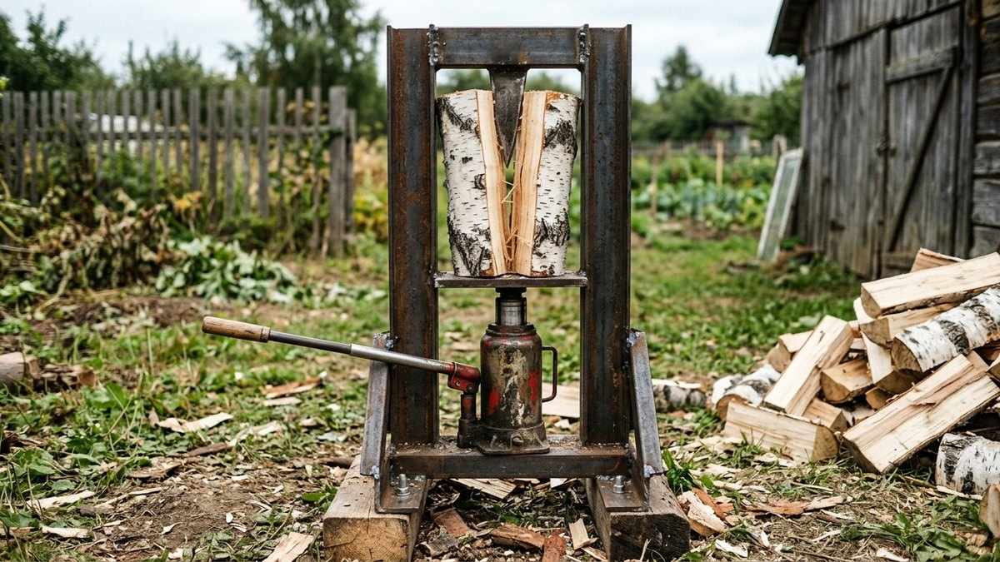
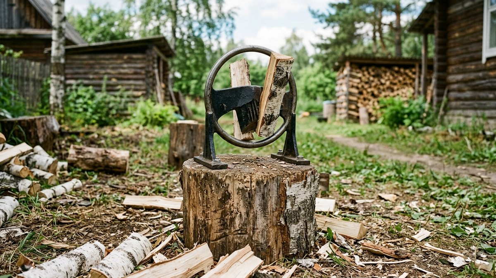
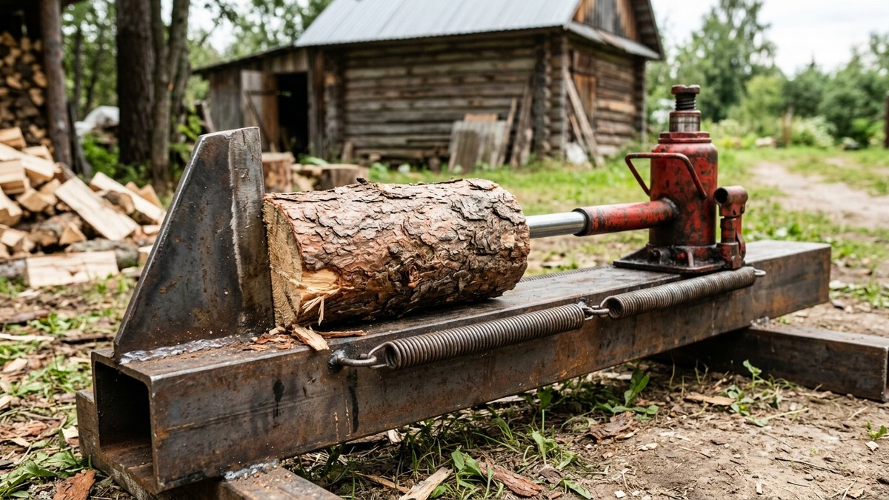
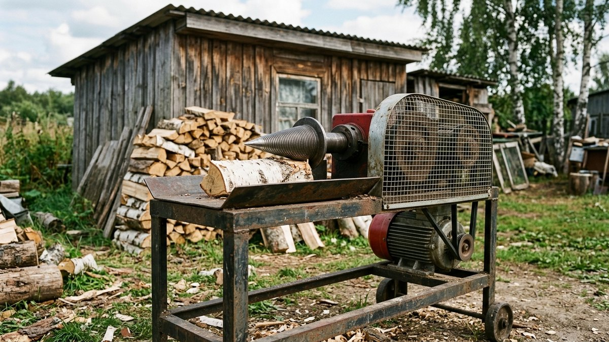
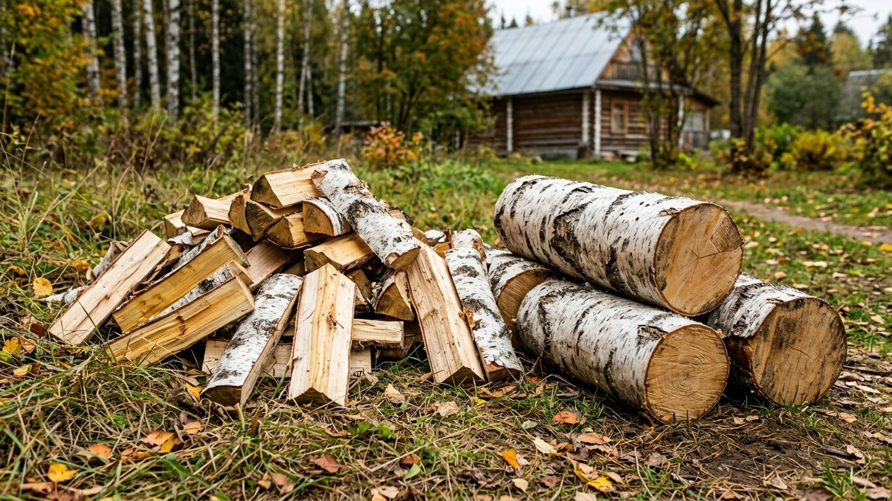
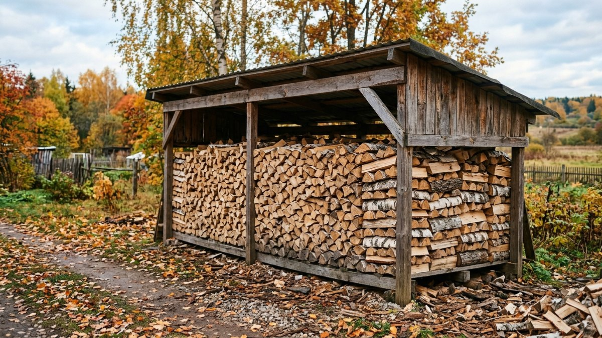

# Дровокол своими руками: ручной, винтовой и гидравлический — что выбрать и как сделать

Пять-шесть кубов дров на зиму — это несколько выходных с колуном и
больная спина. Дровокол своими руками решает задачу дешевле покупного
станка: ручной клин собирается за вечер, гидравлический из автомобильного
домкрата — за пару дней, винтовой с мотором колет быстрее всех, но
требует аккуратности. Разберём, чем три типа отличаются, какой подходит
под ваш объём дров, как устроена каждая конструкция и что в них
действительно опасно.

## Какой дровокол нужен под ваш объём

| Тип | Как колет | Скорость | Безопасность | Кому подходит |
|---|---|---|---|---|
| Ручной клин | Удар кувалдой или грузом по чурке на клине | Как колун, но без замаха | Высокая | 2–4 куба в год, растопка |
| Гидравлический | Домкрат толкает чурку на неподвижный клин | Медленно, 10–20 с на полено | Высокая | 3–10 кубов, сучковатые чурки |
| Винтовой («морковка») | Вращающийся конус с резьбой вкручивается в чурку | Быстро, секунды на полено | Низкая, опасен при небрежности | 10+ кубов, есть опыт |

Сколько кубов нужно именно вам, зависит от площади дома, утепления и
режима топки. Расчёт — в статье
[сколько дров нужно на зиму](https://mir-doma.pro/skolko-drov-nuzhno-na-zimu/).

## Ручной дровокол: клин на основании

Самая простая и безопасная конструкция. Клин остриём вверх закреплён
на тяжёлом основании, чурку ставят на острие и бьют сверху кувалдой
или грузом, который скользит по направляющей. Замаха нет, промахнуться
по ноге нельзя.

**Что понадобится:**

- основание: толстый стальной лист от 10 мм или старый диск колеса;
- клин: заточенная полоса стали 15–20 мм или готовый клин от колуна;
- для варианта с грузом — вертикальная труба-направляющая и груз
  5–8 кг, скользящий по ней;
- для варианта «клин в кольце» — кольцо из трубы Ø 20–30 см вокруг
  клина: полено ставят внутрь и бьют кувалдой, кольцо не даёт половинкам
  разлететься.

**Сборка:** клин приваривают к основанию строго вертикально, основание
крепят к пню или тяжёлой чурке, чтобы станок не прыгал при ударе.
Вариант с кольцом идеален для колки на растопку и небольших поленьев.

## Гидравлический дровокол из домкрата

Золотая середина для дачи: колет даже сучковатые чурки, при этом
медленный и безопасный.

**Устройство.** В прочной раме из швеллера или двутавра с одного конца
стоит бутылочный домкрат, с другого — неподвижный клин. Домкрат толкает
чурку на клин, и она раскалывается. Раму делают горизонтальной (удобнее
класть чурки) или вертикальной (занимает меньше места).

**Что понадобится:**

- бутылочный домкрат на 10–20 т, лучше с широкой пятой;
- швеллер или двутавр от 120 мм на раму, длиной под чурки плюс
  ход домкрата;
- клин из стали 15–20 мм, приваренный к раме с косынками;
- толкатель — стальная пластина на штоке домкрата;
- возвратные пружины, чтобы шток сам уходил назад.

**Сборка по шагам:**

1. Сварите раму. Длина = максимальная длина чурки + высота домкрата с
   ходом + 10 см.
2. Приварите клин на одном торце, усилив его косынками.
3. Закрепите домкрат на другом торце.
4. Приварите толкатель, поставьте возвратные пружины между толкателем и
   рамой.
5. Проверьте на мягкой чурке, затем на сучковатой.

Можно поставить электрический или бензиновый гидравлический насос
вместо ручной качалки, но это уже другой бюджет. Ручной домкрат —
10–15 качаний на полено, и это всё равно легче колуна.

## Винтовой дровокол («морковка»)

Конус с крупной резьбой вращается от электромотора и вкручивается в
чурку, разрывая её. Колет очень быстро, но это самый опасный из
самодельных станков.

**Устройство:**

- станина с рабочим столом;
- вал с конусом на двух подшипниковых опорах;
- электродвигатель 2,2–3 кВт, обычно трёхфазный или однофазный
  соответствующей мощности;
- ремённая передача, понижающая обороты конуса до нескольких сотен
  оборотов в минуту;
- защитный кожух на ремень и шкивы;
- кнопка аварийной остановки в зоне досягаемости.

Конус проще купить готовым: самостоятельно нарезать правильную резьбу на
конусе без токарного станка не получится.

**Правила, без которых этот станок не собирают:**

- **никаких перчаток и свободной одежды** — конус наматывает ткань
  вместе с рукой;
- чурку держат за торцы, руки никогда не находятся перед конусом;
- кожух на ремне обязателен;
- выключатель — в пределах досягаемости свободной руки или ногой;
- станок не дают в руки детям и гостям «попробовать».

Если нет уверенного опыта с вращающимся оборудованием, выбирайте
гидравлический вариант. Он медленнее, но прощает ошибки.

## Какие чурки колоть и как

- **Длина чурок** — под топку печи, обычно 30–40 см. Для буржуйки
  своими руками длину подбирают под её топку, как это сделать, описано
  в статье [буржуйка своими руками](https://mir-doma.pro/burzhuyka-svoimi-rukami/).
- **Сырые чурки колются легче**, особенно берёза и осина. Дуб и лиственницу
  удобнее колоть после небольшой подсушки.
- **Мороз помогает**: промёрзшая древесина раскалывается легче, поэтому
  многие колют дрова зимой.
- **Сучковатую чурку** ставят так, чтобы клин шёл мимо сучка, а не
  через него.

Пилить брёвна на чурки удобнее бензопилой. Какая модель подойдёт под
дачные объёмы — в статье
[как выбрать бензопилу](https://mir-doma.pro/kak-vybrat-benzopilu/).

## Безопасность для любого дровокола

- Защитные очки: щепа летит в лицо.
- Прочная обувь, лучше с защитным подноском.
- Ровная площадка, станок закреплён и не качается.
- Никого рядом в зоне разлёта половинок.
- Не колоть уставшим и в сумерках.

## Частые ошибки

- **Клин из мягкой стали.** Тупится и сминается за один сезон. Нужна
  закалённая или хотя бы толстая сталь.
- **Слабая рама гидравлического дровокола.** Домкрат на 20 т выгибает
  тонкий профиль, и клин уходит в сторону.
- **Нет возвратных пружин.** Шток приходится возвращать руками, работа
  замедляется вдвое.
- **Винтовой станок без кожуха и аварийной кнопки.** Самая частая
  причина тяжёлых травм.
- **Работа в перчатках на винтовом дровоколе.** См. выше: только без
  перчаток.

## Частые вопросы

### Какой дровокол лучше сделать своими руками для дачи

Для большинства дач — гидравлический из домкрата: колет сучковатые
чурки, безопасен и собирается из доступных деталей. Ручной клин —
для небольших объёмов и растопки, винтовой — для больших объёмов и
при опыте работы со станками.

### Какой домкрат нужен для дровокола

Бутылочный на 10–20 т. Меньше 10 т не хватает на сучковатую берёзу и
дуб, больше 20 т потребует очень массивной рамы.

### Какой двигатель нужен для винтового дровокола

Обычно 2,2–3 кВт с понижающей ремённой передачей. Мотор слабее
останавливается в сучковатой чурке.

### Опасен ли винтовой дровокол

Да, это самый травмоопасный из самодельных дровоколов. Им работают без
перчаток и свободной одежды, с кожухом на ремне и аварийной кнопкой под
рукой.

### Какие дрова легче колоть

Берёзу, осину и сосну — сырыми или промёрзшими. Дуб, вяз и сучковатую
древесину легче колоть гидравликой, а не колуном.

## Итог

Дровокол своими руками окупается уже в первый сезон. Для
небольших объёмов хватит ручного клина, для типичной дачи — гидравлики
из домкрата на 10–20 т в прочной раме. Винтовой станок оставьте для
больших объёмов и опыта со станками, и только с кожухом, аварийной
кнопкой и без перчаток.
