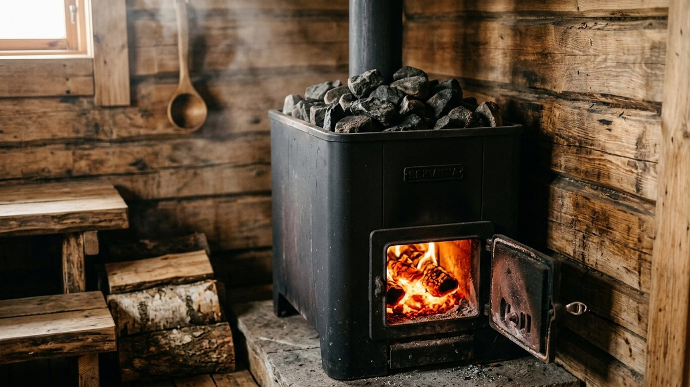
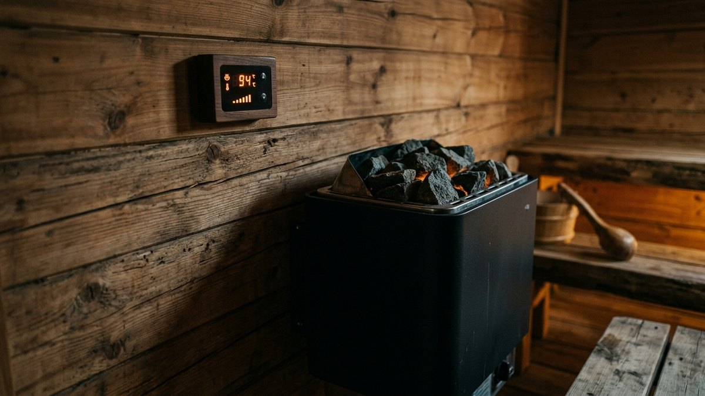
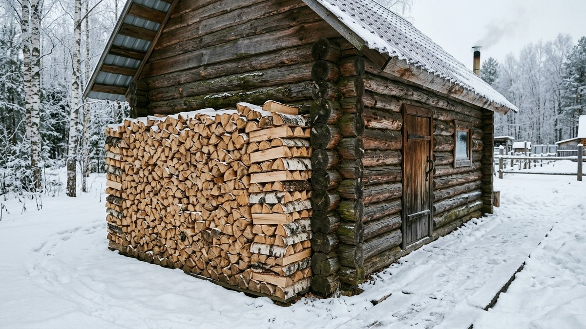
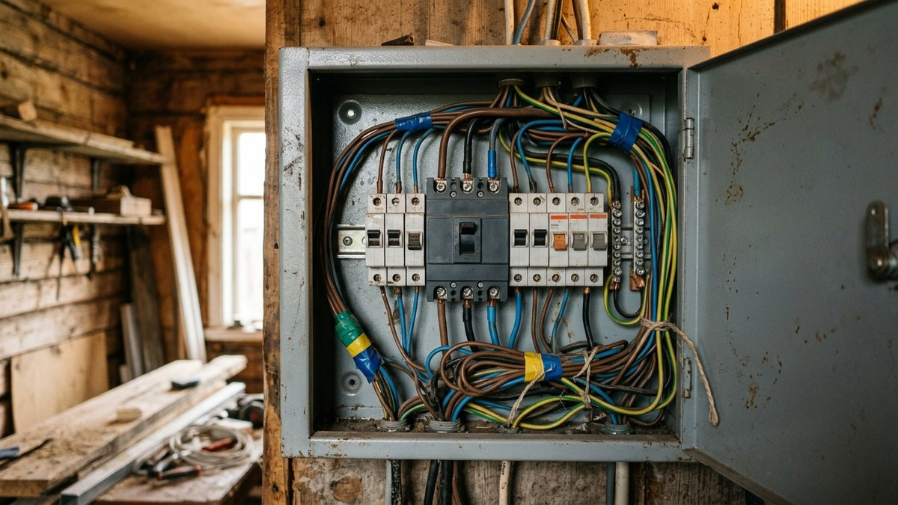
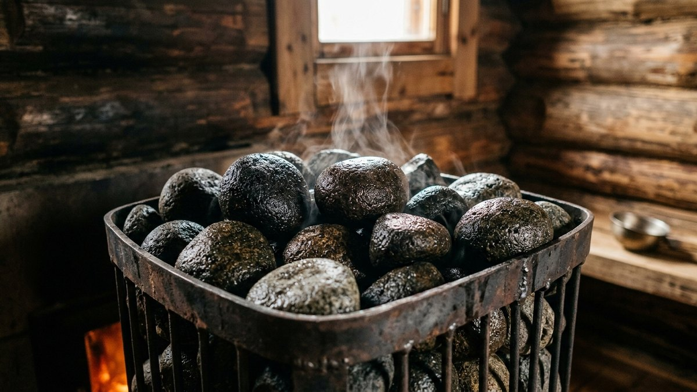
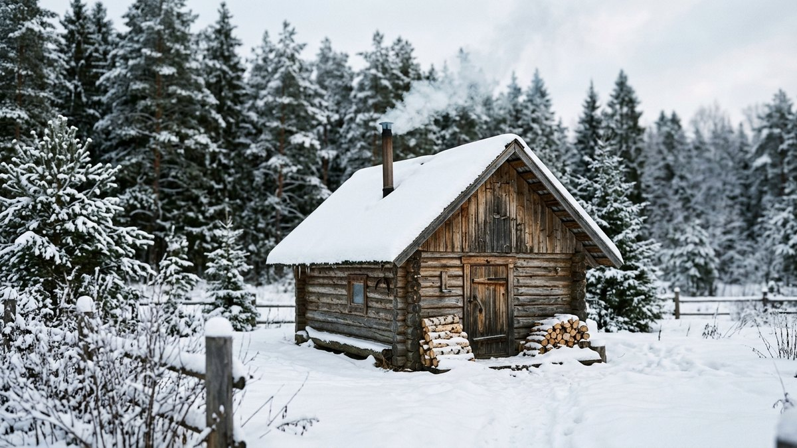

Это статья не про то, как сварить печь своими руками, и не про печь для отопления дачного дома — это разбор одного конкретного решения перед покупкой: дровяная или электрическая печь для бани. У обеих есть реальные плюсы и минусы, которые проявляются не в магазине, а через полгода использования, — разберём их по делу, посчитаем стоимость протопки и подскажем, что решает именно в вашем случае.

## Дровяная печь: плюсы и минусы

**Плюсы.** Классический «живой» пар, который большинство банщиков считает мягче электрического, — за счёт открытого огня и более высокой температуры камней. Не зависит от электросети совсем: баня топится, даже если на участке отключили свет. Дешевле в эксплуатации там, где дрова свои или недорогие.

**Минусы.** Топка занимает полтора-два часа, и всё это время нужно подкладывать дрова и следить за огнём — не получится включить по дороге и приехать к готовой бане. Нужен дымоход через кровлю — отдельный узел монтажа и пожарной безопасности. Требует запаса дров и места для их хранения. Зола и сажа — регулярная уборка и чистка дымохода. И строже требования по отступам от сгораемых конструкций — актуально, если баня стоит близко к дому или забору соседей, разбор норм — в статье [«Расстояние от дома до бани и забора»](https://mir-doma.pro/rasstoyanie-ot-doma-do-bani-zabora/).

## Электрическая печь: плюсы и минусы

**Плюсы.** Включается кнопкой или по таймеру — можно запустить прогрев по дороге на дачу и приехать к готовой парной, тот же принцип, что и с умным управлением отоплением дома, разобранным в статье [«Умная розетка для дачи»](https://mir-doma.pro/umnaya-rozetka-dlya-dachi/). Точный термостат держит заданную температуру без постоянного контроля. Нет дыма, золы и необходимости в дымоходе — проще вписать в готовую баню. Не нужно колоть и хранить дрова.

**Минусы.** Требует мощной выделенной линии — для печи на 9–12 кВт часто нужен трёхфазный ввод, а если участок подключён по старому однофазному вводу на несколько киловатт, без отдельного технологического присоединения не обойтись: как узнать реальную мощность и что для этого нужно, разобрано в статье [«Как увеличить мощность электричества на участке»](https://mir-doma.pro/kak-uvelichit-moshchnost-elektrichestva-na-uchastke/). Полностью зависит от электричества — при отключении света бани не будет, и слабая сеть с просадками напряжения (частая ситуация в СНТ) плохо сочетается с мощной нагрузкой без стабилизатора, подробнее — в статье [«Какой стабилизатор напряжения выбрать»](https://mir-doma.pro/kakoy-stabilizator-napryazheniya-vybrat/). Пар многие считают суше и менее насыщенным, чем от дровяной каменки, хотя современные закрытые электропечи с парогенератором заметно сокращают эту разницу.

## Сколько стоит одна протопка

Ориентировочный расчёт — дрова и электричество считаются по-разному, но сравнить стоимость одной протопки можно.

<!-- wp:html -->

  
Калькулятор: во сколько обходится одна протопка

  <label class="md-calc__label" for="mdBcWood">Цена дров, ₽ за м³ (для дровяной)</label>
  <input type="number" id="mdBcWood" class="md-calc__input" min="0" step="100" placeholder="например, 2500">
  <label class="md-calc__label" for="mdBcTariff">Тариф на электричество, ₽ за кВт·ч (для электрической)</label>
  <input type="number" id="mdBcTariff" class="md-calc__input" min="0" step="0.1" placeholder="например, 5.5">
  <label class="md-calc__label" for="mdBcPower">Мощность электропечи, кВт</label>
  <input type="number" id="mdBcPower" class="md-calc__input" min="1" step="0.5" placeholder="например, 9">
  
Заполните поля выше

<!-- /wp:html -->

К стоимости протопки стоит прибавить разовые расходы на монтаж: дровяной печи — дымоход через кровлю и разделка, электрической — отдельная линия и, если мощности не хватает, увеличение технологического присоединения (это может стоить в разы больше, чем сама печь, если участок изначально подключён на минимальную мощность).

## Что решает именно в вашем случае

- **Баня топится каждую неделю или пару раз за сезон.** При частом использовании неудобство дровяной топки (полтора часа с подкладыванием дров) ощущается сильнее — электрическая с запуском по таймеру экономит время системно. При редких визитах разница не так критична.
- **На участке уже есть мощная электролиния или только предстоит её проводить.** Если трёхфазный ввод уже есть — электрическая печь становится намного проще в реализации. Если нет — сравните цену увеличения мощности с ценой дымохода, прежде чем решать по одним только эксплуатационным плюсам.
- **Баня стоит близко к дому, забору соседей или другим постройкам.** Дровяная печь и дымоход добавляют требований по пожарным отступам — если места мало, электрическая печь снимает этот вопрос почти полностью.
- **Хочется собрать печь своими руками.** Электрическую печь практически всегда покупают готовую — самостоятельно варят именно дровяные, пошаговая сборка разобрана в статье [«Печь для бани своими руками из металла»](https://mir-doma.pro/pech-dlya-bani-iz-metalla/).

## Камни нужны в любом случае

Независимо от типа печи — камни в каменке требуют отдельного разбора: не любой камень с реки подходит, а неподходящий трескается и разлетается от перепада температур. Какие камни выбрать, сколько нужно на объём парной и когда их менять — подробно в статье [«Какие камни выбрать для банной печи»](https://mir-doma.pro/kakie-kamni-dlya-bannoy-pechi/).

## Частые ошибки

- **Выбирать печь до того, как посчитана реальная мощность ввода.** Электрическая печь на 9 кВт при слабом однофазном вводе на 3–5 кВт просто не запустится — мощность проверяется до покупки, а не после доставки.
- **Экономить на дымоходе у дровяной печи.** Разделка и отступы от сгораемых конструкций — не место для экономии, здесь цена ошибки выше стоимости работ.
- **Не учитывать пожарные отступы от соседних построек при дровяной печи.** Расстояние до забора и соседского дома нормируется отдельно от расстояний внутри участка.
- **Судить о паре по одному разу.** Электрические печи с парогенератором и закрытой каменкой сильно отличаются от бюджетных моделей с открытыми ТЭНами — сравнивать стоит конкретные классы печей, а не тип отопления в целом.

## Частые вопросы

### Что лучше для бани: дровяная или электрическая печь?

Однозначного ответа нет — дровяная даёт более насыщенный пар и не зависит от электричества, но требует дымохода и времени на протопку. Электрическая удобнее и быстрее в повседневном использовании, но требует мощной электролинии. Выбор определяется тем, как часто топите баню и какая инфраструктура уже есть на участке.

### Сколько киловатт нужно для электрической печи бани?

Зависит от объёма парной: ориентировочно 1 кВт на 1 м³ помещения с поправкой на утепление и материал стен. Для стандартной парной 8–12 м³ это печи на 6–9 кВт, для больших — от 9 до 12–15 кВт, что обычно требует трёхфазного ввода.

### Можно ли поставить электрическую печь без трёхфазного ввода?

Маломощные электропечи (до 4,5–6 кВт) работают и от однофазной сети, но при этом почти всегда упираются в реально выделенную мощность участка. Перед покупкой стоит проверить точную цифру, а не ориентироваться на паспортную мощность розетки.

### Дороже ли топить баню электричеством, чем дровами?

Зависит от местных цен на дрова и тарифа на электричество — однозначно дороже или дешевле сказать нельзя без расчёта под конкретный регион, ориентир — в калькуляторе выше. Там, где дрова свои или дешёвые, дровяная печь обычно выгоднее по разовой протопке.

### Нужен ли дымоход для электрической печи бани?

Нет, электрическая печь не образует продуктов горения и дымохода не требует — нужна только вентиляция парной для отвода влажного воздуха и притока свежего, разбор устройства — в статье [«Вентиляция бани своими руками»](https://mir-doma.pro/ventilyaciya-v-bane-svoimi-rukami/).
