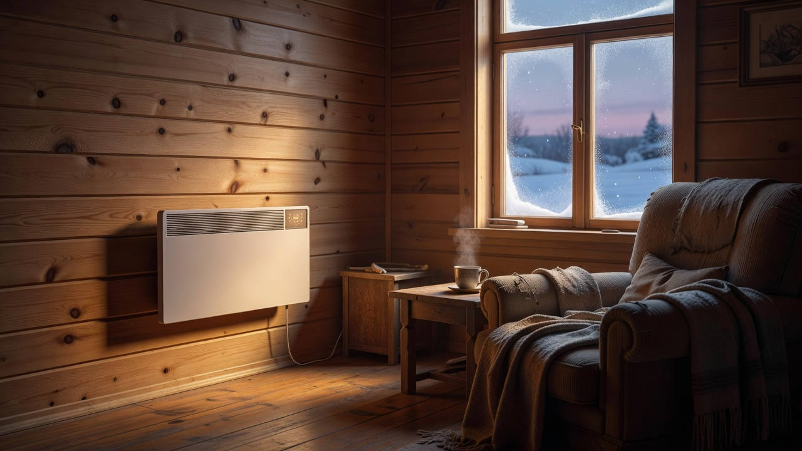
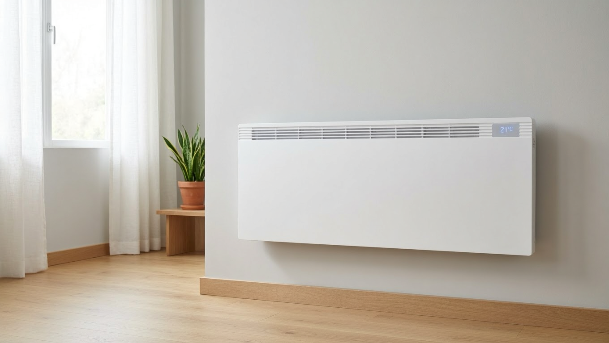
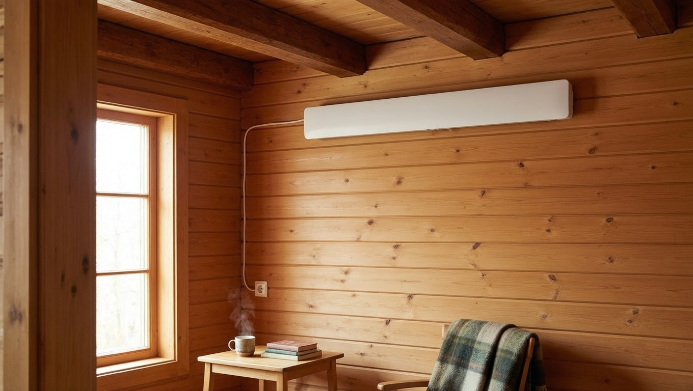
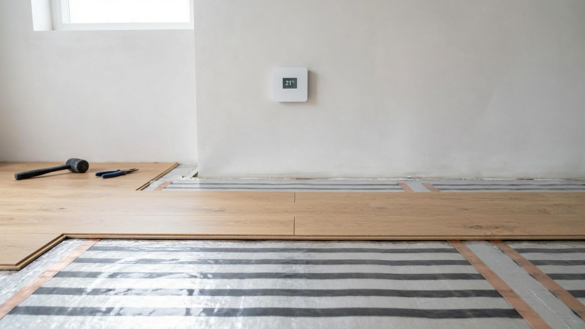
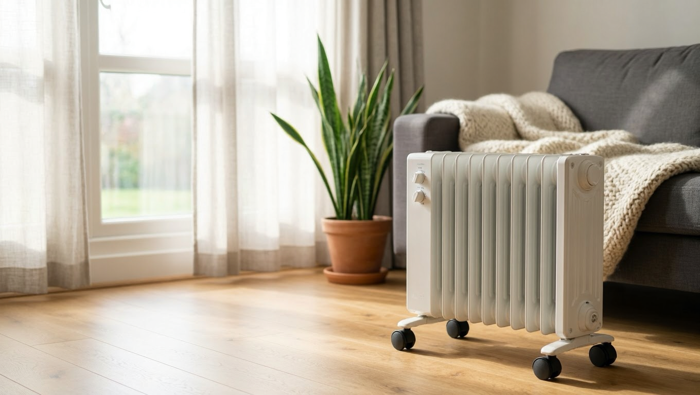
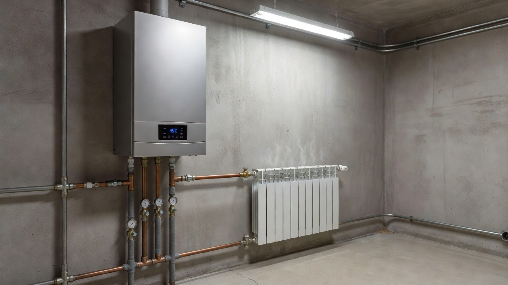

Электричество — самый простой способ обогреть дачу: не нужен дымоход, запас топлива и разрешения, а включить обогрев можно одной кнопкой или даже удалённо. Главные вопросы — чем именно греть и как не разориться на счетах за электричество. Разберём виды электрообогревателей для дачи, какой выбрать под ваш режим проживания и как сэкономить на электроотоплении.

## ⚡ Плюсы и минусы электрического отопления

У электрообогрева есть весомые достоинства и понятные ограничения.

**Плюсы:**

- простой монтаж — не нужны дымоход, котельная и согласования;
- безопасность — нет открытого огня и продуктов горения;
- автоматика — термостаты сами поддерживают температуру, многое управляется со смартфона;
- чистота — нет золы, копоти и запаха.

**Минусы:**

- электричество — недешёвый вид топлива, отопление большого дома влетает в копейку;
- зависимость от сети — при отключении электричества дом остывает;
- нагрузка на проводку — старая дачная сеть может не выдержать мощные приборы.

## 🔌 Виды электрообогревателей для дачи

Электроотопление бывает очень разным — от простого обогревателя до полноценной системы:

| Прибор | Особенности |
|---|---|
| Конвектор | Равномерное тепло, термостат, можно вешать на стену; основа стационарного отопления |
| Инфракрасный обогреватель | Греет не воздух, а предметы и людей; быстрый локальный нагрев |
| Масляный радиатор | Дешёвый, мобильный, долго держит тепло, но и медленно греет |
| Тепловентилятор | Мгновенно гонит тёплый воздух, но сушит и шумит; для быстрого прогрева |
| Электрокотёл + радиаторы | Полноценная система водяного отопления на электричестве |
| Тёплый пол (электрический) | Комфортное тепло снизу, хорош как основной или дополнительный обогрев |

Для дачи чаще всего берут конвекторы и инфракрасные обогреватели, а для постоянного проживания — электрокотёл или тёплый пол.

## 🎯 Что выбрать под режим использования

Выбор зависит от того, как вы пользуетесь дачей:

- **Наездами по выходным.** Нужен быстрый нагрев здесь и сейчас — инфракрасные обогреватели и тепловентиляторы прогреют комнату за минуты, пока конвектор раскачивается.
- **Для постоянного зимнего проживания.** Нужна стабильная система: конвекторы с термостатами в каждой комнате, электрокотёл с радиаторами или тёплый пол.
- **Поддержание «плюса» зимой** (чтобы не промерзал дом, трубы и техника). Конвектор с термостатом, выставленный на +5…+10 °C, будет включаться только при похолодании.

## 🌡️ Электрический тёплый пол на даче

Отдельного внимания заслуживает электрический тёплый пол — он даёт самое комфортное тепло, поднимающееся снизу. Бывает трёх видов:

- **Нагревательный кабель** — укладывают в стяжку, подходит для капитального обустройства;
- **Нагревательные маты** — тонкие, монтируются под плитку без толстой стяжки;
- **Инфракрасная плёнка** — под ламинат и линолеум, укладывается быстро и без стяжки.

Тёплый пол используют и как основное отопление, и как дополнение к конвекторам — например, в санузле и на кухне, где особенно приятно тепло под ногами. Для дачи, куда приезжают наездами, чаще делают плёночный пол в отдельных зонах: он быстро включается и не требует капитальных работ. Важное условие — укладывать тёплый пол только на утеплённое основание, иначе он будет греть перекрытие, а не комнату.

## 💡 Как сэкономить на электроотоплении

Электричество дорогое, поэтому экономия начинается не с обогревателя, а с дома:

- **Утепление — в первую очередь.** В неутеплённом доме электроотопление разорительно: тепло уходит быстрее, чем приборы его дают. Сначала утепляют стены, крышу, окна и пол — как это сделать, в статьях про [утепление дома](https://mir-doma.pro/kak-uteplit-dachnyy-dom/) и [утепление пола](https://mir-doma.pro/uteplenie-pola-na-dache/).
- **Термостаты** — не дают приборам работать вхолостую, поддерживая заданную температуру.
- **Зонированный обогрев** — грейте только те комнаты, где находитесь, а не весь дом.
- **Ночной тариф** — если счётчик двухтарифный, основной прогрев выгодно смещать на ночь.
- **Не грейте пустой дом на полную** — достаточно поддерживать «плюс», а к приезду прогреть.

## ⚠️ Электробезопасность и нагрузка на сеть

Электроотопление — это серьёзная нагрузка, и здесь важна безопасность:

- **Проверьте проводку.** Старая дачная сеть с тонкими проводами может не выдержать мощные обогреватели — возможен перегрев и пожар. При необходимости проводку меняют на медную нужного сечения.
- **Рассчитайте мощность.** Суммарная мощность приборов не должна превышать возможности ввода и автоматов.
- **Поставьте автоматы и УЗО.** Они защитят от перегрузки и утечки тока.
- **Не включайте мощные приборы в один удлинитель** и не оставляйте без присмотра дешёвые обогреватели.

Мощный электрокотёл или несколько конвекторов лучше подключать отдельными линиями через щиток.

## ❌ Частые ошибки

- **Топят неутеплённый дом** — счета огромные, а тепла всё равно мало.
- **Перегружают старую проводку** — риск перегрева и пожара.
- **Греют весь дом вместо нужных комнат** — лишний расход.
- **Берут один мощный тепловентилятор на всё** — он сушит воздух и не подходит для постоянного отопления.
- **Экономят на автоматике** — без термостатов приборы жгут электричество впустую.

## ❓ Частые вопросы

**Чем дешевле всего обогреть дачу электричеством?**
Дешевле всего обходится обогрев хорошо утеплённого дома конвекторами с термостатами при зонированном обогреве и ночном тарифе. Без утепления любой способ будет дорогим.

**Какой электрообогреватель самый экономичный?**
Инфракрасные обогреватели экономят за счёт локального обогрева (греют людей и предметы, а не весь объём), а конвекторы с точными термостатами — за счёт автоматики. Многое решает не прибор, а утепление и режим.

**Можно ли отапливать дачу конвекторами?**
Да, конвекторы с термостатами — популярное решение для дачи: их вешают в каждой комнате, и они сами поддерживают температуру. Для постоянного проживания их ставят как стационарную систему.

**Выдержит ли дачная проводка электрическое отопление?**
Старая проводка часто не рассчитана на мощные обогреватели. Перед установкой нужно проверить сечение проводов, мощность ввода и поставить автоматы с УЗО, при необходимости обновив электрику.

**Как обогреть дачу зимой, если приезжаешь наездами?**
Поддерживать «плюс» конвектором с термостатом, а к приезду быстро прогревать помещение инфракрасным обогревателем или тепловентилятором. Так дом не промерзает, а расход остаётся умеренным.

**Что экономичнее — конвектор или инфракрасный обогреватель?**
Для постоянного обогрева комнаты выгоднее конвектор с термостатом, для быстрого локального тепла (например, в мастерской или на время приезда) — инфракрасный. Часто их сочетают.

---

Электрическое отопление делает дачу тёплой без дымохода и запаса дров, а управлять им можно хоть со смартфона. Подберите приборы под свой режим проживания, но помните главное правило экономии: сначала утеплите дом, а уже потом выбирайте обогрев. Если же хочется автономности и живого тепла, присмотритесь к [печи для дачи](https://mir-doma.pro/pech-dlya-dachi/) как альтернативе или дополнению.
