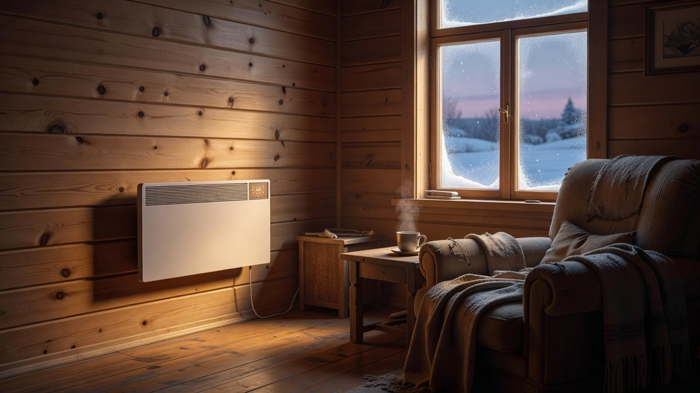
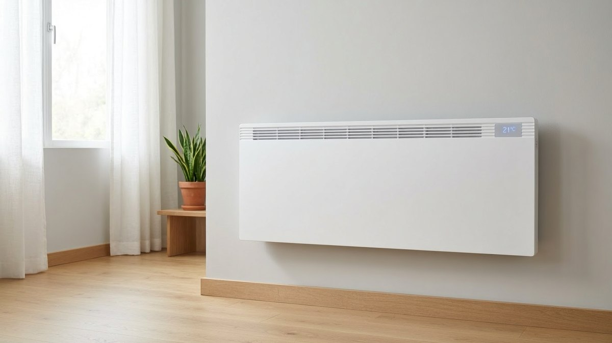
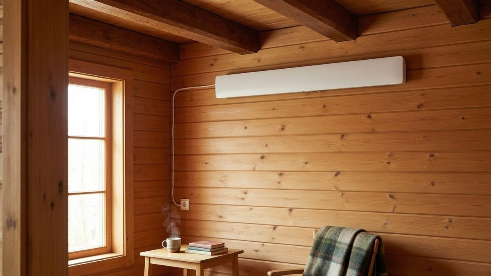
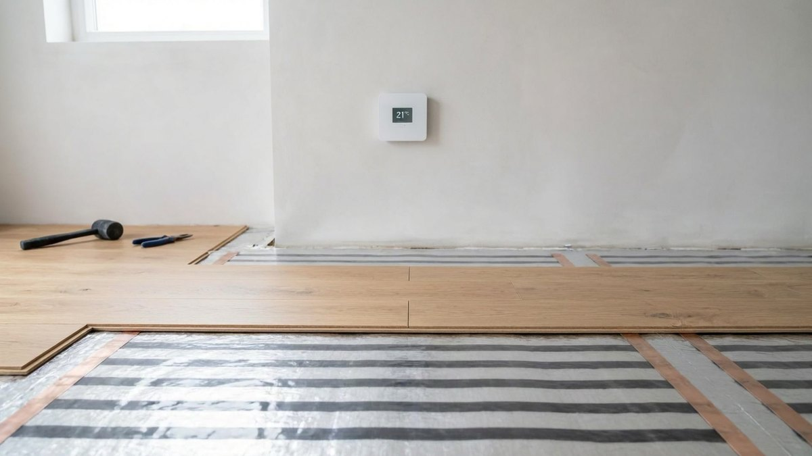
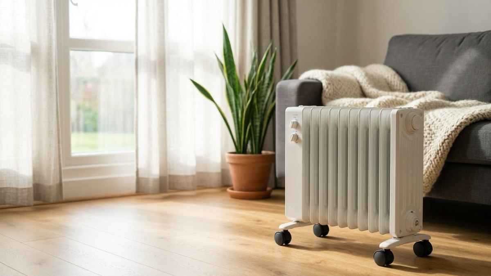
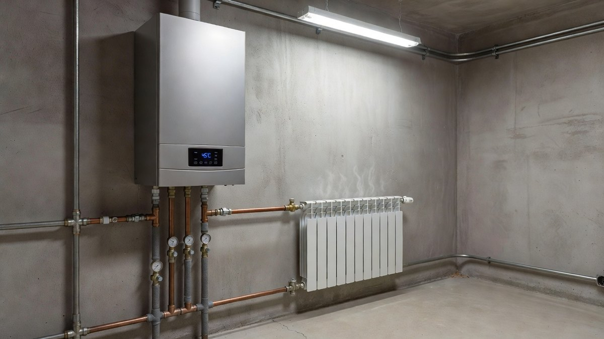

Электричество — самый простой способ обогреть дачу: не нужен дымоход, запас топлива и разрешения, а включить обогрев можно одной кнопкой или даже удалённо. Главные вопросы — чем именно греть и как не разориться на счетах за электричество. Разберём виды электрообогревателей для дачи, какой выбрать под ваш режим проживания и как сэкономить на электроотоплении.

## ⚡ Плюсы и минусы электрического отопления

У электрообогрева есть весомые достоинства и понятные ограничения.

**Плюсы:**

- простой монтаж — не нужны дымоход, котельная и согласования;
- безопасность — нет открытого огня и продуктов горения;
- автоматика — термостаты сами поддерживают температуру, многое управляется со смартфона;
- чистота — нет золы, копоти и запаха.

**Минусы:**

- электричество — недешёвый вид топлива, отопление большого дома влетает в копейку;
- зависимость от сети — при отключении электричества дом остывает;
- нагрузка на проводку — старая дачная сеть может не выдержать мощные приборы.

## 🔌 Виды электрообогревателей для дачи

Электроотопление бывает очень разным — от простого обогревателя до полноценной системы:

| Прибор | Особенности |
|---|---|
| Конвектор | Равномерное тепло, термостат, можно вешать на стену; основа стационарного отопления |
| Инфракрасный обогреватель | Греет не воздух, а предметы и людей; быстрый локальный нагрев |
| Масляный радиатор | Дешёвый, мобильный, долго держит тепло, но и медленно греет |
| Тепловентилятор | Мгновенно гонит тёплый воздух, но сушит и шумит; для быстрого прогрева |
| Электрокотёл + радиаторы | Полноценная система водяного отопления на электричестве |
| Тёплый пол (электрический) | Комфортное тепло снизу, хорош как основной или дополнительный обогрев |

Для дачи чаще всего берут конвекторы и инфракрасные обогреватели, а для постоянного проживания — электрокотёл или тёплый пол.

## 🎯 Что выбрать под режим использования

Выбор зависит от того, как вы пользуетесь дачей:

- **Наездами по выходным.** Нужен быстрый нагрев здесь и сейчас — инфракрасные обогреватели и тепловентиляторы прогреют комнату за минуты, пока конвектор раскачивается.
- **Для постоянного зимнего проживания.** Нужна стабильная система: конвекторы с термостатами в каждой комнате, электрокотёл с радиаторами или тёплый пол.
- **Поддержание «плюса» зимой** (чтобы не промерзал дом, трубы и техника). Конвектор с термостатом, выставленный на +5…+10 °C, будет включаться только при похолодании.

## 🌡️ Электрический тёплый пол на даче

Отдельного внимания заслуживает электрический тёплый пол — он даёт самое комфортное тепло, поднимающееся снизу. Бывает трёх видов:

- **Нагревательный кабель** — укладывают в стяжку, подходит для капитального обустройства;
- **Нагревательные маты** — тонкие, монтируются под плитку без толстой стяжки;
- **Инфракрасная плёнка** — под ламинат и линолеум, укладывается быстро и без стяжки.

Тёплый пол используют и как основное отопление, и как дополнение к конвекторам — например, в санузле и на кухне, где особенно приятно тепло под ногами. Для дачи, куда приезжают наездами, чаще делают плёночный пол в отдельных зонах: он быстро включается и не требует капитальных работ. Важное условие — укладывать тёплый пол только на утеплённое основание, иначе он будет греть перекрытие, а не комнату. Какой тёплый пол выбрать — кабель, маты или плёнку — и как его сделать, подробно в статье про [тёплый пол на даче](https://mir-doma.pro/teplyy-pol-na-dache/).

## 🧮 Сколько киловатт нужно: расчёт мощности

Прежде чем считать деньги, нужно понять, сколько тепла требует дом. Базовый ориентир для средней полосы:

> **1 кВт мощности на 10 м² площади** при потолках 2,5–3 м.

То есть дому 60 м² нужно примерно 6 кВт, дому 100 м² — около 10 кВт.

Но это отправная точка, и её корректируют под реальность:

| Условие | Поправка |
|---|---|
| Дом хорошо утеплён, стеклопакеты | ×0,7–0,8 (можно меньше мощности) |
| Средняя утеплённость | ×1,0 (базовый расчёт) |
| Дом почти не утеплён, старые окна | ×1,5–2,0 |
| Северный регион | ×1,3–1,5 |
| Угловая комната, много окон | +20% на комнату |
| Высокие потолки (от 3 м) | +10–15% |

**Пример.** Дачный дом 60 м², утепление среднее, средняя полоса: 60 ÷ 10 = 6 кВт. Если дом холодный, старой постройки — уже 9–12 кВт, и это принципиально другой счёт за электричество.

Мощность распределяют по комнатам пропорционально их площади: спальня 12 м² — конвектор на 1–1,5 кВт, гостиная 20 м² — 2 кВт.

⚠️ **Проверьте, выдержит ли сеть.** На дачу часто выделено всего 5–10 кВт на весь дом, включая чайник, насос и стиральную машину. Если расчётная мощность отопления упирается в лимит — это повод либо серьёзно утеплять дом, либо смотреть на другой вид отопления.

## 💰 Сколько стоит отопить дачу электричеством: расчёт

Здесь и кроется главный вопрос, ради которого всё считают. Формула простая:

> **Расход за месяц (кВт·ч) = мощность приборов (кВт) × часы работы в сутки × 30**

Ключевой момент, который меняет всё: **приборы с термостатом работают не круглосуточно, а примерно 30–50% времени** — они выключаются, когда комната прогрелась. Поэтому в расчёт берут не 24 часа, а 8–12 часов эффективной работы в сутки.

**Пример для дома 60 м² (6 кВт), средняя полоса, октябрь:**

- 6 кВт × 10 часов эффективной работы × 30 дней = **1800 кВт·ч в месяц**
- умножьте на ваш тариф — получите сумму в рублях.

В сильные морозы приборы работают дольше, и расход растёт; в межсезонье — падает вдвое и больше. Умножьте свой тариф на 1800 кВт·ч, и станет ясно, почему электроотопление считают дорогим: это счёт уровня целой зарплаты в северных регионах.

**Что радикально меняет цифру:**

- **Утепление** — главный множитель. Хорошо утеплённый дом требует в полтора-два раза меньше киловатт при той же температуре.
- **Режим использования.** Если вы приезжаете на выходные, реальный расход в разы меньше: в будни достаточно поддерживать +5…+8 °C, а не +22 °C.
- **Ночной тариф.** При двухтарифном счётчике ночная ставка обычно заметно ниже дневной — прогрев смещают на ночь.
- **Зонирование.** Греть одну комнату вместо всего дома — прямая экономия пропорционально площади.

**Сравнение с другими видами топлива.** Электричество — самое дорогое из распространённых: дрова и магистральный газ обходятся заметно дешевле в пересчёте на киловатт тепла. Поэтому электроотопление обычно выбирают там, где газа нет, а дровами топить неудобно, — или как дополнение к основному источнику. Что выгоднее при постоянном проживании, разобрано в статье про [котёл для дачи](https://mir-doma.pro/kotel-dlya-dachi/).

## 💡 Как сэкономить на электроотоплении

Электричество дорогое, поэтому экономия начинается не с обогревателя, а с дома:

- **Утепление — в первую очередь.** В неутеплённом доме электроотопление разорительно: тепло уходит быстрее, чем приборы его дают. Сначала утепляют стены, крышу, окна и пол — как это сделать, в статьях про [утепление дома](https://mir-doma.pro/kak-uteplit-dachnyy-dom/) и [утепление пола](https://mir-doma.pro/uteplenie-pola-na-dache/).
- **Термостаты** — не дают приборам работать вхолостую, поддерживая заданную температуру.
- **Зонированный обогрев** — грейте только те комнаты, где находитесь, а не весь дом.
- **Ночной тариф** — если счётчик двухтарифный, основной прогрев выгодно смещать на ночь.
- **Не грейте пустой дом на полную** — достаточно поддерживать «плюс», а к приезду прогреть.

## ⚠️ Электробезопасность и нагрузка на сеть

Электроотопление — это серьёзная нагрузка, и здесь важна безопасность:

- **Проверьте проводку.** Старая дачная сеть с тонкими проводами может не выдержать мощные обогреватели — возможен перегрев и пожар. При необходимости проводку меняют на медную нужного сечения.
- **Рассчитайте мощность.** Суммарная мощность приборов не должна превышать возможности ввода и автоматов.
- **Поставьте автоматы и УЗО.** Они защитят от перегрузки и утечки тока.
- **Не включайте мощные приборы в один удлинитель** и не оставляйте без присмотра дешёвые обогреватели.

Мощный электрокотёл или несколько конвекторов лучше подключать отдельными линиями через щиток.

## ❌ Частые ошибки

- **Топят неутеплённый дом** — счета огромные, а тепла всё равно мало.
- **Перегружают старую проводку** — риск перегрева и пожара.
- **Греют весь дом вместо нужных комнат** — лишний расход.
- **Берут один мощный тепловентилятор на всё** — он сушит воздух и не подходит для постоянного отопления.
- **Экономят на автоматике** — без термостатов приборы жгут электричество впустую.

## ❓ Частые вопросы

**Сколько киловатт нужно для отопления дачи?**
Базовый ориентир — 1 кВт на 10 м² при потолках 2,5–3 м: дому 60 м² нужно около 6 кВт. В плохо утеплённом доме мощность умножают на 1,5–2, в северном регионе — на 1,3–1,5. Обязательно проверьте, сколько киловатт выделено на участок: часто это всего 5–10 кВт на весь дом.

**Сколько стоит отопить дачу электричеством?**
Расход считают так: мощность приборов × часы эффективной работы (обычно 8–12 в сутки, а не 24, потому что термостат отключает прибор) × 30 дней. Для дома 60 м² выходит около 1800 кВт·ч в месяц — умножьте на свой тариф. Утепление снижает эту цифру в полтора-два раза.

**Выгодно ли отапливать дачу электричеством?**
Электричество — самое дорогое из распространённых видов топлива, дешевле обходятся дрова и магистральный газ. Зато оно выигрывает простотой: не нужны дымоход, запас топлива и разрешения. Разумный вариант — электроотопление в утеплённом доме, с термостатами и обогревом только нужных комнат.

**Чем дешевле всего обогреть дачу электричеством?**
Дешевле всего обходится обогрев хорошо утеплённого дома конвекторами с термостатами при зонированном обогреве и ночном тарифе. Без утепления любой способ будет дорогим.

**Какой электрообогреватель самый экономичный?**
Инфракрасные обогреватели экономят за счёт локального обогрева (греют людей и предметы, а не весь объём), а конвекторы с точными термостатами — за счёт автоматики. Многое решает не прибор, а утепление и режим.

**Можно ли отапливать дачу конвекторами?**
Да, конвекторы с термостатами — популярное решение для дачи: их вешают в каждой комнате, и они сами поддерживают температуру. Для постоянного проживания их ставят как стационарную систему.

**Выдержит ли дачная проводка электрическое отопление?**
Старая проводка часто не рассчитана на мощные обогреватели. Перед установкой нужно проверить сечение проводов, мощность ввода и поставить автоматы с УЗО, при необходимости обновив электрику.

**Как обогреть дачу зимой, если приезжаешь наездами?**
Поддерживать «плюс» конвектором с термостатом, а к приезду быстро прогревать помещение инфракрасным обогревателем или тепловентилятором. Так дом не промерзает, а расход остаётся умеренным.

**Что экономичнее — конвектор или инфракрасный обогреватель?**
Для постоянного обогрева комнаты выгоднее конвектор с термостатом, для быстрого локального тепла (например, в мастерской или на время приезда) — инфракрасный. Часто их сочетают.

---

Электрическое отопление делает дачу тёплой без дымохода и запаса дров, а управлять им можно хоть со смартфона. Но цифры честнее слов: посчитайте мощность по площади, прикиньте месячный расход по своему тарифу — и станет ясно, укладывается ли электроотопление в ваш бюджет. Главное правило экономии неизменно: сначала утепление дома, потом выбор обогревателей.

**Куда идти дальше:**

- Расчёт показал слишком большой счёт? Это признак теплопотерь, а не плохих приборов. Начните со стен и крыши — [утепление дачного дома](https://mir-doma.pro/kak-uteplit-dachnyy-dom/) снижает расход в полтора-два раза.
- Нужна автономность и живое тепло без счётчика — присмотритесь к [печи для дачи](https://mir-doma.pro/pech-dlya-dachi/): она греет и в отключение электричества.
- Планируете отапливать весь дом радиаторами — сравните виды топлива и выберите [котёл для дачи](https://mir-doma.pro/kotel-dlya-dachi/), электрический или другой.
- Хочется тепла под ногами в санузле и на кухне — самый комфортный вариант разобран в статье про [тёплый пол на даче](https://mir-doma.pro/teplyy-pol-na-dache/).
