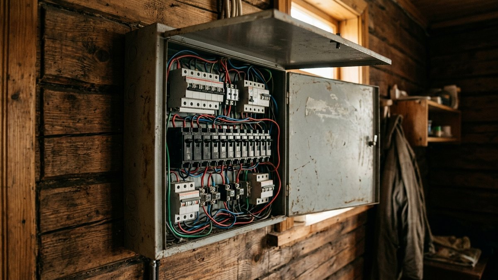
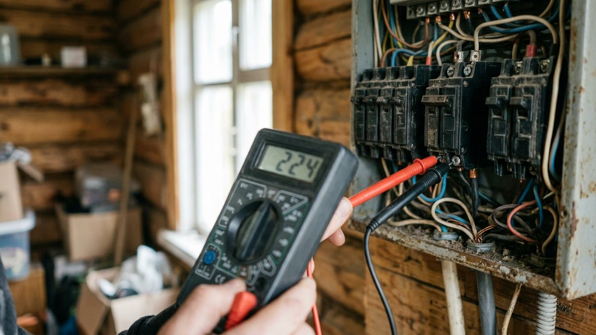
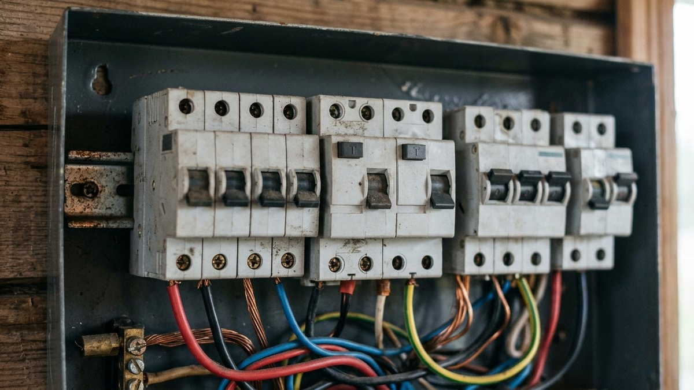
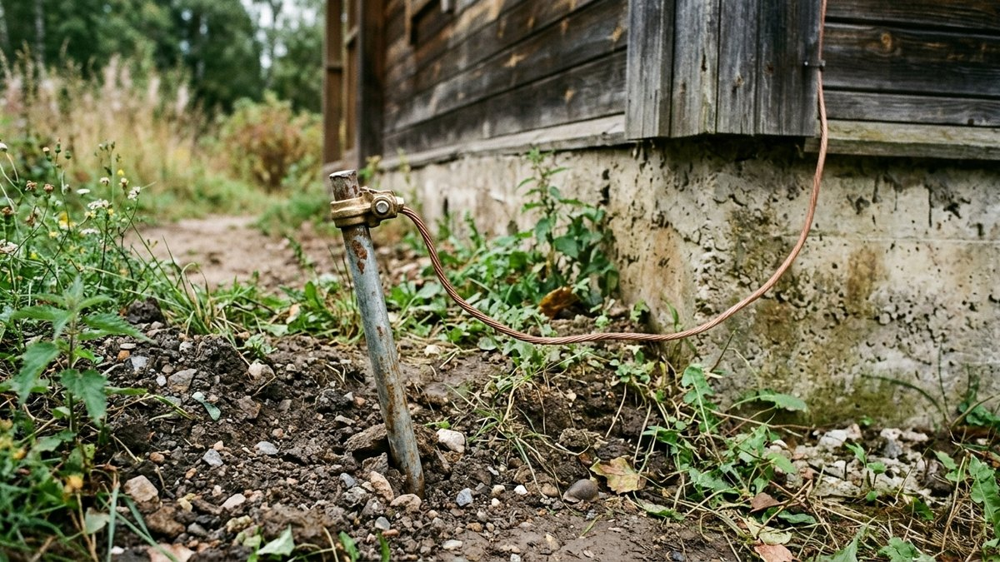
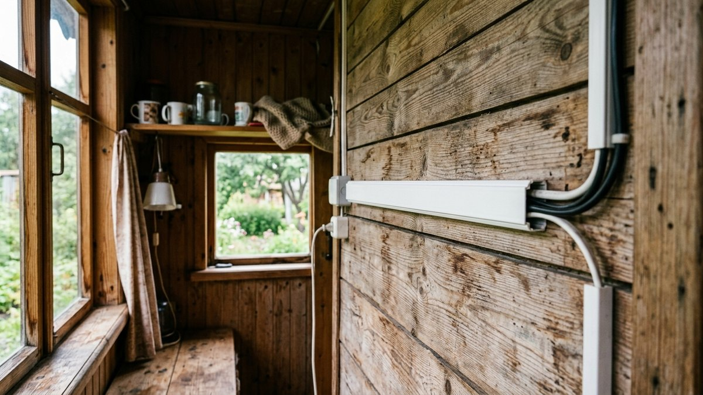
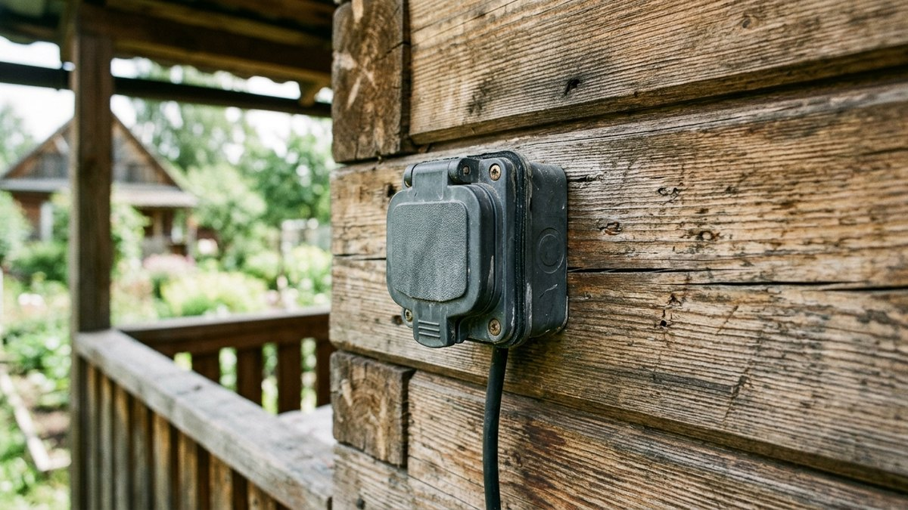

# Как провести электричество на даче своими руками

Проводка, собранная без расчёта нагрузки, — частая причина перегрева кабеля
и отключений автомата под вечер, когда включены чайник, обогреватель и
насос одновременно. Провести электричество на даче своими руками можно на
всех этапах, кроме подключения к сетям — от столба до счётчика работает
сетевая компания, а от щитка дальше по дому всё делается самостоятельно.
Разберём весь путь: от заявки на техусловия до автоматов, заземления и
разводки по комнатам.

## С чего начать: техусловия и ввод

Электричество на участок заводится по договору с сетевой компанией —
подаётся заявка на технологическое присоединение, в ней указывается нужная
мощность (обычно 15 кВт на частный дом хватает с запасом). Компания
доводит линию до границы участка и выдаёт техусловия: какой кабель, какой
автомат на вводе, где ставить прибор учёта. Ввод в дом делают либо
воздушной линией самонесущим изолированным проводом (СИП), либо кабелем в
земле — выбор зависит от расстояния до опоры и требований сетевой
компании.

## Расчёт нагрузки

Прежде чем считать сечение кабеля и подбирать автоматы, нужно понять
суммарную мощность потребителей:

- Освещение — обычно 1–1,5 кВт на весь дом.
- Розеточная группа (телевизор, зарядки, мелкая техника) — 3–5 кВт.
- Кухня (чайник, микроволновка, плита при наличии) — 5–8 кВт.
- Насос для скважины или колодца — 1–2 кВт, включается не постоянно, но
  учитывается в пике. Если на участке уже есть [скважина или колодец](https://mir-doma.pro/skvazhina-ili-kolodec/),
  мощность насоса берут из его паспорта, а не прикидывают на глаз.
- Обогреватели, тёплый пол — от 2 кВт и выше, самая частая причина
  недооценки общей нагрузки.

Складывают не все мощности разом (одновременно всё включённым бывает
редко), а берут суммарную мощность с коэффициентом одновременности
0,6–0,7 — так получается реалистичный пик, под который считают ввод и
кабель.

## Кабель: какое сечение выбрать

Сечение кабеля считается по итоговой нагрузке, а не берётся «с запасом на
глаз» — тонкий кабель греется и оплавляет изоляцию, а переплачивать за
избыточно толстый смысла нет. Для типовой дачи ориентир:

| Нагрузка группы | Сечение медного кабеля | Автомат |
|---|---|---|
| Освещение | 1,5 мм² | 10 А |
| Розетки | 2,5 мм² | 16 А |
| Мощная техника (плита, бойлер) | 4–6 мм² | 25–32 А |
| Ввод в дом | по расчёту суммарной нагрузки | по техусловиям |

Медь предпочтительнее алюминия — не окисляется в местах соединений так
сильно и держит нагрузку лучше при том же сечении. Точный расчёт под
конкретную нагрузку лучше доверить электрику на этапе проекта — ошибка в
сечении не видна сразу, а проявляется через перегрев спустя месяцы
эксплуатации.

## Автоматы и УЗО: как разделить группы

Всё через один автомат на весь дом — ошибка: если пробьёт розетку в
бане, обесточится и свет в доме. Группы разводят отдельно:

- **Свет** — отдельный автомат на каждый этаж или крупную зону.
- **Розетки** — отдельная группа, желательно с УЗО (устройство защитного
  отключения) на 30 мА — оно спасает при пробое изоляции и утечке тока,
  например если насос или обогреватель стоит во влажном помещении.
- **Мощная техника** (плита, бойлер, тёплый пол) — отдельный автомат под
  каждый мощный прибор, номинал по паспорту техники.
- **Улица** (освещение участка, розетки в беседке) — отдельная группа с
  УЗО, обязательно для влажных зон.

## Заземление

На даче с деревянными постройками и металлической кровлей заземление —
не формальность, а защита от удара током при пробое изоляции. Устраивают
контур из нескольких металлических штырей, вбитых в грунт, соединённых
между собой и заведённых на шину в щитке. Без заземления УЗО работает
менее надёжно, а корпуса металлических приборов (стиральная машина,
насосная станция) остаются потенциально опасными при повреждении
проводки.

## Разводка по дому

От щитка кабель прокладывают по группам, которые определили на этапе
расчёта: скрытая проводка в штробах под отделку или открытая в кабель-
каналах, если стены уже готовы и штробить не хочется. Розетки размещают
с запасом — переносить их после отделки намного дороже, чем заложить
на 2–3 больше расчётного количества. В помещениях с высокой влажностью
(баня, зона у септика или скважины) — розетки и выключатели с защитой
IP44 и выше.

## Резерв и сезонное отключение

Если электричество на участке нестабильно, часть нагрузки (насос,
освещение, холодильник) можно вывести на резервный генератор через
отдельный переключатель — но это уже отдельный расчёт мощности генератора
под конкретные приборы. Осенью, когда дом консервируют на зиму,
электричество отключают отдельно от воды — полный чек-лист с
последовательностью действий собран в статье [консервация дачи на
зиму](https://mir-doma.pro/konservaciya-dachi-na-zimu/).

## Частые ошибки

- **Считают нагрузку по количеству розеток, а не по мощности приборов** —
  автомат срабатывает при первом одновременном включении чайника и
  обогревателя.
- **Ставят один автомат на весь дом** — любая неисправность обесточивает
  всё сразу, включая насос, если на участке [септик со станцией
  очистки](https://mir-doma.pro/septik-dlya-dachi/), которой тоже нужно
  питание.
- **Экономят на УЗО во влажных зонах** — баня, улица и помещение у насоса
  без защитного отключения самые частые места поражения током.
- **Забывают про заземление**, ориентируясь только на автоматы — без
  контура заземления защита работает не полностью.

## Частые вопросы

**Можно ли провести электричество на даче своими руками полностью?**
От столба до счётчика — только сетевая компания. От щитка по дому —
самостоятельно, если есть навык и понимание норм; для расчёта сечения и
подбора автоматов лучше привлечь электрика хотя бы на стадии проекта.

**Какой кабель нужен для проводки на даче?**
Медный, сечение по нагрузке группы: 1,5 мм² для света, 2,5 мм² для
розеток, 4–6 мм² для мощной техники и ввода — точный расчёт зависит от
суммарной мощности потребителей.

**Нужно ли УЗО на даче?**
Да, обязательно на группы с повышенной влажностью — улица, баня, зона
насоса или скважины. УЗО отключает питание при утечке тока и защищает
от поражения при пробое изоляции.

**Сколько стоит провести электричество на даче?**
Зависит от расстояния до опоры, длины разводки по дому и количества
групп — техусловия и подключение сетевой компанией считаются отдельно
от внутренней разводки по дому.

**Нужно ли заземление на дачном участке?**
Да, особенно при деревянных постройках и металлических приборах —
контур заземления снижает риск поражения током при повреждении проводки
и делает работу УЗО надёжнее.
