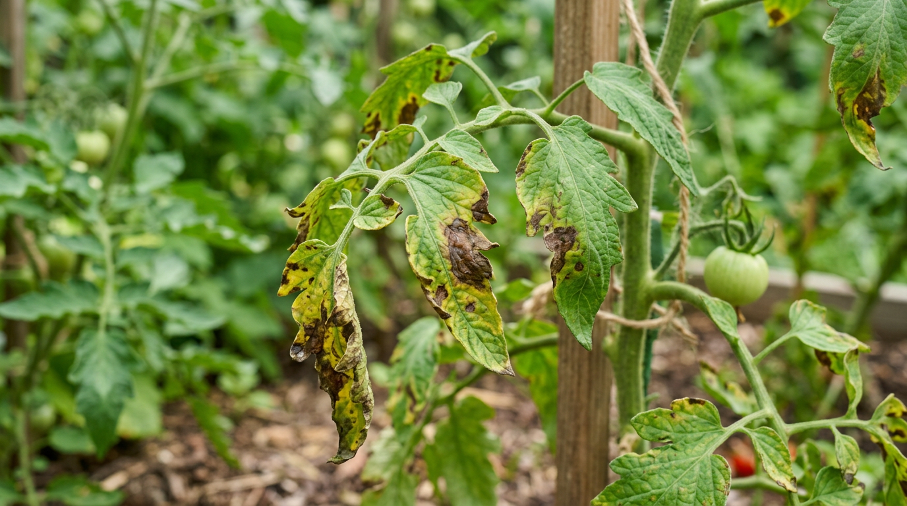
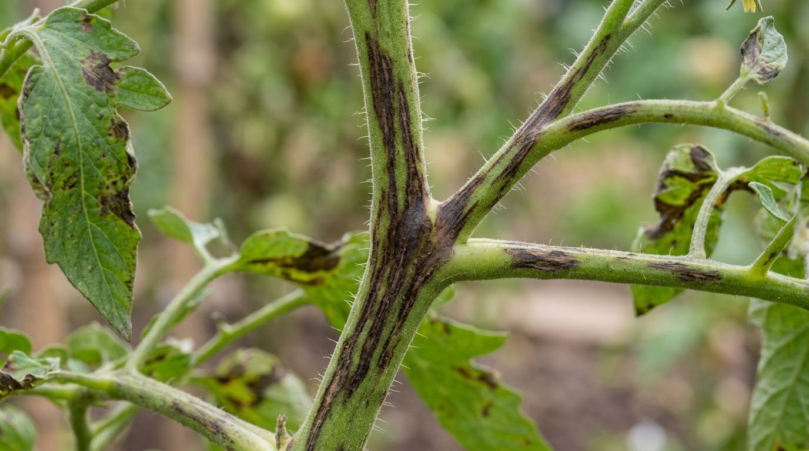
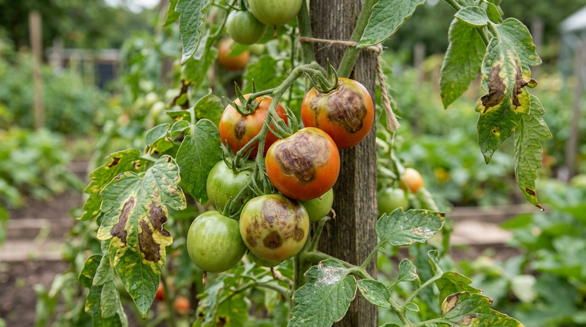
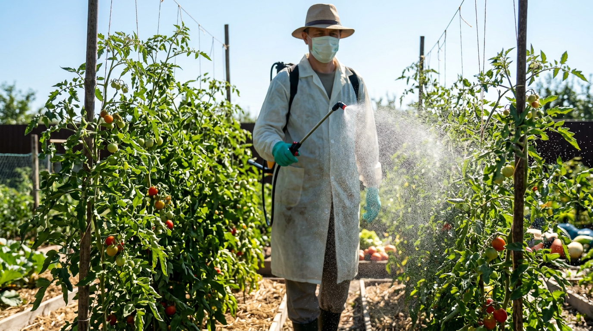
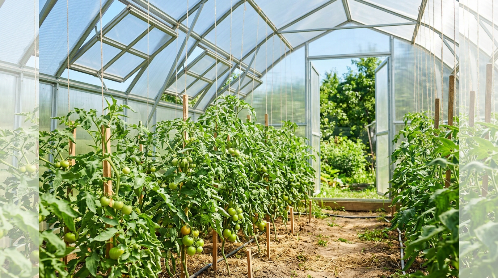
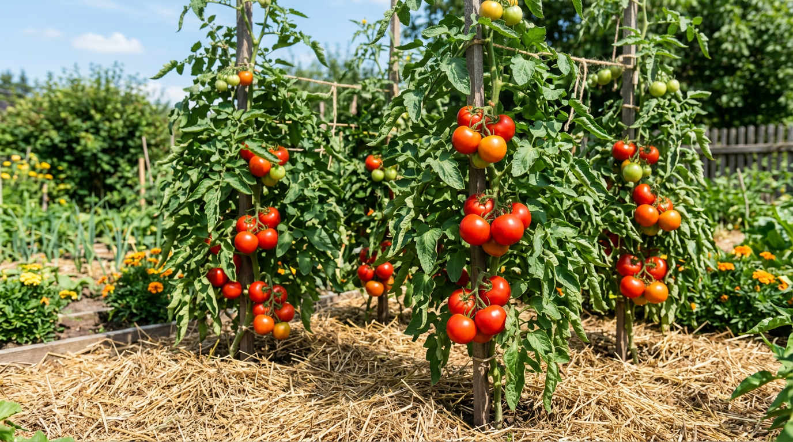

Ещё вчера кусты помидоров были зелёными и крепкими, а сегодня на листьях расползаются бурые пятна, и через несколько дней чернеют плоды. Это фитофтороз — самая опасная и обидная болезнь томатов: при благоприятной для неё погоде она способна уничтожить весь урожай буквально за неделю. Хорошая новость в том, что фитофтору можно остановить и, что важнее, не допустить вовсе. В этой статье разберём, как распознать фитофтору на помидорах на раннем этапе, чем её лечить — от народных средств до фунгицидов — и какая профилактика реально работает.

## 🍅 Что такое фитофтора и откуда она берётся

Фитофтороз вызывает микроорганизм Phytophthora infestans. Строго говоря, это не гриб, а оомицет — грибоподобный возбудитель, но для дачника разница невелика: ведёт он себя как агрессивная грибковая инфекция и распространяется спорами. Тот же самый возбудитель поражает картофель, и это ключ к пониманию, откуда болезнь приходит на ваши томаты.

### При каких условиях развивается фитофтора

Фитофторе нужно сочетание двух факторов: тепло и влага. Идеальные условия для неё — тёплые дни и прохладные ночи, когда из-за перепада температур на листьях выпадает роса. Влажность выше 75%, затяжные дожди, туманы, загущённые посадки и полив дождеванием — всё это разгоняет болезнь. Споры прорастают за считанные часы во влажной плёнке на листе, поэтому именно сырое лето с холодными ночами становится для томатов самым опасным.

### Как быстро развивается болезнь

Попав на влажный лист, спора прорастает всего за несколько часов, а первые видимые пятна появляются через 3–5 дней. На поражённой ткани образуются новые споры, которые ветер и дождь разносят дальше — и так в геометрической прогрессии. Один упущенный сырой период способен превратить пару пятнышек в сплошное поражение грядки. Именно поэтому в борьбе с фитофторой счёт идёт буквально на дни.

### Откуда инфекция приходит на участок

Источников несколько, и зная их, проще выстроить защиту:

- **Картофель.** Чаще всего фитофтора сначала вспыхивает на картофельной ботве, а оттуда споры ветром и дождём переносятся на томаты. Посадки картофеля и помидоров рядом — главная ошибка.
- **Растительные остатки и почва.** Возбудитель зимует в неубранной ботве, в верхнем слое почвы и на заражённых клубнях.
- **Заражённые семена и рассада.** Реже, но болезнь может прийти и так.
- **Ветер и капли воды.** Споры разносятся на десятки метров.

## 🔍 Признаки фитофторы на помидорах

Чем раньше вы заметите болезнь, тем больше шансов спасти урожай. Осматривайте кусты каждые 2–3 дня, особенно в сырую погоду, и обращайте внимание на изменения на всех частях растения.

### На листьях

Первый и самый частый признак — расплывчатые буро-коричневые пятна, которые обычно появляются по краю листа и быстро разрастаются. С нижней стороны листа во влажную погоду образуется тонкий белёсый пушистый налёт — это спороношение гриба. Поражённые листья буреют, засыхают и опадают.

### На стеблях и черешках

На стеблях и черешках появляются тёмно-бурые, почти чёрные продолговатые штрихи и пятна. Стебель в этом месте слабеет, и часть куста выше поражения может надломиться.

### На плодах

Самое обидное — поражение плодов. На зелёных и созревающих помидорах проступают твёрдые буро-коричневые расплывчатые пятна, которые увеличиваются и уходят вглубь мякоти. Такие плоды быстро загнивают, причём болезнь может проявиться уже после сбора — внешне здоровый помидор чернеет, полежав несколько дней.

## ⏱️ Почему важно действовать быстро

Главная коварность фитофторы — скорость. При тёплой влажной погоде от первых пятен до гибели всего куста проходит несколько дней, а заражение соседних растений идёт лавинообразно. Поэтому подход к фитофторе принципиально иной, чем к большинству болезней: ставку делают не на лечение, а на профилактику. Если болезнь уже пришла, лечение лишь сдерживает её, но полностью вылечить сильно поражённый куст почти невозможно — задача в том, чтобы спасти остальные растения и успеть собрать здоровые плоды. Поэтому опытные огородники не ориентируются на симптомы: они начинают защищать томаты заранее, ещё по здоровым кустам, и внимательно следят за прогнозом погоды. Затяжной дождь, резкое похолодание ночью и утренние туманы — прямой сигнал усилить обработки, не дожидаясь первых пятен.

## 🌿 Народные средства от фитофторы

Народные методы хороши как профилактика и на самой ранней стадии, пока поражения единичны. Они безопасны, не накапливаются в плодах и подходят для применения в период плодоношения, когда химию использовать уже нельзя. Обрабатывать нужно по сухим листьям в сухую погоду, не пропуская изнанку. И ещё одно общее правило: после каждого дождя обработку повторяют, потому что вода смывает защитный слой с листьев. Чередуйте средства между собой — так профилактика работает надёжнее.

### Молочная сыворотка

Кисломолочная среда подавляет развитие гриба. Сыворотку разводят с водой примерно 1:1 и опрыскивают кусты — в активный сезон можно делать это хоть каждые несколько дней, средство абсолютно безвредно. Молочнокислые бактерии заселяют поверхность листа и не дают спорам гриба закрепиться, а заодно подкармливают растение. Это одно из самых мягких и безопасных средств, которое не повредит даже в разгар плодоношения.

### Йодно-молочный раствор

Классика дачной профилактики: на 10 л воды берут 1 л молока (или сыворотки) и 10–15 капель 5% йода. Йод обладает обеззараживающим действием, а молочная плёнка мешает спорам закрепиться на листе. Обрабатывают таким раствором каждые 10–14 дней, а в сырую погоду чаще. Заодно это лёгкая внекорневая подкормка — йод полезен растению в микродозах.

### Чесночный настой

Измельчите 100–150 г чеснока (можно со стрелками), залейте небольшим количеством воды, настаивайте сутки, процедите и доведите объём до 10 л. Для усиления добавляют немного марганцовки до светло-розового цвета. Обрабатывают каждые 10–14 дней.

### Зольный настой

Древесная зола работает и как защита, и как подкормка калием. Настоем (300 г золы на 10 л воды, настоять сутки, добавить мыло для прилипания) опрыскивают кусты, а в сырую погоду грядки дополнительно припудривают сухой золой. Зола подщелачивает поверхность и создаёт неблагоприятную для гриба среду, а калий и микроэлементы из неё укрепляют сами растения, повышая их сопротивляемость болезни.

### Трихопол (метронидазол)

Среди дачников популярны аптечные таблетки трихопола (метронидазола): одну таблетку растворяют в литре воды и опрыскивают кусты раз в 10–14 дней. Строгих научных доказательств у метода нет, но многие огородники отмечают сдерживающий эффект и применяют его как дополнение к основной профилактике, а не как самостоятельное лекарство.

### Раствор марганцовки с чесноком

Слабо-розовый раствор марганцовки обладает обеззараживающим действием и хорошо сочетается с чесночным настоем. На 10 л воды берут готовый чесночный настой и добавляют марганцовку до светло-розового цвета. Такой смесью обрабатывают кусты каждые полторы-две недели, чередуя с другими средствами.

### Раствор поваренной соли

Солевой раствор (около стакана соли на 10 л воды) образует на плодах тонкую защитную плёнку, прикрывающую их от спор. Применяют его обычно в конце сезона, по уже сформировавшимся плодам, понимая, что листья от соли могут подсыхать.

> Совет: ни одно народное средство не «лечит» куст, который уже сильно поражён. Их сила — в регулярной профилактике с начала сезона, ещё до появления первых пятен.

## 🧪 Биопрепараты против фитофторы

Если хочется надёжнее народных средств, но без химии, на помощь приходят биопрепараты на основе полезных бактерий и грибов. Они заселяют поверхность растения и подавляют патоген, при этом безопасны для людей и пчёл и подходят для обработки даже в период плодоношения.

Самые известные — **Фитоспорин-М** (на основе сенной палочки Bacillus subtilis), **Триходерма вериде**, **Алирин-Б**, **Гамаир**. Работают они как профилактика и сдерживающее средство: их применяют с самого начала сезона и повторяют каждые 7–14 дней, а также после каждого дождя, который смывает защиту. Важный нюанс — биопрепараты эффективны, пока болезни ещё нет или она только началась; запущенную фитофтору они не остановят.

## ⚗️ Химические фунгициды: тяжёлая артиллерия

Когда болезнь наступает, а погода ей благоприятствует, в ход идут фунгициды. Они делятся на две группы, и понимать разницу важно.

### Контактные и системные препараты

**Контактные** фунгициды защищают только ту поверхность, на которую попали, и смываются дождём. К ним относятся бордоская жидкость (1%), **ХОМ** (хлорокись меди), **Абига-Пик**. Ими хорошо работать на ранней стадии и для профилактики. Их главный плюс — они не проникают в плоды и имеют более короткий срок ожидания, поэтому подходят ближе к сбору урожая, чем системные.

**Системные и комбинированные** препараты проникают внутрь тканей и действуют дольше: **Ридомил Голд**, **Ордан**, **Превикур Энерджи**, **Танос**. Их применяют при реальной угрозе или начале болезни. Системные средства не смываются дождём и защищают даже новый прирост, но именно поэтому их используют осторожно и не на плодоносящих кустах — действующее вещество попадает внутрь тканей и в плоды.

### Правила обработки фунгицидами

- Соблюдайте **срок ожидания** до сбора урожая, указанный на упаковке (у многих химических препаратов это 20–30 дней) — на активно плодоносящих кустах химию лучше не применять вовсе.
- **Чередуйте препараты** с разным действующим веществом: к одному и тому же возбудитель привыкает.
- Системные средства применяют не более 1–2 раз за сезон.
- Обрабатывайте в сухую безветренную погоду, вечером или утром, в средствах защиты.

## 📊 Схема защиты помидоров от фитофторы

Удобнее всего выстроить защиту по этапам сезона.

| Этап | Средства | Частота |
|------|----------|---------|
| С высадки рассады | Биопрепараты (Фитоспорин) | Каждые 10–14 дней |
| Появление завязей | Народные настои, биопрепараты | Каждые 7–10 дней |
| Угроза / первые пятна | Контактные фунгициды (ХОМ, бордоская) | По инструкции |
| Сильное поражение | Системные фунгициды | 1–2 раза, с чередованием |
| Налив и сбор плодов | Только народные средства | По погоде |

## 🏠 Фитофтора в теплице и в открытом грунте

Условия в закрытом и открытом грунте разные, поэтому и защита немного отличается.

### В теплице

В закрытом грунте главный враг — конденсат. Ночью теплица остывает, на плёнке и листьях оседает влага, и для спор создаётся идеальная среда. Поэтому в теплице критично проветривание: форточки и двери держат открытыми днём, а в тёплые ночи не закрывают вовсе. Полив — только под корень и утром, чтобы к вечеру листья и почва успели просохнуть; капельный полив здесь предпочтительнее всего. Зато теплицу проще изолировать от картофеля и обеззаразить осенью после уборки.

Кроме того, в теплице легче выстроить полноценную профилактику: обработки не смываются дождём, а значит, действуют дольше и расходуются экономнее. Минус закрытого грунта — если болезнь всё же проникла, в тёплом влажном воздухе она распространяется особенно стремительно, поэтому реагировать нужно при первых же признаках.

### В открытом грунте

На грядке томаты сильнее зависят от погоды — затяжные дожди и росы не отменишь. Здесь выручают ранние сорта, успевающие отдать урожай до августовской волны болезни, мульчирование, подвязка для лучшего проветривания и регулярные профилактические обработки, особенно после каждого дождя, который смывает защиту. В сырое лето над грядкой иногда натягивают плёночный навес, чтобы прикрыть кусты от осадков, оставив бока открытыми для воздуха.

## 🚑 Что делать, если фитофтора уже началась

Если болезнь проявилась, действуйте быстро и без жалости:

1. **Удалите все поражённые листья, побеги и плоды.** Их нельзя класть в компост — выносите с участка или сжигайте, иначе споры останутся зимовать.
2. **Обработайте оставшиеся растения** подходящим средством по стадии — на плодоносящих кустах биопрепаратом, при сильном поражении и до плодоношения фунгицидом.
3. **Снимите все крупные зелёные плоды** со здоровых на вид кустов. Дозаривать их лучше отдельно, регулярно осматривая, — так вы спасёте часть урожая до того, как болезнь доберётся до плодов. Для надёжности эти плоды можно на пару минут опустить в горячую воду (около 60 °C), которая убивает споры на поверхности, обсушить и убрать на дозаривание в сухое тёплое место.
4. **Уменьшите влажность:** в теплице усильте проветривание, прекратите дождевание, поливайте только под корень.

## 🛡️ Профилактика: как не допустить фитофтору

Именно профилактика решает судьбу урожая томатов. Несколько правил снижают риск в разы:

- **Держите помидоры подальше от картофеля.** Это первое и главное правило — не сажайте их рядом и соблюдайте севооборот, не возвращая паслёновые на грядку 3–4 года.
- **Боритесь с влажностью.** В теплице регулярно проветривайте, не допускайте конденсата, поливайте утром и строго под корень. Подробнее о грамотном поливе — в статье о [капельном поливе](https://mir-doma.pro/planirovka-uchastka-10-sotok/).
- **Прореживайте кусты.** Пасынкуйте, удаляйте нижние листья до первой кисти — так посадки лучше проветриваются и быстрее сохнут после дождя.
- **Мульчируйте грядки.** Мульча мешает спорам из почвы попадать на нижние листья.
- **Выбирайте ранние и устойчивые сорта.** Ранние томаты часто успевают отдать урожай до основной волны фитофторы, которая приходит во второй половине лета.
- **Профилактические обработки с начала сезона.** Начинайте опрыскивать биопрепаратами или народными настоями ещё до появления симптомов, с момента, когда кусты прижились.

Поскольку фитофтора поражает все паслёновые, те же принципы пригодятся и для других культур. Если вы выращиваете [помидоры](https://mir-doma.pro/kogda-sazhat-pomidory-na-rassadu-v-2026/) и [перец](https://mir-doma.pro/kogda-sazhat-perets-na-rassadu/), защищайте их по одной схеме. А чтобы ослабленные болезнью растения не добили ещё и вредители, держите под контролем [тлю и других насекомых](https://mir-doma.pro/kak-izbavitsya-ot-tli/).

## 🌱 Устойчивые к фитофторе сорта

Полностью устойчивых к фитофторе томатов не существует, но есть сорта и гибриды с повышенной выносливостью и, что важнее, с ранним сроком созревания. Ранний срок здесь нередко важнее самой устойчивости: чем быстрее куст отдаст урожай, тем меньше шансов, что болезнь успеет его настигнуть во второй половине лета. Если фитофтора у вас частый гость, делайте ставку на ранние детерминантные сорта и современные гибриды с заявленной устойчивостью к болезням, а поздние крупноплодные сорта подстраховывайте усиленной профилактикой.

## 🍂 Уборка и обеззараживание в конце сезона

Половина успеха следующего года закладывается осенью. После сбора урожая полностью уберите с участка всю ботву томатов и картофеля — именно в растительных остатках возбудитель зимует. Не оставляйте их в компосте и не закапывайте на грядке: лучше вынести за пределы участка или сжечь. В теплице есть смысл снять верхний слой почвы или пролить её обеззараживающим раствором, промыть и продезинфицировать каркас и покрытие, после чего хорошо проветрить. Севооборот работает на ту же цель: возвращайте помидоры на эту грядку не раньше чем через 3–4 года, а до тех пор сажайте здесь культуры, которые фитофторой не болеют. Такая осенняя уборка заметно снижает запас инфекции и сильно облегчает защиту в новом сезоне.

## 🟢 Можно ли есть поражённые плоды

Помидоры с явными пятнами фитофторы есть нельзя — их выбрасывают. А вот внешне здоровые зелёные плоды с заражённого куста спасти можно: их снимают и на пару минут опускают в горячую воду температурой около 60 °C, после чего обсушивают и убирают на дозаривание. Прогрев убивает споры на поверхности, и плоды спокойно доходят до спелости. Главное — не закладывать на хранение и дозаривание помидоры с малейшими признаками болезни.

## ⚠️ Частые ошибки в борьбе с фитофторой

Иногда урожай гибнет не из-за погоды, а из-за типичных промахов. Проверьте, не допускаете ли вы их:

- **Ждут болезнь вместо профилактики.** К моменту появления пятен бороться уже поздно — обработки нужно начинать заранее, по здоровым кустам.
- **Сажают помидоры рядом с картофелем.** Это прямой мост для инфекции с картофельной ботвы на томаты.
- **Поливают дождеванием и вечером.** Мокрые на ночь листья — идеальные условия для спор. Поливать нужно под корень и утром.
- **Загущают посадки.** В тесноте кусты плохо проветриваются и долго остаются влажными после дождя.
- **Кладут больную ботву в компост.** Возбудитель там перезимует и вернётся на следующий год. Поражённые остатки выносят или сжигают.
- **Применяют химию во время плодоношения.** Это опасно из-за срока ожидания — в этот период только народные средства и биопрепараты.
- **Бросают обработки после первого опрыскивания.** Защиту смывает дождём, поэтому её повторяют курсом весь сезон.

## ❓ Частые вопросы

### Почему фитофтора появляется каждый год?

Возбудитель зимует в почве, на растительных остатках и клубнях картофеля, поэтому при подходящей погоде болезнь возвращается. Снизить риск помогают севооборот, уборка ботвы осенью и профилактические обработки с начала сезона.

### Можно ли спасти куст, если фитофтора уже сильно его поразила?

Полностью вылечить сильно поражённый куст почти нельзя. Задача в этот момент — удалить больные части, обработать соседние растения и снять здоровые зелёные плоды, чтобы спасти оставшийся урожай.

### Чем лучше обрабатывать помидоры во время плодоношения?

Только народными средствами и биопрепаратами — сывороткой, йодно-молочным раствором, Фитоспорином. Химические фунгициды в этот период применять нельзя из-за срока ожидания.

### Передаётся ли фитофтора от картофеля к помидорам?

Да, и это один из главных путей заражения. Поэтому помидоры не сажают рядом с картофелем, а при первых признаках болезни на картофельной ботве усиливают защиту томатов.

### Помогает ли йод от фитофторы?

Как профилактика — да. Йодно-молочный раствор обеззараживает поверхность листьев и мешает спорам закрепиться, но запущенную болезнь он не вылечит.

### Сколько раз за сезон нужно обрабатывать помидоры?

Профилактические обработки проводят регулярно — в среднем каждые 7–14 дней с начала сезона и дополнительно после каждого дождя. Точная частота зависит от погоды: в сырое прохладное лето обрабатывают чаще, в сухое жаркое — реже.

### Что делать с почвой после фитофторы?

Осенью уберите все растительные остатки, а в теплице снимите или пролейте обеззараживающим раствором верхний слой грунта. На этой грядке несколько лет не сажайте паслёновые — соблюдайте севооборот, чтобы инфекция в почве сошла на нет.

### Когда обычно появляется фитофтора?

Чаще всего во второй половине лета, в июле–августе, когда ночи становятся прохладными и обильно выпадает роса. Но в сырое лето с холодными ночами болезнь приходит и в июне, поэтому профилактику начинают заранее, не дожидаясь симптомов.

### Можно ли обрабатывать помидоры бордоской жидкостью?

Да, 1% бордоская жидкость — проверенное контактное средство против фитофторы, особенно для профилактики и ранней стадии. Важно соблюдать концентрацию и срок ожидания до сбора урожая.

### Можно ли есть зелёные помидоры с больного куста?

Внешне здоровые зелёные плоды можно снять, прогреть в горячей воде около 60 °C и оставить дозариваться отдельно. Плоды с пятнами в пищу не годятся.

## Заключение

Фитофтора на помидорах — тот случай, когда лучшая защита это нападение на опережение. Не ждите первых пятен: убирайте помидоры подальше от картофеля, проветривайте теплицу, прореживайте кусты и обрабатывайте их биопрепаратами с начала сезона. Если болезнь всё же пришла, действуйте быстро — удаляйте поражённое, спасайте зелёные плоды и сдерживайте инфекцию. Системная профилактика почти всегда даёт результат, и крепкий урожай томатов вполне реален даже в сырое лето.

А как вы спасаете помидоры от фитофторы? Делитесь своими рецептами и хитростями в комментариях — и подписывайтесь, чтобы не пропустить новые статьи о защите сада и огорода.
