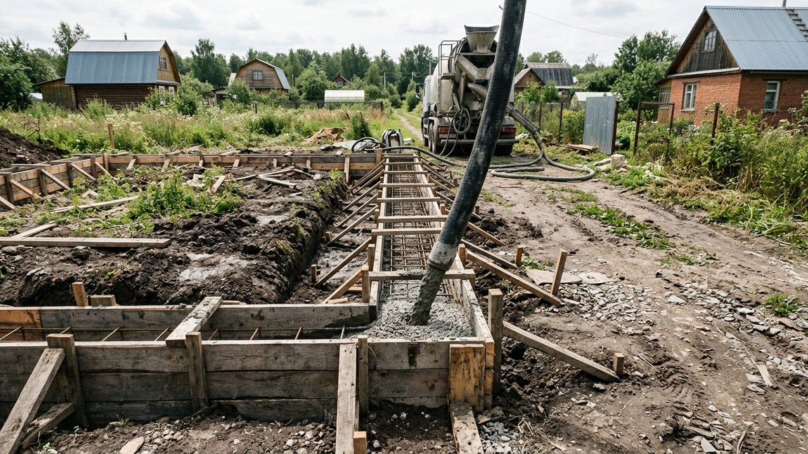
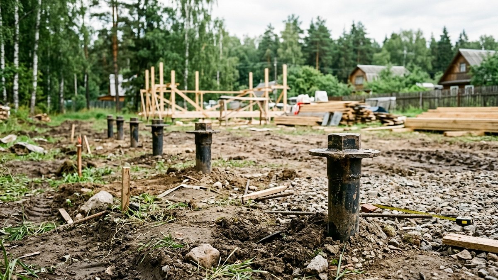
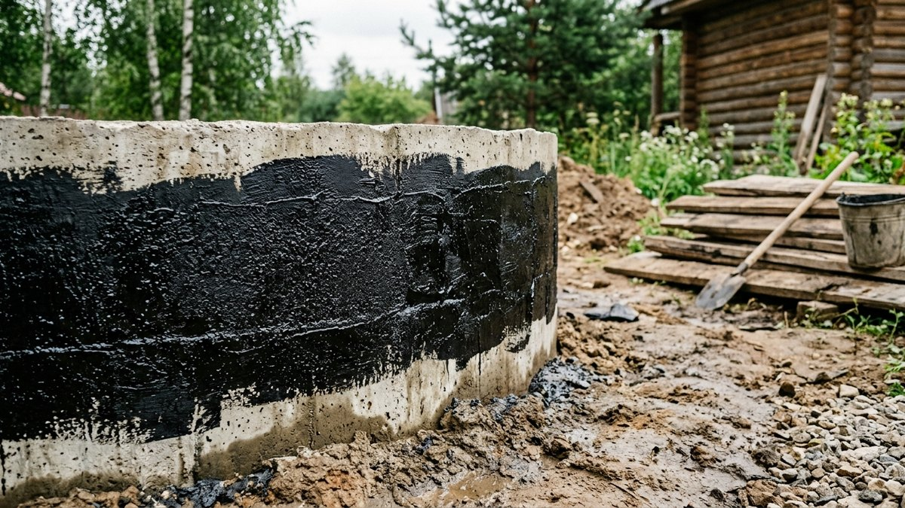
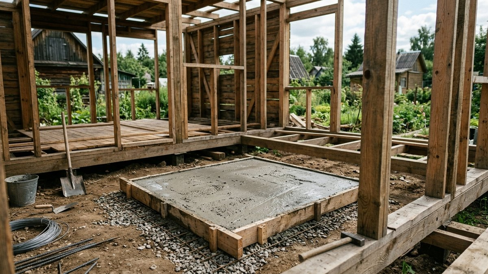
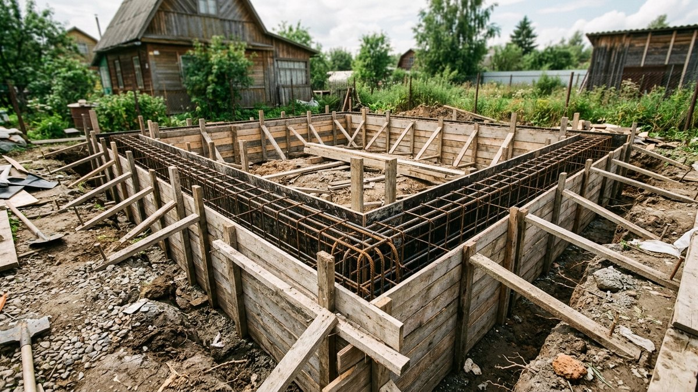
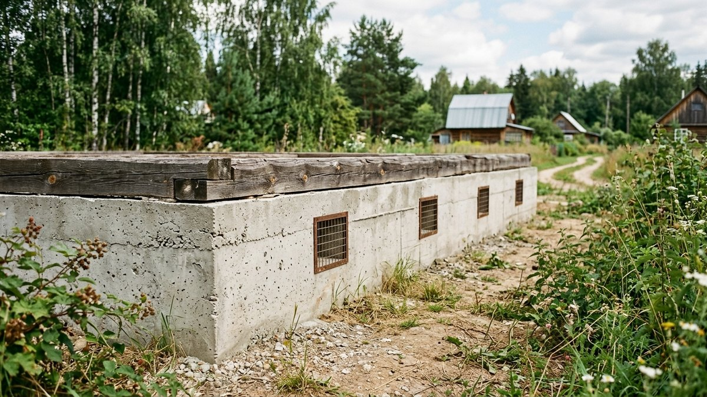

Фундамент под баню решает две задачи, которых нет у жилого дома: выдерживает вес сруба или каркаса на конкретном грунте и при этом справляется с постоянной сыростью — от печи, пара и слива воды из моечной. Разберём, какой тип фундамента выбрать под разные стены и грунты, на какую глубину закладывать и как рассчитать объём бетона под ленту или столбы.

## Чем фундамент под баню отличается от фундамента под дом

Баня почти всегда легче жилого дома — особенно если это каркасная постройка или небольшой сруб 3×4–4×6 м, а не двухэтажный коттедж. Это позволяет чаще выбирать облегчённые и бюджетные типы фундамента, которые для жилого дома были бы недостаточны. Зато добавляется требование по влагозащите: рядом с баней почти всегда есть слив воды из моечной, а значит, фундамент и цоколь должны быть готовы к постоянной локальной сырости у одной из стен, а не только к обычным осадкам.

## Какой тип фундамента выбрать

| Тип фундамента | Для каких стен подходит | Особенности |
|---|---|---|
| Свайно-винтовой | Каркасная баня, лёгкий брус | Самый быстрый и бюджетный, работает почти на любом грунте, включая пучинистый |
| Столбчатый | Каркасная баня, брус до 150×150 мм | Дешевле ленточного, не годится на слабых и подвижных грунтах |
| Ленточный мелкозаглублённый | Брус, оцилиндрованное бревно, блоки | Надёжнее столбчатого, дороже и дольше по срокам из-за набора прочности бетона |
| Плитный | Тяжёлые стены на слабых, пучинистых или высоко обводнённых грунтах | Самый дорогой вариант, но исключает риск неравномерной просадки |

Для большинства дачных бань — каркасных или из бруса сечением до 150×200 мм — достаточно свайно-винтового или столбчатого фундамента. Ленточный имеет смысл закладывать под тяжёлый сруб или если баня рассчитана на кирпичную или каменную печь с отдельным фундаментом под неё.

## На какую глубину закладывать

В отличие от жилого дома, баню не обязательно ставить на фундамент, заглублённый ниже уровня промерзания грунта, — конструкция лёгкая, а зимой баню обычно не отапливают постоянно, значит, требования по устойчивости к пучению грунта не такие жёсткие. Мелкозаглублённый ленточный фундамент на глубину 40–60 см с песчаной подушкой работает нормально на большинстве непучинистых и слабопучинистых грунтов. На сильнопучинистых глинистых грунтах с высоким уровнем грунтовых вод надёжнее свайно-винтовой фундамент — сваи проходят пучинистый слой насквозь и опираются на более стабильный грунт ниже.

Общие принципы выбора между ленточным и свайным для основного дома разобраны в статье [ленточный или свайный фундамент](https://mir-doma.pro/kakoy-fundament-vybrat-dlya-doma/) — для бани логика та же, но требования к глубине и несущей способности мягче из-за меньшего веса конструкции.

<!-- wp:html -->

<h3 class="md-fb__title">Калькулятор бетона на ленточный фундамент бани</h3>

Для свайного или столбчатого фундамента расчёт другой — считайте по объёму отдельных свай/столбов.

<label class="md-fb__f">Периметр ленты (с учётом внутренних перегородок), м<input type="number" id="fbPer" value="20" min="2" max="300" step="0.1"></label>
<label class="md-fb__f">Ширина ленты, м<input type="number" id="fbW" value="0.3" min="0.1" max="1" step="0.05"></label>
<label class="md-fb__f">Высота ленты, м<input type="number" id="fbH" value="0.5" min="0.1" max="2" step="0.05"></label>
<label class="md-fb__f">Запас на неровности, %<input type="number" id="fbRes" value="8" min="0" max="30" step="1"></label>
<label class="md-fb__f">Цена за 1 м³ бетона, ₽ (необязательно)<input type="number" id="fbPrice" value="" min="0" max="100000" step="1" placeholder="0"></label>

Объём бетона<b id="fbVol">3,0 м³</b>

С запасом<b id="fbVolRes">3,2 м³</b>

Стоимость<b id="fbCost">—</b>

Если фундамент имеет сложную форму с перегородками, суммируйте периметр внешних стен и всех внутренних лент.

<button type="button" id="fbCopy" class="md-fb__btn md-fb__btn--main">Скопировать результат</button>
<a id="fbVk" class="md-fb__btn md-fb__btn--vk" href="#" target="_blank" rel="noopener noreferrer">Поделиться ВКонтакте</a>
<a id="fbTg" class="md-fb__btn md-fb__btn--tg" href="#" target="_blank" rel="noopener noreferrer">Поделиться в Telegram</a>
<button type="button" id="fbShareNative" class="md-fb__btn" hidden>Поделиться…</button>
<button type="button" id="fbPrint" class="md-fb__btn">Печать</button>

<!-- /wp:html -->

## Гидроизоляция и слив: особенности именно для бани

Фундамент бани почти всегда соседствует с постоянной локальной влагой — под моечной или душевой зоной вода регулярно уходит в слив, а не просто стекает по крыше, как у жилого дома. Это меняет требования:

1. **Горизонтальная гидроизоляция** между фундаментом и нижним венцом — рубероид или битумная мембрана в 2 слоя, без этого нижний венец сруба или обвязка каркаса будут постоянно контактировать с влагой от бетона.
2. **Обмазочная гидроизоляция цоколя** снаружи в зоне слива воды — та часть фундамента, что ближе к точке слива, требует более тщательной обработки, чем противоположная стена.
3. **Дренаж или отвод стока** от фундамента в сторону — вода из-под пола моечной не должна скапливаться у самого основания, иначе фундамент годами стоит в переувлажнённом грунте.
4. **Продухи в цоколе** (для ленточного фундамента) — обязательны для проветривания подпола, иначе постоянная влажность от бани провоцирует гниение деревянного пола и лаг изнутри.

## Фундамент под печь: отдельно или вместе

Тяжёлую кирпичную или каменную печь-каменку весом от 500–700 кг ставят на собственный фундамент, отдельный от фундамента стен, — жёстко связывать их нельзя, потому что здание и печь оседают неравномерно, и такая связка со временем трескается. Лёгкие металлические печи весом до 150–200 кг можно ставить прямо на усиленный пол без отдельного фундамента — по инструкции конкретной модели печи.

## Порядок устройства ленточного фундамента

1. **Разметить периметр** по осям стен и внутренних перегородок с помощью колышков и шнура.
2. **Выкопать траншею** на расчётную глубину и ширину, с запасом 10 см с каждой стороны под опалубку.
3. **Уложить песчаную подушку** толщиной 10–15 см, утрамбовать, пролить водой.
4. **Установить опалубку** и арматурный каркас — для ленты бани обычно достаточно продольных прутьев 10–12 мм, связанных поперечными хомутами.
5. **Залить бетон** маркой не ниже М200 за один заход, без длительных перерывов, чтобы избежать холодных швов.
6. **Выдержать без нагрузки минимум 28 дней** до набора проектной прочности, укрывая от прямого солнца и пересыхания в первые дни.

Общий процесс стройки бани целиком, от выбора места до печи, — в статье про то, [как построить баню на даче своими руками](https://mir-doma.pro/kak-postroit-banyu-na-dache/). Если стены будут из бруса, вес сруба и требования к усадке напрямую влияют на то, когда можно нагружать фундамент кровлей и начинать отделку, — подробности в статье про [баню из бруса своими руками](https://mir-doma.pro/banya-iz-brusa-svoimi-rukami/).

## Частые ошибки

- **Заложили фундамент без учёта слива воды.** Постоянная влага у одной стороны фундамента без дренажа со временем разрушает бетон и провоцирует пучение грунта именно в этой зоне.
- **Связали фундамент стен с фундаментом печи жёстко.** Разная осадка приводит к трещинам в кладке печи или в самом фундаменте.
- **Не сделали продухи в цоколе.** Влажный воздух от бани скапливается в подполе, и деревянный пол гниёт изнутри быстрее, чем ожидалось.
- **Залили бетон в несколько заходов с большими перерывами.** Холодные швы снижают прочность ленты в местах стыков.
- **Начали строить стены сразу после заливки**, не выдержав набор прочности бетона — фундамент может дать трещины под нагрузкой сруба.

## Частые вопросы

### Нужен ли фундамент под баню-бочку или мобильную баню?

Для лёгких мобильных конструкций достаточно опорных площадок или свай в нескольких точках без сплошной ленты — вес такой бани минимален и не требует полноценного фундамента.

### Можно ли использовать один фундамент под баню и предбанник-веранду?

Можно, если они строятся одновременно и рассчитаны как единая конструкция с общим весом. Если веранда пристраивается позже к уже стоящей бане, для неё делают отдельный фундамент с деформационным швом — это исключает трещины от разной осадки.

### Сколько времени фундамент под баню должен выстояться перед стройкой стен?

Минимум 28 дней для набора базовой прочности бетона, но для тяжёлых стен из бруса или блоков лучше выдержать полный сезон — весной или летом, прежде чем нагружать фундамент срубом.

### Какой фундамент дешевле всего для бани?

Столбчатый и свайно-винтовой обходятся дешевле ленточного и подходят для большинства каркасных и лёгких брусовых бань — разница в стоимости с ленточным фундаментом может достигать 30–40%.

### Нужна ли отмостка вокруг фундамента бани?

Да, отмостка отводит дождевую воду от фундамента по всему периметру, кроме зоны организованного слива, где вода и так уходит по трубе в дренаж, — там отмостку делают с уклоном именно к точке слива.

## Заключение

Фундамент под баню выбирают исходя из веса стен и грунта, а не по аналогии с жилым домом — чаще всего достаточно облегчённого свайного или столбчатого варианта. Ключевое отличие от фундамента дома — обязательная гидроизоляция и продуманный отвод воды в зоне слива, без которых даже правильно рассчитанный по нагрузке фундамент прослужит меньше своего срока.
