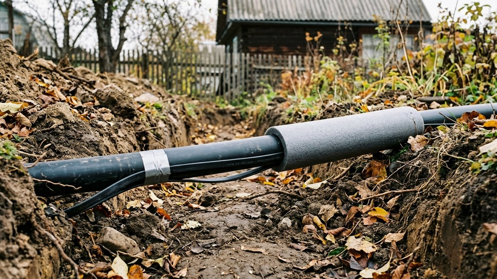
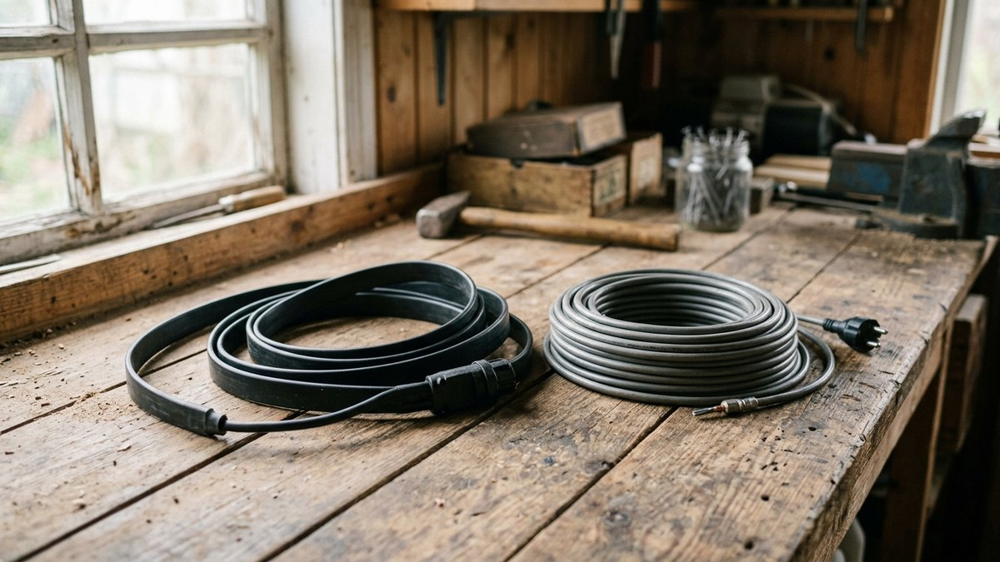
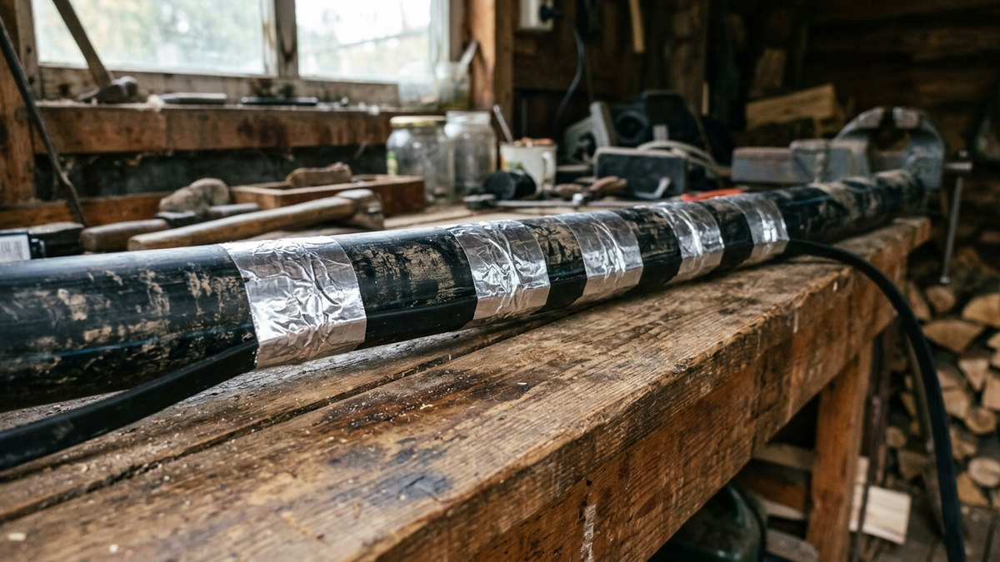
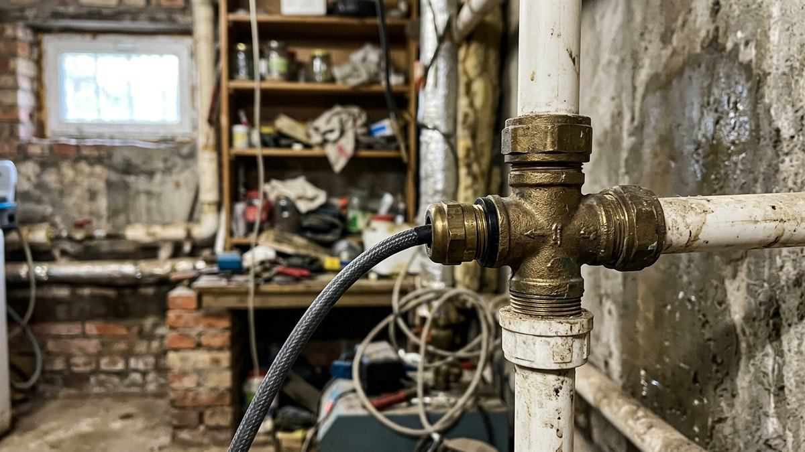
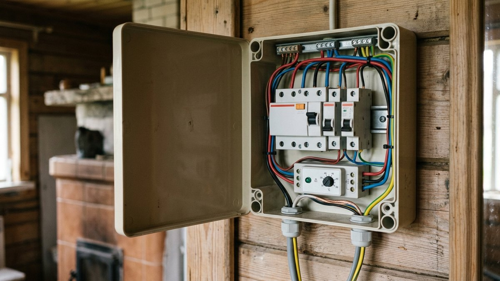
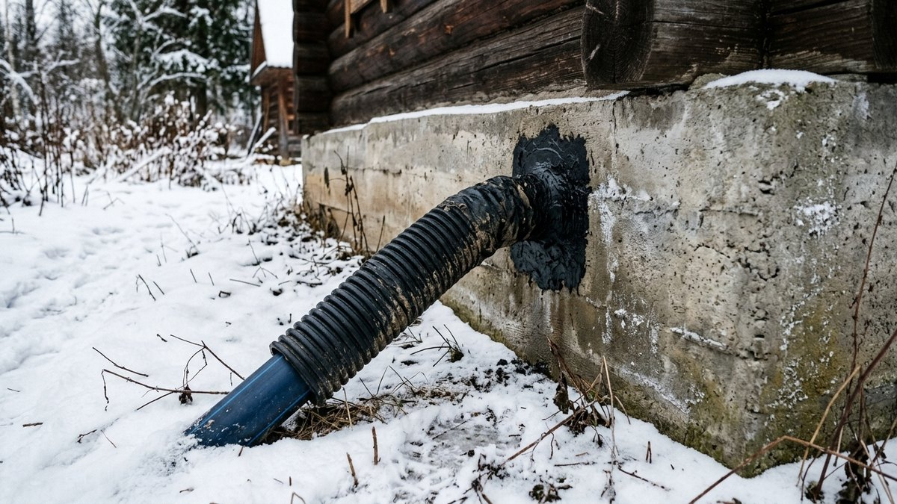

# Греющий кабель для водопровода: какой выбрать и как смонтировать своими руками

Водопровод на даче замерзает не по всей длине, а в нескольких слабых
местах: на выходе из скважины, в месте ввода трубы в дом, на участке,
где траншею не докопали до глубины промерзания. Греющий кабель для
водопровода закрывает именно эти места. Он поддерживает в трубе плюсовую
температуру, пока снаружи мороз. Разберём, какой кабель выбрать —
саморегулирующийся или резистивный, класть его снаружи или внутрь трубы,
какая нужна мощность и как смонтировать систему своими руками. В разделе
про расчёт есть калькулятор длины и мощности.

## Когда кабель нужен, а когда нет

Лучшая защита водопровода от мороза — укладка ниже глубины промерзания.
Кабель нужен там, где это невозможно или не сделано:

- **Выход трубы из скважины или колодца** — участок от оголовка до
  глубины траншеи.
- **Ввод в дом** — труба поднимается из земли через холодное подполье
  или цоколь.
- **Мелкая траншея** — скальный грунт, высокие грунтовые воды или
  просто экономия на земляных работах.
- **Летний водопровод, который хотят использовать зимой** без
  перекладки.
- **Канализационный выпуск** на участке, где он идёт мелко (для него
  нужен отдельный кабель, в канализацию питьевой кабель не кладут).

Если дачей зимой не пользуются, кабель не нужен: систему проще
законсервировать и слить. Как это сделать, чтобы трубы и насос пережили
зиму, разобрано в статье
[консервация дачи на зиму](https://mir-doma.pro/konservaciya-dachi-na-zimu/).
Общий выбор между зимним водопроводом и консервацией — в разделе про
зимнее водоснабжение статьи
[скважина или колодец](https://mir-doma.pro/skvazhina-ili-kolodec/).

## Саморегулирующийся или резистивный

| | Саморегулирующийся | Резистивный |
|---|---|---|
| Как работает | Мощность сама растёт на холоде и падает в тепле по каждому участку | Постоянная мощность по всей длине |
| Отрезать по месту | Можно | Нельзя, продаётся готовыми секциями фиксированной длины |
| Перехлёст витков | Допустим | Нельзя, перегреется и сгорит |
| Термостат | Желателен для экономии, но не обязателен | Обязателен |
| Цена | Дороже за метр | Дешевле за метр |
| Для водопровода на даче | Основной вариант | Только если точно знаете длину и ставите термостат |

Для дачного водопровода почти всегда берут **саморегулирующийся**
кабель. Он прощает ошибки монтажа и сам снижает мощность на участках,
которые уже прогреты: например, там, где труба входит в тёплый дом.

## Снаружи или внутри трубы

**Снаружи** — основной способ. Кабель идёт вдоль трубы под
теплоизоляцией. Подходит для любой длины и любых труб, не мешает воде,
не требует врезки.

**Внутри** — кабель заводят в трубу через тройник с сальником.
Применяют, когда труба уже в земле и снаружи к ней не подобраться.
Ограничения:

- кабель должен быть **пищевым**, с оболочкой, допущенной для
  питьевой воды;
- длина ограничена: длинный кабель трудно протолкнуть, а через краны,
  обратные клапаны и частые повороты он не проходит;
- сальник — дополнительное место возможной протечки;
- внутренний кабель уменьшает сечение трубы, на тонких трубах это
  заметно.

Если есть выбор, кладите снаружи. Внутренний вариант — это ремонтное
решение для уже закопанной трубы.

## Какая мощность нужна

Мощность считают на метр трубы. Ориентиры для типичного дачного
водопровода из ПНД-трубы 25–32 мм в теплоизоляции:

| Условия | Мощность кабеля |
|---|---|
| Внутри трубы | около 10 Вт/м (выпускаются под этот монтаж) |
| Снаружи, труба до 32 мм, изоляция от 20 мм | 15–20 Вт/м, одна линия |
| Снаружи, труба 40–50 мм или изоляция тоньше | 25–30 Вт/м или две линии |
| Выход из скважины, открытый оголовок, сильные морозы | 30 Вт/м или спираль |

Это ориентиры, а не расчёт теплопотерь. Главный множитель —
теплоизоляция. Кабель без изоляции греет улицу, а не трубу, и никакая
мощность не спасёт. Поэтому экономить на изоляции, чтобы купить кабель
мощнее, бессмысленно.

## Калькулятор длины и мощности

Введите длину участка трубы, который нужно греть, и условия монтажа.
Калькулятор добавит запас на подключение и арматуру, подскажет
мощность на метр и покажет, сколько электричества уйдёт при работе в
полную силу.

<!-- wp:html -->

  
Калькулятор греющего кабеля для водопровода

  <label class="md-calc__label" for="mdCbL">Длина трубы, которую нужно греть, м</label>
  <input type="number" id="mdCbL" class="md-calc__input" min="1" step="0.5" value="12">
  <label class="md-calc__label" for="mdCbM">Способ монтажа</label>
  <select id="mdCbM" class="md-calc__input">
    <option value="out">Снаружи трубы</option>
    <option value="in">Внутри трубы</option>
  </select>
  <label class="md-calc__label" for="mdCbD">Диаметр трубы и изоляция</label>
  <select id="mdCbD" class="md-calc__input">
    <option value="1">До 32 мм, изоляция от 20 мм</option>
    <option value="2">40–50 мм или изоляция тоньше 20 мм</option>
    <option value="3">Выход из скважины, сильные морозы</option>
  </select>
  <label class="md-calc__label" for="mdCbV">Кранов, фильтров, клапанов на участке</label>
  <input type="number" id="mdCbV" class="md-calc__input" min="0" step="1" value="1">
  <label class="md-calc__label" for="mdCbP">Тариф, руб. за кВт·ч</label>
  <input type="number" id="mdCbP" class="md-calc__input" min="1" step="0.1" value="6">
  
Заполните поля

<!-- /wp:html -->

## Монтаж снаружи трубы: по шагам

1. **Подготовьте трубу.** Очистите от грязи. Пластиковую трубу по всей
   длине обклейте алюминиевым скотчем: пластик плохо проводит тепло,
   фольга распределяет его вокруг трубы.
2. **Уложите кабель вдоль трубы снизу**, чуть сбоку (положение «4–5 часов»,
   если смотреть с торца). Тёплая вода поднимается, а замерзание начинается
   снизу. Две линии кладут по бокам, на «4 и 8 часов».
3. **Закрепите кабель** алюминиевым скотчем или стяжками через 20–30 см,
   а затем проклейте скотчем сверху по всей длине.
4. **У кранов и фильтров** сделайте петлю или обмотку. Металлическая
   арматура отводит тепло, ей нужен запас кабеля.
5. **Наденьте теплоизоляцию**: вспененный полиэтилен или каучук. Для
   труб в земле и на выходе из скважины — толщиной от 20 мм. Швы
   изоляции проклейте.
6. **Защитите изоляцию.** В земле — гофра или труба большего диаметра,
   на улице — защита от ультрафиолета и грызунов.
7. **Сделайте концевую муфту** на свободном конце и **муфту
   подключения** по инструкции производителя. Термоусадку сажайте
   феном, не зажигалкой.

## Монтаж внутри трубы

1. На вводе в дом поставьте тройник с сальником под кабель (продаётся
   комплектом под диаметр трубы и кабеля).
2. Заведите кабель в трубу на нужную длину. Помогает, если трубу
   временно отсоединить от насоса и проталкивать кабель при открытом
   конце.
3. Затяните сальник так, как указано в инструкции: пережатая оболочка
   повреждается, недотянутый сальник течёт.
4. Проверьте систему под давлением до того, как закрывать доступ к
   тройнику.

## Подключение: безопасность прежде всего

Греющий кабель работает рядом с водой, часто в земле. Правила
подключения:

- **Только через УЗО или дифавтомат на 30 мА.** Это не рекомендация, а
  обязательное условие для любого нагревательного кабеля у воды.
- **Отдельный автомат** на линию кабеля, по мощности.
- **Термостат** с датчиком на трубе: включает кабель при +3…+5 °C и
  выключает при нагреве. Для резистивного кабеля обязателен, для
  саморегулирующегося экономит электричество.
- **Розетка на улице** — только влагозащищённая, лучше подключение в
  распредкоробке.

Если на даче старая проводка и нагрузка уже на пределе, кабель стоит
посчитать в общей мощности. Как устроить линии и автоматы в щитке,
объяснено в статье
[электричество на даче своими руками](https://mir-doma.pro/elektrichestvo-na-dache-svoimi-rukami/).

## Выход из скважины и ввод в дом

Это два самых уязвимых места, и их греют в первую очередь.

**Скважина.** Если оголовок в утеплённом кессоне или домике, греть
нужно участок от кессона до траншеи. Если оголовок открыт, кабелю
придётся греть и трубу внутри обсадной колонны до глубины промерзания.
Как утеплить наземную часть скважины, разобрано в статье
[домик для скважины своими руками](https://mir-doma.pro/domik-dlya-skvazhiny-na-dache/).

**Ввод в дом.** Труба выходит из земли и проходит через холодное
подполье. Кабель ведут до того места, где труба уже в тёплом
помещении, плюс 0,5–1 м.

## Частые ошибки

- **Кабель без теплоизоляции.** Электричество уходит на обогрев грунта,
  а вода всё равно замерзает.
- **Резистивный кабель с перехлёстом** или отрезанный по месту. Сгорит
  в точке перехлёста или перестанет работать совсем.
- **Обычный кабель внутри трубы.** Внутрь можно класть только пищевой
  кабель, предназначенный для этого.
- **Подключение без УЗО.** Повреждённая оболочка в мокром грунте без
  защиты — прямая угроза жизни.
- **Кабель поверху трубы.** Замерзание начинается снизу, кабель сверху
  защищает хуже.
- **Экономия на концевой муфте.** Влага под плохо сделанной заделкой
  выводит кабель из строя за сезон.

## Частые вопросы

### Какой греющий кабель лучше для водопровода

Для дачи — саморегулирующийся. Его можно резать по месту, класть с
перехлёстом, и он сам снижает мощность на тёплых участках. Резистивный
дешевле, но требует точной длины и термостата.

### Какой мощности нужен греющий кабель для водопровода

Снаружи трубы до 32 мм в изоляции обычно хватает 15–20 Вт/м. Для
толстых труб, тонкой изоляции и выхода из скважины — 25–30 Вт/м или две
линии. Внутри трубы используют кабель около 10 Вт/м.

### Можно ли греющий кабель закопать в землю без изоляции

Нельзя. Без изоляции кабель отдаёт тепло грунту, и труба остаётся
холодной. Кабель всегда кладут под теплоизоляцию, а в земле — ещё и в
защитный кожух.

### Нужно ли выключать греющий кабель летом

Да, если нет термостата. Саморегулирующийся кабель летом потребляет
мало, но не ноль. Термостат решает вопрос сам.

### Сколько электричества тратит греющий кабель

Максимум — мощность на метр, умноженная на длину и на часы работы.
На практике саморегулирующийся кабель в изоляции и с термостатом
работает часть времени и тратит заметно меньше. Оценка под вашу
длину — в калькуляторе выше.

## Итог

Греющий кабель для водопровода — это адресная защита слабых мест:
выхода из скважины, мелкой траншеи, ввода в дом. Для дачи берите
саморегулирующийся кабель, кладите снаружи трубы снизу, обязательно под
теплоизоляцию и только через УЗО на 30 мА. Внутрь трубы — пищевой
кабель и только там, где к трубе снаружи уже не подобраться.
