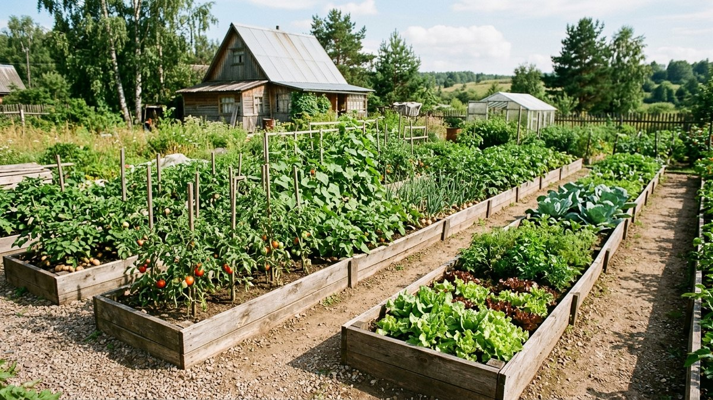
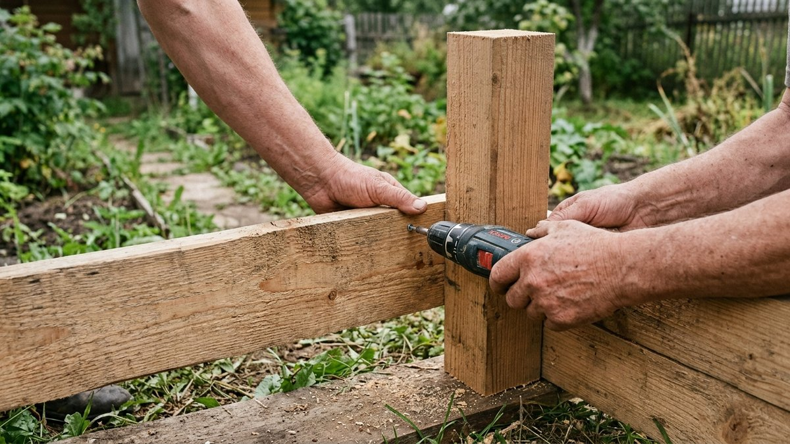
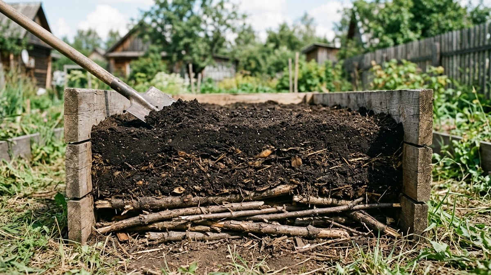
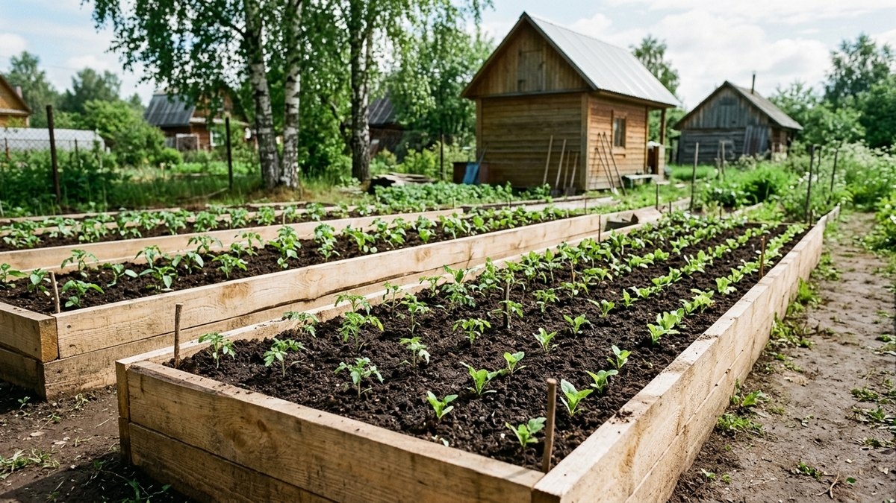
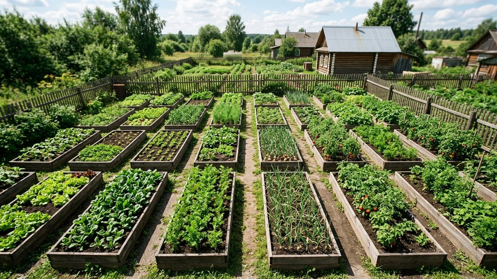
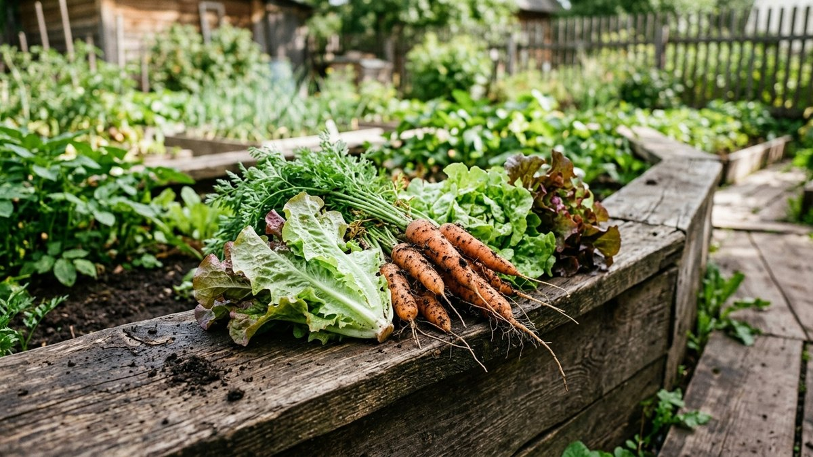

# Грядки-короба из досок своими руками: размеры, сборка и заполнение

Грядка-короб — дощатый бортик высотой 20–40 см, который держит форму
грядки, поднимает почву над дорожкой и чётко делит огород на зоны без
расползающихся краёв. Земля в коробе прогревается быстрее весной, не
размывается дождём и не вытаптывается с краёв — а сорняки с дорожки почти
не заходят внутрь. Разберём размеры, материал, сборку и правильное
послойное заполнение грунтом.

## Какие размеры делать

Ширина короба — не больше 90–100 см, чтобы дотянуться до середины с любой
стороны, не наступая на грядку. Длина — произвольная, но удобнее секциями
по 2–3 м, чтобы доска не выгибалась под давлением грунта без промежуточных
стоек. Высота борта — от 15 см для зелени и невысоких овощей до 30–40 см
для корнеплодов и для тех, кому неудобно наклоняться низко. Между коробами
оставляют дорожку от 40 см — меньше неудобно с тачкой или ведром.

## Материал: чем не стоит экономить

- **Доска от 30 мм толщиной** — тонкая доска гнётся под давлением влажного
  грунта уже через сезон, особенно на бортах выше 25 см.
- **Порода с естественной стойкостью к влаге** — лиственница держится в
  постоянном контакте с сырой землёй заметно дольше сосны без пропитки.
- **Без пропитки, токсичной для почвы.** Грядка соприкасается с землёй, из
  которой потом едят урожай — антисептики для открытых конструкций на
  улице (для террас и заборов) сюда не годятся, используют пищевые или
  специально сертифицированные для контакта с грунтом составы, либо просто
  необработанную стойкую породу.
- **Оцинкованный крепёж.** Обычные гвозди и саморезы ржавеют в постоянно
  влажной земле за один-два сезона.

## Сборка короба пошагово

1. Разметить периметр колышками и шнуром, проверить диагонали — прямоугольник
   должен быть без перекоса.
2. Снять дёрн на глубину 3–5 см внутри периметра, если грядка ставится на
   траву — так короб плотнее сядет на землю.
3. Сколотить бортики: доски крепятся к угловым стойкам (брус 40×40 мм),
   вкопанным на 15–20 см в грунт для устойчивости.
4. По длинным сторонам выше 2 м добавить промежуточную стойку в середине —
   без неё борт со временем выгибается наружу под давлением грунта.
5. Выставить короб по уровню, подсыпав или подкопав землю под низкие углы.
6. Уложить на дно сетку от грызунов, если короб ставится там, где кроты
   или мыши — частая проблема на новом участке.

## Расчёт материала и грунта

Досок нужно на периметр с учётом высоты борта, а грунта — на весь
внутренний объём короба, обычно с частичной заменой верхнего слоя, а не
полной засыпкой на всю глубину с нуля. Пропорции и количество посчитайте
по своим размерам ниже.

### Калькулятор грядки-короба

<!-- wp:html -->

<h3 class="md-gk__title">Калькулятор грядки-короба</h3>

Считает доски на борт и объём грунта для заполнения короба.

<label class="md-gk__f">Длина короба, м<input type="number" id="gkLen" value="2.5" min="0.5" max="10" step="0.1"></label>
<label class="md-gk__f">Ширина короба, м<input type="number" id="gkWid" value="0.9" min="0.4" max="2" step="0.05"></label>
<label class="md-gk__f">Высота борта, м<input type="number" id="gkHei" value="0.3" min="0.1" max="0.6" step="0.05"></label>
<label class="md-gk__f">Ширина доски, мм<input type="number" id="gkBoardWid" value="150" min="50" max="300" step="10"></label>
<label class="md-gk__f">Количество коробов<input type="number" id="gkCount" value="4" min="1" max="50" step="1"></label>
<label class="md-gk__f">Цена грунта за м³, ₽ (необязательно)<input type="number" id="gkSoilPrice" value="" min="0" max="20000" step="50" placeholder="0"></label>

Досок на борт (1 короб)<b id="gkBoards">6 шт</b>

Досок на все короба<b id="gkBoardsTotal">24 шт</b>

Грунта на все короба<b id="gkSoil">2,7 м³</b>

Стоимость грунта<b id="gkCost">—</b>

Доска на борт считается по периметру короба и высоте, разделённой на ширину доски (с округлением вверх на ряд). Объём грунта — полный внутренний объём короба без вычета дренажного слоя, при послойном заполнении часть уйдёт под ветки и компост.

<button type="button" id="gkCopy" class="md-gk__btn md-gk__btn--main">Скопировать результат</button>
<a id="gkVk" class="md-gk__btn md-gk__btn--vk" href="#" target="_blank" rel="noopener noreferrer">Поделиться ВКонтакте</a>
<a id="gkTg" class="md-gk__btn md-gk__btn--tg" href="#" target="_blank" rel="noopener noreferrer">Поделиться в Telegram</a>
<button type="button" id="gkShareNative" class="md-gk__btn" hidden>Поделиться…</button>
<button type="button" id="gkPrint" class="md-gk__btn">Печать</button>

<!-- /wp:html -->

## Послойное заполнение

Короб выше 20 см не имеет смысла засыпать плодородной землёй на всю
глубину — это дорого и без пользы, нижние 10–15 см корни овощей почти не
используют.

1. **Дно** — крупные ветки, обрезки досок, картон: дренажный слой, который
   постепенно перегнивает и греет корни снизу.
2. **Средний слой** — полуперепревший компост, листва, скошенная трава.
3. **Верхний слой 20–25 см** — плодородная земля с перегноем, именно в неё
   высаживают рассаду и семена.

Такое заполнение работает похоже на тёплую грядку: органика внизу
перегнивает и греет корни, а короб держит форму и не даёт слоям расползтись
по сторонам, как это происходит на грядке без бортов. Чем осенью подкормить
уже занятые грядки под зиму — в статье [осенние
подкормки](https://mir-doma.pro/osennie-podkormki/).

## Частые ошибки

- **Тонкая доска на высокий борт.** Доска до 25 мм на коробе выше 25 см
  выгибается под давлением влажного грунта уже за один сезон.
- **Пропитка для улицы на контакте с землёй.** Составы для открытых
  деревянных конструкций рассчитаны на атмосферу, а не на постоянный
  контакт с влажной землёй, из которой потом едят урожай.
- **Засыпка чистой землёй без дренажного слоя.** Дорого, а тёплая грядка не
  получается — органика внизу и греет корни, и снижает расход грунта.
- **Ширина больше 100 см.** До середины такой грядки не дотянуться без
  того, чтобы наступить на грунт и не утоптать его.

## Частые вопросы

### Какой высоты делать грядку-короб

От 15 см для зелени и невысоких овощей до 30–40 см для корнеплодов или если
неудобно наклоняться низко. Выше 40 см борт требует уже более серьёзного
каркаса и заметно увеличивает расход грунта.

### Нужно ли стелить геотекстиль на дно короба

Не обязательно, если снят дёрн и дно не граничит с очень сырой землёй.
Сетку от грызунов стоит положить, если на участке проблема с кротами или
мышами — сама она от прорастания сорняков снизу не защищает.

### Сколько служит короб из досок без обработки

Лиственница без пропитки держится в постоянном контакте с землёй
ориентировочно 7–10 лет, сосна без обработки — заметно меньше, 3–5 лет,
после чего борта начинают подгнивать у самой земли и требуют замены.

### Можно ли использовать шифер или металл вместо досок для короба

Можно, но у дерева проще регулировать высоту и толщину под свои размеры, а
металлические борта на солнце сильно нагреваются и могут перегревать
почву у самого края грядки в жару.

