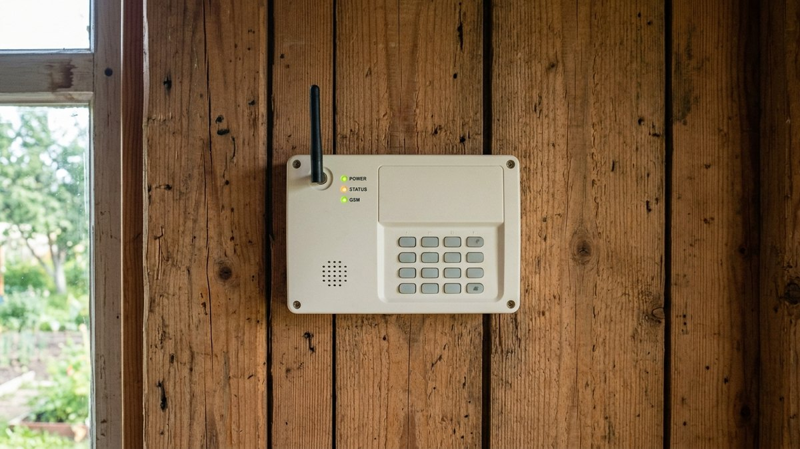
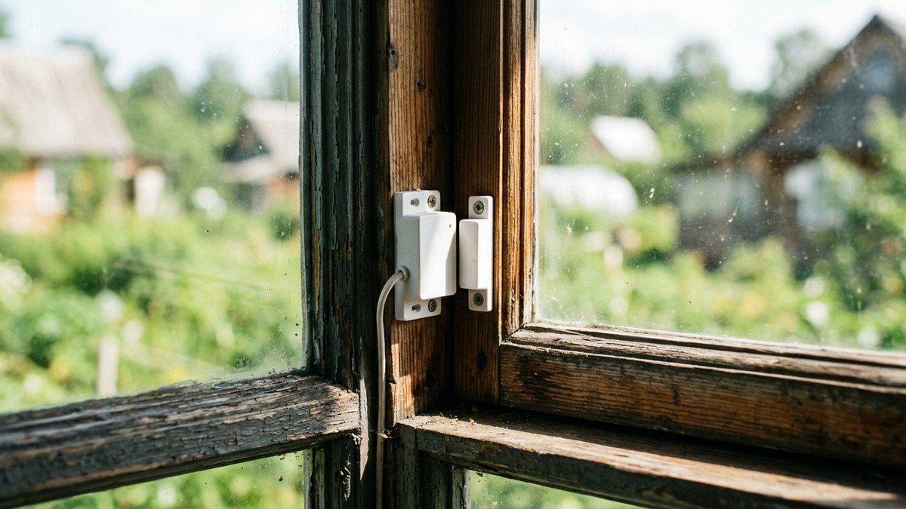
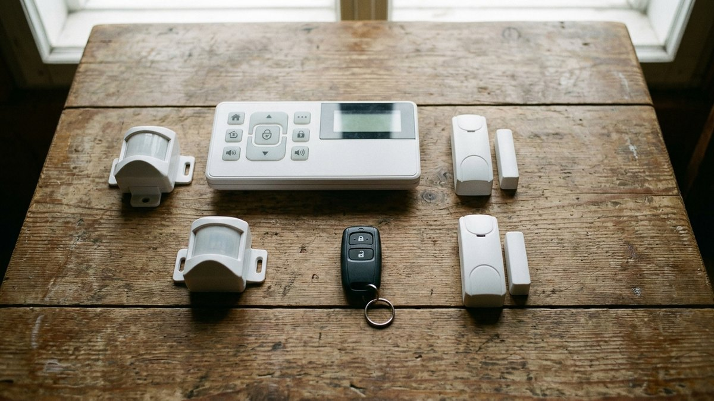
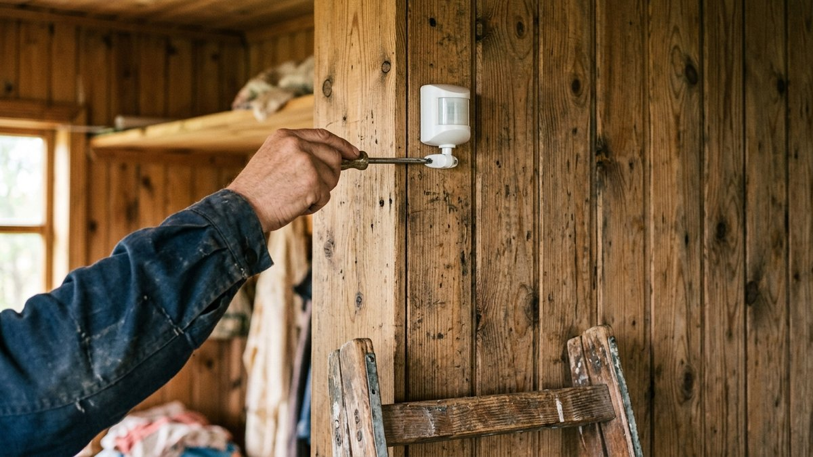
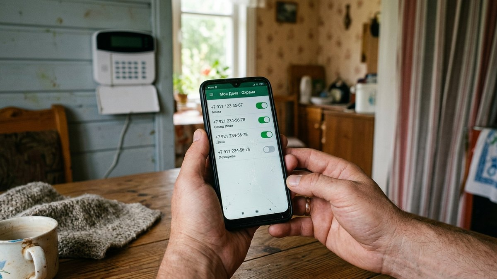
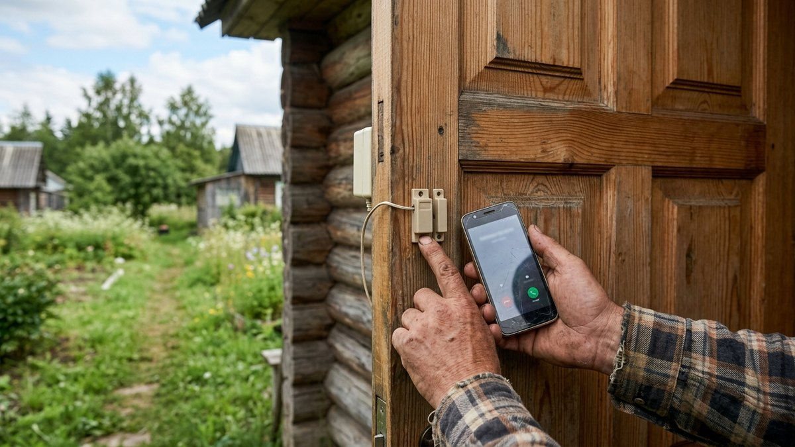

# GSM-сигнализация для дачи своими руками: как установить

Провести на дачу пультовую охрану с выездом наряда дорого и не всегда
возможно — до многих СНТ ближайший пункт охраны просто далеко. GSM-сигнализация
для дачи своими руками решает задачу проще: комплект датчиков и базовый блок
со своей SIM-картой звонит или пишет хозяину напрямую, без прокладки кабеля
по участку и без интернета. Разберём, какие датчики нужны, как выбрать
комплект и как всё установить самостоятельно за один день.

## Как работает GSM-сигнализация для дачи

В основе системы — базовый блок со своей SIM-картой и датчики, которые
подключаются к нему по радиоканалу (беспроводные комплекты для дачи ставят
почти всегда, чтобы не штробить стены под кабель). При срабатывании любого
датчика блок звонит или отправляет SMS на несколько заранее заданных
номеров, часть моделей дополнительно дублирует оповещение в приложение на
телефоне. Отдельно от сирены на самом блоке — она пугает того, кто уже
внутри, а не заменяет звонок хозяину.

От [видеонаблюдения](https://mir-doma.pro/videonablyudenie-na-dache-svoimi-rukami/)
GSM-сигнализация отличается ролью: камера показывает, что произошло, а
сигнализация сообщает о проникновении в момент, когда это ещё можно
остановить — например, позвонив соседям, пока злоумышленник ещё на
участке.

## Какие датчики нужны и зачем

- **Магнитный датчик на дверь или окно** — размыкается при открытии
  створки, самый частый и самый дешёвый тип датчика в комплекте.
- **ИК-датчик движения в помещении** — реагирует на тепло и движение
  внутри дома, ловит проникновение через то, что не оснастили магнитным
  датчиком (разбитое окно, подкоп, слуховое окно на чердаке).
- **Уличный ИК-барьер или датчик движения по периметру** — срабатывает
  ещё до того, как злоумышленник подошёл к самому дому; для дачи с
  большим участком расширяет зону реагирования за пределы построек.
- **Датчик разбития стекла** — отдельно от магнитного контакта, ловит сам
  факт разбитого окна, даже если рама осталась закрытой.
- **Датчик дыма или протечки воды** — не про охрану от вторжения, но
  многие базовые блоки поддерживают такие зоны как дополнительную защиту
  дома, пока хозяев нет.

## GSM-сигнализация или видеонаблюдение: что выбрать

| Критерий | GSM-сигнализация | Видеонаблюдение |
|---|---|---|
| Что даёт | Оповещение о проникновении в реальном времени | Видеоархив и просмотр происходящего |
| Реакция на событие | Звонок/SMS сразу при срабатывании датчика | Нужно зайти в приложение и посмотреть |
| Расход трафика | Минимальный — только SMS/звонок | Требует мобильного трафика на видео |
| Что видно постфактум | Только факт и время срабатывания зоны | Полная картина происшествия |
| Когда выбрать | Нужно узнать о проникновении немедленно | Нужны доказательства и видеоархив |

Оптимально — не выбирать одно вместо другого, а
[поставить обе системы вместе](https://mir-doma.pro/videonablyudenie-na-dache-svoimi-rukami/):
сигнализация даёт мгновенное оповещение, камера — доказательную картину
произошедшего.

## Как выбрать комплект

- **Готовый комплект против модульного.** Готовый комплект (блок + 2–4
  датчика) проще для старта, модульный — гибче, если участок с
  хозпостройками требует больше зон, чем есть в базовой коробке.
- **Резервный аккумулятор в базовом блоке** — при отключении
  электричества блок должен продолжать работать от батареи хотя бы
  несколько часов, иначе сигнализация отключается ровно тогда, когда
  свет пропадает вместе с приходом непрошеных гостей.
- **Класс защиты IP54 и выше для уличных датчиков** — барьер на улице
  должен пережить дождь и минусовую температуру так же надёжно, как и
  камера видеонаблюдения на фасаде.
- **Несколько номеров оповещения** — если сработает зона, а хозяин не
  взял трубку, важно, чтобы блок дозвонился до второго и третьего номера
  по очереди, а не остановился на одной попытке.
- **Поддержка приложения** — дублирует SMS push-уведомлением и показывает
  историю срабатываний, даже если SMS почему-то не доставилась.

## Пошаговая установка своими руками

1. **Разместите базовый блок в доме**, где стабильно ловит сеть выбранного
   оператора — в подвале или за толстой кирпичной стеной сигнал может не
   доходить, это стоит проверить телефоном заранее.
2. **Установите SIM-карту** и активируйте её в телефоне до установки в
   блок — легче разобраться с балансом и тарифом, пока карта ещё в
   привычном устройстве.
3. **Смонтируйте магнитные датчики на входные двери** и на
   [калитку или ворота участка](https://mir-doma.pro/vorota-dlya-dachi-svoimi-rukami/) —
   основные точки прохода закрывают в первую очередь.
4. **Разместите ИК-датчик движения** в помещении так, чтобы в зону обзора
   не попадали батарея отопления и открытое окно — оба источника тепла
   дают ложные срабатывания.
5. **Настройте номера оповещения** — минимум два, в порядке приоритета.
6. **Протестируйте каждую зону по очереди**, открывая датчики один за
   другим и проверяя, что звонок или SMS действительно приходит на
   указанный номер.
7. **Проверьте автономность от батареи**, отключив блок от сети на
   несколько минут, — если он гаснет без питания, оповещения при
   реальном отключении электричества не будет.

## Калькулятор количества датчиков

Сколько зон реально нужно на конкретный дом и участок — отметьте пункты
ниже, калькулятор посчитает сумму зон и подскажет, панель какой ёмкости
брать.

<!-- wp:html -->

<h3 class="md-gs__title">Калькулятор зон GSM-сигнализации</h3>

Каждая дверь, окно и отдельная зона движения — своя зона на панели.

<label class="md-gs__f">Входных дверей<input type="number" id="gsDoors" value="2" min="0" max="20" step="1"></label>
<label class="md-gs__f">Окон первого этажа под датчик<input type="number" id="gsWindows" value="4" min="0" max="30" step="1"></label>
<label class="md-gs__f">ИК-датчиков движения внутри<input type="number" id="gsMotion" value="1" min="0" max="10" step="1"></label>
<label class="md-gs__f">Уличных зон/барьеров по периметру<input type="number" id="gsOutdoor" value="0" min="0" max="10" step="1"></label>
<label class="md-gs__f">Хозпостроек под охрану (сарай, баня и т.п.)<input type="number" id="gsOut" value="0" min="0" max="10" step="1"></label>

Всего зон<b id="gsTotal">7</b>

Панель<b id="gsPanel">—</b>

<button type="button" id="gsCopy" class="md-gs__btn md-gs__btn--main">Скопировать результат</button>
<a id="gsVk" class="md-gs__btn md-gs__btn--vk" href="#" target="_blank" rel="noopener noreferrer">Поделиться ВКонтакте</a>
<a id="gsTg" class="md-gs__btn md-gs__btn--tg" href="#" target="_blank" rel="noopener noreferrer">Поделиться в Telegram</a>
<button type="button" id="gsShareNative" class="md-gs__btn" hidden>Поделиться…</button>
<button type="button" id="gsPrint" class="md-gs__btn">Печать</button>

<!-- /wp:html -->

## Частые ошибки

- **Экономия на резервной батарее блока.** Без нормального аккумулятора
  сигнализация замолкает вместе с электричеством — а отключение света на
  участке само по себе не редкость.
- **ИК-датчик направлен на батарею отопления или окно.** Оба дают ложные
  срабатывания от перепада тепла, из-за которых хозяин перестаёт
  реагировать на реальные звонки блока.
- **Ни разу не протестировали зоны перед отъездом.** Датчик, который не
  сработал при монтаже из-за плохого контакта, точно так же не сработает
  и при настоящем проникновении — проверять нужно каждую зону, а не
  только факт включения блока.
- **Забыли о балансе на SIM-карте.** Если на карте закончились деньги,
  блок физически не может отправить SMS или позвонить — стоит поставить
  автоплатёж или напоминание себе на календарь.

## Частые вопросы

### Как работает gsm сигнализация для дачи

Базовый блок со своей SIM-картой принимает сигнал от датчиков по
радиоканалу и при срабатывании любого из них звонит или отправляет SMS на
заданные номера — интернет и проводка по участку для этого не нужны.

### Можно ли одной сигнализацией охранять дом, дачу и гараж одновременно

Да, если суммарное число зон укладывается в ёмкость панели: датчики на
гараж и хозпостройки подключаются к тому же базовому блоку как отдельные
зоны — сколько их нужно, можно прикинуть в калькуляторе выше.

### Можно ли совместить GSM-сигнализацию с видеонаблюдением

Да, и это разумное сочетание: сигнализация даёт мгновенное оповещение о
проникновении, а
[камера видеонаблюдения](https://mir-doma.pro/videonablyudenie-na-dache-svoimi-rukami/)
фиксирует, что именно произошло. Системы работают независимо друг от
друга и не мешают одна другой.

### Помогает ли муляж сигнализации без реальной настоящей системы

Отчасти — заметная сирена или мигающий светодиод на фасаде отпугивает
случайного человека, который выбирает дом полегче. От того, кто уже
целенаправленно нацелился на конкретный участок, муляж не защищает
никак.

### Нужна ли сирена, если сигнализация и так звонит на телефон

Сирена решает другую задачу — она не оповещает хозяина, а пугает того, кто
уже внутри, и привлекает внимание соседей на месте. Для дачи в СНТ с
плотной застройкой это часто даёт больше эффекта, чем звонок, на который
никто не успеет отреагировать за нужные минуты.
