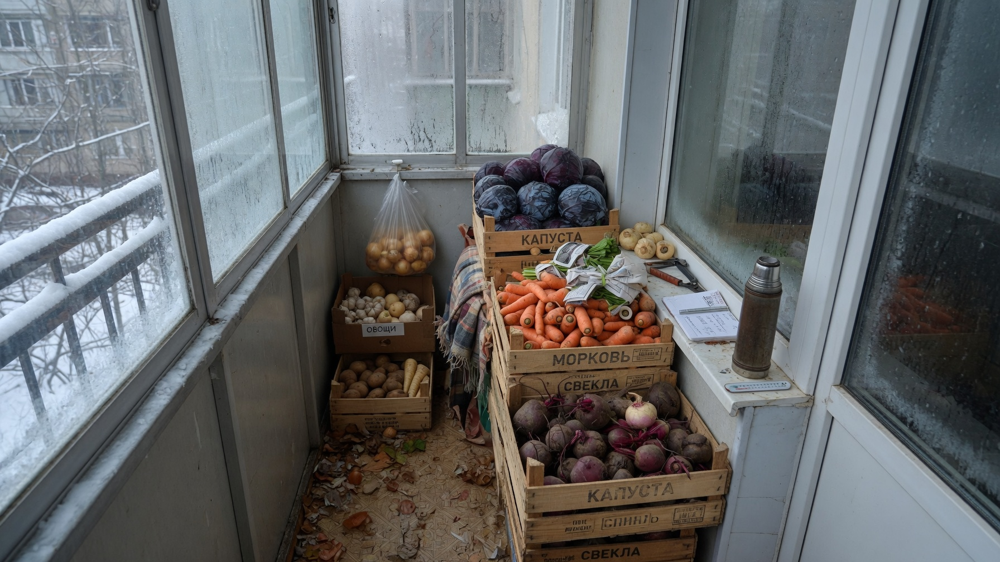
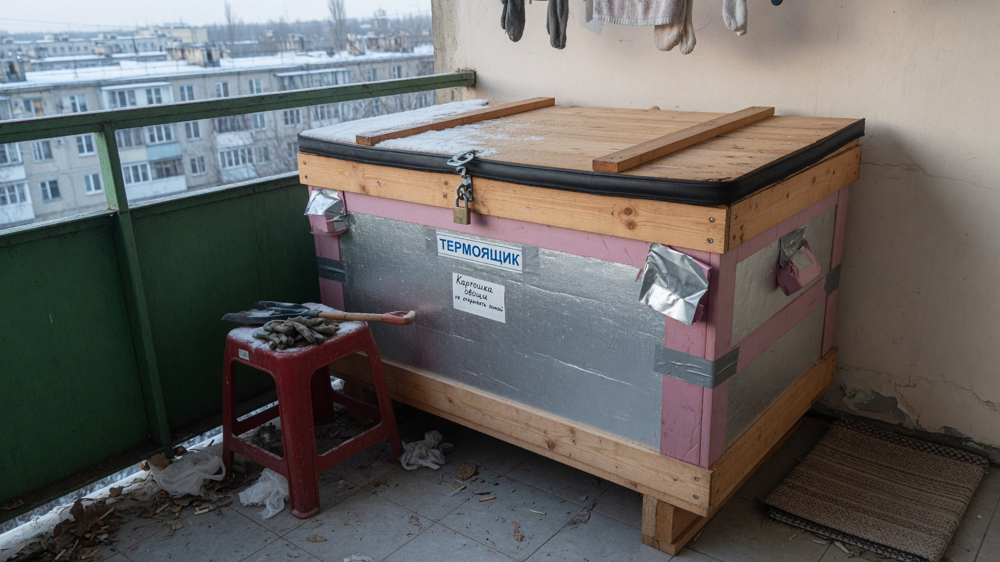
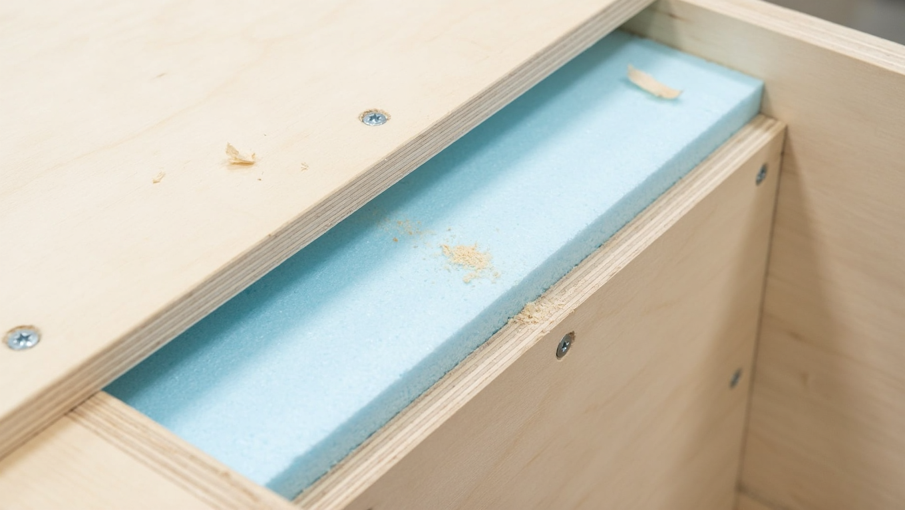
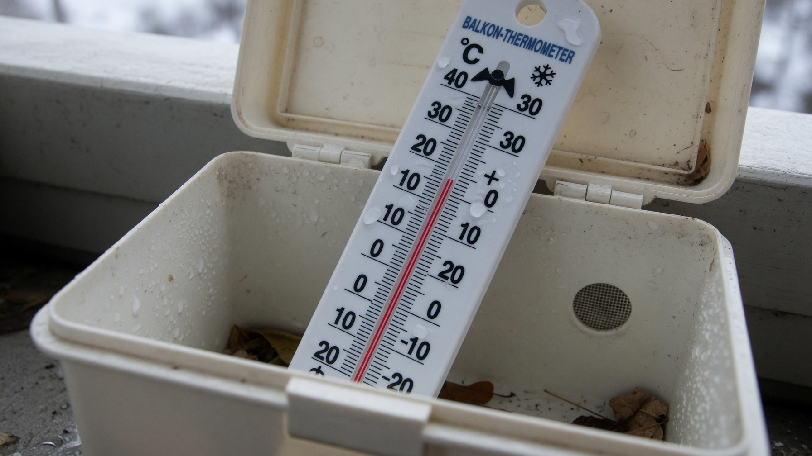
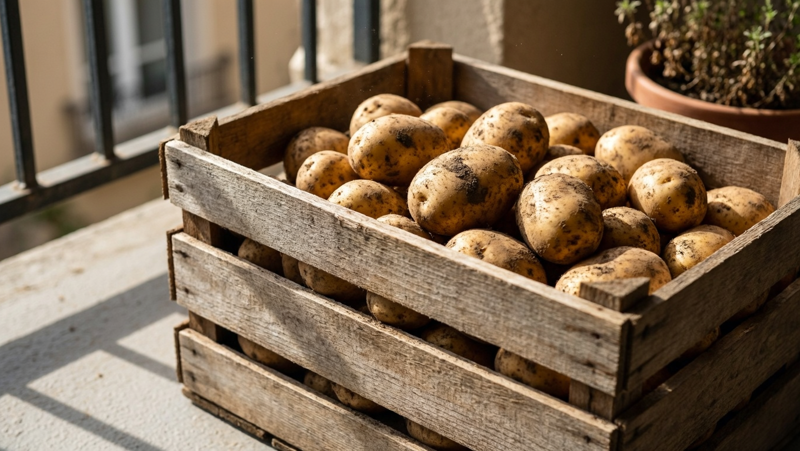
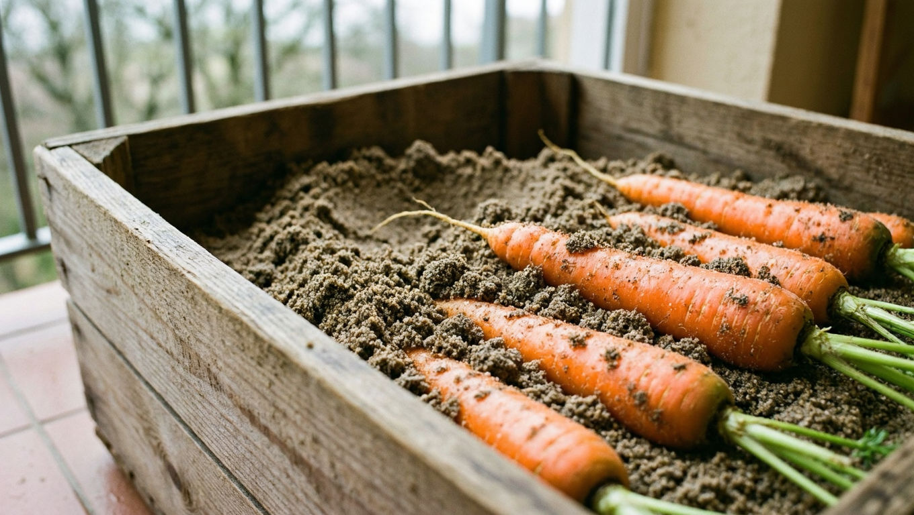

Погреб есть далеко не у всех, а урожай с дачи или закупленные осенью мешки картошки хранить где-то надо. Выручает балкон — при правильном подходе он заменяет погреб и держит овощи свежими всю зиму. Главная задача — не дать им замёрзнуть в мороз и не перегреть в оттепель. Решается она просто: утеплённым ящиком-«погребком». Разберём, как хранить овощи на балконе зимой, при какой температуре и как сделать термоящик своими руками.

## 🌡️ Можно ли хранить овощи на балконе зимой

Можно — но с оговорками. Овощам нужна температура **около 0…+5 °C**: при минусе они промерзают и после оттаивания становятся сладкими, водянистыми и быстро гниют, а в тепле прорастают и вянут.

- **Утеплённый застеклённый балкон** — идеальный вариант: там держится плюс, и овощи прекрасно лежат в обычных ящиках.
- **Застеклённый, но холодный балкон** — самый частый случай. Зимой температура опускается ниже нуля, поэтому нужен **термоящик** (утеплённый короб, при необходимости с подогревом).
- **Открытый балкон без остекления** — для овощей не годится: там те же условия, что на улице. Промёрзнут даже в утеплённом ящике без подогрева, а банки с заготовками могут лопнуть.

Итог: на большинстве балконов вопрос решается не «класть или не класть», а «в чём хранить».

## 📦 Термоящик: какие бывают

«Балконный погребок» бывает трёх видов:

- **Утеплённый ящик без подогрева.** Короб с двойными стенками и утеплителем внутри. Держит тепло за счёт самих овощей и инерции. Подходит для тёплого застеклённого балкона и мягких зим.
- **Ящик с подогревом.** Тот же короб, но внутри — источник тепла (лампы накаливания или греющий кабель) с терморегулятором. Самый надёжный вариант: включается сам, когда температура падает.
- **Готовый термоконтейнер («балконный погребок», термосумка).** Мягкий утеплённый мешок или контейнер заводского изготовления с подогревом. Удобен, если не хочется столярничать.

Самодельный ящик обходится дешевле и делается под размеры вашего балкона — им и займёмся.

## 🔨 Как сделать термоящик своими руками

Конструкция простая — короб в коробе, между стенками утеплитель.

1. **Каркас.** Соберите каркас из бруска по размерам балкона (удобная высота — как у скамьи, чтобы сверху сидеть).
2. **Двойные стенки.** Обшейте каркас снаружи и изнутри фанерой, ОСБ или досками — получится полость между стенками.
3. **Утеплитель.** Заполните полость пенопластом или ЭППС толщиной **не менее 5 см** (в холодных регионах — больше). Утеплять нужно все стороны: стенки, дно и крышку. Дно особенно важно — от бетонной плиты тянет холодом, под ящик полезно подложить брусок или пенопласт.
4. **Крышка.** Сделайте её тоже утеплённой и плотно прилегающей, но открывающейся — это ваш доступ к овощам.
5. **Вентиляция.** Просверлите небольшие отверстия для воздухообмена: без него внутри копится конденсат и овощи гниют. Ставить их лучше в разных концах ящика.
6. **Подогрев (если балкон холодный).** Внутри закрепите **1–2 лампы накаливания (15–40 Вт)** или греющий кабель, подключив их через **терморегулятор (термостат)** — он сам включит подогрев при похолодании. Лампы прикройте кожухом или жестянкой, чтобы свет не падал на картофель (на свету он зеленеет).
7. **Термометр.** Установите его внутри и выведите так, чтобы видеть показания не открывая ящик.

Изнутри стенки удобно застелить плёнкой или фольгированным утеплителем — так короб лучше держит тепло и не тянет влагу.

## 🌡️ Температурный режим и контроль

Оптимум для большинства овощей — **0…+5 °C**, для картофеля лучше **+2…+4 °C**. Что важно помнить:

- **Термометр обязателен.** Без него вы узнаете о проблеме, только когда овощи испортятся.
- **В сильный мороз** включается подогрев (или включайте лампу вручную, если нет термостата). Дополнительно ящик можно укрыть старым одеялом.
- **В оттепель, наоборот, следите за перегревом**: при плюсовой температуре в закрытом ящике картофель прорастает. Приоткрывайте крышку и проветривайте.
- **Проверяйте запасы раз в 2–3 недели**, убирая подгнившие экземпляры: один испорченный клубень заражает соседние.

## 🥔 Как хранить конкретные овощи на балконе

У каждого овоща свои требования:

- **Картофель** — в темноте (на свету зеленеет), в ящике с вентиляционными отверстиями, слоем не выше 40–50 см. Сверху полезно положить несколько свёкол — они заберут лишнюю влагу.
- **Морковь** — капризнее всех: хранят в ящике, пересыпав **влажным песком или опилками**, чтобы не вяла. Можно и в плотно завязанном пакете с парой отверстий.
- **Свёкла** — неприхотлива, хранится россыпью или поверх картофеля.
- **Капуста** — любит прохладу и влажность; кочаны заворачивают в бумагу или подвешивают за кочерыжку.
- **Лук и чеснок** — им нужна, наоборот, **сухость и тепло**, поэтому на холодном балконе им не место: лучше держать их дома, в сетках или капроновых чулках.
- **Тыква, кабачки** — тоже предпочитают тепло и сухость, им подойдёт квартира, а не холодный балкон.

Полный разбор условий и сроков хранения каждого овоща — в статье про то, [как хранить овощи зимой](https://mir-doma.pro/kak-hranit-ovoshchi-zimoy/).

## 🫙 Заготовки на балконе

Банки с соленьями и вареньем на утеплённом балконе хранятся отлично — им нужна та же прохлада. Но **не допускайте замерзания**: содержимое расширяется, крышки срывает, а стекло может лопнуть. Особенно рискуют банки, стоящие вплотную к стеклу или на голом бетоне. Ставьте заготовки в глубине балкона, на подставку, и в морозы прикрывайте.

Если и балкона нет — часть урожая проще заморозить: что и как, разбирали в статье [что заморозить на зиму](https://mir-doma.pro/chto-zamorozit-na-zimu/).

## ❌ Частые ошибки

- **Ящик без утепления дна** — от бетонной плиты тянет холодом, овощи снизу подмерзают.
- **Нет вентиляционных отверстий** — внутри конденсат, овощи гниют.
- **Хранение в герметичном пакете или закрытом ведре** — то же самое: сырость и гниль.
- **Картофель на свету** — зеленеет и накапливает вредный соланин.
- **Нет термометра** — вы не заметите ни промерзания, ни перегрева.
- **Лук рядом с картофелем на холоде** — луку нужно сухо и тепло, он там пропадёт.
- **Не перебирают запасы** — один гнилой клубень портит весь ящик.

## ❓ Частые вопросы

**Можно ли хранить картошку на балконе зимой?**
Да, если балкон застеклён и картофель лежит в утеплённом ящике при +2…+4 °C, в темноте и с вентиляцией. На открытом балконе картофель промёрзнет.

**При какой температуре хранить овощи на балконе?**
Оптимально 0…+5 °C (для картофеля +2…+4 °C). Минус недопустим — овощи промерзают, а в тепле прорастают и вянут.

**Как сделать ящик для хранения овощей на балконе своими руками?**
Собрать каркас из бруска, обшить фанерой изнутри и снаружи, заполнить полость пенопластом или ЭППС (от 5 см), утеплить дно и крышку, просверлить вентиляционные отверстия и при необходимости добавить лампу или греющий кабель с термостатом.

**Нужен ли подогрев в термоящике?**
На тёплом застеклённом балконе — нет. Если зимой на балконе минус, подогрев необходим: 1–2 лампы накаливания 15–40 Вт или греющий кабель через терморегулятор.

**Как хранить морковь на балконе, чтобы не вяла?**
Пересыпать её влажным песком или опилками в ящике — так она не теряет влагу. Подойдёт и плотный пакет с несколькими отверстиями.

**Что делать, если овощи подмёрзли?**
Подмёрзшие овощи долго не пролежат — их нужно как можно скорее пустить в дело: переработать, приготовить или заморозить. Хранить их дальше бессмысленно, они начнут гнить.

**Можно ли хранить овощи на незастеклённом балконе?**
Нет. Там те же условия, что на улице: даже в утеплённом ящике без подогрева овощи промёрзнут, а банки с заготовками могут лопнуть.

---

Балкон вполне заменяет погреб — нужен лишь утеплённый ящик, термометр и, если зимой холодно, простой подогрев с термостатом. Соблюдайте режим 0…+5 °C, не забывайте про вентиляцию и раз в пару недель перебирайте запасы — и овощи долежат до весны. А если погреб всё же есть, наладьте в нём условия: как это сделать, читайте в статье про [обустройство погреба](https://mir-doma.pro/obustroystvo-pogreba/).
